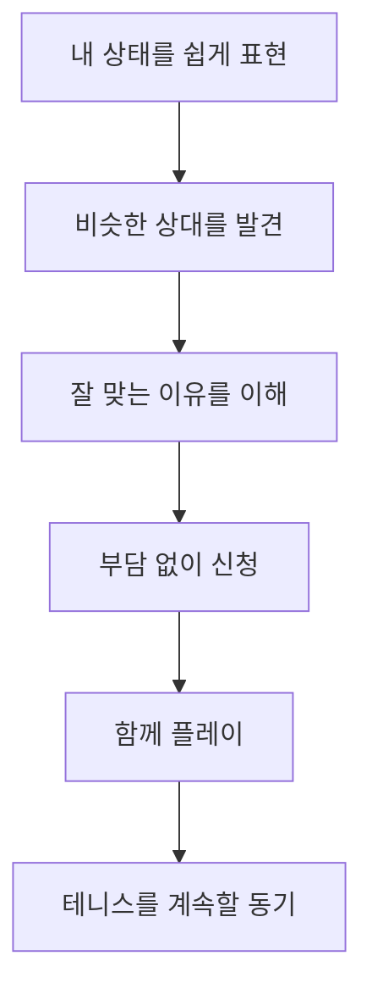
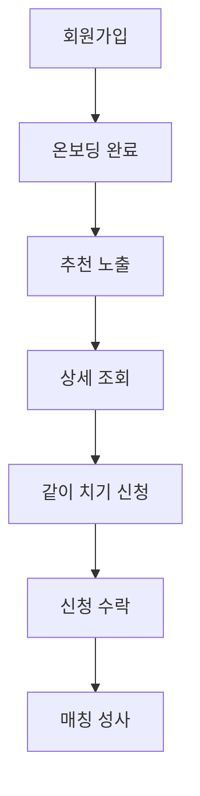
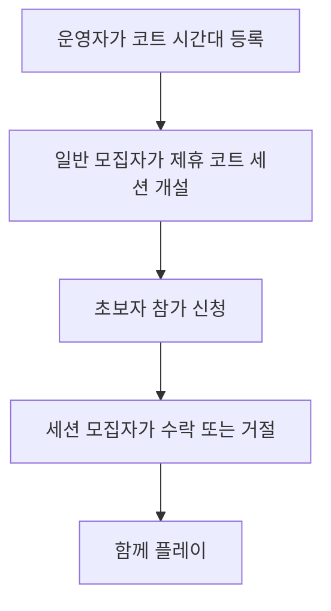
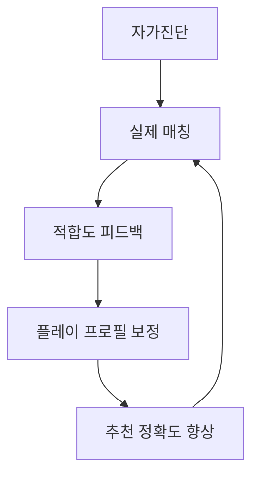

# Rally On 제품 개요

## 1. 문서 정보

| 항목 | 내용 |
| --- | --- |
| 문서명 | Rally On 제품 개요 |
| 문서 목적 | 제품이 해결하려는 문제와 핵심 가치를 이해관계자와 개발 에이전트가 일관되게 이해하도록 한다. |
| 제품 단계 | Core MVP 및 Court Partner 확장 설계 |
| 주요 독자 | 기획자, 디자이너, 개발자, Codex |
| 상세 요구사항 | `02-prd.md`에서 정의 |

이 문서는 기능 명세서가 아니다. 무엇을 구현할지는 PRD와 화면 명세에서 구체화하며, 이 문서에서는 **왜 이 서비스를 만드는지**, **누구를 위한 서비스인지**, **어떤 경험으로 문제를 해결할지**를 정의한다.

## 2. 제품 요약

Rally On은 테니스 초보자가 실력 차이에 대한 부담 없이 자신과 비슷한 수준의 사람을 찾고, 함께 테니스 칠 약속을 잡도록 돕는 매칭 웹앱이다.

단순히 테니스 칠 사람을 연결하는 서비스가 아니다. 매칭 신청 전 초보자가 느끼는 다음 질문에 답을 제공하는 것이 제품의 핵심이다.

> 내 실력으로 신청해도 괜찮을까?

Rally On은 사용자가 상대방의 실력과 기대하는 플레이를 쉽게 이해하도록 돕는다. 또한 코트를 이미 예약한 사용자가 참가자를 모집할 수 있도록 하고, 제휴 코트 운영자가 준비한 시간에 일반 모집자가 세션을 열어 참가자를 모을 수 있게 하여 초보자가 장소와 상대를 각각 찾아야 하는 부담을 줄인다.

사용자가 얻어야 하는 핵심 확신은 다음과 같다.

> 이 사람이라면 나도 부담 없이 같이 칠 수 있겠다.

## 3. 제품 비전

테니스를 시작한 사람이 함께 칠 사람을 찾지 못하거나 실력에 대한 부담 때문에 포기하지 않도록 한다.

초보자가 자신의 현재 상태를 편안하게 표현하고, 비슷한 사람과 연결되어 실제 플레이 경험을 쌓는 선순환을 만든다.

## 4. 주요 사용자

### 4.1 Primary Target

20~30대 테니스 입문자 중 다음과 같은 특성을 가진 사람을 주요 사용자로 한다.

- 구력 약 0~3년
- 레슨 경험이 있거나 현재 레슨을 받고 있음
- 짧은 랠리는 가능하지만 게임은 아직 부담스러움
- 게임 경험이 적거나 없음
- 정기적으로 함께 칠 사람이 부족함
- 기존 동호회에 가입하는 것은 부담스러움
- 처음 보는 사람에게 직접 연락하거나 신청하는 것이 어려움
- NTRP와 같은 전문적인 등급 체계에 익숙하지 않음
- 코트를 검색하고 예약해 본 경험이 적어 예약 절차가 어려움

### 4.2 대표 상황

- 주말에 테니스를 치고 싶지만 함께 칠 사람이 없다.
- 레슨 외에 랠리 연습이 필요하지만 연습 상대를 구하기 어렵다.
- 매칭 글을 발견해도 자신의 실력으로 신청 가능한지 판단하기 어렵다.
- 구력이 비슷한 사람을 찾았지만 실제 플레이 수준도 비슷한지 알 수 없다.
- 동호회 활동보다는 가볍게 한 번 같이 칠 사람을 찾고 싶다.
- 이미 예약된 코트가 있는 매칭에 참여하여 코트 예약 부담을 피하고 싶다.
- 외부에서 코트를 예약해 두었지만 함께 칠 사람을 구하지 못했다.

### 4.3 대표 사용자 생각

> 주말에 테니스를 치고 싶은데 같이 칠 사람이 없다.

> 내가 너무 못하면 상대방에게 민폐 아닐까?

> 구력 1년이라고 하면 사람들은 어느 정도를 기대하지?

> NTRP가 뭔지도 잘 모르겠는데 어떤 매칭에 신청해야 하지?

### 4.4 Secondary Partner Target

Court Partner Pilot에서는 코트 운영자를 두 번째 사용자 집단으로 추가한다.

대표적인 특성은 다음과 같다.

- 비어 있는 코트 시간을 초보자 매칭 세션에 안정적으로 공급하고 싶음
- 전화, 메시지와 수기 장부로 코트 시간 운영을 관리하고 있음
- 사업자와 실제 테니스장 정보를 안전하게 제출해 공급 주체를 확인받고 싶음
- 시간대를 공개한 뒤에도 세션 모집·마감·이용 완료·취소 상태를 한곳에서 확인하고 싶음
- 초보자 고객에게 코트 위치, 이용 규칙과 준비물을 정확하게 안내하고 싶음
- 결제와 정산은 예약 운영이 검증된 이후 단계적으로 도입하기를 원함

코트 운영자는 테니스 실력을 평가하거나 매칭 참가자를 선택하는 역할이 아니다. 운영자는 코트 시간을 공급하고, 일반 회원인 세션 모집자가 참가 신청을 별도로 검토한다. 공개 시간의 상태는 일반 회원에게도 보여 줄 수 있지만, 코트 예약 요청이나 운영자 승인 흐름으로 해석되지 않도록 세션 개설·세션 참여 외 행동을 제공하지 않는다.

## 5. 해결하려는 핵심 문제

### 5.1 실력 차이에 대한 불안

테니스는 두 사람의 실력 차이가 크면 랠리나 게임을 함께 진행하기 어렵다. 초보자는 신청 전에 자신이 상대방에게 민폐가 될 가능성을 걱정한다.

이 불안은 적합한 매칭을 발견하고도 신청하지 않는 행동으로 이어질 수 있다.

### 5.2 구력만으로 알 수 없는 실제 수준

같은 구력이라도 레슨 빈도, 개인 연습, 랠리 경험, 게임 경험에 따라 실제 플레이 수준이 크게 달라진다.

예를 들어 구력 1년인 사용자도 다음처럼 서로 다를 수 있다.

- 주 1회 레슨만 받은 사용자
- 레슨과 랠리를 꾸준히 병행한 사용자
- 이미 게임을 여러 차례 경험한 사용자

따라서 구력은 참고 정보로 사용하되, 상대와의 적합성을 판단하는 유일한 기준으로 사용하지 않는다.

### 5.3 기존 커뮤니티의 언어와 진입 장벽

기존 테니스 커뮤니티에는 `NTRP 2.5 이상`, `게임 가능자`, `남복`, `구력 3년 이상`처럼 경험자에게 익숙한 표현이 사용된다.

초보자는 해당 조건의 의미를 정확히 알지 못하거나 자신이 조건에 해당하는지 판단하기 어렵다. Rally On은 초보자가 자신의 실제 경험에 맞춰 선택할 수 있는 쉬운 표현을 사용한다.

### 5.4 처음 보는 사람에게 신청하는 부담

초보자는 적합해 보이는 매칭을 발견해도 낯선 사람에게 직접 연락하거나 긴 자기소개를 보내는 것을 부담스럽게 느낄 수 있다.

서비스는 필요한 정보를 프로필로 구조화하고, 상대가 초보자를 환영하는지와 왜 서로 잘 맞는지를 보여주어 신청에 필요한 심리적 비용을 낮춘다.

### 5.5 코트 검색 및 예약의 어려움

테니스 초보자는 지역별 예약 사이트, 예약 오픈 시간, 코트 이용 규칙과 결제 방식을 잘 알지 못할 수 있다. 함께 칠 사람을 찾더라도 코트를 확보하지 못하면 실제 플레이로 이어지지 않는다.

반대로 외부에서 코트를 먼저 예약한 사용자는 정해진 시간까지 참가자를 모집해야 한다. Rally On은 **이미 예약된 코트와 참가자를 연결하는 흐름**과 제휴 코트 운영자가 준비한 시간에 일반 모집자가 세션을 여는 흐름을 함께 제공한다. 일반 사용자가 제휴 코트에 예약 요청을 보내거나 운영자가 참가자를 승인하지 않으며, 앱 내 결제와 정산은 별도 단계로 유지한다.

## 6. 문제 해결 접근법

Rally On은 정확한 실력 점수를 측정하는 대신 **서로의 기대치를 맞추는 것**에 집중한다.

### 6.1 쉬운 플레이 프로필

사용자의 상태를 다음 정보를 조합해 표현한다.

- 테니스 경험 기간
- 현재 랠리 수준
- 게임 경험
- 원하는 플레이
- 주요 활동 지역

숫자 레벨이나 서열보다 `시작하는 중`, `랠리 성장중`, `랠리 플레이어`, `게임 입문`처럼 현재 함께하기 좋은 플레이를 설명하는 표현을 우선한다.

### 6.2 실력과 오늘의 목적 분리

사람의 기본적인 플레이 상태와 특정 날짜에 하고 싶은 테니스는 다를 수 있다.

예를 들어 `랠리 플레이어`인 사용자가 오늘은 편한 랠리를 원하고, 다음 주에는 게임 입문을 원할 수 있다. 따라서 사용자 실력인 `Player Skill`과 매칭 목적을 나타내는 `Match Purpose`를 별도로 관리한다.

### 6.3 설명 가능한 추천

추천 결과만 제시하지 않고 다음과 같이 추천 이유를 알려준다.

- 둘 다 천천히 랠리가 가능해요.
- 게임보다 랠리 연습을 원해요.
- 활동 지역이 가까워요.

MVP에서는 단순한 규칙 기반으로 추천하며, 내부 계산 점수는 사용자에게 노출하지 않는다.

### 6.4 참여 가능성의 명시

매칭 작성자가 원하는 상대 수준과 `초보자 환영` 여부를 명확하게 표시한다. 사용자는 자신이 신청 가능한 대상인지 추측하지 않아도 된다.

### 6.5 짧고 부담 없는 신청

긴 자기소개 대신 구조화된 테니스 프로필을 먼저 보여준다. 사용자는 `같이 치기` 버튼을 통해 신청하며, 필요한 경우에만 짧은 메시지를 선택적으로 입력한다.

### 6.6 두 가지 코트 확보 경로

Rally On은 코트 확보 경로를 다음과 같이 구분한다.

| 코트 유형 | 설명 | 사용자 표시 | 제품 단계 |
| --- | --- | --- | --- |
| 직접 예약 코트 | 모집자가 외부 사이트, 전화 등으로 예약한 코트 | `모집자가 코트를 예약했어요` | Core MVP |
| 제휴 코트 | 운영자가 준비한 시간에 일반 모집자가 연 매칭 세션 | `Rally On에서 준비한 코트예요` | 필수 Court Partner Pilot |

직접 예약 코트는 모집자가 제공한 정보를 기반으로 하며 Rally On이 예약 사실을 검증한 것으로 표현하지 않는다. 제휴 코트 세션은 승인된 운영자가 준비한 시간에 연결된 Match로만 표시한다.

일반 `매칭`에서는 모집자가 코트의 이름, 위치, 예약 날짜·시작·종료 시간과 전체 비용을 모두 입력한 뒤에만 공개한다. 코트 이름과 주소는 카카오맵 장소 검색으로 채울 수 있지만, 검색 결과가 예약·운영 상태를 보증하지 않으며 직접 입력도 항상 가능하다. 코트를 아직 확보하지 못한 사용자는 코트 정보가 비어 있는 모집 글을 만들지 않고 `코트 매칭`에서 운영자가 준비한 시간을 확인한다. 예상 1인 비용은 모집자를 포함한 예상 총 참여 인원으로 나눈 뒤 1원 단위 올림하여 자동 표시하고 사용자가 수정할 수 없다. 참가자 간 비용 정산은 앱 밖에서 진행한다. 기존 `COURT_TBD` 기록은 이 정책 전환 뒤에도 이력·기존 참여자 채팅·완료 처리를 위해 보존한다.

## 7. 핵심 가치 제안

| 핵심 가치 | 사용자에게 제공하는 가치 |
| --- | --- |
| 비슷한 실력 | 나와 함께 플레이하기 좋은 초보자를 쉽게 찾는다. |
| 부담 없는 참여 | 게임을 잘하지 못해도 신청 가능한 매칭을 판단할 수 있다. |
| 쉬운 실력 표현 | 전문적인 등급을 몰라도 자신의 상태를 설명할 수 있다. |
| 기대치 조율 | 만나기 전에 서로 원하는 플레이와 경험 수준을 이해한다. |
| 신청에 대한 확신 | 추천 이유와 초보자 환영 여부를 보고 안심하고 신청한다. |
| 장소에 대한 확신 | 코트 확보 여부, 위치, 시간과 예상 비용을 신청 전에 확인한다. |
| 코트 운영 효율 | 운영자는 모집에 사용할 수 있는 코트 시간과 사용 상태를 한곳에서 관리한다. Court Partner Pilot 이후 가치 |

## 8. 제품 원칙

### 8.1 초보자가 이해하는 언어를 사용한다

전문 용어나 숫자 등급보다 실제 행동과 경험을 설명하는 표현을 사용한다.

### 8.2 심리적 부담을 낮춘다

각 화면에서 사용자가 `내가 해도 되는가`를 스스로 추측하게 두지 않는다. 신청 가능 여부와 다음 행동을 명확하게 안내한다.

### 8.3 선택을 우선한다

온보딩과 매칭 등록에서는 자유 입력보다 이해하기 쉬운 선택지를 우선하여 사용자의 판단 부담과 입력 시간을 줄인다.

### 8.4 완벽한 측정보다 기대치 조율을 우선한다

초기 자가진단을 절대적인 실력 판정으로 취급하지 않는다. 두 사람이 함께 어떤 플레이를 할 수 있을지 판단할 수 있을 정도의 정보를 제공한다.

### 8.5 매칭 성공에 필요한 기능부터 만든다

기능의 새로움이나 개수보다 가입부터 매칭 성사까지의 흐름이 실제로 작동하는 것을 우선한다.

### 8.6 추천 이유를 숨기지 않는다

추천 결과가 단순하더라도 사용자가 결과를 신뢰하고 행동할 수 있도록 근거를 자연어로 설명한다.

### 8.7 코트 확보 경로와 책임을 투명하게 보여준다

모집자가 직접 예약한 코트와 운영자가 준비한 제휴 코트 세션을 구분한다. 일반 사용자는 제휴 코트에 예약 요청을 보내지 않고 세션에 참가 신청한다. 운영자는 시간 공급만 담당하고 참가 수락은 일반 모집자만 담당한다. 사용자가 코트 확보 주체와 비용 처리 방식을 오해하지 않도록 문구와 배지를 다르게 사용한다.

## 9. MVP 정의

### 9.1 한 줄 정의

> 나와 비슷한 수준의 테니스 초보자를 찾아 부담 없이 테니스 약속을 잡을 수 있는 서비스

### 9.2 검증할 핵심 가설

> 초보자가 상대방의 수준을 쉽게 이해할 수 있다면 실제로 처음 보는 사람에게 매칭을 신청하는가?

### 9.3 핵심 사용자 흐름

1. 카카오 로그인
2. 닉네임 확인
3. 테니스 프로필 생성
4. 나와 맞는 추천 매칭 확인
5. 매칭 상세 및 추천 이유 확인
6. 같이 치기 신청
7. 모집자의 신청자 프로필 확인
8. 신청 수락
9. 수락된 참가자에게만 앱 안의 Match 채팅방 공개
10. 매칭 성사
11. 일정 종료 후 모집자의 완료 확인

직접 매칭을 등록하는 사용자는 외부에서 예약한 코트 정보를 입력하여 `코트 준비 완료` 매칭을 만들 수 있다. 이 기능은 Core MVP에 포함한다.

매칭 완료는 일정 종료 후 모집자가 확인한다. 완료 후 적합도 피드백은 Core MVP에 포함하지 않는다.

## 10. North Star UX

첫 방문 사용자가 짧은 시간 안에 다음 경험을 하는 것을 목표로 한다.

1. 나는 어떤 테니스 플레이어인지 알게 된다.
2. 나와 비슷한 사람들이 있다는 것을 확인한다.
3. 왜 이 상대와 잘 맞는지 이해한다.
4. `내가 신청해도 괜찮겠다`고 생각한다.
5. `같이 치기`를 누른다.

온보딩 자체의 목표 시간은 약 30~45초다. 첫 방문부터 신청 의향이 생기는 핵심 경험까지는 약 1분을 지향하되, 실제 달성 가능성은 사용성 테스트로 검증한다.

## 11. 핵심 차별화

Rally On의 차별점은 매칭 기능 자체가 아니다. 기존 서비스도 사람을 연결할 수 있다.

차별화되는 경험은 다음과 같다.

1. 초보자가 자신의 실력을 쉽게 표현한다.
2. 비슷한 상대의 상태를 쉽게 이해한다.
3. 왜 서로 잘 맞는지 알 수 있다.
4. 신청해도 괜찮다는 확신을 얻는다.
5. 부담 없이 `같이 치기`를 누른다.

## 12. 제품 성공의 방향

단순 가입자 수보다 핵심 행동의 전환을 본다.

주요 지표 후보는 다음과 같다.

| 지표 | 의미 |
| --- | --- |
| Onboarding Completion Rate | 회원가입 후 온보딩을 끝까지 완료한 비율 |
| Match Application Rate | 매칭을 확인한 사용자 중 같이 치기를 신청한 비율 |
| Match Acceptance Rate | 접수된 신청 중 모집자가 수락한 비율 |
| Match Success Rate | 신청 이후 실제 매칭 성사 상태에 도달한 비율 |
| Reserved Court Match Application Rate | 직접 예약 코트 매칭을 확인한 사용자 중 참가를 신청한 비율 |
| Skill Match Satisfaction | 플레이 후 상대와 실력이 잘 맞았다고 평가한 비율. MVP 이후 활용 후보 |

구체적인 이벤트 정의, 분모·분자, 측정 기간과 목표값은 PRD 또는 분석 계획에서 확정한다.

## 13. MVP에서 하지 않는 것

초기 범위를 지키기 위해 다음 기능은 MVP에서 제외한다.

- 범용 실시간 채팅, 개인 DM, 일반 파일·음성 메시지, 접속·입력 중 표시
- AI 영상 실력 분석
- 영상 업로드
- 복잡한 NTRP 자동 계산
- 클럽 및 동호회
- 대회 및 랭킹
- 커뮤니티 게시판
- 복잡한 AI 추천 알고리즘
- 코트 운영자 입점과 권한 인증
- 제휴 코트 시간 공급과 앱 결제
- 환불, 운영자 정산 및 참가자별 분할 결제

이 목록 중 코트 운영자 시간 공급과 제휴 코트 세션은 Core MVP 다음의 필수 Court Partner Pilot에서 구현한다. 나머지 기능과 결제·환불·정산은 실제 사용자 행동·운영 가능성 및 별도 승인 후 검토한다.

## 14. 향후 확장 방향

### 14.1 Court Partner Pilot

Core MVP 이후 소수의 코트 운영자와 다음 흐름을 검증한다.

세션 운영 가능성이 확인된 후 결제·환불·운영자 정산을 별도로 검토한다. 운영자는 코트 시간을 공급하고, 일반 세션 모집자가 함께 칠 참가자를 승인한다. 두 책임을 하나의 승인으로 합치지 않는다.

Court Partner Pilot의 운영자 및 일반 사용자 세션 화면은 `03-1-court-partner-screen-spec.md`에서 별도로 정의한다. 이 문서는 Core MVP 구현 범위와 혼동되지 않도록 분리한다.

운영자는 초대 없이 직접 신청할 수 있다. 다만 자동 확인은 운영 권한의 최종 보증이 아니라 위험을 분류하는 수단이다. 사업자 정상 여부, 표준화한 사업장 주소와 테니스장 장소 정보의 일치, 이미 승인된 동일 장소 운영자 부재를 모두 충족한 경우에만 공개 권한을 자동 부여한다. 이외의 불일치·공공시설·지점·위탁운영·중복 장소 사례는 증빙과 운영 검토를 거쳐 공개한다. 자동 확인이 끝난 운영자는 비공개 코트·시간대 초안을 만들 수 있지만, 공개 권한이 없으면 일반 모집자가 세션에 연결할 수 없다.

외부 확인 서비스의 장애나 신규 사업자 정보 반영 지연은 반려 사유가 아니다. 제한된 재시도 후 `검토 필요`으로 전환하며, 사업자 정보 불일치 또는 휴·폐업처럼 명백히 공개 조건을 충족하지 않는 경우만 수정 후 재신청을 안내한다. 승인 기록, 재확인, 운영 중지와 이의·보완 이력은 최소 정보로 감사 가능하게 남긴다.

공개한 제휴 코트 시간은 코트 면·시각·비용·현장 정원·이용 안내를 직접 바꿀 수 없는 공개 기록으로 취급한다. 오류가 발견되면 운영자는 그 시간을 `공개 중지`하고 새 비공개 초안을 등록한다. 이미 세션에 연결된 시간은 일반 수정이나 임의 중지가 불가능하며, 실제 공급 불가·시설 폐쇄·안전 문제 같은 긴급 사유만 감사 이력과 함께 세션 취소·인앱 안내로 처리한다. 운영자 귀책으로 연결 세션을 반복 철회하면 새 시간 공개를 자동 일시 중지하고 운영 검토 후에만 해제한다. 이 정책은 운영자의 참가자 승인 권한이나 일반 사용자의 코트 예약 권한을 만들지 않는다.

### 14.1 Court Commerce 확장 원칙

유료 제휴 코트 세션은 운영자가 현장에 없어도 코트 이용 총액이 실제 결제된 세션만 확인할 수 있어야 한다. 이를 위해 Rally On이 카드나 계좌 정보를 보관하거나 수기 이체를 대신 받지 않고, 운영자가 PG의 판매자/하위가맹점 온보딩을 완료하며 Rally On은 세션·**모집자 단일 결제** 상태를 중개하는 구조를 우선 검토한다. 실제 계약상 판매자·환불·세무·지급 책임은 PG 계약과 법무·세무 검토 후에만 확정한다.

사용자가 확정한 제품 정책은 운영자 부담 플랫폼 수수료 5%, 운영자 부담 PG 수수료, 그리고 운영자별 첫 성공 유료 모집자 결제 승인일부터 30일간 플랫폼 수수료 0%다. 모집자는 공개된 코트 이용 총액 한 건을 결제하고, 참가자는 목표 인원 기준 예상 부담을 참고해 현장에서 자율 분담한다. Rally On은 참가자별 결제·송금·미납·환불을 수납하거나 보장하지 않는다. 모집자는 시작 24시간 전까지 전액 취소할 수 있으며, 운영자 공급 철회·시설 폐쇄·안전 위험·사용 불가 우천·재난은 시간과 무관하게 모집자에게 전액 환불한다. 이 정책은 기존 Pilot 결제 없는 흐름을 바꾸지 않으며, 세부 모델·PG 게이트는 `07-court-commerce-design.md`에서 관리한다.

### 14.2 서비스 내 Match 채팅

수락 뒤 일정과 준비물을 조율하는 대화는 모든 Match에서 서비스 안의 Match 전용 채팅방으로 처리한다. 방에는 모집자와 실제 수락 참가자만 입장하며, 코트 운영자·대기 신청자·제3자는 입장하지 않는다. 채팅 탭은 내가 입장 권한을 가진 방만 `내가 만든 매칭`과 `내가 신청한 매칭`으로 나누어 보여 주며, 새 방 만들기·사용자 검색은 제공하지 않는다. 채팅은 매칭과 분리된 개인 메신저가 아니므로 사용자 검색, DM, 일반 파일·음성, 접속·입력 중 표시는 제공하지 않는다. 다만 방 멤버는 JPEG·PNG·WebP 사진을 한 메시지에 최대 3장, 각 5 MiB까지 텍스트와 함께 또는 단독으로 보낼 수 있다. 사진은 비공개 객체로 저장하고 같은 방 멤버의 보호된 읽기 경로에서만 보이며, 인물 얼굴·연락처·예약번호·실시간 위치가 보이는 사진은 올리지 않도록 안내한다. 발신자는 자신이 보낸 최신 일반 메시지에 아직 읽지 않은 현재 방 멤버 수만 숫자로 볼 수 있으며, 모두 읽으면 숫자는 사라진다. 읽은 시각·누가 읽었는지·온라인 상태는 표시하지 않는다.

첫 단계는 메시지 영속·권한·신고·운영 조치·보관 정책을 검증하는 5초 폴링 기반의 준실시간 경험이다. WebSocket과 별도 공유 상태 저장소는 사용자 수·지연·비용을 검증한 뒤 별도 승인으로 다룬다. 기존 카카오 링크 Match의 전환·안전·보관·API와 화면 설계는 `08-in-app-match-chat-design.md`에서 관리한다.

### 14.3 매칭 데이터 기반 추천 개선

MVP 이후에는 실제 매칭 결과와 사용자 피드백을 활용하여 추천 품질을 높일 수 있다.

예를 들어 매칭 완료 후 `오늘 상대방과 실력이 잘 맞았나요?`라는 간단한 질문을 제공하고, 다음과 같은 선순환을 만들 수 있다.

이 방향은 초기부터 영상 분석이나 복잡한 AI를 도입하지 않고도 서비스 내부 데이터로 추천 품질을 발전시킬 수 있다는 의미다. MVP 구현 범위로 확정된 것은 아니다.

## 15. 확정된 제품 결정

1. 초보자 중심 서비스로 시작한다.
2. 주요 사용자는 구력 약 0~3년의 입문자다.
3. NTRP를 핵심 실력 표현으로 사용하지 않는다.
4. 구력만으로 사용자의 실력을 판단하지 않는다.
5. 랠리 경험과 게임 경험을 함께 활용한다.
6. 실력은 숫자보다 현재 플레이 상태로 표현한다.
7. 사용자 실력과 특정 매칭에서 원하는 플레이를 분리한다.
8. 온보딩은 약 30~45초 완료를 목표로 한다.
9. 추천 결과와 함께 추천 이유를 보여준다.
10. `초보자 환영` 여부를 중요한 매칭 정보로 사용한다.
11. 초기 추천은 AI가 아닌 규칙 기반으로 구현한다.
12. 첫 목표는 기능 수가 아니라 매칭 성공 경험을 만드는 것이다.
13. 외부에서 이미 예약한 코트로 참가자를 모집하는 기능은 Core MVP에 포함한다.
14. 직접 예약 코트와 제휴 코트는 서로 다른 출처와 확인 상태로 표현한다.
15. 직접 예약 코트의 참가자 간 비용 정산은 Core MVP에서 앱 밖에서 진행한다.
16. 운영자의 시간 공급과 모집자의 참가 수락을 분리하며, 앱 결제는 Court Partner Pilot 이후의 별도 Commerce 단계에서만 다룬다.

## 16. 확정된 Core MVP 운영 정책

- 카카오 소셜 로그인 한 종류로 시작한다.
- 소셜 표시명을 닉네임 기본값으로 제안하고 최초 진입에서 확인·수정한다.
- 비로그인 사용자는 서비스 소개만 볼 수 있고 매칭 목록·상세는 로그인 후 제공한다.
- Match 연락은 `08-in-app-match-chat-design.md`의 방 멤버십 정책을 따른다. 외부 오픈채팅 링크는 수집·저장·표시하지 않는다.
- 한 명 이상 수락한 모집자는 조기 마감할 수 있다.
- 수락 후 참가 취소는 화면과 API에서 제공하지 않고 비공개 MVP에서는 운영 문의로 처리한다.
- 플레이 상태 자동 이름은 규칙 확정 전 표시하지 않는다.
- 신고와 차단은 비공개 MVP에서 운영 문의로 처리하고 공개 출시 전에 재검토한다.

## 17. 아직 확정하지 않은 내용

다음 항목은 이 문서에서 결정하지 않으며, PRD 및 상세 설계 과정에서 검토한다.

- 성별 및 연령 정보 수집 여부
- 초보자의 운영상 허용 범위
- 공개 후 일정·코트 정보 변경 정책
- 직접 예약 코트의 취소 및 정보 오류 처리 정책
- 제휴 코트 운영자 인증 방식
- 24시간 전 마감 뒤 법정·PG 계약상 예외 환불, PG 장애 지원 SLA와 운영자 지급 보류·대사 기준
- 후기와 노쇼 정책
- 공개 출시 전 신고·차단의 최소 범위
- 수락 후 참가 취소를 정식 기능으로 제공할 때의 상태와 이력
- 플레이 상태 자동 분류 규칙
- 추천 점수의 정확한 가중치

미확정 항목은 구현 과정에서 임의로 결정하지 않는다.

## 18. 관련 문서와 다음 단계

- Core MVP 요구사항: `02-prd.md`
- Core MVP 화면 명세: `03-screen-spec.md`
- Court Partner 확장 화면 명세: `03-1-court-partner-screen-spec.md`
- Court Commerce 설계: `07-court-commerce-design.md`
- Court Commerce PG 사전 검증: `09-court-commerce-pg-preflight.md`
- 서비스 내 Match 채팅 설계: `08-in-app-match-chat-design.md`
- 다음 설계 단계: `04-erd.md`

ERD에서는 Core MVP 엔터티를 우선 확정하고, Court Partner 관련 엔터티는 확장 모델로 구분한다. 프로젝트 초기화와 기술 구성이 확정되면 저장소 소개, 설치, 실행, 환경 변수와 검증 명령을 포함한 `README.md`를 작성한다.
