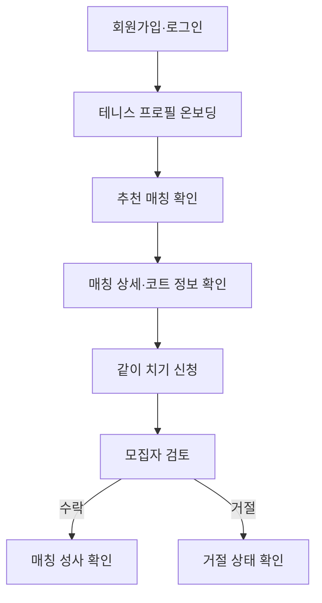
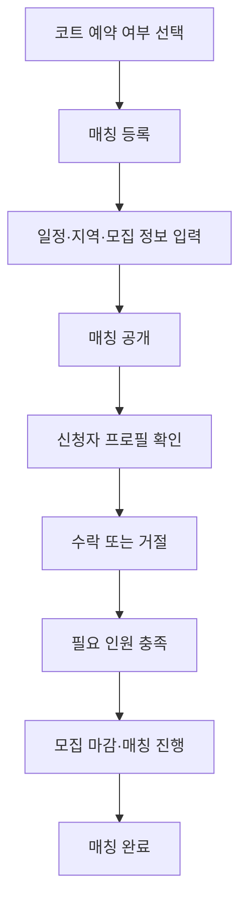

# Tennis Mate MVP PRD

## 1. 문서 정보

| 항목 | 내용 |
| --- | --- |
| 문서명 | Tennis Mate MVP Product Requirements Document |
| 문서 상태 | Draft v0.1 |
| 제품 단계 | Core MVP 및 필수 Court Partner Pilot 설계 |
| 기준 문서 | `01-product-overview.md` |
| 관련 화면 명세 | `03-screen-spec.md`, `03-1-court-partner-screen-spec.md` |

이 문서는 Tennis Mate Core MVP의 기능 범위, 비즈니스 규칙과 완료 조건을 정의한다. 화면 배치와 세부 인터랙션은 화면 명세에서, 데이터 구조는 ERD에서, HTTP 계약은 API 명세에서 구체화한다.

## 2. 제품 목표

테니스 초보자가 자신의 플레이 상태를 쉽게 표현하고, 비슷한 수준의 사용자가 모집하는 테니스 일정에 부담 없이 신청하여 실제 매칭을 성사시키도록 한다.

Core MVP는 다음 가설을 검증한다.

> 초보자가 상대방의 수준, 원하는 플레이와 코트 정보를 쉽게 이해할 수 있다면 처음 보는 사람에게 실제로 같이 치기를 신청하는가?

## 3. 제품 단계 구분

### 3.1 Core MVP

이번 PRD의 구현 대상이다.

- 회원가입 및 로그인
- 테니스 프로필 온보딩
- 규칙 기반 추천 매칭
- 매칭 목록과 상세 조회
- 모집자가 예약된 코트 또는 코트 미정 상태로 만드는 매칭 등록
- 같이 치기 신청
- 모집자의 신청 수락 및 거절
- 내가 등록하거나 신청한 매칭 관리
- 매칭 취소 및 완료 상태 관리

### 3.2 Court Partner Pilot

Court Partner Pilot은 Core MVP 다음에 구현하는 필수 서비스 단계다. M9 사용자 테스트는 화면과 운영 방식을 개선하기 위한 관찰 단계이며, Court Partner Pilot 시작 여부를 결정하는 선행 조건으로 사용하지 않는다.

- 코트 운영자 계정 및 권한 확인
- 코트 정보와 모집 가능한 시간대 등록
- 일반 모집자의 제휴 코트 세션 개설
- 다른 일반 사용자의 세션 참가 신청
- 모집자의 참가 신청 수락 또는 거절

운영자는 시간대를 공급할 뿐 일반 사용자의 코트 예약 요청을 받거나 매칭 참가자를 승인하지 않는다. 일반 회원인 세션 모집자가 준비된 시간대를 Match에 연결하고, 기존 `MatchApplication` 흐름으로 참가 신청을 수락·거절한다. 운영자와 사용자의 화면 흐름은 `03-1-court-partner-screen-spec.md`에서 정의한다.

공개한 Slot은 세션이 열렸는지·마감됐는지·이용이 끝났는지·취소됐는지를 사람이 이해할 수 있는 상태로 계속 보여 준다. 이 공개 상태는 코트 예약 가능을 뜻하지 않는다. `AVAILABLE`에서는 온보딩을 마친 일반 회원이 세션을 열 수 있고, `ALLOCATED`에서는 연결 세션을 확인·참가 신청할 수 있으며, 그 외 상태는 읽기 전용이다. 각 Slot에는 모집자를 포함한 현장 최대 인원을 운영자가 지정하고, 세션 개설 시 모집 인원과 함께 서버가 검증한다.

운영자는 초대 없이 직접 등록을 시작할 수 있다. 자동 확인은 운영자를 즉시 배제하는 수단이 아니라, 공개 전에 사람이 보아야 할 사례를 가려내는 수단이다. 사업자 확인이 끝난 운영자는 코트와 시간대 **초안**을 저장할 수 있지만, 아래 공개 조건을 모두 충족해 `공개 승인`되기 전에는 일반 모집자가 세션에 연결할 수 없다.

1. 사업자등록증을 필수 비공개 증빙으로 제출하고, 입력한 사업자명·사업자번호·개업일·대표자명과 대조한다.
2. 국세청 사업자등록정보 API로 사업자번호·개업일·대표자명 등의 진위와 정상 영업 상태를 확인한다.
3. 도로명주소 API로 사업장·코트 주소를 표준화하고, 장소 검색 결과의 명칭·주소·좌표를 입력값과 대조한다.
4. 사업자 정보의 표준 주소와 테니스장 장소가 일치하고, 같은 정규화 장소를 이미 활성 운영자가 점유하고 있지 않음을 확인한다.
5. 공공시설, 지점, 위탁 운영 등 대표자와 실제 운영 주체가 다를 수 있는 경우에는 운영 권한 증빙 또는 확인 가능한 시설 담당 연락처를 검토한다.

사업자등록증은 사업체 정보의 일치 확인 증빙이며, 그 자체로 특정 테니스장의 운영 권한을 자동 승인하는 근거는 아니다. 사업자는 유효하지만 장소가 불일치·모호·중복되거나 운영 주체가 다른 경우 `검토 필요`으로 두고, 운영 권한을 확인한 뒤에만 승인한다. 국세청 확인에서 사업자 정보가 불일치하거나 휴·폐업인 경우에는 공개를 반려하고 올바른 정보로 다시 신청하게 한다. API 장애·시간 초과·신규 개업 반영 지연은 반려하지 않고 제한된 자동 재시도 후 운영 검토 또는 정보 수정 경로를 제공한다.

#### 운영자 검증 상태와 공개 규칙

| 내부 상태 | 운영자에게 보이는 상태 | 가능한 행동 | 시간대 공개·세션 연결 |
| --- | --- | --- | --- |
| `DRAFT` | 입력 중 | 정보 임시 저장·수정 | 불가 |
| `VERIFYING` | 자동 확인 중 | 결과 대기 | 불가 |
| `DRAFT_ACCESS_GRANTED` | 코트 초안을 만들 수 있어요 | 코트·시간대 비공개 초안 작성 | 불가 |
| `REVIEW_REQUIRED` / `UNDER_REVIEW` | 추가 확인이 필요해요 / 확인하고 있어요 | 정보 보완·증빙 제출 | 불가 |
| `PUBLISH_APPROVED` | 운영자 등록이 완료됐어요 | 코트·시간대 공개 | 가능 |
| `CHANGES_REQUESTED` | 정보를 보완해 주세요 | 수정 후 재확인 요청 | 불가 |
| `REJECTED` | 현재 정보로는 등록이 어려워요 | 사유 확인·정정 후 새 신청 | 불가 |
| `SUSPENDED` | 공개가 일시 중지됐어요 | 운영 문의·보완 | 새 공개·세션 연결 불가 |

`PUBLISH_APPROVED`는 자동 규칙을 모두 충족한 경우 또는 권한 있는 운영 검토자가 승인한 경우에만 전환한다. 검토자는 자신의 신청을 검토할 수 없고, 판정·사유 코드·판정 시각을 기록한다. `INTERNAL_REVIEWER`만 승인된 신청을 `SUSPENDED`로 전환할 수 있으며, 사업자·장소·운영 권한 재확인, 안전 검토, 시설 폐쇄 중 선택형 안전 사유만 남긴다. 중지 즉시 새 Slot 공개·새 제휴 세션 연결·운영자 사진 관리·공개 Slot과 사진 노출을 막는다. 이미 열린 제휴 코트 세션은 운영자 검증 상태가 바뀌었다고 자동 취소하지 않는다. 다만 실제 공급 불가를 확정한 긴급 철회는 아래 시간 공급 보호 정책에 따라 Match 취소·인앱 안내·사후 검토를 하나의 작업으로 처리한다.

#### 공개 시간의 수정·중지와 반복 철회 보호 정책

이 정책은 운영자의 등록 실수로 참가자가 헛걸음하는 문제를 줄이면서, 운영자가 공개 후 시간대를 임의로 바꾸거나 반복 취소하는 것을 막기 위한 Pilot 기본 정책이다.

| 상황 | 운영자 행동 | 이용자 영향 |
| --- | --- | --- |
| `DRAFT` 비공개 초안 | 코트 면·일시·비용·현장 정원·이용 안내를 모두 수정하거나 취소 | 이용자에게 보이지 않음 |
| `AVAILABLE` 공개 시간의 오류 | 직접 수정하지 않고 `BLOCKED`로 공개 중지한 뒤 새 초안을 등록 | 기존 시간은 `새 세션 연결이 중지됐어요`와 갱신 시각을 계속 표시. 이미 열린 세션은 없음 |
| `ALLOCATED` 연결 시간의 일반 오류·문의 | 시간·비용·코트 수정과 직접 중지 불가. 운영 검토 요청만 가능 | 연결 세션은 그대로 유지 |
| 세션 모집자의 시작 전 취소 | Slot을 자동 재공개하지 않는다. 운영자가 실제 공급 가능 여부를 확인한 뒤에만 취소된 Match가 연결된 Slot을 `BLOCKED`로 중지하고, 별도 `DRAFT`를 등록 | 기존 세션과 신청 상태는 취소로 남고, 새 세션·참가 신청 CTA는 보이지 않음 |
| `ALLOCATED` 실제 공급 불가·시설 폐쇄·안전 위험·재난 | 사유 코드를 선택해 긴급 공급 철회. Slot과 연결 Match를 한 트랜잭션으로 취소하고 사후 검토 | 모집자·PENDING·ACCEPTED 참가자에게 안전한 인앱 안내를 남김 |

한 번 `PUBLIC`으로 공개한 Slot은 상태와 갱신 시각을 남긴 채 계속 공개한다. `BLOCKED`, `CANCELLED` Slot은 Pilot에서 다시 `AVAILABLE`로 되돌리지 않으며, 같은 조건을 다시 공급하려면 새 `DRAFT`를 만든다. 공개 후 사용자에게 보이는 필드는 부분 수정도 허용하지 않는다. 이로써 공개된 코트·시간·비용을 조용히 바꿔 참가자의 판단을 흐리지 않게 한다.

긴급 철회는 `SCHEDULE_UNAVAILABLE`, `FACILITY_CLOSED`, `SAFETY_RISK`, `NATURAL_DISASTER`처럼 미리 정한 사유 코드로만 요청한다. 원문 사유·담당자 연락처는 참가자에게 노출하지 않는다. 첫 Pilot의 안내는 Match 상세와 활동 화면의 인앱 고지이며, 푸시·문자·카카오 알림은 동의·개인정보·발송 계약을 확정하기 전에는 즉시 전달 수단으로 약속하지 않는다. 수락된 참가자는 기존 정책대로 모집자와의 카카오 오픈채팅으로 추가 안내를 받을 수 있지만, 운영자 연락처는 공개하지 않는다.

운영자 귀책 긴급 철회가 최근 30일에 2회이거나 시작 24시간 이내에 1회 발생하면 시스템은 새 Slot 공개를 자동 일시 중지한다. 이미 연결된 다른 세션을 자동 취소하지 않으며, 해제는 플랫폼 검토 후에만 가능하다. 이용자에게는 공개 중지 사실과 안전한 상태만 보이고, 공개적인 신뢰 점수나 원문 사유는 노출하지 않는다.

#### 예외·재검증·정보 보호

- API 장애와 신규 사업자 반영 지연은 `UNAVAILABLE`로 기록한다. 시스템은 제한된 횟수만 재시도하고, 계속 실패하면 신청자를 막아 두지 않고 `검토 필요` 또는 정보 수정 경로로 전환한다.
- 동일 사업자번호 또는 정규화 장소에 활성 신청·운영자가 있으면 자동 승인하지 않는다. 기존 운영자와의 관계(지점, 공동 운영, 명의 변경)를 검토한다.
- Pilot에서 한 운영자 신청은 한 개의 코트장 시설에만 적용한다. 같은 운영자가 다른 지점·시설을 추가하려면 그 시설의 주소·장소·운영 권한을 별도로 확인한 뒤에만 공개할 수 있다.
- 활성 운영자는 최소 연 1회, 사업자·주소·운영 주체 변경 신고, 신고·분쟁, 외부 확인 실패가 발생했을 때 재확인한다. 재확인 동안 신규 Slot 공개만 중지할 수 있으며, 이미 열린 제휴 코트 세션의 처리와 이용자 안내는 별도 운영 절차를 따른다.
- 사업자번호·개업일·대표자명·증빙 원문과 외부 API 응답 전문은 일반 DB 컬럼, 클라이언트, 로그, 분석 이벤트에 노출하지 않는다. 사업자등록증은 전용 비공개 객체 저장소에만 두고 일반 응답에는 객체 URL·파일명·원문을 넣지 않는다. 신청자 화면에는 업로드 완료 여부만 표시하고, 원문은 `INTERNAL_REVIEWER`가 서버 권한을 확인한 같은 출처 읽기 경로로만 열람한다.
- 제출에 연결되지 않은 증빙은 24시간 뒤 정리한다. 연결된 사업자등록증은 심사·정보 보완을 위한 30일 동안만 보관하고, 승인 또는 반려 판정 뒤에는 다음 정리 작업에서 삭제한다. 삭제 뒤에는 심사자·판정·선택형 사유 코드·시각만 감사 이력으로 남긴다. 재확인이 필요하면 새 증빙을 제출한다.
- 운영자 휴대폰 번호는 이번 등록 필수 입력으로 수집하지 않는다. 시설 담당 연락처가 필요한 예외는 공공시설·지점·위탁운영 등 조건부 운영 권한 검토에서만, 목적과 보관 기간을 별도 고지한 안전한 경로로 받는다.
- 사업자번호를 대입해 존재 여부를 알아내지 못하도록 검증 요청에는 전용 속도 제한, 로그인 사용자 단위 제한, 동일 입력의 재시도 제한을 적용한다. 실패 응답은 입력 항목별 상세 사유나 외부 응답을 노출하지 않는다.

### 3.3 Court Commerce

Court Partner Pilot에서 실제 수요와 운영 가능성이 확인된 후 검토한다.

- 승인 후 앱 결제
- 결제 제한 시간 및 예약 자동 만료
- 사용자·운영자·우천 취소
- 전액 및 부분 환불
- 플랫폼 수수료와 운영자 정산
- 참가자별 비용 분할 결제

## 4. 목표와 제외 범위

### 4.1 Core MVP 목표

1. 사용자가 약 30~45초 안에 테니스 프로필을 완성한다.
2. 사용자가 추천 매칭과 추천 이유를 이해한다.
3. 예약된 코트 매칭은 장소·시간·예상 비용을, 코트 미정 매칭은 장소·비용이 협의 필요함을 신청 전에 명확히 확인한다.
4. 긴 자기소개 없이 같이 치기를 신청한다.
5. 모집자가 신청자의 핵심 테니스 프로필을 보고 수락 또는 거절한다.
6. 신청자와 모집자가 매칭 성사 여부를 명확하게 확인한다.

### 4.2 Core MVP 제외 범위

- 실시간 채팅
- 앱 내 코트 예약 및 결제
- 운영자 입점과 코트 재고 관리
- 참가자 간 분할 결제
- 영상 업로드 및 AI 실력 분석
- NTRP 자동 계산
- 클럽, 동호회, 대회, 랭킹과 커뮤니티
- 복잡한 AI 추천
- 후기 기반 프로필 자동 보정

## 5. 사용자 역할

Core MVP에서는 별도의 영구 역할을 많이 만들지 않는다. 일반 회원이 매칭마다 모집자 또는 신청자가 된다.

| 역할 | 설명 | 주요 권한 |
| --- | --- | --- |
| 방문자 | 로그인하지 않은 사용자 | 서비스 소개와 카카오 로그인 접근. 매칭 목록·상세 조회 불가 |
| 회원 | 로그인하고 온보딩을 완료한 사용자 | 매칭 탐색, 상세 조회, 신청, 매칭 등록 |
| 모집자 | 매칭을 등록한 회원 | 매칭 수정·취소, 신청자 조회, 수락·거절 |
| 신청자 | 다른 사용자의 매칭에 신청한 회원 | 신청 상태 확인, 대기 중 신청 철회 |
| 코트 운영자 | 제휴 코트 공급자 | Core MVP 제외, Pilot에서 정의 |

한 사용자가 어떤 매칭에서는 모집자이고 다른 매칭에서는 신청자일 수 있다.

Court Partner Pilot의 코트 운영자도 별도 인증 계정이나 영구 역할 선택으로 만들지 않는다. 첫 진입에서 `테니스장을 운영하고 있어요`를 선택한 사용자는 같은 카카오 계정으로 인증한 뒤 OP01 운영자 등록으로 이동하며, 테니스 메이트 탐색에 필요한 플레이 프로필은 이 흐름의 선행 조건이 아니다. 이후 메이트 이용을 선택할 때에만 일반 테니스 프로필 온보딩을 완료한다.

## 6. 핵심 용어

| 용어 | 정의 |
| --- | --- |
| Tennis Profile | 구력, 랠리 수준, 게임 경험, 원하는 플레이와 활동 지역으로 구성된 사용자 프로필 |
| Player Skill | 지속적으로 유지되는 사용자의 현재 플레이 상태 |
| Match Purpose | 특정 매칭에서 하고 싶은 플레이 |
| Match | 날짜, 시간, 코트와 참가 조건이 있는 테니스 모집 |
| Match Application | 회원이 매칭에 같이 치기를 신청한 기록 |
| External Reserved Court | 모집자가 앱 밖에서 직접 예약한 코트 |
| Partner Court | 운영자가 Tennis Mate에 등록한 코트. 필수 Court Partner Pilot에서 제공 |
| Court Source | 코트를 어떤 경로로 확보했는지 나타내는 값 |

## 7. 핵심 사용자 흐름

### 7.1 참가자 흐름



### 7.2 모집자 흐름



## 8. 공통 비즈니스 규칙

1. 매칭 등록과 신청은 로그인 및 온보딩 완료 후 가능하다.
2. 사용자는 자신이 등록한 매칭에 신청할 수 없다.
3. 동일한 사용자는 동일한 매칭에 활성 신청을 두 개 이상 만들 수 없다.
4. 모집이 마감·완료·성사 없이 종료·취소된 매칭에는 새로 신청할 수 없다.
5. 모집자는 필요한 모집 인원을 초과하여 신청자를 수락할 수 없다.
6. 신청자의 프로필은 신청 시점의 상태를 기준으로 보여주되, 저장 방식은 ERD에서 결정한다.
7. 사용자의 내부 추천 점수는 화면에 숫자로 노출하지 않는다.
8. 직접 예약 코트는 모집자 입력 정보이며 서비스 확인 예약으로 표시하지 않는다. `COURT_TBD`는 코트와 비용이 미정임을 목록·상세·신청 전 확인 화면에 표시한다.
9. 외부 예약 번호나 예약 확인서에 포함된 개인정보는 Core MVP에서 수집하지 않는다.
10. 직접 예약 코트의 비용 정산은 당사자 간 진행하며 Tennis Mate가 결제 완료를 보증하지 않는다.
11. 모집자는 매칭별 카카오 오픈채팅 링크를 등록하고 모집자와 수락된 신청자에게만 공개한다.
12. 직접 예약 코트의 예상 1인 비용은 `ceil(전체 코트 비용 ÷ (모집 인원 + 모집자 1명))`으로 계산하며 수정할 수 없다. `COURT_TBD`에서는 비용을 계산·표시하지 않는다.
13. 한 명 이상 수락된 Match는 모집자가 조기 마감할 수 있으며 정원 충족·조기 마감·시작 시각 도달로 CLOSED가 되면 남은 PENDING 신청은 `CANCELLED`로 전환한다.
14. 일정 종료 후 CLOSED Match는 완료 후보가 되고 모집자 확인으로 `COMPLETED`가 된다.
15. 매칭 생성은 모집자별 `clientRequestId`로 중복을 방지한다.

## 9. 기능 요구사항

### 9.1 인증

#### AUTH-01 회원가입

- 사용자는 카카오 계정으로 가입하고 로그인한다.
- 비로그인 첫 진입에서는 `테니스 메이트를 찾고 있어요`와 `테니스장을 운영하고 있어요` 중 시작 의도를 선택한다. 두 선택지는 같은 카카오 인증을 사용하며, 전자는 테니스 프로필 온보딩으로, 후자는 OP01 운영자 등록으로 이어진다.
- 소셜 표시명을 닉네임 기본값으로 제안하고 최초 진입에서 확인하거나 수정한다.
- 닉네임 확인이 끝나기 전에는 테니스 프로필 온보딩을 시작하지 않는다.
- 회원가입 직후 온보딩 미완료 사용자는 온보딩으로 이동한다.

#### AUTH-02 로그인 및 로그아웃

- 기존 사용자는 로그인하고 로그아웃할 수 있어야 한다.
- 인증이 필요한 페이지에 비로그인 사용자가 접근하면 로그인 화면으로 이동한다.
- 로그인 후 온보딩 완료 여부에 따라 온보딩 또는 홈으로 이동한다.

### 9.2 테니스 프로필 온보딩

#### ONB-01 활동 지역

- 사용자는 시·도와 시·군·구를 거쳐 주 활동 지역 한 곳을 필수로 선택한다.
- `선택 지역과 가까운 시·군·구도 괜찮아요` boolean 옵션을 제공한다.
- Core MVP에서는 추가 활동 지역을 직접 선택·저장하지 않는다.

#### ONB-02 테니스 경험

사용자는 가장 가까운 경험 기간 하나를 선택한다.

- 3개월 미만
- 3~6개월
- 6개월~1년
- 1~2년
- 2년 이상

경험 기간은 참고 정보이며 단독으로 추천 여부를 결정하지 않는다.

#### ONB-03 랠리 수준

사용자는 다음 중 가장 가까운 상태 하나를 선택한다.

| 코드 | 사용자 문구 | 설명 |
| --- | --- | --- |
| A | 아직 랠리가 어려워요 | 공을 이어가는 연습을 하고 있어요. |
| B | 몇 번씩 주고받을 수 있어요 | 천천히 치면 짧은 랠리가 가능해요. |
| C | 편하게 랠리할 수 있어요 | 비슷한 수준끼리는 어느 정도 이어갈 수 있어요. |
| D | 일반적인 랠리도 가능해요 | 속도가 조금 있어도 어느 정도 주고받을 수 있어요. |

#### ONB-04 게임 경험

사용자는 다음 중 하나를 선택한다.

- 아직 안 해봤어요
- 규칙은 조금 알아요
- 몇 번 해봤어요
- 게임 진행이 가능해요

Core MVP에서는 서브 수준을 별도 질문으로 받지 않는다.

#### ONB-05 원하는 플레이

사용자는 원하는 플레이를 최대 2개까지 선택한다.

- 편하게 공 주고받기
- 랠리 연습
- 스트로크 연습
- 게임 입문
- 게임

#### ONB-06 완료 결과

- 입력 결과를 바탕으로 플레이 프로필 요약을 보여준다.
- 완료 CTA는 `나와 맞는 매칭 보기`로 제공한다.
- 플레이 상태 자동 분류 규칙은 확정 전까지 구현하지 않고 플레이 상태 이름 영역을 숨긴다.

### 9.3 홈 및 추천 매칭

#### HOME-01 추천 영역

- 홈 상단에 `나와 잘 맞을 것 같아요` 영역을 제공한다.
- 사용자와 잘 맞는 매칭 3~5개를 우선 보여준다.
- 추천 가능한 매칭이 없으면 다른 매칭 탐색 또는 매칭 등록 행동을 안내한다.

#### HOME-02 추천 이유

- 추천 카드 또는 상세 화면에서 최소 한 개 이상의 추천 이유를 제공한다.
- 추천 이유는 랠리 수준, 플레이 목적, 활동 지역, 게임 경험을 기반으로 생성한다.
- 내부 점수는 사용자에게 노출하지 않는다.

#### HOME-03 초기 추천 규칙

M3에서는 아래 규칙을 고정해 적용한다. 점수는 정렬에만 사용하며 화면에는 노출하지 않는다.

| 조건 | 내부 가중치 예시 |
| --- | ---: |
| 랠리 수준 동일 | +40 |
| 랠리 수준 ±1 | +25 |
| 플레이 목적 일치 | +30 |
| 활동 지역 동일 | +20 |
| 게임 경험 유사 | +10 |

동점은 `startsAt ASC`, `id ASC` 순으로 정렬한다.

#### HOME-04 코트 상태 표시

- 매칭 카드에는 코트 확보 상태와 출처를 표시한다.
- 직접 예약 코트는 `모집자가 코트를 예약했어요`라고 표시한다.
- 향후 제휴 예약이 확인된 코트에만 `Tennis Mate에서 예약이 확인된 코트예요`라고 표시한다.

### 9.4 매칭 등록

#### MATCH-01 등록 권한

- 로그인하고 온보딩을 완료한 회원만 매칭을 등록할 수 있다.
- Core MVP에서 공개 가능한 매칭은 외부에서 코트를 이미 예약한 경우를 우선 지원한다.

#### MATCH-02 필수 입력

모집자는 다음 정보를 입력한다.

| 항목 | 필수 여부 | 설명 |
| --- | --- | --- |
| 제목 | 필수 | 초보자가 목적을 이해할 수 있는 짧은 제목 |
| 날짜 | 필수 | 과거 날짜 선택 불가 |
| 시작 시간 | 필수 | 코트 예약 시작 시간 |
| 이용 시간 | 필수 | 분 또는 시간 단위 |
| 지역 | 필수 | 추천과 목록 필터에 사용 |
| 코트장 이름 | 예약 코트만 필수 | 외부 예약 코트명 |
| 주소 | 예약 코트만 필수 | 참가자가 장소를 판단할 수 있는 위치 |
| 코트 번호 | 예약 코트에서 선택 | 개인정보나 예약 번호는 입력하지 않음 |
| 대표 코트 사진 | 예약 코트에서 선택 | 모집자가 직접 제공한 사진 1장. 예약 확인·서비스 검증을 뜻하지 않음 |
| 모집 인원 | 필수 | 모집자를 제외하고 추가로 필요한 인원 |
| 원하는 플레이 | 필수 | 최대 2개 |
| 원하는 상대 수준 | 필수 | 초보자 언어의 선택지 사용, `완전 초보도 좋아요` 선택 시 초보자 환영 배지 표시 |
| 전체 코트 비용 | 필수 | 무료인 경우 0원 허용 |
| 예상 1인 비용 | 서버 계산 | 전체 비용을 모집자 포함 예상 총 참여 인원으로 나누어 표시 |
| 추가 비용 안내 | 선택 | 조명비, 볼 비용 등의 포함 여부 |
| 소개 메시지 | 선택 | 짧은 길이 제한 적용 |
| 카카오 오픈채팅 링크 | 필수 | 수락된 참가자에게만 공개할 매칭별 연락 링크 |

#### MATCH-03 코트 출처

- Core MVP에서 등록되는 코트 출처는 `EXTERNAL_RESERVED`다.
- 매칭 상세에 외부 직접 예약임을 명확하게 표시한다.
- 예약 번호와 예약 확인서 이미지는 Core MVP에서 받지 않는다.

#### MATCH-04 비용 안내

- 전체 코트 비용과 예상 1인 비용을 구분해 보여준다.
- 예상 1인 비용은 최종 참가 인원에 따라 달라질 수 있음을 안내한다.
- 계산값은 1원 단위 올림하고 모집자가 수정할 수 없다.
- `앱에서 결제`, `결제 완료`처럼 서비스 결제를 암시하는 표현을 사용하지 않는다.

#### MATCH-05 등록 완료

- 필수 입력이 유효하면 매칭을 공개할 수 있다.
- 공개 후 모집자는 상세 화면과 받은 신청 화면으로 이동할 수 있다.
- 등록 실패 시 입력값을 보존하고 원인을 안내한다.

### 9.5 매칭 상세 및 신청

#### DETAIL-01 상세 정보

상세 화면에는 다음 정보를 제공한다.

- 제목과 모집 상태
- 날짜, 시간과 이용 시간
- 지역, 코트장 이름과 주소
- 코트 예약 출처 안내
- 전체 비용과 예상 1인 비용
- 원하는 플레이와 상대 수준
- 초보자 환영 여부
- 모집자의 핵심 테니스 프로필
- 잘 맞는 이유
- 현재 모집 인원과 남은 자리

#### APP-01 같이 치기 신청

- 신청 CTA는 `같이 치기`로 제공한다.
- 신청자는 선택적으로 짧은 메시지를 입력할 수 있다.
- 신청 전에 자신의 핵심 프로필과 예상 비용을 다시 확인할 수 있어야 한다.

#### APP-02 신청 제한

- 모집자 본인은 신청할 수 없다.
- 중복 신청을 허용하지 않는다.
- 모집 마감, 완료, 성사 없이 종료, 취소된 매칭에는 신청할 수 없다.
- 신청 가능 여부를 서버에서도 검증한다.

### 9.6 받은 신청 관리

#### HOST-01 신청자 정보

모집자는 다음 정보를 확인한다.

- 닉네임
- 플레이 상태
- 테니스 경험 기간
- 랠리 수준
- 게임 경험
- 활동 지역
- 원하는 플레이
- 신청 메시지

#### HOST-02 수락

- 모집자는 대기 중인 신청을 수락할 수 있다.
- 남은 모집 인원이 없으면 추가 수락을 막는다.
- 수락된 신청자는 자신의 신청 목록에서 성사 상태와 카카오 오픈채팅 링크를 확인할 수 있다.

#### HOST-03 거절

- 모집자는 대기 중인 신청을 거절할 수 있다.
- Core MVP에서는 거절 사유를 입력받거나 신청자에게 공개하지 않는다.
- 거절된 신청은 다시 대기 상태로 변경할 수 없다.

### 9.7 내가 신청한 매칭

#### MYAPP-01 신청 목록

- 사용자는 자신이 신청한 매칭을 상태별로 확인할 수 있다.
- 최소 상태는 `검토 중`, `수락`, `거절`, `철회`, `매칭 취소`다.

#### MYAPP-02 신청 철회

- 사용자는 대기 중인 신청을 철회할 수 있다.
- 수락 후 참가 취소는 Core MVP 화면과 API에서 제공하지 않고 비공개 테스트에서는 운영 문의로 처리한다.

### 9.8 내가 등록한 매칭

#### MYMATCH-01 등록 목록

- 모집자는 자신이 등록한 매칭을 모집 중, 마감, 완료, 성사 없이 종료, 취소 상태로 확인한다.
- 각 매칭에서 받은 신청과 수락 인원을 확인한다.

#### MYMATCH-02 모집 마감

- 필요한 인원이 모두 수락되면 새 신청을 받을 수 없도록 한다.
- 정원이 충족되면 남아 있는 PENDING 신청을 `CANCELLED`로 전환한다.
- 한 명 이상 수락된 경우 모집자가 조기 마감할 수 있다.
- 조기 마감 시 남은 PENDING 신청은 `CANCELLED`로 전환하고 `모집이 마감됐어요`라고 표시한다.

#### MYMATCH-03 매칭 취소

- 모집자는 매칭을 취소할 수 있다.
- 취소 시 대기 및 수락된 신청자에게 앱 내 상태로 명확하게 표시한다.
- 외부 코트의 실제 취소 및 환불은 모집자의 책임이며 서비스가 대신 처리하지 않는다.

#### MYMATCH-04 매칭 완료

- 예정 시간이 지난 매칭을 완료 상태로 전환할 수 있어야 한다.
- `endsAt`이 지난 CLOSED Match를 완료 후보로 표시한다.
- 모집자가 완료를 확인하면 `COMPLETED`로 전환한다.

## 10. 상태 정의

### 10.1 Match 상태

| 상태 | 의미 | 새 신청 |
| --- | --- | --- |
| OPEN | 참가자 모집 중 | 가능 |
| CLOSED | 필요 인원 충족, 한 명 이상 수락 후 조기 마감 또는 시작 시각 도달 | 불가 |
| COMPLETED | 플레이 일정 종료 및 완료 처리 | 불가 |
| EXPIRED | 수락된 참가자 없이 시작 시간이 지나 성사되지 않고 종료 | 불가 |
| CANCELLED | 모집자가 매칭을 취소 | 불가 |

`매칭 성사`는 한 명 이상의 신청이 수락된 결과를 의미한다. 별도의 Match 상태로 둘지는 ERD 설계에서 검토한다.

시작 시간이 되었을 때 수락자가 한 명 이상이면 모집을 `CLOSED`로 전환하고, 수락자가 없으면 `EXPIRED`로 전환한다. `EXPIRED`와 모집자의 `CANCELLED`를 같은 상태로 처리하지 않는다.

정원 충족, 모집자 조기 마감 또는 시작 시각 도달로 `CLOSED`가 될 때 남아 있는 `PENDING` 신청은 `CANCELLED`로 전환한다. `endsAt` 이후 CLOSED Match는 모집자에게 완료 후보로 표시하고 확인 시 `COMPLETED`로 전환한다.

### 10.2 Match Application 상태

| 상태 | 의미 |
| --- | --- |
| PENDING | 모집자 검토 대기 |
| ACCEPTED | 모집자가 수락 |
| REJECTED | 모집자가 거절 |
| WITHDRAWN | 신청자가 검토 중 철회 |
| CANCELLED | 조기 마감, 매칭 취소 또는 성사 없이 종료되어 신청 무효화 |

### 10.3 Court Source

| 값 | 의미 | 사용자 문구 | 단계 |
| --- | --- | --- | --- |
| EXTERNAL_RESERVED | 모집자가 외부에서 직접 예약 | 모집자가 코트를 예약했어요 | Core MVP |
| PARTNER_COURT | 운영자가 준비한 코트 시간에 일반 모집자가 연 매칭 | Tennis Mate에서 준비한 코트예요 | 필수 Court Partner Pilot |
| COURT_TBD | 코트 미정 | 코트와 비용을 함께 정해요 | Core MVP |

## 11. 권한 규칙

| 행동 | 방문자 | 회원 | 모집자 | 신청자 |
| --- | ---: | ---: | ---: | ---: |
| 매칭 목록·상세 조회 | 불가 | 가능 | 가능 | 가능 |
| 매칭 신청 | 불가 | 가능 | 자신의 매칭은 불가 | 가능 |
| 매칭 등록 | 불가 | 가능 | 가능 | 가능 |
| 매칭 수정·취소 | 불가 | 불가 | 자신의 매칭만 가능 | 불가 |
| 신청 수락·거절 | 불가 | 불가 | 자신의 매칭 신청만 가능 | 불가 |
| 신청 철회 | 불가 | 불가 | 불가 | 자신의 대기 신청만 가능 |

비로그인 사용자는 매칭 목록과 상세를 조회할 수 없다.

## 12. 오류 및 예외 상태

최소한 다음 상황을 처리해야 한다.

- 온보딩 미완료 사용자의 등록 또는 신청 시도
- 과거 날짜 또는 종료 시간이 시작 시간보다 빠른 입력
- 모집 인원이 0 이하인 입력
- 중복 신청
- 본인 매칭 신청
- 남은 자리보다 많은 수락 시도
- 모집 마감과 신청 요청의 동시 발생
- 취소된 매칭의 상세 접근
- 등록 또는 신청 처리 중 네트워크 오류
- 외부 예약 코트의 비용이 변경된 경우

서버는 화면 상태와 관계없이 권한, 현재 상태와 정원을 다시 검증한다.

## 13. 분석 이벤트와 지표

### 13.1 핵심 이벤트 후보

| 이벤트 | 발생 시점 |
| --- | --- |
| signup_completed | 회원가입 완료 |
| onboarding_started | 온보딩 시작 |
| onboarding_completed | 플레이 프로필 생성 완료 |
| recommended_match_impression | 추천 매칭 카드 노출 |
| match_detail_viewed | 매칭 상세 조회 |
| match_created | 매칭 등록 완료 |
| match_application_submitted | 같이 치기 신청 완료 |
| match_application_accepted | 모집자가 신청 수락 |
| match_application_rejected | 모집자가 신청 거절 |
| match_cancelled | 모집자가 매칭 취소 |
| match_completed | 매칭 완료 처리 |

이벤트에는 필요 최소한의 식별자와 상태만 기록하며 닉네임, 주소 전문, 신청 메시지 같은 개인정보성 원문은 분석 속성에 넣지 않는다.

### 13.2 핵심 지표

| 지표 | 기본 정의 |
| --- | --- |
| Onboarding Completion Rate | 온보딩 완료 사용자 ÷ 온보딩 시작 사용자 |
| Match Application Rate | 신청 사용자 또는 신청 수 ÷ 매칭 상세 조회 사용자 또는 조회 수 |
| Match Acceptance Rate | 수락 신청 수 ÷ 검토 완료 신청 수 |
| Match Success Rate | 한 명 이상 수락된 매칭 수 ÷ 신청이 발생한 매칭 수 |
| Reserved Court Match Application Rate | 직접 예약 코트 매칭 신청 수 ÷ 직접 예약 코트 상세 조회 수 |

사용자 기준과 이벤트 기준 중 어느 분모를 사용할지는 분석 설계에서 확정한다.

## 14. 비기능 요구사항

### 14.1 모바일 우선

- 핵심 흐름은 모바일 화면에서 완결되어야 한다.
- 주요 CTA는 한 손 조작과 작은 화면을 고려한다.

### 14.2 접근성과 문구

- 색상만으로 추천, 상태 또는 오류를 구분하지 않는다.
- 아이콘과 함께 텍스트를 제공한다.
- 초보자가 이해하기 어려운 용어는 사용하지 않거나 설명한다.

### 14.3 보안 및 개인정보

- 권한과 입력값은 서버에서 검증한다.
- 인증 정보와 비밀값을 로그에 남기지 않는다.
- 전화번호와 이메일은 공개하지 않는다. 매칭별 카카오 오픈채팅 링크만 모집자와 ACCEPTED 신청자에게 반환한다.
- 외부 코트 예약 번호와 예약 확인서는 수집하지 않는다.
- 외부 예약 코트 사진은 모집자가 직접 제공한 대표 사진 1장만 허용한다. 지도·검색 서비스·웹에서 사진을 자동 수집하지 않으며, 인물·연락처·예약번호가 보이는 이미지는 업로드하지 않게 안내한다. JPEG·PNG·WebP만 4 MiB 이하로 받고 파일 시그니처를 확인한 뒤 비공개 객체 저장소에 보관한다. 미연결 업로드는 24시간 뒤 정리하며, Match에 연결된 원본의 보관·삭제는 Match 이력 정책과 함께 정식 개인정보 처리방침에서 확정한다.
- 제휴 코트의 대표 사진은 `PUBLISH_APPROVED` 운영자가 직접 제공하거나 사용할 권한이 있는 시설 사진만 최대 3장 관리한다. JPEG·PNG·WebP만 10 MiB 이하로 받고 서버가 파일 시그니처를 확인한다. 대표 1장만 로그인·온보딩을 마친 이용자에게 비공개 객체의 보호된 읽기 경로로 보이며, `운영자 제공 사진` 출처를 함께 표시한다. 사진은 예약 가능, 운영자 심사 완료, Tennis Mate의 시설 보증을 뜻하지 않는다.
- 운영자 사진 업로드 뒤 저장을 완료하지 않은 `PENDING` 파일은 24시간 뒤 삭제한다. 운영자가 사진을 제거하거나 저장 과정에서 교체된 기존 사진은 즉시 공개에서 제외하고 다음 정리 작업에서 객체와 메타데이터를 삭제한다. 내부 심사자가 Court를 `INACTIVE`로 전환하거나 운영자 공개 승인을 `SUSPENDED`로 전환하면 연결된 `ATTACHED` 사진은 즉시 보호된 공개 경로에서 제외하고 `expiresAt`을 30일 뒤로 설정한다. 보관 기한 뒤 정리 작업이 비공개 객체와 메타데이터를 함께 삭제한다. 이 관리 조치는 실제 공급 불가로 인한 세션 취소를 대신하지 않는다.
- `/api/v1`은 로그인한 계정별 60초에 최대 120개 요청으로 제한하며, 초과 시 `429 RATE_LIMITED`와 `Retry-After`를 반환한다.
- 로그인 전 이용약관(`/terms`)과 개인정보 처리방침(`/privacy`)을 확인할 수 있어야 한다. 비공개 MVP 안내에는 정식 공개 전 확정해야 할 운영 주체·문의 채널·보관 및 파기 정책을 명시한다.

### 14.4 동시성

- 마지막 남은 자리에 여러 수락 요청이 동시에 발생해도 정원을 초과하지 않아야 한다.
- 마감 또는 취소와 동시에 들어온 신청을 서버 상태를 기준으로 처리한다.

## 15. Core MVP 인수 기준

다음 조건을 모두 만족하면 Core MVP 핵심 흐름이 구현된 것으로 본다.

1. 신규 사용자가 회원가입 후 온보딩을 완료할 수 있다.
2. 추천 매칭과 최소 한 개의 추천 이유를 확인할 수 있다.
3. 모집자가 외부 예약 코트 정보와 비용을 포함하거나, 코트와 비용을 미정으로 두고 매칭을 등록할 수 있다.
4. 직접 예약 코트가 서비스 확인 코트와 혼동되지 않는 문구로 표시된다.
5. 다른 사용자가 매칭 상세를 확인하고 같이 치기를 신청할 수 있다.
6. 모집자가 신청자의 테니스 프로필을 확인하고 수락 또는 거절할 수 있다.
7. 모집 인원을 초과해 신청자를 수락할 수 없다.
8. 신청자가 신청 결과를 확인할 수 있다.
9. 모집자가 매칭을 취소하고 완료 처리할 수 있다.
10. 로딩, 빈 화면, 입력 오류, 권한 없음과 서버 오류 상태가 처리된다.
11. 모집자와 ACCEPTED 신청자만 카카오 오픈채팅 링크를 확인할 수 있다.
12. 같은 clientRequestId의 매칭 생성 재시도가 중복 Match를 만들지 않는다.
13. 예상 1인 비용이 모든 화면에서 같은 1원 단위 올림 규칙으로 표시된다.

## 16. 확정된 Core MVP 정책

| ID | 정책 | 확정 내용 |
| --- | --- | --- |
| CORE-01 | 가입 및 로그인 | 카카오 로그인 한 종류로 시작. 첫 진입의 메이트 이용·운영자 등록 선택은 인증 계정이나 영구 역할을 나누지 않음 |
| CORE-02 | 닉네임 | 소셜 표시명을 기본 제안하고 최초 진입에서 확인·수정 |
| CORE-03 | 매칭 성사 후 연락 | 매칭별 카카오 오픈채팅 링크를 모집자와 ACCEPTED 신청자에게만 공개 |
| CORE-04 | 성별 및 연령 | 수집하지 않음 |
| CORE-05 | 코트 미정 매칭 | 일정·활동 지역·모집 정보와 오픈채팅 링크를 입력해 생성, 코트·비용은 수락자와 조율 |
| CORE-06 | 비로그인 탐색 | 목록·상세 조회 불가 |
| CORE-07 | 수락 후 참가 취소 | 화면·API 미제공, 비공개 MVP에서는 운영 문의 |
| CORE-08 | 조기 모집 마감 | 한 명 이상 수락 후 모집자가 마감 가능, PENDING 신청은 CANCELLED |
| CORE-09 | 매칭 완료 | endsAt 이후 완료 후보로 표시하고 모집자가 확인 |
| CORE-10 | 예상 1인 비용 | 모집자 포함 예상 인원 기준 1원 단위 올림, 수정 불가 |
| CORE-11 | 플레이 상태 이름 | 분류 규칙 확정 전 생성·표시하지 않음 |
| CORE-12 | 매칭 생성 중복 방지 | 모집자별 clientRequestId를 저장하고 재시도 시 기존 Match 반환 |
| CORE-13 | 신고·차단 | 비공개 MVP에서는 운영 문의, 공개 출시 전에 최소 기능 재검토 |

## 17. 남은 후속 결정

- 공개 후 일정·코트 정보 변경 정책
- 외부 예약 코트의 취소·정보 오류 처리와 운영 문의 절차
- 수락 후 참가 취소를 정식 기능으로 제공할 때의 상태·사유·이력
- 철회·거절 후 재신청 허용 여부
- 후기와 노쇼 정책
- 공개 출시 전 신고·차단의 최소 범위
- 플레이 상태 자동 분류 규칙
- 추천 점수의 정확한 가중치와 동점 규칙

## 18. Court Partner Pilot 초안

Pilot에서는 다음 역할과 책임을 분리한다.

- 코트 운영자: 코트·시간대 공급과 시간대 공개 관리
- 세션 모집자: 공개된 시간대를 하나의 제휴 코트 Match에 원자적으로 연결하고 참가 신청을 수락 또는 거절
- 참가자: 준비된 코트와 모집 조건을 확인하고 Match에 참가 신청

일반 사용자가 운영자에게 코트 예약 요청을 보내지 않으며, 운영자의 시간 공급 권한과 모집자의 참가 승인 권한을 하나로 합치지 않는다.

Pilot 상세 PRD를 작성할 때 다음 상태를 검토한다.

```text
CourtSlotVisibility
- PRIVATE
- PUBLIC

CourtSlot
- DRAFT
- AVAILABLE
- ALLOCATED
- ENDED
- BLOCKED
- CANCELLED
```

`visibility = PUBLIC`은 `status`와 별개다. Pilot에서 새 Slot은 비공개 초안으로 시작하고, 한 번 공개한 Slot은 `ENDED`, `BLOCKED`, `CANCELLED`가 되어도 상태와 갱신 시각을 계속 표시한다. 공개 Slot의 사용자 표시 필드는 직접 수정하거나 다시 `AVAILABLE`로 열 수 없으며, 오류는 공개 중지 후 새 초안으로 정정한다. 세션 모집자의 시작 전 취소는 연결 Slot을 자동으로 바꾸거나 재공개하지 않는다. 운영자가 실제 공급 가능 여부를 확인한 뒤 취소된 Match가 연결된 `ALLOCATED` Slot만 `BLOCKED`로 중지하고, 새 `DRAFT`를 별도로 만들어 공개할 수 있다. `AVAILABLE → ALLOCATED`는 일반 모집자가 제휴 코트 세션을 열 때 서버 트랜잭션으로만 수행한다. 참가 신청의 `PENDING`, `ACCEPTED`, `REJECTED`는 기존 `MatchApplication`에 유지하며 운영자에게 노출하지 않는다. 결제·환불·정산은 이 Pilot 범위에 포함하지 않으며, Commerce를 검토하게 되어도 일반 사용자 코트 예약 모델을 다시 도입하지 않는다.

운영자 등록은 자율 신청으로 제공하되, `자동 확인 중`, `코트 초안을 만들 수 있어요`, `추가 확인이 필요해요`, `운영자 등록이 완료됐어요`, `현재 정보로는 등록이 어려워요`를 사용자 언어로 분리해 보여준다. 사업자 확인 후에는 비공개 초안을 저장할 수 있어도, `PUBLISH_APPROVED` 전에는 공개·세션 연결을 허용하지 않는다. 운영 검토의 기준, 권한, 이력과 재확인 정책은 3.2의 검증 정책을 따른다.

## 19. 후속 설계 문서

- Core MVP 화면: `03-screen-spec.md`
- Court Partner Pilot 및 Court Commerce 화면: `03-1-court-partner-screen-spec.md`
- 다음 설계 단계: `04-erd.md`

ERD에서는 `User`, `TennisProfile`, `Match`, `MatchApplication`과 외부 예약 코트 정보를 Core MVP 모델로 먼저 정의한다. `CourtOperator`, `Court`, `CourtSlot`과 `Match.courtSlotId` 연결은 후속 Pilot 확장 모델로 구분한다. 결제·환불·정산도 별도 단계이며, `CourtBooking`은 사용하지 않는다.
