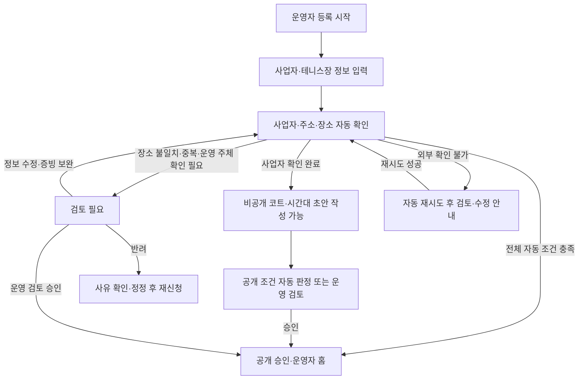
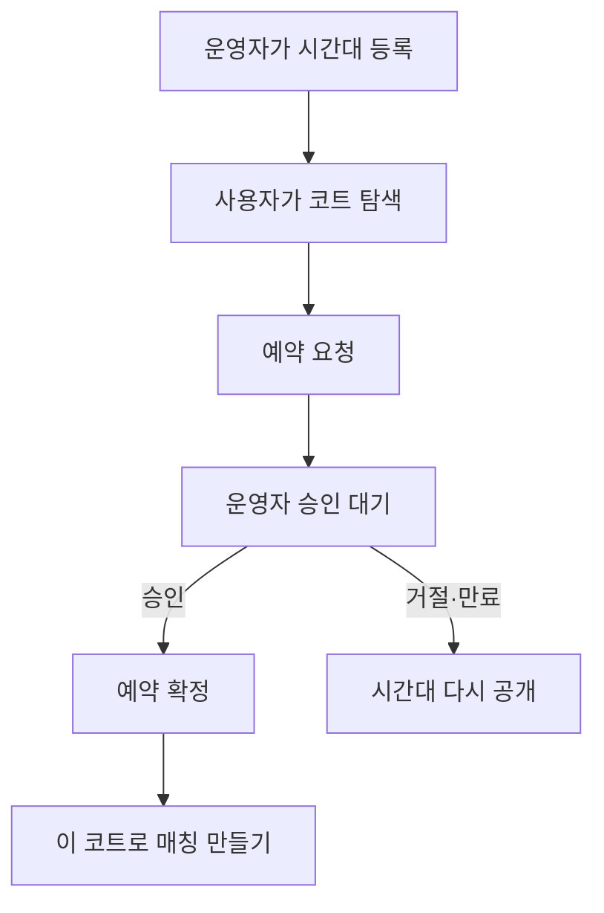
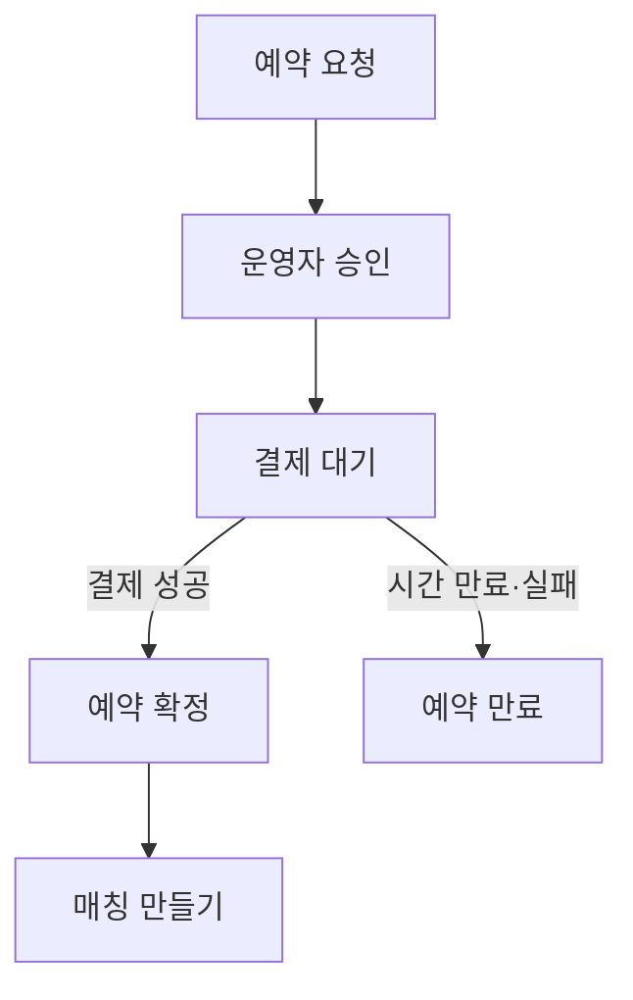

# Tennis Mate 코트 파트너 화면 명세

## 1. 문서 정보

| 항목 | 내용 |
| --- | --- |
| 문서명 | Tennis Mate Court Partner Screen Specification |
| 문서 상태 | Draft v0.1 |
| 제품 단계 | Court Partner Pilot 및 Court Commerce 확장 설계 |
| 기준 문서 | `01-product-overview.md`, `02-prd.md` |
| Core 화면 명세 | `03-screen-spec.md` |
| 구현 범위 | Core MVP 다음의 필수 Court Partner Pilot. 결제·환불·정산은 별도 Commerce 단계 |

이 문서는 코트 운영자가 예약 가능한 코트 시간대를 공급하고, 사용자가 해당 시간대를 요청하여 코트 예약을 확정하는 후속 단계의 화면을 정의한다.

`03-screen-spec.md`의 Core MVP 화면과 구현 범위를 분리하기 위한 문서다. Court Partner Pilot은 Core MVP 다음에 반드시 구현하지만, 이 문서의 Court Commerce 항목(결제·환불·정산)은 별도 승인 전까지 구현 범위에 포함하지 않는다.

## 2. 제품 단계

### 2.1 Court Partner Pilot

소수의 운영자와 함께 코트 예약 흐름을 제공하는 필수 확장 단계다. Pilot에서는 운영 가능성을 검증하고 개선하되, 수요 지표가 시작 여부를 결정하지 않는다.

- 운영자 등록과 승인
- 코트 정보 등록
- 예약 가능 시간대 등록
- 사용자의 코트 탐색과 예약 요청
- 운영자의 승인 또는 거절
- 예약 확정 후 매칭 모집 생성
- 예약 목록과 상태 관리

Pilot에서는 앱 내 결제, 환불과 정산을 구현하지 않는다. 운영자 승인 시 예약을 확정하는 단순한 구조를 우선 검증한다.

### 2.2 Court Commerce

Pilot 검증 후 다음 기능을 추가한다.

- 운영자 승인 후 결제 대기
- 결제 제한 시간과 자동 만료
- 결제 성공 후 예약 확정
- 사용자·운영자·우천 취소
- 전액 또는 부분 환불
- 플랫폼 수수료와 운영자 정산
- 결제 및 정산 내역

### 2.3 제외 범위

다음 기능은 이 확장 화면 명세에도 기본 포함하지 않는다.

- 참가자별 코트 비용 분할 결제
- 코트 운영자가 매칭 참가자를 직접 선택하는 기능
- 코치나 레슨 상품 예약
- 정기권, 쿠폰과 포인트
- 동적 가격 자동 결정
- 여러 코트를 묶은 복합 예약
- 전화나 외부 예약 시스템의 자동 동기화

## 3. 역할과 책임

| 역할 | 책임 | 하지 않는 일 |
| --- | --- | --- |
| 코트 운영자 | 코트·시간대 공급, 예약 요청 승인·거절, 운영상 취소 | 매칭 참가자의 실력 심사와 참가 승인 |
| 코트 예약자 | 코트 조건 확인, 예약 요청, Commerce 단계의 결제 | 운영자 대신 코트 재고 수정 |
| 매칭 모집자 | 확정 코트를 기반으로 참가자 모집, 참가 신청 수락·거절 | 코트 예약 상태 임의 변경 |
| 매칭 참가자 | 확정된 일정·비용 확인 후 같이 치기 신청 | 코트 운영자에게 직접 예약 승인 요청 |
| 플랫폼 관리자 | 운영자 심사, 분쟁 및 예외 처리 | 일반적인 예약을 대신 승인 |

한 사용자가 코트를 예약한 뒤 매칭을 만들면 `코트 예약자`와 `매칭 모집자` 역할을 동시에 가진다. 그러나 코트 예약 승인과 참가 신청 수락은 서로 다른 행동과 상태로 유지한다.

## 4. 핵심 UX 원칙

### 4.1 실제 예약 가능 시간만 공개한다

운영자가 공개한 `AVAILABLE` 시간대만 사용자에게 보여준다. 이미 점유되거나 예약된 시간대를 예약 가능하게 표시하지 않는다.

### 4.2 예약 요청과 예약 확정을 구분한다

사용자가 요청 버튼을 눌렀다는 이유만으로 코트가 확정된 것처럼 표현하지 않는다.

- 요청 전: `예약 가능`
- 운영자 확인 전: `승인 대기`
- 운영자 승인 후: `예약 확정`
- Commerce 결제 전: `결제 대기`

### 4.3 운영자에게 불필요한 플레이 정보를 노출하지 않는다

운영자가 예약 요청을 판단하는 데 사용자의 랠리 수준, 게임 경험이나 성별은 필요하지 않다. 예약자 식별과 운영에 필요한 최소 정보만 보여준다.

### 4.4 중복 예약을 서버에서 방지한다

동일한 CourtSlot에는 동시에 하나의 활성 요청 또는 예약만 존재하도록 하는 방식을 우선 권장한다. 화면에서 버튼을 숨기는 것만으로 중복 예약을 막지 않는다.

### 4.5 결제와 예약 상태를 분리한다

결제가 추가되어도 `CourtBooking.status`와 `Payment.status`를 하나로 합치지 않는다. 화면은 두 상태를 조합해 사용자 문구를 결정한다.

## 5. 전체 정보 구조

### 5.1 운영자 화면

| ID | 화면 | 제안 경로 | 단계 |
| --- | --- | --- | --- |
| OP01 | 운영자 등록 | `/partner/apply` | Pilot |
| OP02 | 운영자 심사 상태 | `/partner/application` | Pilot |
| OP03 | 운영자 홈 | `/partner` | Pilot |
| OP04 | 코트 목록·관리 | `/partner/courts` | Pilot |
| OP05 | 코트 등록·수정 | `/partner/courts/new`, `/partner/courts/[id]/edit` | Pilot |
| OP06 | 예약 시간 관리 | `/partner/slots` | Pilot |
| OP07 | 예약 시간 등록·수정 | `/partner/slots/new`, `/partner/slots/[id]/edit` | Pilot |
| OP08 | 예약 요청 목록 | `/partner/bookings` | Pilot |
| OP09 | 예약 요청 상세 | `/partner/bookings/[id]` | Pilot |
| OP10 | 결제·정산 | `/partner/settlements` | Commerce |

### 5.2 사용자 코트 예약 화면

| ID | 화면 | 제안 경로 | 단계 |
| --- | --- | --- | --- |
| CT01 | 예약 가능 코트 | `/courts` | Pilot |
| CT02 | 코트·시간대 상세 | `/court-slots/[slotId]` | Pilot |
| CT03 | 예약 요청 확인 | `/court-slots/[slotId]/request` | Pilot |
| CT04 | 내 코트 예약 | `/my/court-bookings` | Pilot |
| CT05 | 코트 예약 상세 | `/my/court-bookings/[bookingId]` | Pilot |
| CT06 | 결제 | `/my/court-bookings/[bookingId]/payment` | Commerce |
| CT07 | 예약 확정·매칭 연결 | 예약 상세 내 결과 상태 | Pilot·Commerce |

### 5.3 운영자 내비게이션

운영자 권한이 승인된 계정에만 다음 내비게이션을 제공한다.

| 항목 | 이동 위치 | 배지 |
| --- | --- | --- |
| 운영 홈 | OP03 | 없음 |
| 시간 관리 | OP06 | 오늘 공개 슬롯 수 선택 표시 |
| 예약 요청 | OP08 | 처리 대기 요청 수 |
| 코트 관리 | OP04 | 없음 |

일반 사용자 앱의 `홈 · 매칭 만들기 · 활동 · 마이`와 운영자 내비게이션을 한 화면에 혼합하지 않는다. 마이페이지에서 `코트 운영자 모드`로 전환하는 진입점을 제공할 수 있다.

## 6. 전체 흐름

### 6.1 운영자 등록

### 6.2 Pilot 예약

### 6.3 Commerce 예약

## 7. 상태와 사용자 문구

### 7.1 CourtSlot

| 상태 | 의미 | 사용자 공개 | 운영자 문구 |
| --- | --- | --- | --- |
| `DRAFT` | 작성 중 | 비공개 | 작성 중 |
| `AVAILABLE` | 예약 요청 가능 | 공개 | 예약 가능 |
| `HELD` | 활성 요청 또는 결제 대기 | 예약 불가 | 임시 점유 |
| `BOOKED` | 예약 확정 | 예약 불가 | 예약 완료 |
| `BLOCKED` | 운영상 판매 중단 | 비공개 | 운영 중지 |
| `CANCELLED` | 시간대 취소 | 비공개 | 취소됨 |

### 7.2 CourtBooking

| 상태 | 사용자 문구 | 운영자 문구 |
| --- | --- | --- |
| `REQUESTED` | 운영자가 확인하고 있어요 | 승인 대기 |
| `AWAITING_PAYMENT` | 운영자가 승인했어요. 결제가 필요해요 | 결제 대기 |
| `CONFIRMED` | 코트 예약이 확정됐어요 | 예약 확정 |
| `REJECTED` | 이번 시간은 예약이 어려워요 | 요청 거절 |
| `EXPIRED` | 요청 시간이 만료됐어요 | 요청 만료 |
| `CANCELLED_BY_USER` | 예약을 취소했어요 | 사용자 취소 |
| `CANCELLED_BY_OPERATOR` | 운영자가 예약을 취소했어요 | 운영자 취소 |

### 7.3 Payment — Commerce

| 상태 | 사용자 문구 |
| --- | --- |
| `PENDING` | 결제를 기다리고 있어요 |
| `PAID` | 결제가 완료됐어요 |
| `FAILED` | 결제를 완료하지 못했어요 |
| `CANCELLED` | 결제가 취소됐어요 |
| `PARTIALLY_REFUNDED` | 일부 금액이 환불됐어요 |
| `REFUNDED` | 환불이 완료됐어요 |

### 7.4 Settlement — Commerce

| 상태 | 운영자 문구 |
| --- | --- |
| `PENDING` | 정산 예정 |
| `SCHEDULED` | 정산 처리 중 |
| `PAID` | 정산 완료 |
| `HELD` | 정산 보류 |
| `FAILED` | 정산 실패 |

## 8. OP01 운영자 등록

### 8.1 목적

코트 시간대를 공급할 실제 운영 권한이 있는지 확인하기 위한 정보를 받는다.

### 8.2 화면 구성

1. 운영자 프로그램 소개
2. 등록 절차와 예상 심사 단계
3. 사업자·테니스장 기본 정보
4. 담당자 정보
5. 사업자·주소·장소 자동 확인 결과
6. 불일치 시 운영 권한 추가 확인
7. 약관 동의
8. 제출 전 확인

### 8.3 입력 항목

| 항목 | 필수 | 비고 |
| --- | --- | --- |
| 사업장명 | 필수 | 사용자에게 노출될 이름과 구분 가능 |
| 사업자등록번호 | 필수 | 국세청 진위·상태 조회에 사용, 원문 노출·분석 금지 |
| 개업일·대표자명 | 필수 | 사업자등록 진위 확인에 사용, 일반 사용자에게 비공개 |
| 담당자명 | 필수 | 일반 사용자에게 비공개 |
| 담당자 연락처 | 필수 | 운영 연락 용도 |
| 코트·테니스장명 | 필수 | 장소 검색 결과와 대조 |
| 코트 주소 | 필수 | 도로명주소로 표준화하고 장소 검색 결과와 대조 |
| 운영 권한 증빙 | 검토 필요 시 필수 | 임대·위탁·지점·공공시설 등 운영 주체 확인에 필요한 최소 자료 |
| 시설 담당 연락처 | 검토 필요 시 선택 | 공공시설·위탁 운영의 별도 확인 경로 |
| 운영 시간 | 선택 | 코트 등록 단계에서 보완 가능 |

국세청 API는 사업자번호·개업일·대표자명 등의 일치와 영업 상태를, 주소·장소 API는 실제 장소 정보의 일치를 보조적으로 확인한다. 사업자 유효 여부가 곧 테니스장 운영 권한을 뜻하지는 않는다. 공개 승인에는 정상 사업자, 표준화한 사업장·코트 주소와 장소 검색 결과의 일치, 활성 동일 장소 운영자 부재가 모두 필요하다. 지점·위탁 운영·공공시설·명의 변경과 장소 중복은 운영 권한 증빙 또는 시설 담당 연락처를 운영자가 검토한다.

외부 확인 실패는 곧 반려가 아니다. 장애·시간 초과·신규 개업 반영 지연은 안내 가능한 코드만 남기고 제한된 자동 재시도 후 검토 또는 수정 경로를 보여준다. 국세청의 불일치 또는 휴·폐업처럼 공개 조건을 충족하지 않는 결과만 수정 후 재신청으로 안내한다. 증빙 파일은 공개 URL로 저장하거나 분석 이벤트에 포함하지 않으며, 원문 보관·삭제 기간은 Pilot 공개 전 개인정보 처리방침과 운영 절차로 확정한다.

### 8.4 상태

- 입력 중
- 제출 중
- 제출 완료
- 자동 확인 중
- 코트 초안 작성 가능
- 검토 필요
- 중복 사업장 의심
- 공개 승인
- 공개 일시 중지
- 파일 업로드 실패
- 제출 실패

## 9. OP02 운영자 심사 상태

### 9.1 목적

운영자가 현재 심사 상태와 다음 행동을 알 수 있게 한다.

| 상태 | 안내 | CTA |
| --- | --- | --- |
| 자동 확인 중 | 사업자와 테니스장 정보를 확인하고 있어요 | 잠시 기다리기 |
| 코트 초안 작성 가능 | 코트와 시간을 먼저 준비할 수 있어요. 아직 다른 사용자에게는 보이지 않아요 | 코트 초안 만들기 |
| 검토 필요 | 테니스장 또는 운영 권한을 한 번 더 확인해 주세요 | 정보 수정·추가 확인 |
| 검토 중 | 제출한 정보를 확인하고 있어요 | 제출 내용 보기 |
| 보완 필요 | 추가 정보가 필요해요 | 정보 보완하기 |
| 승인 | 운영자 등록이 완료됐어요. 이제 시간대를 공개할 수 있어요 | 운영자 홈으로 |
| 공개 일시 중지 | 새 예약을 받기 전에 정보를 다시 확인해야 해요 | 확인 내용 보기 |
| 반려 | 현재 정보로는 등록이 어려워요 | 사유 확인·문의 |

반려 사유는 내부 위험 판단 정보를 과도하게 노출하지 않으면서 사용자가 수정 가능한 내용을 구체적으로 안내한다. 같은 장소가 이미 등록돼 있거나 공공시설·지점·위탁 운영처럼 자동 확인만으로 권한을 판단하기 어려우면 반려하지 않고 `검토 필요`로 안내한다. 운영자 본인 신청의 심사나 공개 승인 판단은 할 수 없으며, 판정·사유 코드·시각은 내부 감사 이력으로 남긴다.

## 10. OP03 운영자 홈

### 10.1 목적

오늘 필요한 운영 행동을 우선순위대로 보여준다.

### 10.2 정보 순서

1. 승인 대기 예약 요청
2. 오늘 이용 예정 예약
3. 앞으로 공개된 시간대
4. 최근 취소 또는 운영상 확인 필요 항목
5. 빠른 시간대 등록 CTA

### 10.3 요약 카드

- `확인할 예약 요청 n건`
- `오늘 예약 n건`
- `이번 주 예약 가능 시간 n개`
- Commerce 단계: `다음 정산 예정 금액`

매출, 전환율과 정산 정보는 운영 권한이 있는 사용자에게만 보여준다.

### 10.4 Empty State

> 아직 등록한 예약 시간이 없어요.  
> 비어 있는 코트 시간을 먼저 등록해보세요.

CTA: `[예약 시간 등록하기]`

## 11. OP04 코트 목록·관리

### 11.1 목적

운영자가 관리하는 실제 코트와 공개 상태를 확인한다.

### 11.2 CourtCard

- 코트장 이름
- 등록된 코트 면 수
- 실내·실외
- 바닥 종류
- 운영 상태
- 앞으로 등록된 시간대 수
- 수정 CTA

### 11.3 행동

- 코트 면 추가
- 코트 정보 수정
- 신규 시간대 등록
- 코트 운영 중지

향후 예약이 있는 코트는 삭제하지 않고 `운영 중지` 처리한다.

Pilot에서 `코트 면 추가`는 승인된 운영자가 다른 시설을 추가하는 행동이 아니라, 현재 승인된 한 코트장 시설에 CourtUnit을 추가하는 범위로 제한한다. 다른 지점·주소의 코트장을 추가하려면 OP01 검증을 새로 시작하도록 안내한다.

## 12. OP05 코트 등록·수정

### 12.1 입력 항목

| 그룹 | 필드 |
| --- | --- |
| 기본 | 코트장 이름, 코트 구분, 주소, 위치 안내 |
| 시설 | 실내·실외, 바닥, 조명, 주차, 샤워·탈의, 라켓 대여 |
| 이용 | 기본 운영 시간, 준비물, 이용 규칙 |
| 문의 | 현장 문의 연락처, 노출 범위 |
| 이미지 | 대표 이미지와 시설 이미지—Pilot 선택 기능 |

### 12.2 검증

- 주소와 사용자에게 보여줄 위치 안내 필수
- 전화번호 등 개인정보의 공개 범위 확인
- 이미지 업로드 시 용량·형식·개인정보 포함 여부 안내
- 기존 예약이 있는 코트의 주소와 핵심 정보를 변경할 때 영향 경고

## 13. OP06 예약 시간 관리

### 13.1 목적

운영자가 날짜별 코트 시간대와 현재 상태를 빠르게 확인한다.

### 13.2 화면 구조

1. 날짜 선택
2. 코트 선택
3. 상태 필터
4. 시간순 SlotCard 목록
5. 예약 시간 추가 CTA

### 13.3 SlotCard

- 코트
- 시작·종료 시간
- 이용 시간
- 전체 예약 가격
- CourtSlot 상태
- 연결된 예약자—운영자에게만 최소 표시
- 수정 또는 상세 CTA

### 13.4 일괄 행동

Pilot 초기에는 한 건씩 등록·수정한다. 반복 시간대 생성이나 일괄 가격 변경은 실제 운영 부담이 확인된 뒤 추가한다.

## 14. OP07 예약 시간 등록·수정

### 14.1 필드

- 코트
- 날짜
- 시작 시간
- 이용 시간
- 전체 코트 가격
- 예약 가능 인원 참고값
- 이용 조건
- 취소 기준 요약
- 공개 여부

코트 전체를 한 명의 예약자에게 제공하는 구조로 시작한다. 참가자별 좌석 판매는 별도 상품 유형이므로 Pilot에 포함하지 않는다.

### 14.2 상태별 수정 제한

| Slot 상태 | 수정 가능 범위 |
| --- | --- |
| DRAFT | 전체 수정 가능 |
| AVAILABLE | 전체 수정 가능, 사용자 노출 영향 안내 |
| HELD | 가격·시간 변경 불가, 요청 상세로 이동 |
| BOOKED | 핵심 정보 직접 변경 불가, 예약 변경 절차 필요 |
| BLOCKED | 재공개 또는 취소 가능 |
| CANCELLED | 읽기 전용 |

### 14.3 중복 검사

같은 코트의 시간이 겹치면 등록할 수 없다. 클라이언트와 서버 모두 검사하되 서버 결과를 최종 기준으로 한다.

## 15. OP08 예약 요청 목록

### 15.1 목적

운영자가 처리할 요청과 확정·종료된 예약을 상태별로 확인한다.

### 15.2 탭

- 승인 대기
- 확정 예약
- 종료

### 15.3 BookingRequestCard

- 요청 상태
- 코트·날짜·시간
- 요청자 닉네임 또는 최소 식별 정보
- 요청 접수 시간
- 처리 제한 시간—정책 확정 후
- 상세 CTA

승인 대기를 최상단에 배치한다. 사용자 테니스 실력은 카드에 표시하지 않는다.

## 16. OP09 예약 요청 상세

### 16.1 정보 순서

1. 요청 상태와 남은 처리 시간
2. 코트·시간대 정보
3. 예약자 최소 정보
4. 사용자가 작성한 예약 관련 메시지—제공하는 경우
5. 가격과 취소 기준
6. 승인·거절 CTA

### 16.2 승인

Pilot:

> 이 예약을 확정할까요?  
> 확정하면 같은 시간대에는 다른 예약을 받을 수 없어요.

CTA: `[예약 확정하기]`

Commerce:

> 요청을 승인하면 사용자가 제한 시간 안에 결제할 수 있어요.

CTA: `[결제 요청 보내기]`

### 16.3 거절

- 거절 사유는 사용자에게 보여줄 짧은 선택지를 제공한다.
- 내부 메모와 사용자 공개 사유를 분리한다.
- 거절 후 Slot을 `AVAILABLE`로 되돌릴 수 있어야 한다.

권장 공개 사유:

- 해당 시간 이용이 어려워졌어요.
- 운영 일정 확인이 필요해요.
- 다른 시간을 선택해 주세요.

### 16.4 동시성 오류

다른 운영자가 먼저 처리했다면 최신 상태를 다시 불러오고 중복 승인하지 않는다.

## 17. OP10 결제·정산 — Commerce

### 17.1 목적

운영자가 예약별 결제와 정산 상태를 확인한다.

### 17.2 화면 구성

- 정산 예정 금액
- 다음 정산일
- 정산 완료 내역
- 환불·보류 건
- 예약별 결제 상세

### 17.3 상태 처리

- 결제 성공이 예약 확정에 반영되지 않은 예외
- 환불 처리 중
- 정산 보류
- 정산 계좌 오류

정산 계좌 전체 번호와 민감 정보를 화면에 그대로 노출하지 않는다.

## 18. CT01 예약 가능 코트

### 18.1 진입

- Core 매칭 등록 화면에서 `제휴 코트를 예약하고 싶어요`
- 홈 또는 마이페이지의 코트 예약 진입점
- 내 코트 예약의 `다른 시간 찾아보기`

### 18.2 화면 구조

1. 지역과 날짜
2. 필터 칩
3. 예약 가능한 시간대 목록
4. CourtSlotCard

### 18.3 필터

Pilot P0:

- 지역
- 날짜
- 시작 시간대
- 이용 시간

Pilot P1:

- 실내·실외
- 주차
- 가격 범위

### 18.4 CourtSlotCard

- 코트장 이름
- 지역
- 날짜·시작 시간·이용 시간
- 실내·실외와 바닥
- 전체 코트 가격
- 주요 편의시설
- `예약 요청 가능`

### 18.5 Empty State

> 선택한 조건에 예약 가능한 코트가 없어요.  
> 날짜나 지역을 바꿔보세요.

다른 사용자가 임시 점유한 Slot을 예약 가능한 것처럼 표시하지 않는다.

## 19. CT02 코트·시간대 상세

### 19.1 정보 순서

1. 코트장과 시설 이미지
2. 날짜·시간·이용 시간
3. 전체 예약 가격
4. 주소와 위치 안내
5. 시설 정보
6. 이용 규칙과 준비물
7. 취소 기준
8. 운영자 정보의 공개 가능한 범위
9. 하단 고정 `[예약 요청하기]`

### 19.2 CTA 상태

| 상태 | CTA |
| --- | --- |
| AVAILABLE | 예약 요청하기 |
| HELD | 다른 사용자가 확인 중이에요—비활성 |
| BOOKED | 예약이 완료된 시간이에요—비활성 |
| BLOCKED·CANCELLED | 이용할 수 없는 시간이에요—비활성 |
| 비로그인 | 로그인하고 예약 요청하기 |

## 20. CT03 예약 요청 확인

### 20.1 목적

요청 전에 시간, 가격과 취소 조건을 최종 확인한다.

### 20.2 화면 구성

- 코트·시간대 요약
- 전체 가격
- Pilot 결제 방식 안내
- 취소 기준
- 예약 관련 선택 메시지
- 약관 확인
- `[예약 요청 보내기]`

Pilot 안내:

> 지금은 예약 요청 후 운영자가 확인하면 코트 예약이 확정돼요. 앱에서는 결제하지 않아요.

Commerce 안내:

> 운영자가 승인하면 제한 시간 안에 결제해야 예약이 확정돼요.

### 20.3 성공

> 예약 요청을 보냈어요.  
> 운영자가 확인하면 상태가 바뀌어요.

CTA: `[내 코트 예약 보기]`

## 21. CT04 내 코트 예약

### 21.1 탭

- 확인 중
- 예약 확정
- 지난 예약
- 취소·종료

### 21.2 BookingCard

- 예약 상태
- 코트장
- 날짜·시간
- 전체 가격
- 결제 상태—Commerce만
- 다음 행동

### 21.3 Empty State

> 아직 요청한 코트가 없어요.  
> 원하는 날짜의 예약 가능한 코트를 찾아보세요.

CTA: `[코트 찾아보기]`

## 22. CT05 코트 예약 상세

### 22.1 공통 정보

- CourtBooking 상태
- 코트장·주소
- 날짜·시간·이용 시간
- 전체 가격
- 운영자 안내
- 취소 기준
- 상태 이력

### 22.2 상태별 CTA

| 상태 | CTA |
| --- | --- |
| REQUESTED | 예약 요청 취소—정책 확정 후 |
| CONFIRMED | 이 코트로 매칭 만들기 |
| REJECTED | 다른 시간 찾아보기 |
| EXPIRED | 다시 예약 요청하기 또는 다른 시간 찾기 |
| CANCELLED_BY_USER | 다른 코트 찾아보기 |
| CANCELLED_BY_OPERATOR | 다른 시간 찾기·지원 문의 |
| AWAITING_PAYMENT | 결제하기 |

### 22.3 예약 확정 정보

확정 후에만 다음 정보를 보여준다.

- 상세 이용 안내
- 현장 연락 방법
- 운영자가 제공한 입장 안내
- 매칭 생성 CTA

## 23. CT06 결제 — Commerce

### 23.1 화면 구성

1. 코트·시간대 요약
2. 결제 제한 시간
3. 결제 금액
4. 취소·환불 기준
5. 결제 수단
6. 결제 CTA

### 23.2 상태

| 상태 | 처리 |
| --- | --- |
| 결제 가능 | 남은 시간과 CTA 표시 |
| 결제 진행 | 중복 결제 차단 |
| 성공 | 예약 확정으로 이동 |
| 실패 | 실패 원인과 재시도 |
| 시간 만료 | 결제 차단, 다른 시간 찾기 |
| 결과 확인 중 | 자동 재결제 금지, 상태 조회 |

결제 결과를 알 수 없는 상태에서 사용자가 다시 결제하여 중복 결제되지 않게 한다.

## 24. CT07 예약 확정과 매칭 연결

### 24.1 목적

코트 예약 완료를 참가자 모집으로 자연스럽게 연결한다.

권장 결과 화면:

> 코트 예약이 완료됐어요 🎾  
> 이제 함께 칠 사람을 모집해볼까요?

Primary CTA: `[이 코트로 매칭 만들기]`  
Secondary CTA: `[예약 상세 보기]`

### 24.2 기존 매칭 등록 화면으로 전달할 값

| 필드 | 전달 방식 |
| --- | --- |
| `courtSource` | `PARTNER_COURT`로 고정 |
| `courtBookingId` | 예약 연결용으로 전달 |
| 코트장·코트 | 예약 정보에서 자동 입력, 수정 불가 |
| 날짜·시간·이용 시간 | 자동 입력, 수정 불가 |
| 전체 코트 비용 | 예약 정보에서 자동 입력 |
| 예상 1인 비용 | 모집 예상 인원을 입력한 뒤 계산 |
| CourtSourceBadge | `Tennis Mate에서 예약이 확인된 코트예요` |

사용자는 플레이 목적, 모집 인원, 상대 수준, 초보자 환영 여부와 소개 메시지만 입력한다.

### 24.3 연결 규칙

- 취소·만료된 예약으로 매칭을 만들 수 없다.
- 하나의 예약에 연결할 수 있는 활성 매칭 수는 한 개를 권장한다.
- 예약이 운영자에 의해 취소되면 연결된 매칭에 영향을 명확하게 표시한다.
- 코트 예약 취소와 매칭 취소의 연쇄 처리 정책은 구현 전 확정한다.

## 25. 예약 취소·변경 UX

### 25.1 사용자 취소

취소 전 다음을 보여준다.

- 현재 예약 상태
- 취소 가능 기한
- 환불 예상 금액—Commerce
- 연결된 매칭과 수락된 참가자 수
- 취소 영향

### 25.2 운영자 취소

운영자는 사유를 선택하고 사용자에게 보여줄 안내를 입력한다. 연결된 매칭이 있으면 예약자와 수락된 참가자에게 상태를 표시해야 한다.

### 25.3 일정 변경

Pilot에서는 확정 예약의 직접 시간 변경을 지원하지 않는 방향을 권장한다. 기존 예약을 취소하고 새 Slot을 예약하게 하여 상태 복잡도를 줄인다.

## 26. 화면별 로딩·빈 화면·오류

| 영역 | 로딩 | 빈 화면 | 오류 |
| --- | --- | --- | --- |
| 운영자 홈 | 요약 카드 스켈레톤 | 시간대 등록 CTA | 다시 불러오기 |
| 코트 관리 | CourtCard 스켈레톤 | 첫 코트 등록 CTA | 재시도 |
| 시간 관리 | 시간순 스켈레톤 | 시간대 등록 CTA | 날짜·코트 선택 유지 |
| 예약 요청 | BookingCard 스켈레톤 | 처리할 요청 없음 안내 | 기존 목록 유지와 재시도 |
| 코트 탐색 | CourtSlotCard 스켈레톤 | 조건 변경 CTA | 필터 유지와 재시도 |
| 예약 상세 | 핵심 정보 스켈레톤 | 삭제·권한 없음 안내 | 상태 재조회 |
| 결제 | 결제 상태 표시 | 해당 없음 | 자동 재결제 없이 결과 조회 |

## 27. 권한과 보안

- 승인된 운영자만 자신의 코트와 Slot을 등록·수정한다.
- 운영자는 다른 운영자의 코트, 예약과 정산을 조회할 수 없다.
- 일반 사용자는 공개된 코트 정보와 자신의 예약만 조회한다.
- 예약자 연락처는 예약 운영에 필요한 시점과 범위에서만 공개한다.
- 사업자 증빙, 정산 계좌와 운영자 내부 메모는 일반 사용자에게 노출하지 않는다.
- 코트 운영자 권한과 일반 회원 권한을 UI 표시뿐 아니라 서버에서도 검증한다.
- 예약 승인·거절·취소와 결제·환불은 감사 가능한 상태 이력을 남긴다.

## 28. 접근성과 반응형

- 운영자 화면도 모바일에서 승인·거절과 시간대 등록이 가능해야 한다.
- 달력만으로 정보를 제공하지 않고 날짜별 목록 보기를 함께 지원한다.
- CourtSlot 상태를 색상과 텍스트로 함께 표시한다.
- 승인·거절 다이얼로그는 키보드와 보조기술로 사용할 수 있어야 한다.
- 데스크톱에서는 코트·날짜 필터와 시간대 목록을 2열로 배치할 수 있다.
- 결제 제한 시간은 색상 변화만으로 긴급성을 표현하지 않는다.

## 29. 분석 이벤트

### 29.1 Pilot

| 이벤트 | 발생 시점 |
| --- | --- |
| `partner_application_submitted` | 운영자 신청 제출 |
| `court_created` | 코트 등록 완료 |
| `court_slot_published` | 시간대 공개 |
| `court_slot_viewed` | 사용자가 시간대 상세 조회 |
| `court_booking_requested` | 예약 요청 제출 |
| `court_booking_confirmed` | 운영자가 예약 확정 |
| `court_booking_rejected` | 운영자가 요청 거절 |
| `partner_booking_cancelled` | 운영자가 예약 취소 |
| `court_booking_match_create_started` | 확정 코트에서 매칭 생성 시작 |
| `court_booking_match_created` | 확정 코트에 매칭 연결 완료 |

### 29.2 Commerce

| 이벤트 | 발생 시점 |
| --- | --- |
| `court_payment_started` | 결제 시작 |
| `court_payment_succeeded` | 결제 성공 |
| `court_payment_failed` | 결제 실패 |
| `court_payment_expired` | 결제 제한 시간 만료 |
| `court_payment_refunded` | 환불 완료 |
| `court_settlement_completed` | 운영자 정산 완료 |

분석 이벤트에 사업자 번호, 연락처, 계좌번호, 상세 주소 또는 결제수단 원문을 포함하지 않는다.

## 30. Pilot 성공 지표

| 지표 | 기본 정의 |
| --- | --- |
| Slot Request Rate | 예약 요청이 발생한 Slot 상세 조회 수 ÷ 전체 Slot 상세 조회 수 |
| Booking Confirmation Rate | 확정 예약 수 ÷ 예약 요청 수 |
| Operator Response Time | 요청 생성부터 승인·거절까지 걸린 시간 |
| Slot Utilization Rate | 예약 확정 Slot 수 ÷ 공개된 Slot 수 |
| Booking-to-Match Rate | 매칭이 생성된 확정 예약 수 ÷ 전체 확정 예약 수 |
| Court-backed Match Success Rate | 한 명 이상 참가자가 수락된 제휴 코트 매칭 수 ÷ 제휴 코트 매칭 수 |

Commerce에서는 결제 완료율, 결제 만료율, 환불률과 정산 실패율을 추가한다.

## 31. 구현 인수 체크리스트

### 범위

- [ ] Pilot과 Commerce 화면이 구현 범위에서 분리된다.
- [ ] Pilot에서 앱 결제를 암시하는 CTA가 노출되지 않는다.
- [ ] 운영자 예약 승인과 매칭 참가 승인이 서로 다른 화면과 상태다.

### 운영자

- [ ] 승인된 운영자만 코트와 시간대를 공개한다.
- [ ] 중복 시간대를 등록할 수 없다.
- [ ] HELD·BOOKED Slot의 핵심 정보를 직접 수정할 수 없다.
- [ ] 운영자는 예약 판단에 불필요한 테니스 실력 정보를 보지 않는다.
- [ ] 승인·거절·취소 결과가 사용자 예약 상태에 반영된다.

### 사용자

- [ ] AVAILABLE Slot만 예약 요청할 수 있다.
- [ ] 요청과 확정 상태가 명확하게 구분된다.
- [ ] 코트 가격과 이용·취소 조건을 요청 전에 확인한다.
- [ ] 확정 예약에서 PARTNER_COURT 매칭을 만들 수 있다.
- [ ] 예약에서 전달된 코트와 시간 정보는 매칭 등록에서 임의 변경할 수 없다.

### 결제·정산

- [ ] 결제 상태와 예약 상태를 분리한다.
- [ ] 결제 제한 시간이 지나면 결제를 차단한다.
- [ ] 결제 결과가 불확실할 때 자동 재결제하지 않는다.
- [ ] 환불과 정산 상태를 권한 있는 사용자에게만 표시한다.

## 32. 구현 전 결정할 항목

1. 운영자 인증에 필요한 최소 정보와 심사 주체
2. 한 Slot에 허용할 동시 예약 요청 수
3. Slot 임시 점유 시간과 운영자 응답 제한 시간
4. Pilot에서 운영자 승인 즉시 예약 확정으로 처리할지 여부
5. Pilot의 실제 비용 지급 방식과 화면 안내
6. 사용자·운영자·우천 취소 기준
7. 예약 취소 시 연결된 매칭의 자동 처리 범위
8. 하나의 예약에 연결 가능한 활성 매칭 수
9. 코트 이미지 업로드의 Pilot 포함 여부
10. Commerce 결제 제한 시간
11. 환불 기준과 운영자 정산 주기
12. 예약자 연락처의 공개 시점과 범위

확정되지 않은 항목은 화면에 고정된 정책 문구로 구현하지 않는다. ERD에서는 상태 이력과 후속 확장을 고려하되 Core MVP 테이블로 만들지 않는다.

## 33. 다음 단계

`04-erd.md`에서는 다음 두 모델을 구분한다.

- Core MVP: `User`, `TennisProfile`, `Match`, `MatchApplication`, 외부 예약 코트 정보
- Court Partner 확장: `CourtOperator`, `Court`, `CourtSlot`, `CourtBooking`, `Payment`, `Settlement`, 상태 이력

Core MVP 구현에서는 확장 엔터티를 미리 만들지 않는다. 다만 `Match.courtSource`와 향후 `courtBookingId` 연결 가능성은 확장 지점으로 검토한다.
