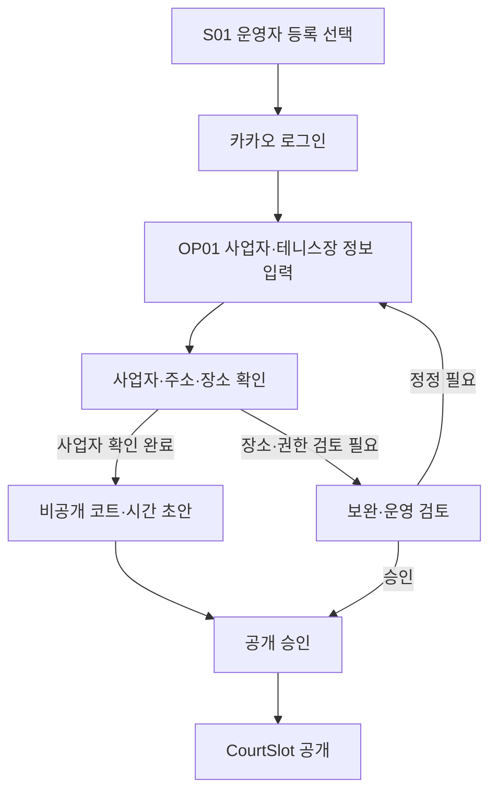
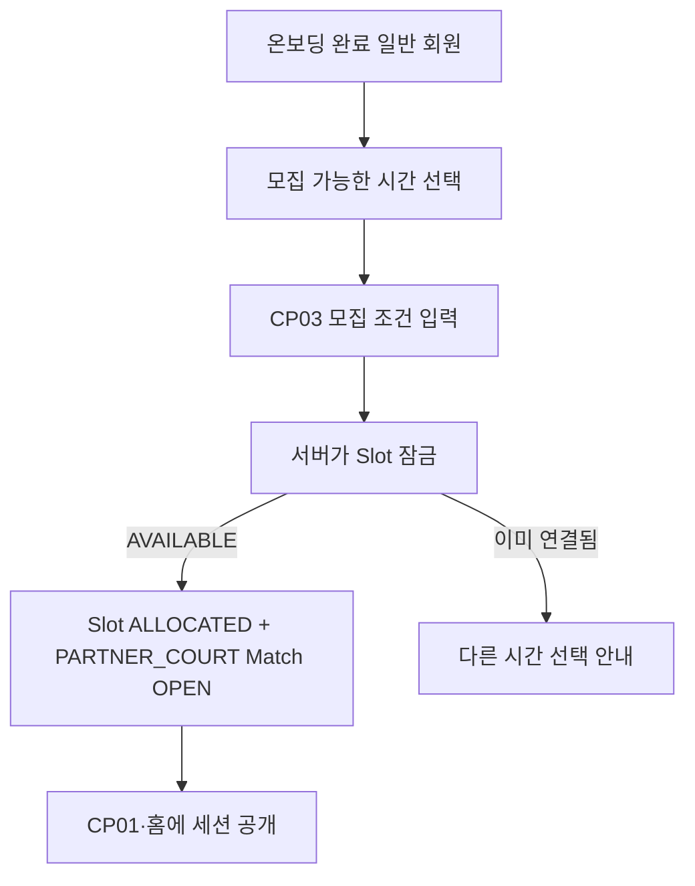
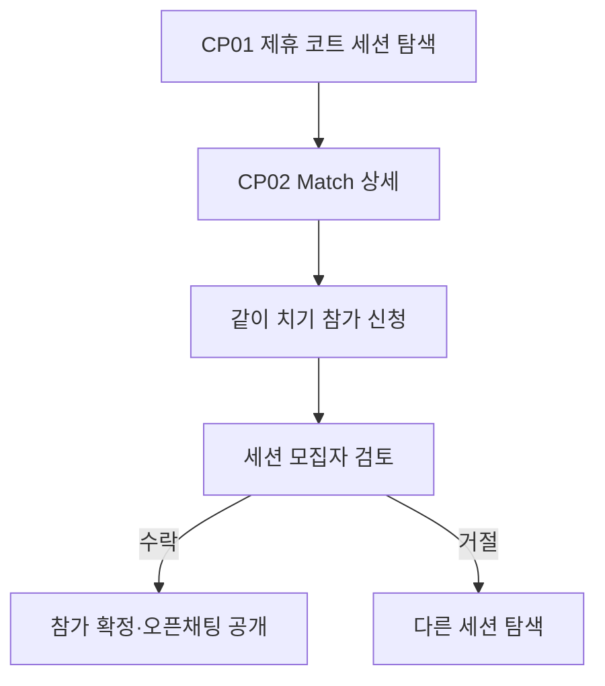

# Tennis Mate 코트 파트너 화면 명세

## 1. 문서 정보

| 항목 | 내용 |
| --- | --- |
| 문서명 | Tennis Mate Court Partner Screen Specification |
| 문서 상태 | Draft v0.2 |
| 제품 단계 | Court Partner Pilot 설계 |
| 기준 문서 | `01-product-overview.md`, `02-prd.md` |
| Core 화면 명세 | `03-screen-spec.md` |
| 구현 범위 | Core MVP 다음의 필수 Pilot. 결제·환불·정산은 별도 단계 |

이 문서는 코트 운영자가 준비한 코트 시간을 공급하고, 일반 모집자가 그 시간에 제휴 코트 세션을 열어 참가자를 모집하는 흐름을 정의한다. 일반 사용자는 제휴 코트에 예약 요청을 보내지 않는다. 참가 신청은 기존 Match 흐름과 동일하게 세션 모집자에게 보내며, 운영자는 이를 승인하거나 거절하지 않는다.

`03-screen-spec.md`의 Core MVP 화면과 구현 범위를 분리하기 위한 문서다. Court Partner Pilot은 Core MVP 다음에 반드시 구현하지만, 앱 결제·환불·정산과 일반 사용자 코트 예약은 별도 승인 전까지 포함하지 않는다.

### 1.1 시각 기준

- Figma 파일의 `Court Partner Pilot` 페이지를 기준 화면으로 사용한다.
- OP01 운영자 등록, OP02 심사 상태와 CP01 제휴 코트 세션 탐색이 작성되어 있다.
- CP01은 390 × 844 기준이며 대표 코트 사진 또는 기본 일러스트, `Tennis Mate에서 준비한 코트`, 공개 상태 칩(예: `세션 모집 중`), `참가 신청은 세션을 연 모집자에게 보내요`를 표시한다.
- 모바일 아트보드는 `390 × 844`, 기존 Tennis Mate 색상·간격·모서리 토큰과 Noto Sans KR을 사용한다.
- 웹 구현 전에는 Figma에 해당 화면·상태를 먼저 추가하고, 카드와 하단 CTA의 간격을 같은 기준으로 검토한다.

### 1.2 첫 진입과 공통 인증

비로그인 첫 화면 S01에서 `테니스장을 운영하고 있어요`를 선택하면 메이트 이용자와 동일한 카카오 계정으로 인증한 뒤 OP01로 이동한다. 운영자 등록에는 일반 테니스 프로필 온보딩을 요구하지 않으며, 이 선택만으로 별도 운영자 계정이나 영구 역할을 만들지 않는다. 인증된 사용자의 운영 권한과 공개 가능 여부는 OP01 신청 상태로만 판단한다.

일반 회원이 제휴 코트 세션을 열거나 참가하려면 기존 Match 정책대로 테니스 프로필 온보딩을 완료해야 한다.

## 2. 제품 단계와 제외 범위

### 2.1 Court Partner Pilot

소수의 운영자와 함께 초보자가 코트를 따로 예약하지 않아도 참가할 수 있는 제휴 코트 세션을 제공하는 필수 확장 단계다.

- 운영자 등록, 심사와 공개 권한 확인
- 코트·개별 코트 면과 비공개 시간대 초안 등록
- 공개 가능한 CourtSlot 관리
- 일반 모집자의 제휴 코트 세션 개설
- 일반 사용자의 제휴 코트 세션 탐색과 참가 신청
- 기존 모집자의 참가 수락·거절·마감·완료 흐름 재사용

Pilot은 운영자가 시간 공급을 승인한 뒤 다시 예약 요청을 처리하는 구조가 아니다. `AVAILABLE` Slot을 하나의 Partner Court Match에 원자적으로 연결하는 것은 서버 내부의 공급 배정이며, 이용자 UI에서 코트 예약이나 운영자 승인으로 표현하지 않는다.

### 2.2 별도 단계

다음은 Pilot에 추가하지 않는다.

- 일반 사용자의 코트 예약 요청, 예약 목록, 예약 승인·거절
- 앱 내 결제, 환불, 수수료, 운영자 정산
- 운영자의 참가자 선택·실력 심사
- 참가자별 좌석 판매 또는 분할 결제
- 실시간 채팅, 코치·레슨 상품, 정기권·쿠폰·포인트
- 외부 예약 시스템 자동 동기화

향후 Commerce를 검토하더라도 결제 대상·계약 주체·환불 책임이 확정되기 전에는 화면과 API를 만들지 않는다. Commerce 검토가 일반 사용자 CourtBooking 모델을 다시 도입하는 근거가 되지 않는다.

## 3. 역할과 책임

| 역할 | 하는 일 | 하지 않는 일 |
| --- | --- | --- |
| 코트 운영자 | 코트·시간대 공급, 공개·중지, 운영상 안내 | 참가 신청 수락·거절, 이용자 실력 심사 |
| 세션 모집자 | 공개 Slot을 Match에 연결, 모집 조건 입력, 참가 신청 수락·거절 | 운영자 대신 시간 재고 수정, 다른 운영자 시간 사용 |
| 매칭 참가자 | 제휴 코트 세션의 조건을 확인하고 같이 치기 신청 | 운영자에게 코트 예약 요청, Slot 상태 변경 |
| 플랫폼 관리자 | 운영자 심사, 예외·분쟁 처리 | 일반 참가 신청을 대신 수락 |

`세션 모집자`와 `매칭 참가자`는 모두 일반 회원이다. 한 회원이 어떤 세션에서는 모집자이고 다른 세션에서는 참가자일 수 있다. 운영자 시간 공급 권한과 모집자의 참가 승인 권한은 데이터 모델·API·화면 상태로 절대 합치지 않는다.

## 4. 핵심 UX 원칙

### 4.1 사용자 언어는 “제휴 코트 세션”으로 통일한다

일반 사용자 화면에서 `예약 가능`, `예약 요청`, `승인 대기`, `코트 예약 확정`을 사용하지 않는다.

- 목록 제목: `이번 주 제휴 코트 세션`
- 배지: `Tennis Mate에서 준비한 코트`
- 상세 CTA: `참가 신청하기`
- 보조 문구: `참가 신청은 세션을 연 모집자에게 보내요.`

운영자 화면에서만 공급 관리 맥락으로 `모집 가능한 시간`, `공개 시간`, `사용 중인 시간`을 사용한다. 일반 사용자에게도 공개 상태는 보여 줄 수 있지만, 상태별 행동은 세션 개설 또는 세션 참여로만 제한한다.

### 4.2 시간 공급과 참가 승인을 분리한다

운영자는 공개 Slot을 관리한다. 온보딩을 마친 일반 모집자가 `AVAILABLE` Slot을 선택해 Match를 만들면 서버는 Slot을 `ALLOCATED`로 바꾸고 Match에 연결한다. 이후 참가자의 `PENDING`, `ACCEPTED`, `REJECTED`는 기존 `MatchApplication` 상태를 사용하며 세션 모집자만 변경할 수 있다.

운영자에게는 참가자 프로필, 참가 신청 메시지, 수락·거절 CTA를 제공하지 않는다. 참가자에게는 운영자 승인 대기 상태를 제공하지 않는다.

### 4.3 공개 여부와 공급 상태를 분리한다

새 Slot은 `DRAFT`·`PRIVATE`로 시작하고, 한 번 공개하면 상태가 바뀌어도 계속 공개할 수 있다. `PUBLIC`은 이용자가 시간의 현재 상태를 확인할 수 있다는 뜻이고, `AVAILABLE`, `ALLOCATED`, `ENDED`, `BLOCKED`, `CANCELLED`은 그 시간에 할 수 있는 행동을 정하는 공급 상태다. 한 번도 공개하지 않은 초안을 취소한 경우에는 비공개를 유지할 수 있다.

일반 사용자는 Slot 자체를 예약하는 화면을 보지 않는다. `AVAILABLE`이면 온보딩을 마친 일반 회원에게만 `[이 시간으로 세션 열기]`를 보여 준다. `ALLOCATED`이면 연결된 `PARTNER_COURT` Match를 보여 주고, 참가자는 그 세션에만 참가 신청할 수 있다. `ENDED`, `BLOCKED`, `CANCELLED`는 상태와 최신 갱신 시각만 읽을 수 있고 CTA는 제공하지 않는다. 예약 요청·가격 결제·운영자 승인 대기 단계를 노출하지 않는다.

### 4.4 중복 배정은 서버에서 막는다

동일한 CourtSlot은 활성 Partner Court Match 하나에만 연결한다. 카드에서 숨기는 것만으로 막지 않고 `AVAILABLE → ALLOCATED` 전환과 Match 생성을 하나의 트랜잭션으로 처리한다. 충돌 시 사용자는 `방금 다른 세션에 연결됐어요. 다른 시간을 골라주세요.`를 본다.

### 4.5 결제와 비용 안내를 구분한다

Pilot은 앱 결제를 제공하지 않는다. Slot의 전체 코트 비용은 Partner Court Match의 예상 1인 비용을 계산하는 기준으로만 사용한다. 카드·상세·신청 화면에 결제 완료, 환불, 정산처럼 보이는 문구를 쓰지 않는다.

## 5. 전체 정보 구조

### 5.1 운영자 화면

| ID | 화면 | 제안 경로 | 단계 |
| --- | --- | --- | --- |
| OP01 | 운영자 등록 | `/partner/apply` | Pilot |
| OP02 | 운영자 심사 상태 | `/partner/application` | Pilot |
| OP03 | 운영자 홈 | `/partner` | Pilot |
| OP04 | 코트 목록·관리 | `/partner/courts` | Pilot |
| OP05 | 모집 가능한 시간 관리 | `/partner/slots` | Pilot |
| OP06 | 시간 등록·수정 | `/partner/slots/new`, `/partner/slots/[id]/edit` | Pilot |

운영자 내비게이션에는 `운영 홈`, `시간 관리`, `코트 관리`만 둔다. 예약 요청 또는 참가 신청 메뉴·배지는 제공하지 않는다.

### 5.2 일반 사용자 화면

| ID | 화면 | 제안 경로 | 단계 |
| --- | --- | --- | --- |
| CP01 | 제휴 코트 세션 탐색 | `/partner-sessions` 또는 홈의 `PARTNER_COURT` 필터 | Pilot |
| CP02 | 제휴 코트 세션 상세 | `/matches/[matchId]` | Pilot, Core S04 확장 |
| CP03 | 제휴 코트 세션 열기 | `/matches/new?courtSlotId=[id]` | Pilot, Core S05 확장 |
| CP04 | 받은·보낸 참가 신청 | 기존 `/activity/*` | Pilot, Core 화면 재사용 |

CP01과 CP02는 참가자용이면서 공개 Slot의 상태를 읽을 수 있는 화면이다. CP03은 세션 모집자가 공개된 `AVAILABLE` Slot을 선택한 뒤에만 진입하며, 운영자 전용 화면이 아니다.

## 6. 전체 흐름

### 6.1 운영자 등록과 시간 공급

### 6.2 일반 모집자의 제휴 코트 세션 개설

### 6.3 참가자 흐름

## 7. 상태와 사용자 문구

### 7.1 CourtSlot

| 상태 | 의미 | 공개 상태 문구·일반 사용자 행동 | 운영자 문구 |
| --- | --- | --- | --- |
| `DRAFT` | 작성·수정 중 | 비공개 | 초안 작성 중 |
| `AVAILABLE` | 세션 개설에 연결 가능 | `세션을 열 수 있어요` · 온보딩 완료 회원만 세션 개설 CTA | 모집 가능한 시간 |
| `ALLOCATED` | 하나의 Partner Court Match에 연결됨 | 연결 Match 상태를 `세션 모집 중`·`모집 마감` 등으로 표시하고 상세로 이동 | 세션 사용 중 |
| `ENDED` | 이용 시간이 지남 | `이용 완료` · 읽기 전용 | 이용 완료 |
| `BLOCKED` | 운영상 새 세션 연결 중지 | `새 세션 연결이 중지됐어요` · 읽기 전용 | 공개 중지 |
| `CANCELLED` | 시간대를 취소함 | `취소된 시간이에요` · 읽기 전용 | 취소됨 |

`AVAILABLE`은 참가자에게 직접 보이는 “예약 가능” 상태가 아니다. 공개 Slot은 `PUBLIC` 상태를 유지해도 예약할 수 없으며, 세션을 열거나 연결된 Match를 보는 행동만 가능하다. `ALLOCATED` 카드에는 연결된 Match의 `OPEN`, `CLOSED`, `COMPLETED`, `EXPIRED`, `CANCELLED`를 사람이 이해할 수 있는 상태로 우선 표시한다.

### 7.2 Match와 MatchApplication

Partner Court Match는 기존 상태를 그대로 사용한다.

| 도메인 | 상태 | 책임자 |
| --- | --- | --- |
| Match | `OPEN`, `CLOSED`, `COMPLETED`, `EXPIRED`, `CANCELLED` | 세션 모집자·자동 상태 작업 |
| MatchApplication | `PENDING`, `ACCEPTED`, `REJECTED`, `WITHDRAWN`, `CANCELLED` | 세션 모집자, 참가자, 자동 상태 작업 |

운영자의 CourtSlot 상태는 MatchApplication 상태를 바꾸지 않으며, MatchApplication 수락은 CourtSlot 상태를 바꾸지 않는다.

## 8. OP01·OP02 운영자 등록과 심사 상태

### 8.1 OP01 운영자 등록

목적은 코트 시간을 공급할 실제 운영 권한을 확인하는 것이다. 입력 항목·검증·개인정보 보호는 `02-prd.md` 3.2와 `04-erd.md` 13.1을 따른다.

- 사업자등록번호·개업일·대표자명으로 사업자 상태를 확인한다.
- 표준 도로명주소·장소 검색으로 테니스장 존재·일치를 보조 확인한다.
- 사업자 유효만으로 운영 권한을 승인하지 않는다.
- 지점·위탁·공공시설·명의 변경·동일 장소 중복은 증빙 또는 시설 담당 연락처로 검토한다.
- 외부 확인 불가는 재시도 후 검토·수정 경로로 안내하며 단순 불일치를 즉시 영구 반려하지 않는다.

### 8.2 OP02 운영자 심사 상태

| 상태 | 안내 | CTA |
| --- | --- | --- |
| 자동 확인 중 | 사업자와 테니스장 정보를 확인하고 있어요 | 잠시 기다리기 |
| 코트 초안 작성 가능 | 코트와 시간을 먼저 준비할 수 있어요. 아직 세션에 연결할 수 없어요 | 코트 초안 만들기 |
| 검토 필요 | 테니스장 또는 운영 권한을 한 번 더 확인해 주세요 | 정보 수정·추가 확인 |
| 보완 필요 | 추가 정보가 필요해요 | 정보 보완하기 |
| 승인 | 운영자 등록이 완료됐어요. 이제 시간을 공개할 수 있어요 | 운영자 홈으로 |
| 공개 일시 중지 | 새 세션에 연결하기 전에 정보를 다시 확인해야 해요 | 확인 내용 보기 |
| 반려 | 현재 정보로는 등록이 어려워요 | 사유 확인·정정 후 재신청 |

`PUBLISH_APPROVED` 전에는 코트·시간 초안 저장만 가능하며 이용자 공개, 세션 연결, 운영자 메뉴의 운영 데이터 노출을 허용하지 않는다.

## 9. 운영자 시간 관리

### 9.1 OP03 운영자 홈

운영자가 우선 확인할 정보는 다음 순서다.

1. 오늘 사용 중인 제휴 코트 세션 수
2. 앞으로 모집 가능한 시간 수
3. 공개 중지 또는 검토가 필요한 시간
4. 빠른 시간 등록 CTA

카드 예시:

- `오늘 세션 사용 중 2개`
- `이번 주 모집 가능한 시간 8개`
- `확인이 필요한 시간 1개`

참가 신청 대기 수, 참가자 실력, 예약 승인 CTA, 매출·정산 정보는 표시하지 않는다.

### 9.2 OP04 코트 목록·관리

CourtCard에는 코트장 이름, 코트 면 수, 실내·실외, 바닥, 운영 상태와 앞으로 등록한 시간 수를 표시한다. 한 운영자 신청은 한 시설에만 적용한다. 다른 지점·주소를 추가하려면 OP01 검증을 새로 시작하게 한다.

### 9.3 OP05·OP06 모집 가능한 시간 관리

SlotCard에는 코트, 시작·종료 시각, 이용 시간, 전체 코트 비용, 공개 여부, CourtSlot 상태, 연결된 세션 제목과 상태 변경 시각만 표시한다. 참가자 정보는 표시하지 않는다.

시간 등록 필드:

- 코트 면, 날짜, 시작 시간, 이용 시간
- 전체 코트 비용, 이용 조건, 준비물·현장 안내
- 공개 여부

| Slot 상태 | 수정 가능 범위 |
| --- | --- |
| `DRAFT` | 전체 수정 가능 |
| `AVAILABLE` | 전체 수정 가능, 공개 Slot·세션 개설 노출 영향 안내 |
| `ALLOCATED` | 시간·가격·코트 직접 수정 불가, 연결된 세션 보기 |
| `BLOCKED` | 재공개 또는 취소 가능 |
| `ENDED`, `CANCELLED` | 읽기 전용 |

같은 CourtUnit의 활성 시간은 겹치게 등록할 수 없다. 클라이언트 안내와 별개로 서버·DB가 최종 판단한다.

## 10. CP01 제휴 코트 세션 탐색

### 10.1 목적과 진입

초보자가 코트 예약을 고민하지 않고, 이미 준비된 시간과 비슷한 메이트를 한 번에 이해해 참가할 수 있게 한다. 홈의 Partner Court 필터, 추천 카드, `/partner-sessions`에서 진입한다.

### 10.2 화면 구성

1. 제목: `코트 걱정 없이 함께 테니스해요`
2. 보조 문구: `운영자가 준비한 코트 시간에 나와 비슷한 메이트와 함께해요.`
3. 섹션 제목: `이번 주 제휴 코트 세션`
4. 대표 코트 사진 또는 기본 일러스트와 공개 상태가 있는 PartnerSessionCard 또는 PublicSlotCard 목록
5. 안내: `참가 신청은 세션을 연 모집자에게 보내요.`

Figma CP01의 첫 카드 예시는 다음을 표시한다.

- 배지 `Tennis Mate 제휴 코트`
- 대표 코트 사진과 출처 `운영자 제공 사진` — 사진이 없으면 Tennis Mate 기본 코트 일러스트
- 상태 `세션 모집 중`
- 제목 `편하게 랠리해요`
- `8월 28일 목요일 · 오후 7:00 · 2시간`
- `마포 테니스파크 · 2번 코트`
- `민지님이 같이 칠 메이트를 찾고 있어요.`
- `3명 더 함께할 수 있어요`
- `자세히 보기 →`

`예약 가능`, 운영자 이름, 운영자 승인 여부, 결제 버튼은 카드에 표시하지 않는다. `AVAILABLE` 상태의 PublicSlotCard에는 `세션을 열 수 있어요`와 `[이 시간으로 세션 열기]`만 표시하며, 참가 신청 CTA는 표시하지 않는다. `ENDED`, `BLOCKED`, `CANCELLED` 카드에는 상태와 갱신 시각만 표시한다.

### 10.3 빈 화면과 오류

빈 화면:

> 지금 참여할 수 있는 제휴 코트 세션이 없어요.
>
> 다른 지역이나 날짜의 매칭도 살펴보세요.

CTA는 `[일반 매칭 둘러보기]`다. 오류 시 기존 필터를 유지하고 `[다시 불러오기]`를 제공한다.

## 11. CP02 제휴 코트 세션 상세와 참가 신청

CP02는 기존 S04 Match 상세를 확장한다. 정보 순서는 다음과 같다.

1. 대표 코트 사진과 `운영자 제공 사진` 출처, 사진이 없을 때 기본 코트 일러스트
2. `Tennis Mate에서 준비한 코트예요` 배지와 설명
3. 제목, 원하는 플레이, 초보자 환영 여부, 모집자 요약
4. 날짜·시간·이용 시간
5. 코트장·코트 면·주소·이용 안내
6. 예상 1인 비용과 추가 비용 안내
7. 남은 자리
8. `참가 신청은 세션을 연 모집자에게 보내요.`
9. 하단 고정 `[참가 신청하기]`

하단 CTA는 기존 MatchApplication 바텀시트로 이어진다. 로그인·온보딩 미완료, 본인 세션, 마감, 취소·종료 상태는 Core S04와 같은 권한·오류 상태를 따른다.

운영자에게 직접 보내는 연락, 코트 예약 요청, 운영자 승인 대기는 제공하지 않는다. 예상 1인 비용은 코트 결제를 의미하지 않는다는 안내를 필요한 곳에 짧게 표시한다.

## 12. CP03 제휴 코트 세션 열기

CP03은 일반 모집자가 `AVAILABLE` Slot을 선택한 뒤 기존 S05 매칭 등록에 진입하는 흐름이다.

### 12.1 사전 조건

- 로그인과 일반 테니스 프로필 온보딩 완료
- `PUBLISH_APPROVED` 운영자가 공개한 `AVAILABLE` Slot
- 시작 시각 이전
- 선택 시점에 다른 Partner Court Match와 연결되지 않음

### 12.2 고정·입력 필드

| 구분 | 필드 |
| --- | --- |
| Slot에서 고정 | 코트장·코트 면, 주소, 시작·종료, 전체 코트 비용, 이용 안내 |
| 모집자가 입력 | 제목, 모집 인원, 원하는 상대, 플레이 목적, 초보자 환영, 짧은 소개, 오픈채팅 링크 |
| 서버 계산 | 예상 1인 비용, `courtSource = PARTNER_COURT`, `courtSlotId`, Match 상태 |

제출 CTA는 `[이 시간으로 세션 열기]`다. 사용자는 코트를 개인적으로 예약한 것으로 표현하지 않는다.

### 12.3 충돌과 성공

서버가 Slot을 확보하지 못하면 입력값을 유지하고 다른 시간을 고르게 한다. 성공 시에는 새 Match 상세로 이동하고, 카드·상세 모두 Partner Court 배지를 표시한다.

## 13. 로딩·권한·보안

| 영역 | 로딩 | 빈 화면 | 오류·권한 없음 |
| --- | --- | --- | --- |
| 운영자 심사 | 상태 카드 스켈레톤 | 신청 시작 CTA | 안전한 사유와 재시도·수정 경로 |
| 시간 관리 | 시간순 SlotCard 스켈레톤 | 첫 시간 등록 CTA | 날짜·코트 선택 유지, 중복 시간 안내 |
| CP01 탐색 | PartnerSessionCard 스켈레톤 | 일반 매칭 탐색 CTA | 필터 유지·재시도 |
| CP02 상세 | Match 상세 스켈레톤 | 취소·종료 안내 | 최신 상태 재조회 |
| CP03 개설 | 고정 코트 요약 스켈레톤 | Slot 미선택 안내 | Slot 충돌·권한·시작 시각 오류 |

- 승인된 운영자만 자신의 코트·Slot을 등록·공개·중지할 수 있다.
- 일반 사용자는 공개된 Slot의 안전한 상태·코트·시간·비용·이용 안내와 공개된 Partner Court Match를 조회할 수 있다. Slot 원본의 운영자 내부 메모·사업자 증빙·운영자 연락처는 조회할 수 없다.
- 코트 이미지는 승인된 운영자 제공 사진만 대표 이미지로 노출한다. 사진이 없으면 동일한 기본 코트 일러스트를 사용하며, 외부 웹·지도에서 자동으로 사진을 가져오지 않는다.
- 세션 모집자만 자신의 MatchApplication을 수락·거절할 수 있다.
- 운영자는 참가자의 프로필 스냅샷·신청 메시지·오픈채팅 링크를 조회하지 않는다.
- 사업자·대표자·증빙 원문과 외부 API 응답은 화면·분석 이벤트·로그에 노출하지 않는다.

## 14. 분석 이벤트와 성공 지표

### 14.1 Pilot 이벤트

| 이벤트 | 발생 시점 |
| --- | --- |
| `partner_application_submitted` | 운영자 신청 제출 |
| `court_slot_published` | 시간대 공개 |
| `partner_session_open_started` | 일반 모집자가 Slot 선택 |
| `partner_session_created` | Slot 배정과 Match 생성 성공 |
| `partner_session_conflict` | 이미 배정된 Slot으로 세션 개설 실패 |
| `partner_slot_status_viewed` | 공개 Slot의 상태 노출 |
| `partner_slot_status_changed` | 공개 Slot의 공급 상태 변경 |
| `partner_session_impression` | CP01 카드 노출 |
| `partner_session_viewed` | CP02 상세 조회 |
| `partner_session_application_submitted` | 참가 신청 성공 |
| `partner_session_completed` | 연결된 Match 완료 |

분석 이벤트에는 사업자 번호, 담당자 연락처, 상세 주소, 신청 메시지 원문을 넣지 않는다.

### 14.2 성공 지표

| 지표 | 기본 정의 |
| --- | --- |
| Slot-to-Session Rate | `ALLOCATED` Slot 수 ÷ 공개 Slot 수 |
| Partner Session Application Rate | 제휴 코트 세션 참가 신청 수 ÷ 세션 상세 조회 수 |
| Partner Session Acceptance Rate | 수락 신청 수 ÷ 검토 완료 신청 수 |
| Partner Session Success Rate | 한 명 이상 참가자가 수락된 제휴 코트 세션 수 ÷ 열린 제휴 코트 세션 수 |
| Operator Supply Reliability | 시작 전에 운영 사유로 취소되지 않은 연결 Slot 수 ÷ `ALLOCATED` Slot 수 |

## 15. 구현 인수 체크리스트

### 범위와 권한

- [ ] 일반 사용자 CourtBooking, 예약 요청·승인·예약 목록을 구현하지 않는다.
- [ ] 운영자가 참가 신청을 수락·거절할 수 없다.
- [ ] 세션 모집자만 MatchApplication을 수락·거절할 수 있다.
- [ ] 참가자는 운영자에게 직접 예약을 요청할 수 없다.

### 시간 공급과 세션

- [ ] `PUBLISH_APPROVED` 운영자만 Slot을 공개한다.
- [ ] 동일 CourtUnit의 활성 시간이 겹치지 않는다.
- [ ] 동일 Slot이 활성 Partner Court Match 두 개에 연결되지 않는다.
- [ ] Slot 배정과 Match 생성이 하나의 서버 트랜잭션으로 완료된다.
- [ ] `PARTNER_COURT` Match의 코트·시간·비용은 연결 Slot에서만 읽고 모집자가 임의로 바꾸지 못한다.
- [ ] 공개 여부와 Slot 공급 상태를 분리하고, 상태가 바뀌어도 초안 외 Slot은 공개 상태를 유지할 수 있다.

### 사용자 경험

- [ ] CP01·CP02는 “예약”이 아니라 “제휴 코트 세션” 언어를 사용한다.
- [ ] 공개 Slot에는 사람이 이해할 수 있는 현재 상태와 상태 변경 시각을 보이고, 상태에 맞지 않는 CTA를 숨긴다.
- [ ] CP02의 하단 CTA는 `참가 신청하기`이며 기존 신청 흐름을 사용한다.
- [ ] 직접 예약 코트와 제휴 코트 세션의 배지·보조 문구가 다르다.
- [ ] 결제·환불·정산을 암시하는 CTA가 없다.
- [ ] 로딩, 빈 화면, 로그인·온보딩 미완료, Slot 충돌, 마감·취소 오류가 처리된다.

## 16. 구현 전 확정할 항목

다음 정책은 데이터 모델과 화면에 영향을 주므로 구현 전에 사용자가 확정한다.

1. 세션 모집자가 시작 전 Match를 취소하면 Slot을 자동으로 `AVAILABLE`로 되돌릴지, 운영자 확인 후 다시 열지
2. 운영자가 `ALLOCATED` Slot을 취소할 수 있는 시점과 연결 Match·수락 참가자 안내 방식
3. 한 Slot에 허용할 활성 Partner Court Match 수 — Pilot 권장안은 한 건
4. 운영자가 Slot 비용을 0원으로 등록할 수 있는지와 비용 안내의 정확한 문구
5. 공개된 세션의 코트·이용 안내 변경 정책
6. 코트 이미지 업로드의 Pilot 포함 여부

권장안은 1번에 대해 시작 전·참가자 수락 전인 경우에만 서버가 Slot을 다시 열고, 그 외에는 운영자 검토로 두는 것이다. 어느 경우에도 Slot 공개 여부는 유지하고, 상태 변경 이력과 최신 상태를 보여 준다. 이 문서는 자동 재개 조건을 설계 후보로만 기록하며, 사용자가 확정하기 전 코드·마이그레이션에 자동 전환을 넣지 않는다.

### 16.1 이용자·운영자 사이의 Pilot 운영 이슈

| 이슈 | 왜 문제가 되는가 | Pilot의 최소 보호책 | 구현 전 확정 필요 |
| --- | --- | --- | --- |
| 공개 Slot을 예약으로 오해 | `AVAILABLE`만 보고 참가자가 운영자에게 예약을 기대할 수 있음 | 공개 상태와 CTA를 분리. `AVAILABLE`은 세션 개설만, `ALLOCATED`는 연결 세션 참가 신청만 허용 | 아니요 — 이 문서의 기본 정책 |
| 상태가 오래됨 | 운영자가 코트를 더 이상 제공하지 않는데 이전 시간·세션 정보가 남으면 현장 혼선이 생김 | 상태 칩·`statusChangedAt`·상태 이력, 연결 뒤 시간·가격 직접 수정 금지 | 상태 변경 SLA와 긴급 안내 채널 |
| 현장 인원·전환 시간 불일치 | 모집자가 코트 수용 인원보다 많이 모으거나, 앞뒤 세션이 겹쳐 이용 불가 | Slot별 현장 최대 인원 검증, CourtUnit 시간 겹침 방지 | 코트별 최대 인원, 입장·정리 버퍼 기준 |
| 세션 모집자 또는 운영자 취소 | 이미 수락된 참가자는 갈 곳을 잃고, 운영자는 빈 시간을 다시 공급하지 못할 수 있음 | 누가 취소했는지 상태 이력으로 남기고 공개 Slot에 최신 상태 표시. 운영자 공급 철회는 연결 Match 취소·Activity 안내와 함께 처리 | 자동 재개 조건, 수락자 긴급 알림·보상/문의 절차 |
| 현장 확인과 개인정보 | 운영자는 현장 이용자를 확인할 필요가 있지만 참가자의 연락처·프로필을 모두 볼 필요는 없음 | 운영자는 참가 신청·프로필을 보지 않는다 | 세션 대표자 확인 방식(예: 일회성 방문 코드)과 운영자–대표자 최소 연락 경로 |
| 코트 비용의 수납 책임 | 결제가 없으면 운영자가 누구에게 어떤 방식으로 비용을 받는지, 참가자가 누구에게 정산하는지 불명확함 | 앱에 결제·환불·정산 문구를 두지 않고 비용은 참고값으로만 표시 | **필수:** 무료 Pilot인지, 모집자 또는 참가자가 앱 밖에서 누구에게 어떤 방식으로 납부하는지 |
| 노쇼·파손·규정 위반 | 운영자에게는 현장 책임 주체가 필요하고, 참가자에게는 과도한 개인 책임 전가 위험이 있음 | 이용 규칙을 Slot에 고정하고, 운영자는 신청 수락 권한을 갖지 않음 | **필수:** 현장 대표 책임자, 노쇼·파손·민원 처리 주체와 운영 문의 절차 |

위 표의 **필수** 항목은 결제 기능을 추가하자는 뜻이 아니다. 비용·현장 책임이 확정되지 않은 경우에는 더 단순하게 `운영자 부담의 무료 체험 시간`만으로 Pilot을 시작하는 것이 안전하다. 유료 시간대를 포함하려면 앱 밖 납부의 수령 주체·시점·환불 문의 창구를 화면과 운영 절차에 분명히 해야 한다.

## 17. 다음 단계

`04-erd.md`는 `CourtSlot`과 `Match.courtSlotId` 연결, `AVAILABLE → ALLOCATED` 동시성 제약을 정의한다. `05-api-spec.md`는 운영자 시간 공급 API와 일반 Match 생성·참가 신청 API의 경계를 정의한다. `06-development-plan.md`는 운영자 신청 이후의 구현 순서를 이 모델로 갱신한다.
