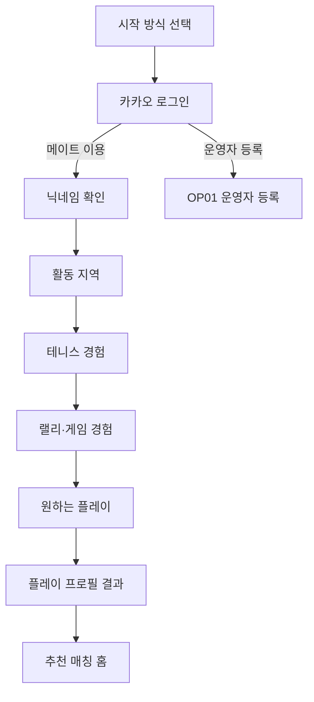
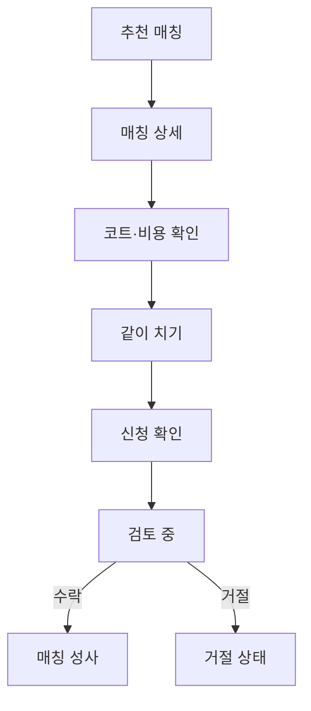
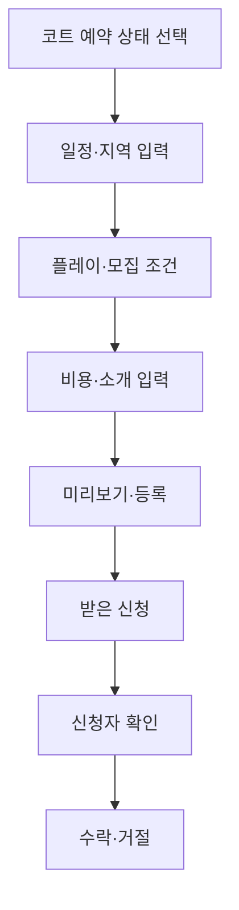

# Rally On 화면 명세

## 1. 문서 정보

| 항목 | 내용 |
| --- | --- |
| 문서명 | Rally On Core MVP Screen Specification |
| 문서 상태 | Draft v0.1 |
| 기준 문서 | `01-product-overview.md`, `02-prd.md` |
| 관련 확장 문서 | `03-1-court-partner-screen-spec.md` |
| 대상 | 모바일 우선 반응형 웹앱 |
| 주요 독자 | 기획자, UX/UI 디자이너, 프론트엔드·백엔드 개발자, Codex |
| 다음 문서 | `04-erd.md` |

이 문서는 Core MVP 화면의 정보 구조, 컴포넌트, 사용자 행동, 이동 경로와 상태를 정의한다. 시각 디자인의 세부 토큰과 최종 카피는 구현 과정에서 별도로 구체화할 수 있지만, 이 문서의 정보 우선순위와 상태 규칙은 임의로 변경하지 않는다.

## 2. 화면 설계 목표

1. 처음 방문한 초보자가 30~45초 안에 테니스 프로필을 만든다.
2. 추천 매칭에서 `왜 나와 잘 맞는지`를 바로 이해한다.
3. 신청 전에 일정, 코트 출처, 비용과 상대방 기대치를 확인한다.
4. 긴 자기소개 없이 `같이 치기`를 신청한다.
5. 모집자와 신청자가 현재 상태와 다음 행동을 명확하게 이해한다.
6. 직접 예약 코트를 Rally On이 검증한 코트로 오해하지 않게 한다.

## 3. UX 원칙

### 3.1 한 화면에는 하나의 주요 행동만 둔다

온보딩 각 단계에는 하나의 질문만 보여준다. 매칭 상세의 주요 행동은 `같이 치기`, 신청 관리의 주요 행동은 `수락` 또는 `거절`이다.

### 3.2 초보자의 자기평가 부담을 줄인다

`레벨을 선택하세요`가 아니라 실제 경험과 가장 가까운 문장을 선택하게 한다. 정답이나 평가처럼 느껴지는 점수, 등급과 성공·실패 표현을 사용하지 않는다.

### 3.3 신청 전에 불확실성을 먼저 해소한다

일정, 코트, 비용, 원하는 플레이, 남은 자리를 CTA보다 앞에서 확인할 수 있어야 한다.

### 3.4 상태는 색상과 텍스트를 함께 사용한다

`모집 중`, `검토 중`, `수락`, `거절`, `마감`, `취소`를 색상만으로 구분하지 않는다. 아이콘 또는 텍스트 레이블을 함께 제공한다.

### 3.5 직접 예약 코트와 제휴 코트를 구분한다

- Core MVP 직접 예약: `모집자가 코트를 예약했어요`
- 향후 제휴 코트 세션: `Rally On에서 준비한 코트예요`

제휴 코트 세션은 일반 사용자의 코트 예약이 아니라 운영자가 준비한 시간에 일반 모집자가 연 Match다. 두 유형에 동일한 아이콘, 색상 또는 `인증` 문구를 사용하지 않는다.

### 3.6 공통 색상은 하드코트 블루를 기준으로 한다

서비스의 주색은 테니스 하드코트를 연상시키는 블루로 통일한다. CTA, 선택 상태, 브랜드 링크와 포커스는 `하드코트 블루 #315E9E`를 사용하고, 본문은 `딥 네이비 #243044`, 보조 문구는 `슬레이트 #5E6C80`, 기본 배경은 `웜 화이트 #FCFBF7`로 사용한다. 카드와 비활성 영역은 `블루 미스트 #EEF3F8`, 테두리는 `#D9E2EC`를 기준으로 한다.

`테니스볼 옐로 #D8DE35`는 블루 CTA 안의 작은 제목·아이콘처럼 시선을 보조하는 요소에만 사용한다. 옐로를 단독으로 본문 텍스트나 주요 상태 색으로 사용하지 않으며, 오류·거절 같은 의미 상태는 기존처럼 텍스트와 함께 별도 의미 색을 유지한다.

## 4. 화면 설계의 확정 기본안

다음 항목은 Core MVP 구현 기준으로 확정한다.

| 항목 | UX안 | 상태 |
| --- | --- | --- |
| 로그인 방식 | 첫 진입에서 메이트 이용·운영자 등록 의도를 고르고, 같은 카카오 로그인 한 종류로 시작 | 확정 |
| 닉네임 | 소셜 표시명을 기본 제안하고 최초 진입에서 확인·수정 | 확정 |
| 비로그인 탐색 | 서비스 소개만 제공하고 목록·상세는 로그인 후 접근 | 확정 |
| 매칭 후 연락 | 새 Match의 서비스 내 방을 수락된 사용자에게만 공개. 기존 카카오 링크 Match는 호환 유지 | 확정 |
| 성별·연령 | Core MVP 필수 수집 제외 | 확정 |
| 코트 미확정 매칭 | 일정·활동 지역·모집 정보로 공개 등록 가능. 코트·비용은 수락된 참가자와 현재 연락 수단으로 조율 | 확정 |
| 수락 후 참가 취소 | 화면·API 미제공, 비공개 테스트에서는 운영 문의 | 확정 |
| 조기 모집 마감 | 한 명 이상 수락한 뒤 모집자가 선택 가능 | 확정 |
| 매칭 완료 | 일정 종료 후 완료 후보로 전환하고 모집자가 확인 | 확정 |
| 예상 1인 비용 | 모집자 포함 인원 기준 1원 단위 올림, 수정 불가 | 확정 |
| 플레이 상태 이름 | 분류 규칙 확정 전 숨김 | 확정 |

## 5. 정보 구조

### 5.1 핵심 화면 목록

| ID | 화면 | 제안 경로 | 핵심 목적 |
| --- | --- | --- | --- |
| S01 | 시작 방식 선택·로그인 | `/` (비로그인), `/login` | 메이트 이용 또는 운영자 등록 의도를 고른 뒤 공통 카카오 인증 시작 |
| S02 | 테니스 프로필 온보딩 | `/login` 또는 `/?returnTo=...`에서 이어짐 | 초보자 언어로 플레이 상태 생성 |
| S03 | 홈·추천 매칭 | `/` | 잘 맞는 매칭 발견 |
| S04 | 매칭 상세 | `/matches/[matchId]` | 신청 전 적합성·코트·비용 확인 |
| S05 | 매칭 등록 | `/matches/new` | 이미 예약한 외부 코트로 참가자 모집 |
| S06 | 받은 신청 | `/activity/received` | 모집자가 신청자를 검토 |
| S07 | 보낸 신청 | `/activity/sent` | 신청자가 결과와 다음 행동 확인 |
| S08 | 마이페이지 | `/my` | 프로필과 내가 만든 매칭 관리 |

### 5.2 보조 화면과 오버레이

| ID | 유형 | 용도 |
| --- | --- | --- |
| O01 | 바텀시트 | 같이 치기 신청 확인 및 짧은 메시지 입력 |
| O02 | 바텀시트 | 신청자 프로필 상세 |
| O03 | 바텀시트 | 신청 수락·거절 확인 |
| O04 | 다이얼로그 | 신청 철회, 매칭 취소와 모집 마감 확인 |
| O05 | 전체 화면 | 매칭 등록 최종 미리보기 |
| O06 | 전체 화면 | 테니스 프로필 수정 |
| O07 | 다이얼로그 | 매칭 등록 중 테니스장 검색·결과 선택·직접 입력 |

### 5.3 하단 내비게이션

로그인 및 온보딩 완료 후 다음 네 항목을 사용한다.

| 항목 | 이동 위치 | 표시 조건 |
| --- | --- | --- |
| 매칭 | `/` | 항상. 추천·일반 매칭 목록을 보여 주는 첫 탭 |
| 코트 매칭 | `/partner-sessions` | 운영자가 공개한 코트 시간으로 여는 매칭 목록. 일반 코트 예약 메뉴가 아님을 화면에 설명 |
| 채팅 | `/chats` | `마이` 바로 앞. 내가 입장 권한을 가진 Match 방만 목록에 표시 |
| 마이 | `/my` | 항상 |

하단 메뉴 아이콘은 Phosphor Icons의 채움(`fill`) 스타일 28px, 레이블은 14px, 각 항목의 최소 터치 높이는 72px로 둔다. `매칭`은 함께 칠 상대를 찾는 두 사람 아이콘, `코트 매칭`은 테니스공 아이콘을 사용한다. `채팅`과 `마이`도 같은 아이콘 계열과 무게로 통일해 네 항목의 시각적 존재감을 맞춘다. 선택 상태는 하드코트 블루와 레이블로 함께 구분한다.

온보딩, 매칭 등록, 매칭 상세의 집중 흐름에서는 필요에 따라 하단 내비게이션을 숨기고 상단 뒤로가기를 제공한다. 상단 뒤로가기는 브라우저의 외부 기록에 의존하지 않고, 화면별로 정한 안전한 이전 화면으로 이동한다. 매칭 상세는 카드 진입 시 전달된 동일 서비스 내 `returnTo` 경로(기본 홈), 프로필 수정은 마이, 신청자 상세는 해당 신청 목록, 매칭 등록 첫 단계는 홈으로 돌아간다.

## 6. 전체 화면 흐름

### 6.1 신규 사용자

### 6.2 매칭 신청

### 6.3 매칭 등록과 신청 관리

## 7. 공통 컴포넌트

### 7.1 MatchCard

카드의 정보 우선순위는 다음과 같다.

1. 추천 적합도 자연어와 상태 배지
2. 매칭 제목
3. 날짜·시작 시간·종료 시간
4. 지역·코트장 이름
5. 원하는 플레이·초보자 환영
6. 모집자 플레이 상태
7. 예상 1인 비용·남은 자리

필수 표시 예시:

> 💚 잘 맞을 것 같아요  ·  🌱 초보자 환영  
> 편하게 랠리해요  
> 8월 15일 토요일 · 오후 3시 · 2시간  
> 마포구 · 마포 테니스파크  
> 모집자가 코트를 예약했어요  
> 예상 1인 15,000원 · 2자리 남음

카드 전체를 탭하면 상세 화면으로 이동한다. 카드 안에서 즉시 신청을 완료시키지 않는다.

### 7.2 CourtSourceBadge

| 코트 출처 | 배지 문구 | 보조 문구 | 스타일 원칙 |
| --- | --- | --- | --- |
| `EXTERNAL_RESERVED` | 모집자가 코트를 예약했어요 | 예약 정보는 모집자가 입력했어요. | 중립 색상, 체크 인증 아이콘 금지 |
| `PARTNER_COURT` | Rally On에서 준비한 코트예요 | 운영자가 준비한 시간에 열린 세션이에요. 참가 신청은 모집자에게 보내요. | 향후 별도 강조 색상 및 확인 아이콘 |
| `COURT_TBD` | 코트와 비용을 함께 정해요 | 과거 기록에서만 기존 참여자에게 표시. 채팅·완료 처리를 유지해요. | 경고가 아닌 정보 스타일, 공개 목록·신규 생성·신청 CTA 없음 |

### 7.3 ProfileSummaryCard

- 닉네임
- 플레이 상태 이름과 설명—분류 규칙 확정 후에만 표시
- 테니스 경험 기간
- 랠리 수준
- 게임 경험
- 활동 지역
- 원하는 플레이 최대 2개

나이, 성별과 연락처는 Core MVP 기본 카드에 포함하지 않는다.

### 7.4 StatusChip

| 도메인 | 상태 | 사용자 문구 |
| --- | --- | --- |
| Match | `OPEN` | 모집 중 |
| Match | `CLOSED` | 모집 마감 |
| Match | `COMPLETED` | 완료 |
| Match | `EXPIRED` | 성사 없이 종료 |
| Match | `CANCELLED` | 취소됨 |
| Application | `PENDING` | 검토 중 |
| Application | `ACCEPTED` | 같이 치게 됐어요 |
| Application | `REJECTED` | 이번에는 함께하기 어려워요 |
| Application | `WITHDRAWN` | 신청 철회 |
| Application | `CANCELLED` | Match 상태에 따라 `모집이 마감됐어요`, `매칭이 취소됐어요`, `성사 없이 종료됐어요` |

거절 상태를 사용자의 실력 평가처럼 느껴지는 `탈락`, `부적합` 등의 문구로 표현하지 않는다.

### 7.5 공통 피드백

- 성공: 페이지 이동 후 상단 토스트 또는 결과 화면으로 확인
- 입력 오류: 필드 바로 아래에 원인과 해결 방법 표시
- 서버 오류: 사용자의 입력을 보존하고 재시도 제공
- 파괴적 행동: 확인 다이얼로그 제공
- 장시간 처리: 버튼 비활성화와 진행 상태 표시, 중복 요청 차단

## 8. S01 시작 방식 선택·로그인

### 8.1 목적

서비스의 핵심 가치를 짧게 전달하고, 메이트 이용과 운영자 등록 중 현재 목적을 고른 뒤 최소 행동으로 가입 또는 로그인하게 한다.

### 8.2 진입과 이탈

| 구분 | 내용 |
| --- | --- |
| 진입 | 비로그인 상태의 루트 진입, 인증 필요 화면 또는 직접 URL 접근 |
| 성공 | 메이트 이용 선택 → 신규 사용자 S02, 온보딩 완료 사용자 S03. 운영자 등록 선택 → OP01 |
| 이탈 | 브라우저 뒤로가기 또는 서비스 소개 확인 |

### 8.3 화면 구성 순서

1. Rally On 로고
2. `어떻게 시작할까요?` 제목과 짧은 안내
3. `테니스 메이트를 찾고 있어요` 선택 카드
4. `테니스장을 운영하고 있어요` 선택 카드
5. 두 카드가 같은 카카오 계정으로 시작한다는 안내
6. 이용약관 및 개인정보 처리 안내

메이트 이용 카드는 카카오 인증 뒤 닉네임 확인과 S02 테니스 프로필 온보딩으로 이어진다. 운영자 등록 카드는 같은 카카오 인증 뒤 OP01로 바로 이동하며, 일반 테니스 프로필 온보딩을 요구하지 않는다. 이 선택은 인증 공급자, 사용자 계정 또는 매칭 역할을 고정하지 않는다.

안내 문구의 `서비스 이용약관`은 `/terms`, `개인정보 처리방침`은 `/privacy`로 이동한다. 두 화면은 로그인 없이 열리며, 로그인 화면으로 돌아갈 수 있어야 한다. 비공개 MVP 단계에는 운영 주체·문의 채널·보관 및 파기 절차가 정식 공개 전에 확정될 항목임을 숨기지 않고 안내한다.

비로그인 사용자가 보호된 경로를 직접 열면 `/login?returnTo=...`으로 이동한다. `returnTo`는 동일 서비스의 상대 경로만 허용한다. 메이트 화면은 신규 사용자의 S02 완료 후, 기존 사용자의 즉시 원래 경로 복귀를 유지한다. `/partner/apply`, `/partner/application`은 활성 카카오 계정만 있으면 되므로 테니스 프로필 온보딩을 건너뛰고 원래 운영자 화면으로 돌아간다. 네트워크·서버 확인 실패는 로그인 실패와 구분해 `다시 확인하기` 상태로 보여준다.

권장 카피:

> 나와 비슷한 테니스 초보자를 만나보세요.  
> 실력을 시험하지 않아도, 지금 함께하기 좋은 사람을 찾아드려요.

### 8.4 주요 행동

- 메이트 이용 카드: `[메이트로 시작하기 →]`
- 운영자 등록 카드: `[운영자로 등록하기 →]`
- 인증 진행 중 선택한 카드의 중복 클릭 방지
- 로그인 실패 시 같은 화면에서 재시도

### 8.5 상태

| 상태 | 처리 |
| --- | --- |
| 기본 | 두 시작 방식 카드 표시 |
| 인증 중 | 선택한 카드 로딩, 다른 인증 요청 차단 |
| 인증 실패 | 개인정보를 노출하지 않는 오류 문구와 재시도 |
| 이미 로그인 | 메이트 이용은 온보딩 여부에 따라 자동 이동, 운영자 등록은 OP01 이동 |

### 8.6 분석 이벤트

- `login_viewed`
- `login_started`
- `login_succeeded`
- `login_failed`

## 9. S02 테니스 프로필 온보딩

### 9.1 목적

시험처럼 느껴지지 않는 5개의 짧은 질문으로 사용자의 플레이 상태와 선호를 수집한다.

### 9.2 닉네임 확인

테니스 질문 전에 카카오 표시명을 기본값으로 채운 닉네임 확인 화면을 한 번 제공한다.

- 질문: `어떤 이름으로 불러드릴까요?`
- 입력: 앞뒤 공백 제거 후 2~12자, 한글·영문·숫자만 허용
- 중복 또는 사용할 수 없는 이름이면 같은 화면에서 수정
- CTA: `[이 이름으로 시작할게요]`
- 닉네임 확인 완료 후 다섯 개의 테니스 질문을 시작

### 9.3 공통 레이아웃

1. 상단 뒤로가기
2. `n/5` 진행률과 프로그레스 바
3. 질문
4. 안심시키는 보조 문구
5. 선택 카드
6. 하단 고정 `[다음]` CTA

선택 전에는 CTA를 비활성화한다. 이전 단계로 돌아가도 기존 선택을 유지한다.

### 9.4 단계별 명세

| 단계 | 질문 | 입력 방식 | 선택지·동작 |
| --- | --- | --- | --- |
| 1 | 주로 어디에서 테니스를 치고 싶나요? | 시·도 탭 → 시·군·구 선택 | 주 활동 지역 한 곳 필수, `선택 지역과 가까운 시·군·구도 괜찮아요` boolean 선택 |
| 2 | 테니스와 친해진 지 얼마나 됐나요? | 단일 선택 카드 | 3개월 미만, 3~6개월, 6개월~1년, 1~2년, 2년 이상 |
| 3 | 요즘 랠리는 어떤가요? | 단일 선택 카드 | A~D를 코드 없이 경험 문장으로 표시 |
| 4 | 테니스 게임도 해봤나요? | 단일 선택 카드 | 경험 없음, 규칙 인지, 몇 번 경험, 진행 가능 |
| 5 | 요즘 어떤 테니스를 하고 싶나요? | 최대 2개 복수 선택 | 편하게 공 주고받기, 랠리, 스트로크, 게임 입문, 게임 |

### 9.5 선택 카드 문구

랠리 단계는 다음처럼 제목과 설명을 함께 표시한다.

| 내부 값 | 제목 | 설명 |
| --- | --- | --- |
| A | 아직 랠리가 어려워요 | 공을 이어가는 연습을 하고 있어요. |
| B | 몇 번씩 주고받을 수 있어요 | 천천히 치면 짧은 랠리가 가능해요. |
| C | 편하게 랠리할 수 있어요 | 비슷한 수준끼리는 어느 정도 이어갈 수 있어요. |
| D | 일반적인 랠리도 가능해요 | 속도가 조금 있어도 어느 정도 주고받을 수 있어요. |

### 9.6 결과 화면

마지막 입력 저장 후 사용자의 플레이 프로필 요약을 보여준다.

화면 구성:

1. `지선님의 플레이 프로필 🎾`
2. 경험 기간·랠리·게임 경험·선호 플레이
3. 잘 맞을 가능성이 있는 플레이어 범위
4. Primary CTA: `[나와 맞는 매칭 보기]`

플레이 상태 자동 분류 규칙이 확정되기 전에는 상태 이름과 설명 영역을 표시하지 않는다. 개발용 목업에서도 임의의 상태 이름을 만들지 않는다.

### 9.7 오류 및 복구

| 상황 | 처리 |
| --- | --- |
| 지역 목록 불러오기 실패 | 재시도와 기본 지역 선택 진입 제공 |
| 선택 저장 실패 | 현재 선택 유지, 저장 재시도 |
| 세션 만료 | 재로그인 후 가능한 범위에서 진행 단계 복구 |
| 최대 선택 초과 | 세 번째 선택을 막고 `최대 2개까지 선택할 수 있어요` 표시 |
| 닉네임 중복 | 입력을 유지하고 다른 이름 요청 |

### 9.8 분석 이벤트

- `onboarding_started`
- `onboarding_step_viewed`
- `onboarding_step_completed`
- `onboarding_completed`
- `onboarding_abandoned`
- `nickname_confirmed`

## 10. S03 홈·추천 매칭

### 10.1 목적

사용자가 별도 검색 없이 자신과 잘 맞을 가능성이 높은 매칭을 먼저 발견하게 한다.

### 10.2 화면 구성 순서

1. 스크롤에도 유지되는 상단 인사와 활동 지역 칩
2. `추천 매칭`·`다른 매칭` 목록을 전환하는 선택 버튼
3. 선택된 목록의 제목·한 줄 안내
4. 선택된 목록의 대표 코트 사진 또는 기본 일러스트가 있는 MatchCard
5. 우측 하단에 고정된 타원형 `+ 매칭 만들기` 버튼
6. 하단 내비게이션

추천 목록과 다른 매칭 목록은 한 화면에 함께 쌓지 않는다. 기본 선택은 `추천 매칭`이며, 사용자가 선택 버튼으로 `다른 매칭`을 확인한다. `매칭 만들기`에서는 이미 예약한 외부 코트의 이름·주소·비용을 모두 입력한다. 코트를 아직 확보하지 못한 사용자는 빈 모집 글을 만들지 않고 `코트 매칭 둘러보기`로 운영자가 준비한 시간을 확인한다. 기존 `COURT_TBD` 기록은 공개 목록과 신규 신청에서 제외하고, 기존 참여자의 상세·활동·채팅에서만 이전 안내를 유지한다.

알림 기능 자체가 Core MVP에 포함되지 않으면 상단 알림 아이콘을 만들지 않는다. 받은 신청 수는 활동 탭 배지로만 표시한다.

### 10.3 추천 카드 행동

- 카드 탭 → S04
- 프로필 칩 탭 → S08 또는 O06
- 매칭 만들기 → S05
- 추천 이유는 카드에 핵심 한 줄, 상세에서 전체 제공

### 10.4 탐색 필터

Core MVP P1 후보로 다음 세 개의 간단한 칩만 고려한다.

- 지역
- 날짜
- 원하는 플레이

필터가 일정에 영향을 주면 P0 범위에서는 제외하고 추천·전체 목록만 제공한다. 복잡한 거리, 성별, 연령과 NTRP 필터를 추가하지 않는다.

### 10.5 상태

| 상태 | 화면 처리 | CTA |
| --- | --- | --- |
| 추천 있음 | 기본 선택된 추천 목록에 추천 3~5개 표시 | 상세 보기·다른 매칭 전환 |
| 추천 없음·다른 매칭 있음 | `조건이 꼭 맞는 매칭은 아직 없어요`와 `다른 매칭 보기` 제공 | 다른 매칭 전환 |
| 전체 매칭 없음 | 부담을 주지 않는 Empty State | 매칭 만들기 |
| 로딩 | 상단 제목과 하단 메뉴를 유지한 채 본문에 하드코트 라인·테니스볼 랠리 로더 | 없음 |
| 오류 | 기존 캐시가 있으면 표시, 없으면 재시도 | 다시 불러오기 |

권장 Empty State:

> 아직 가까운 매칭이 없어요.  
> 새로운 매칭이 등록되면 여기에서 확인할 수 있어요.

### 10.6 분석 이벤트

- `home_viewed`
- `recommended_match_impression`
- `recommended_match_selected`
- `empty_match_create_selected`

## 11. S04 매칭 상세

### 11.1 목적

사용자가 `내가 신청해도 되는지`, `언제 어디서 얼마에 치는지`를 확인하고 안심한 뒤 신청하게 한다.

### 11.2 정보 우선순위

1. 모집 상태·초보자 환영·코트 출처
2. 제목과 일정
3. 남은 자리와 예상 1인 비용
4. `왜 잘 맞나요?`
5. 코트 상세와 비용 안내
6. 모집자가 원하는 플레이와 상대 수준
7. 모집자 프로필
8. 소개 메시지와 유의사항
9. 하단 고정 CTA

### 11.3 화면 구성

#### A. 상단 요약

- 예약 코트 또는 제휴 코트 사진. 사진이 없으면 기본 코트 일러스트
- `모집 중` StatusChip
- `🌱 초보자 환영`
- Match 제목
- 날짜, 시작 시간, 종료 시간
- 지역과 남은 자리

#### B. 추천 이유

> 왜 잘 맞나요?

- 둘 다 천천히 랠리가 가능해요.
- 게임보다 랠리 연습을 원해요.
- 활동 지역이 가까워요.

추천 이유가 없으면 빈 박스를 노출하지 않는다. 일반 매칭 정보만 제공한다.

#### C. 코트와 비용

- CourtSourceBadge
- 대표 코트 사진과 출처 `모집자 제공 사진` 또는 `운영자 제공 사진` — 사진이 있으면 표시
- 코트장 이름
- 주소
- 코트 번호—입력된 경우만
- 전체 코트 비용
- 예상 1인 비용
- 조명비·볼 비용 안내
- `최종 인원에 따라 실제 비용이 달라질 수 있어요.`

지도 API가 Core MVP에 포함되지 않으면 주소 복사 기능만 제공하고 지도 미리보기는 만들지 않는다.

#### D. 플레이 조건

- 원하는 플레이 최대 2개
- 원하는 상대 수준—초보자 환영 선택 포함

#### E. 모집자 프로필

ProfileSummaryCard를 사용한다. 연락처와 연락 수단은 신청 수락 전 노출하지 않는다.

수락된 신청자와 모집자에게만 `채팅방 열기`를 표시한다. 외부 오픈채팅 링크와 외부 이동 CTA는 제공하지 않는다.

### 11.4 하단 고정 CTA

| 사용자·상태 | CTA |
| --- | --- |
| 신청 가능 | `[같이 치기]` |
| 본인 매칭 | `[받은 신청 보기]` |
| 이미 신청·대기 | `검토 중이에요` 비활성 + `[신청 내역 보기]` |
| 수락됨 | `[매칭 정보 확인]` |
| 모집 마감 | `모집이 마감됐어요` 비활성 |
| 취소·완료·성사 없이 종료 | 상태 안내, 신청 CTA 없음 |

### 11.5 O01 같이 치기 신청 바텀시트

표시 순서:

1. 일정·코트·예상 비용 요약
2. 내 ProfileSummaryCard 축약형
3. 선택형 짧은 메시지 입력
4. `비용은 참가자끼리 별도로 정산해요.` 안내
5. Primary CTA: `[신청하기]`
6. Secondary: `[조금 더 생각해볼게요]`

메시지 입력은 선택이며 글자 수 제한과 현재 글자 수를 제공한다. 신청 중에는 CTA를 비활성화하고 중복 제출을 막는다.

### 11.6 신청 결과

성공 후 다음 메시지를 보여주고 S07로 이동할 수 있게 한다.

> 신청을 보냈어요 🎾  
> 모집자가 프로필을 확인하면 결과를 알려드릴게요.

### 11.7 오류 상태

| 오류 | 처리 |
| --- | --- |
| 마지막 자리가 방금 마감 | 최신 상태 반영 후 `아쉽지만 방금 마감됐어요` |
| 중복 신청 | 기존 신청 상태와 보낸 신청 링크 제공 |
| 본인 매칭 | 신청 대신 받은 신청 관리 CTA 제공 |
| 매칭 취소 | 취소 안내와 홈 이동 |
| 신청 실패 | 바텀시트 입력 유지, 재시도 |

### 11.8 분석 이벤트

- `match_detail_viewed`
- `match_application_sheet_opened`
- `match_application_submitted`
- `match_application_failed`

## 12. S05 매칭 등록

### 12.1 목적

코트를 이미 예약한 사용자가 짧고 명확한 단계로 참가자 모집을 등록하게 한다. 새 일반 매칭은 `EXTERNAL_RESERVED`만 만들 수 있으며, 코트를 아직 확보하지 못한 사용자는 첫 단계의 안내 카드에서 `코트 매칭 둘러보기`로 이동한다. 코트 미정 일반 매칭을 만드는 선택 카드나 입력은 제공하지 않는다.

### 12.3 단계 구조

| 단계 | 제목 | 주요 입력 |
| --- | --- | --- |
| 1 | 언제, 어디서 칠까요? | 날짜, 시작 시간, 종료 시간, 지역, 테니스장 검색 또는 예약한 코트명·주소·코트 번호·대표 코트 사진 |
| 2 | 어떤 테니스를 함께할까요? | 제목, 모집 인원, 원하는 플레이, 원하는 상대—초보자 환영 선택 포함 |
| 3 | 비용과 안내를 알려주세요 | 예약 코트일 때만 전체 비용·예상 1인 비용·추가 비용, 소개 메시지, 수락 후 서비스 내 채팅 안내 |
| 4 | 이렇게 모집할까요? | 전체 미리보기와 등록 확인 |

각 단계는 상단 진행률과 뒤로가기를 제공한다. 상단에는 현재 단계 제목과 `n/4` 진행 상태를, 하단에는 현재 단계의 다음 행동을 설명하는 고정 CTA를 둔다. 2~4단계에서는 입력을 잃지 않는 `[이전]` 보조 CTA를 함께 제공한다. 이전 입력은 유지한다. 첫 단계의 상단 제목은 `매칭 개설`로 고정하고, 일정·장소를 하나의 `매칭 기본 정보` 카드에서 먼저 입력해 진행률과 안내 카드가 주요 입력을 가리지 않게 한다.

### 12.4 공통 UI

- 390 × 844 기준에서 한 번에 하나의 질문과 관련 입력 묶음에 집중한다. 일정·장소·모집·비용처럼 성격이 다른 입력은 둥근 흰 카드로 나눈다.
- 각 필수 입력에는 `필수`를 텍스트로 표시하고, 선택 입력에는 `(선택)`을 표시한다. 선택 카드의 선택 상태는 색상뿐 아니라 체크 표시와 `aria-pressed`로 전달한다.
- 하단 CTA는 고정해 긴 입력 화면에서도 다음 행동을 잃지 않게 한다. CTA가 가리는 내용이 없도록 본문 하단에 안전 여백을 둔다.
- 연령대·성별·NTRP·외부 코트 검색/예약은 제공하지 않는다. 초보자 친화적인 플레이 목적과 상대 선호 선택, 모집자를 포함한 예상 총 참여 인원·예상 1인 비용으로 충분히 판단할 수 있게 한다.

### 12.5 1단계 — 일정과 코트

#### 필드

- 날짜: 오늘 이후만 선택
- 시작 시간
- 종료 시간: 같은 날짜 안에서 시작 시간보다 늦게 직접 선택
- 지역: 시·도, 시·군·구 선택
- 테니스장: 기본 화면에서는 검색 진입 버튼 또는 선택된 코트명·주소 요약 카드로 표시한다. 버튼을 누르면 O07을 연다.
- O07 테니스장 검색: 이름·동네를 두 글자 이상 입력하면 카카오맵 장소 결과를 최대 5개 제안한다. 선택하면 O07을 닫고 코트장 이름·도로명 주소를 채운다. 첫 진입에는 검색 안내 Empty State를 보인다.
- O07 직접 입력: 검색 화면 안의 `테니스장 직접 입력`을 누르면 이름·주소·선택 코트 번호를 같은 다이얼로그에서 입력한다. 이름과 주소가 모두 있을 때만 완료할 수 있으며, 완료 뒤 기본 화면에는 같은 요약 카드로 보인다.
- 사용자는 검색 결과 또는 직접 입력으로 채운 이름·주소를 다시 열어 언제든 수정할 수 있음
- 코트장 이름·주소—필수, 코트 번호·대표 코트 사진 1장—선택

#### 도움 문구

> 예약번호나 예약자 전화번호는 입력하지 마세요.

> 검색 결과는 실제 예약·운영 상태를 확인하거나 Rally On이 코트를 보증한다는 뜻이 아니에요. 검색 결과가 없거나 다른 코트라면 직접 입력해 주세요.

> 코트 사진은 직접 찍었거나 사용할 권한이 있는 사진만 올려 주세요. 사진이 없어도 매칭을 등록할 수 있어요.

#### 검증

- 과거 날짜 선택 불가
- 종료 시간이 시작 시간보다 이르거나 같은 경우 불가
- 검색어는 공백을 제외하고 2~80자, 300 ms 입력 지연 뒤 서버를 통해 조회한다. 검색 결과와 검색어는 저장하지 않으며 키가 없거나 외부 조회에 실패해도 O07의 직접 입력은 계속 가능
- 코트장 이름과 주소 필수
- 예약 번호처럼 보이는 민감 정보가 코트 번호 필드에 입력되지 않도록 안내
- 사진은 1장만 허용하고, JPEG·PNG·WebP 4 MiB 이하만 받는다. 인물 얼굴·연락처·예약번호가 보이는 사진은 업로드하지 않도록 안내한다.

### 12.6 2단계 — 플레이와 모집 조건

#### 필드

- 제목
- 추가 모집 인원
- 원하는 플레이 최대 2개
- 원하는 상대 수준—초보자 환영 선택 포함

추가 모집 인원은 증감 버튼과 현재 인원을 함께 보여 주고, 모집자를 포함한 예상 총 참여 인원을 바로 표시한다. 성별별 인원이나 연령 조건은 받지 않는다.

원하는 상대 수준은 다음 선택지로 제공한다.

- `완전 초보도 좋아요`
- `비슷한 수준이면 좋아요`
- `게임 가능한 분을 찾고 있어요`

첫 번째 선택을 한 경우 카드에 `초보자 환영` 배지를 표시한다.

### 12.7 3단계 — 비용과 안내

#### 필드

- 전체 코트 비용(0원 허용), 예상 총 참여 인원, 예상 1인 비용, 추가 비용 안내
- 소개 메시지: 선택
- 서비스 내 채팅: 입력 없음. 첫 수락이 확정되면 모집자와 수락자를 방에 추가

권장 UX안:

- 예상 1인 비용을 `ceil(전체 비용 ÷ 예상 총 참여 인원)`으로 자동 계산하고, `전체 비용 ÷ 예상 n명` 계산 근거를 함께 보여 준다.
- 계산값은 사용자가 수정할 수 없으며 추가 비용 안내에 차이를 설명한다.
- 새 Match의 연락은 첫 수락 뒤 서비스 내 채팅방에서 시작하며, 대기 신청자에게는 방을 보이지 않는다.

필수 안내:

> Rally On에서는 이 비용을 결제하지 않아요. 실제 비용은 참가자끼리 확인해 주세요.

### 12.8 4단계 — 미리보기

실제 상세 화면과 같은 순서로 보여준다.

- MatchCard 미리보기
- 일정과 코트
- `모집자가 코트를 예약했어요` 배지
- 전체 코트 비용과 예상 1인 비용
- 플레이 조건
- 소개 메시지
- 수락 뒤 서비스 내 채팅으로 준비를 조율한다는 안내—방 자체는 공개 미리보기에 표시하지 않음

Primary CTA: `[매칭 공개하기]`
Secondary CTA: `[이전]`

### 12.9 등록 성공

성공 결과:

> 매칭을 등록했어요 🎾  
> 신청이 오면 활동에서 확인할 수 있어요.

CTA:

- `[등록한 매칭 보기]`
- `[홈으로 가기]`

### 12.10 상태 및 오류

| 상황 | 처리 |
| --- | --- |
| 온보딩 미완료 | 프로필 생성 필요 안내 후 S02 이동 |
| 필수 입력 누락 | 해당 단계에 오류를 안내하고 입력 보존 |
| 등록 중 중복 클릭 | CTA 잠금과 로딩 표시 |
| 등록 실패 | 모든 입력 유지, 원인 안내와 재시도 |
| 페이지 이탈 | 입력 내용이 있으면 이탈 확인 |

Core MVP에 임시저장을 추가하지 않는다. 실제 이탈률이 높을 때 검토한다.

### 12.11 분석 이벤트

- `match_create_started`
- `match_create_step_completed`
- `match_create_previewed`
- `match_created`
- `match_create_failed`
- `match_create_abandoned`

## 13. S06 받은 신청

### 13.1 목적

모집자가 자신이 만든 매칭과 신청자를 한곳에서 확인하고 수락·거절하게 한다.

### 13.2 화면 구조

1. 상단 뒤로가기와 `내 활동`
2. 탭: `받은 신청` / `보낸 신청`
3. 상태 필터: `모집 중` / `마감·지난 매칭`
4. 내가 만든 Match 요약 카드
5. 매칭별 대기 신청 수
6. 신청자 목록

받은 신청과 보낸 신청은 마이의 `내 활동 보기`에서 진입하는 하나의 활동 화면이다. 두 목록 최상단에는 `마이로 돌아가기` 뒤로가기 버튼을 제공하고 탭으로 전환한다. 매칭별 신청자 목록과 신청자 상세처럼 한 단계 들어간 화면에서는 해당 신청 목록으로 돌아가는 뒤로가기를 제공한다.

### 13.3 매칭 요약 카드

- 제목
- 날짜·시간
- 코트 출처(`모집자가 코트를 예약했어요`, 과거 기록에서는 이전 `코트와 비용을 함께 정해요` 안내 유지)
- 모집 상태
- `수락 n명 / 모집 n명`
- `검토할 신청 n건`
- `[신청자 보기]`

대기 신청이 있는 매칭을 먼저 보여준다. 숫자 배지는 `PENDING` 신청만 계산한다.

수락자가 있으면 모집자에게만 채팅방 CTA를 제공한다. 새 `EXTERNAL_RESERVED` Match에는 코트를 다시 정하는 것으로 보이지 않도록 `당일 준비와 비용 정산 방법을 확인해요`라고 안내한다. 과거 `COURT_TBD` 기록은 기존 참여자가 남은 조율과 완료 처리를 할 수 있도록 이전 안내를 유지한다. 어떤 경우에도 Rally On이 비용을 결제하거나 정산하지 않는다는 책임 범위를 유지한다.

`[신청자 보기]`를 선택하면 해당 매치의 대기 신청자 목록으로 이동한다. 목록에서 한 명을 선택한 뒤에만 신청자 상세 검토 화면을 연다. 이 목록은 여러 신청자 중 누구를 검토할지 정하는 필수 단계이며, 받은 신청 화면에서 특정 신청자의 상세로 바로 이동하지 않는다.

### 13.4 O02 신청자 프로필 상세

- 닉네임
- 플레이 상태
- 테니스 경험 기간
- 랠리 수준
- 게임 경험
- 활동 지역
- 원하는 플레이
- 신청 메시지

하단 CTA:

- Primary: `[수락하기]`
- Secondary: `[이번에는 어려워요]`

### 13.5 수락 확인

수락 전 다음을 보여준다.

> 지선님과 함께 치기로 할까요?  
> 수락하면 남은 자리가 1자리예요.

확정 CTA: `[네, 함께 칠게요]`

수락·거절 확인은 신청자 상세 검토 화면 위에 표시되는 바텀시트다. 별도 전체 화면으로 이동하지 않으며, 취소하면 입력이나 스크롤 위치를 유지한 채 상세 검토 화면으로 돌아간다.

마지막 자리인 경우 동시에 다른 신청을 수락할 수 없도록 서버 결과를 반영한다.

### 13.6 거절 확인

권장 카피:

> 이번 신청을 정중하게 마무리할까요?  
> 상대방에게는 `이번에는 함께하기 어려워요`라고 표시돼요.

거절 사유는 Core MVP에서 필수로 받지 않는다.

### 13.7 모집 마감과 취소

매칭 관리 메뉴에서 다음 행동을 제공한다.

- 모집 마감—한 명 이상 수락된 경우
- 매칭 취소
- 상세 보기

매칭 취소 전에는 수락자와 대기 신청자 수를 함께 보여주고 영향을 명확히 안내한다.

조기 마감 확인에는 남은 대기 신청이 `모집이 마감됐어요` 상태로 바뀐다는 점을 안내한다. 조기 마감 후 모집을 다시 열 수 없다.

정원 충족 또는 시작 시각 도달로 모집이 마감될 때도 남은 대기 신청은 같은 문구로 종료한다.

### 13.8 상태

| 상태 | 처리 |
| --- | --- |
| 만든 매칭 없음 | 코트 예약 전에도 만들 수 있는 매칭 등록 안내 |
| 매칭은 있으나 신청 없음 | 공유 기능을 추가하지 않고 기다림 안내와 상세 링크 |
| 대기 신청 있음 | 대기 신청을 최상단에 정렬 |
| 모집 정원 충족 | 수락 CTA 비활성, 모집 마감 표시 |
| 오류 | 기존 목록 유지 가능 시 유지하고 재시도 |

### 13.9 분석 이벤트

- `received_applications_viewed`
- `applicant_profile_viewed`
- `match_application_accepted`
- `match_application_rejected`
- `match_closed`
- `match_cancelled`

## 14. S07 보낸 신청

### 14.1 목적

신청자가 자신의 신청 결과와 다음 행동을 한눈에 확인하게 한다.

### 14.2 화면 구조

1. 상단 뒤로가기와 `내 활동`
2. 탭: `받은 신청` / `보낸 신청`
3. 상태 필터: `전체` / `검토 중` / `수락` / `종료`
4. 신청 매칭 카드 목록

최상단의 활동 탭 구조와 마이로 돌아가는 뒤로가기 원칙은 S06과 동일하게 적용한다.

### 14.3 신청 카드

- Application StatusChip
- 매칭 제목
- 날짜·시간
- 코트장·지역
- 예상 1인 비용
- 신청일
- 상태에 따른 다음 행동

수락된 카드의 연락 안내는 채팅방 CTA와 코트 출처 안내를 함께 보인다. 새 `EXTERNAL_RESERVED` Match에는 당일 준비와 참가자 간 비용 정산 방법 확인을 안내한다. 과거 `COURT_TBD` 기록에는 이전 조율 안내를 보존하되, 새 매칭 흐름에서 이 문구를 사용하지 않는다.

### 14.4 상태별 행동

| 상태 | 안내 | 행동 |
| --- | --- | --- |
| PENDING | 모집자가 프로필을 확인하고 있어요 | 상세 보기, 신청 철회 |
| ACCEPTED | 같이 치게 됐어요 🎾 | 확정 정보 확인, 새 Match는 채팅방으로 연락(기존 링크 Match는 카카오 이동) |
| REJECTED | 이번에는 함께하기 어려워요 | 다른 추천 매칭 보기 |
| WITHDRAWN | 신청을 철회했어요 | 상세 보기 |
| CANCELLED + Match `CANCELLED` | 모집자가 매칭을 취소했어요 | 다른 추천 매칭 보기 |
| CANCELLED + Match `EXPIRED` | 일정이 시작되어 매칭이 성사되지 않았어요 | 다른 추천 매칭 보기 |
| CANCELLED + Match `CLOSED` | 모집이 마감되어 이번 신청은 진행되지 않아요 | 다른 추천 매칭 보기 |

취소된 신청은 연결 Match 상태에 따라 원인을 구분해 보여주며, `CLOSED`·취소·성사 없이 종료를 하나의 모호한 문구로 합치지 않는다.

### 14.5 신청 철회

대기 중 신청만 바로 철회할 수 있다.

확인 문구:

> 신청을 철회할까요?  
> 철회하면 다시 신청하지 못할 수 있어요.

재신청 허용 여부는 상태 정책 확정 후 결정한다.

수락 후 참가 취소 CTA는 제공하지 않는다. 비공개 MVP에서는 운영 문의로 안내한다.

### 14.6 Empty State

> 아직 신청한 매칭이 없어요.  
> 나와 잘 맞는 초보자 매칭을 둘러보세요.

CTA: `[추천 매칭 보기]`

### 14.7 분석 이벤트

- `sent_applications_viewed`
- `sent_application_selected`
- `match_application_withdrawn`
- `accepted_match_info_viewed`

## 15. S08 마이페이지

### 15.1 목적

사용자가 자신의 테니스 프로필을 이해하고 수정하며 계정과 내가 만든 매칭에 접근하게 한다.

### 15.2 화면 구성 순서

1. 닉네임과 ProfileSummaryCard
2. `[테니스 프로필 수정]`
3. 내 활동 요약
4. 내가 만든 매칭
5. 계정 및 서비스 메뉴

매칭 생성은 매칭 탭 우측 하단의 `+ 매칭 만들기` CTA에서 시작한다. 전역 하단 메뉴의 `[만들기]`는 `채팅`으로 교체하고, `매칭` 탭에는 목록의 성격이 드러나도록 기존 `홈` 대신 `매칭`을 쓴다. `코트 매칭`은 운영자가 공개한 코트 시간 목록으로 바로 이동하며, 일반 코트 예약으로 오해되지 않게 화면 설명을 함께 제공한다. `내 활동 보기`는 마이에서만 제공하며, 마이페이지에는 동일한 생성 CTA를 중복 제공하지 않는다.

### 15.3 내 활동 요약

Core MVP에서는 경쟁이나 서열로 느껴지는 승률·점수·랭킹을 보여주지 않는다.

표시 후보:

- 모집 중인 매칭 수
- 검토 중인 받은 신청 수
- 수락된 참가 일정 수
- 완료한 매칭 수

숫자가 제품 가치를 높이지 않는다면 링크형 메뉴만 제공한다.

### 15.4 내가 만든 매칭

- 모집 중
- 마감
- 지난 매칭
- 성사 없이 종료된 매칭
- 취소된 매칭

각 항목에서 상세와 받은 신청으로 이동한다. 수정 기능을 제공할 경우 신청이 발생한 뒤 변경 가능한 필드를 제한해야 하므로 정책 확정 전 임의로 구현하지 않는다.

`endsAt`이 지난 CLOSED Match에는 `[플레이 완료하기]` CTA를 제공한다. 확인 후 COMPLETED로 전환하며 일정 종료 전에는 노출하지 않는다.

### 15.5 O06 테니스 프로필 수정

- 경로: `/my/profile` (전체 화면, 하단 전역 메뉴 숨김)
- 활동 지역
- 테니스 경험 기간
- 랠리 수준
- 게임 경험
- 원하는 플레이

수정 후 향후 추천에 반영된다는 안내를 제공한다. 이미 제출한 신청에 어떤 프로필 버전을 보여줄지는 ERD에서 결정한다.

저장 영역에는 `이미 보낸 신청에는 신청 당시 프로필이 유지돼요.`를 함께 표시한다. 저장 실패 시 현재 입력값을 유지하고 재시도할 수 있어야 한다.

### 15.6 계정 메뉴

- 닉네임 수정
- 이용약관
- 개인정보 처리 안내
- 로그아웃
- 회원 탈퇴—정책 및 데이터 보존 기준 확정 후

닉네임 수정은 마이 화면 안에서 2–12자 한글·영문·숫자 입력을 검증하고, 실패해도 현재 입력값을 유지한다. 로그아웃은 카카오 세션을 종료하고 로그인 화면으로 이동한다.

후기, 신고 내역, 결제 내역과 코트 운영자 메뉴는 Core MVP에 추가하지 않는다.

### 15.7 상태

| 상황 | 처리 |
| --- | --- |
| 프로필 불러오기 실패 | 재시도, 편집 CTA 비활성 |
| 프로필 저장 실패 | 입력 유지와 재시도 |
| 로그아웃 | 확인 후 S01 이동 |
| 탈퇴 | 영향 데이터 안내와 재인증 필요—후속 정책 |

### 15.8 분석 이벤트

- `my_page_viewed`
- `tennis_profile_edit_started`
- `tennis_profile_updated`
- `logout_completed`

## 16. 화면별 로딩·빈 화면·오류 원칙

| 화면 | 로딩 | 빈 화면 | 오류 |
| --- | --- | --- | --- |
| 로그인 | CTA 진행 표시 | 해당 없음 | 같은 화면에서 재시도 |
| 온보딩 | 하드코트 라인·테니스볼 랠리 로더 | 해당 없음 | 선택 유지 후 재시도 |
| 홈 | 상단 제목·하단 메뉴를 유지한 본문 하드코트 라인·테니스볼 랠리 로더 | 추천 없음과 전체 없음 구분 | 같은 프레임에서 재시도 및 캐시 데이터 유지 |
| 상세 | 하드코트 라인·테니스볼 랠리 로더 | 삭제·취소 상태 안내 | 홈 이동과 재시도 |
| 매칭 등록 | 제출 버튼 로딩 | 해당 없음 | 모든 입력 유지 |
| 받은 신청 | 하드코트 라인·테니스볼 랠리 로더 | 만든 매칭 없음과 신청 없음 구분 | 재시도 |
| 보낸 신청 | 하드코트 라인·테니스볼 랠리 로더 | 추천 매칭 CTA | 재시도 |
| 마이 | 하드코트 라인·테니스볼 랠리 로더 | 온보딩 미완료 시 생성 CTA | 재시도 |

전체 화면을 단순한 `데이터가 없습니다`로 처리하지 않는다. 사용자가 다음에 할 수 있는 행동을 함께 제공한다.

초기 데이터 조회는 하드코트 블루 사각 마크, 코트 라인, 테니스볼의 짧은 랠리 움직임과 화면별 안내 문구를 공통으로 사용한다. 주요 헤더·탭·안내가 이미 표시된 화면에서는 이를 유지한 채 콘텐츠 영역에 로더를 둔다. 실제 완료율이 없으므로 퍼센트나 단계는 표시하지 않으며, `prefers-reduced-motion`에서는 정적인 마크로 표시한다. 저장·업로드·인증처럼 사용자가 시작한 작업은 CTA 내부의 진행 표시를 유지한다.

## 17. 반응형 레이아웃

### 17.1 모바일

- 기준 콘텐츠 폭: 화면 전체, 좌우 안전 여백 사용
- 주요 CTA: 하단 고정 가능
- 선택 카드와 MatchCard: 한 열
- 활동 탭과 필터: 가로 스크롤 가능
- 입력 폼: 한 열

### 17.2 태블릿·데스크톱

- 최대 콘텐츠 폭을 제한하여 긴 줄을 방지한다.
- 홈 매칭 카드는 화면 폭에 따라 2~3열까지 허용한다.
- 상세는 본문과 요약·CTA 영역의 2열 구성을 사용할 수 있다.
- 매칭 등록 폼은 한 열 중심을 유지하고 미리보기를 보조 열에 표시할 수 있다.
- 하단 내비게이션은 상단 또는 좌측 내비게이션으로 바꿀 수 있지만 정보 구조는 유지한다.

## 18. 접근성 기준

- 모든 버튼과 선택 카드에 명확한 접근 가능한 이름을 제공한다.
- 포커스 순서는 시각적 순서와 일치해야 한다.
- 키보드만으로 모든 입력과 다이얼로그를 사용할 수 있어야 한다.
- 선택 상태를 색상뿐 아니라 체크 아이콘과 텍스트로 표현한다.
- StatusChip은 보조기술이 읽을 수 있는 전체 상태 문구를 제공한다.
- 터치 영역은 모바일에서 충분한 크기를 확보한다.
- 오류 메시지는 해당 입력과 프로그램적으로 연결한다.
- 바텀시트와 다이얼로그가 열리면 포커스를 내부로 이동하고 닫힌 뒤 원래 요소로 복귀한다.
- 애니메이션은 정보 이해를 방해하지 않으며 감소된 모션 설정을 존중한다.

## 19. 사용자 문구 원칙

### 19.1 권장 표현

- 같이 치기
- 잘 맞을 것 같아요
- 몇 번씩 주고받을 수 있어요
- 모집자가 코트를 예약했어요
- 이번에는 함께하기 어려워요
- 비용은 참가자끼리 별도로 확인해 주세요

### 19.2 피해야 할 표현

- 신청 자격 미달
- 실력 부족
- 탈락
- 하수·고수
- NTRP 필수
- 예약 인증 완료—직접 예약 코트에 사용 금지
- 결제 완료—앱 밖 정산에 사용 금지

## 20. 화면과 요구사항 추적표

| 화면 | 주요 PRD 요구사항 |
| --- | --- |
| S01 로그인·회원가입 | AUTH-01, AUTH-02 |
| S02 온보딩 | ONB-01~06 |
| S03 홈 | HOME-01~04 |
| S04 상세·신청 | DETAIL-01, APP-01~02 |
| S05 매칭 등록 | MATCH-01~05 |
| S06 받은 신청 | HOST-01~03, MYMATCH-01~04 |
| S07 보낸 신청 | MYAPP-01~02 |
| S08 마이페이지 | 프로필 조회·수정, 내가 만든 매칭 접근 |

## 21. 화면 구현 인수 체크리스트

### 공통

- [ ] 모바일 화면에서 주요 행동이 완결된다.
- [ ] 로딩, 빈 화면, 오류와 권한 없음 상태가 정의대로 표시된다.
- [ ] 상태를 색상만으로 구분하지 않는다.
- [ ] 서버 응답 대기 중 중복 제출이 차단된다.
- [ ] 직접 예약 코트와 제휴 코트의 표시가 혼동되지 않는다.

### 온보딩

- [ ] 이전 단계로 이동해도 선택값이 유지된다.
- [ ] 각 단계는 하나의 질문에 집중한다.
- [ ] 원하는 플레이는 최대 2개로 제한된다.
- [ ] 완료 후 홈이 아니라 플레이 프로필 결과를 먼저 보여준다.

### 매칭 탐색·신청

- [ ] 카드와 상세에서 날짜, 코트, 예상 비용과 남은 자리를 확인할 수 있다.
- [ ] 추천 이유를 최소 한 개 제공하거나 영역 자체를 숨긴다.
- [ ] 신청 전 비용 정산 방식과 내 프로필을 확인한다.
- [ ] 본인 매칭, 중복 신청과 모집 마감 상태를 처리한다.

### 매칭 등록

- [ ] 예약한 외부 코트 정보가 없는 일반 매칭 등록은 막히고, 코트를 아직 확보하지 못한 사용자는 코트 매칭으로 이동할 수 있다.
- [ ] 예약번호와 개인정보를 입력하지 말라는 안내가 있다.
- [ ] 전체 코트 비용과 예상 1인 비용이 구분된다.
- [ ] 최종 미리보기가 실제 상세 정보 순서와 일치한다.
- [ ] 등록 실패 시 입력값을 잃지 않는다.

### 신청 관리

- [ ] 모집자는 남은 자리보다 많은 신청자를 수락할 수 없다.
- [ ] 신청자는 검토 중, 수락, 거절, 철회와 취소 상태를 구분할 수 있다.
- [ ] 거절 문구가 신청자의 실력을 평가하는 표현으로 보이지 않는다.
- [ ] 매칭 취소 전 영향을 받는 신청자 수를 안내한다.

## 22. 남은 후속 결정

Core MVP 기본 흐름에 필요한 로그인, 닉네임, 연락, 비용, 마감과 완료 정책은 확정되었다. 다음 항목은 해당 기능을 확장하거나 공개 출시하기 전에 결정한다.

1. 플레이 상태 자동 분류 규칙과 이름
2. 공개 후 일정·코트 정보 변경 정책
3. 수락 후 참가 취소를 정식 기능으로 제공할 때의 상태와 이력
4. 철회·거절 후 재신청 허용 여부
5. 외부 예약 코트의 취소·정보 오류 처리와 운영 문의 경로
6. 공개 출시 전 신고·차단·노쇼 정책
7. 후기 기능의 포함 시점

확정되지 않은 항목은 확장 가능성을 고려하되 Core MVP 구현 기능으로 간주하지 않는다.

코트 운영자, 코트 시간대 등록, 제휴 코트 세션 개설·탐색과 결제 화면은 `03-1-court-partner-screen-spec.md`에서 별도로 정의하며 Core MVP 화면 수에 포함하지 않는다. 일반 사용자의 제휴 코트 예약 요청·운영자 승인 화면은 제공하지 않는다.

## 23. 서비스 내 Match 채팅 후속 화면 원칙

S04 상세와 S07 보낸 신청은 모집자·`ACCEPTED` 참가자에게만 `채팅방 열기`를 보인다. `PENDING`, 거절·철회·수락된 적 없는 취소 신청자, 운영자와 제3자에게는 방 존재·멤버를 노출하지 않는다. Match 취소 뒤에는 이미 입장한 멤버만 안전한 안내를 읽기 전용으로 본다.

| 상태 | 화면 행동 |
| --- | --- |
| 첫 수락 전 | 채팅 CTA를 보이지 않음 |
| `OPEN` | Match 제목·일정 요약·텍스트와 방 멤버 전용 사진 메시지·신고·전송 입력과, 내가 보낸 최신 일반 메시지의 조건부 미확인 인원 숫자 제공 |
| `READ_ONLY` | 취소 또는 이용 종료 안내와 기존 메시지만 제공. 입력과 재개 CTA는 숨김 |
| `ARCHIVED` | 활동 목록에서 제거하고 일반 메시지에 접근시키지 않음 |

방은 개인 메신저가 아니므로 사용자 검색, DM, 일반 파일·음성, 접속·입력 중 표시를 추가하지 않는다. `OPEN` 방의 발신 가능한 멤버는 입력창의 사진 추가 버튼으로 JPEG·PNG·WebP를 1~3장, 각 5 MiB까지 고른 뒤 텍스트와 함께 또는 단독으로 보낸다. 선택 중에는 작은 미리보기와 사진별 제거 버튼을 보이고, 전송 전에는 서버에 올리지 않는다. 전송된 사진은 말풍선 안에서 같은 출처의 보호된 읽기 경로로만 보이며, 원본 파일명·객체 URL·사진별 읽음 상태·다운로드 CTA는 노출하지 않는다. 인물 얼굴·연락처·예약번호·실시간 위치가 보이는 사진은 올리지 않도록 입력창 가까이에 안내한다. 채팅방 안에서는 내가 보낸 최신 일반 메시지 아래에 아직 읽지 않은 다른 현재 멤버 수만 숫자로 표시하고, 모두 읽으면 숫자를 숨긴다. 숫자는 누가 읽지 않았는지나 읽은 시각을 뜻하지 않는다. 이전 메시지의 읽음, 온라인 상태와 입력 중 표시는 제공하지 않는다. 모바일 키보드·안전 영역, 로딩·빈 메시지·사진 업로드·폴링 실패·신고 접수 상태는 `08-in-app-match-chat-design.md`를 기준으로 별도 설계한다. Figma는 사용량 한도가 해제된 뒤 사용자가 명시적으로 요청할 때만 동기화한다.

### 23.1 S12 채팅 목록

- 경로: `/chats` (전체 화면, 하단 전역 메뉴 표시)
- 상단 제목은 `채팅`이며, 첨부 레퍼런스의 역할별 탭 구조를 참고해 `내가 만든 매칭`, `내가 신청한 매칭` 두 탭을 제공한다.
- 각 탭에는 실제로 입장 가능한 `IN_APP_CHAT` 방만 보인다. Match 제목, 일정, 마지막 안전한 메시지 또는 시스템 안내, 방 상태와 내 미확인 수를 보여 주며 다른 멤버의 읽음·접속 정보는 보이지 않는다.
- 빈 상태는 `아직 채팅할 매칭이 없어요`와 `매칭이 성사되면 여기에서 준비를 조율할 수 있어요.`를 보여 준다. 홈으로 돌아가는 CTA만 제공하며 알림 권한·푸시 설정 카드는 제공하지 않는다.
- 하단 메뉴는 `매칭`, `코트 매칭`, `채팅`, `마이` 순서다. `채팅`은 `마이` 바로 앞에 놓고, `활동`은 마이의 `내 활동 보기`로만 진입한다. 기존 `만들기` 메뉴는 제거하고 매칭 탭의 `+ 매칭 만들기` CTA는 유지한다.
