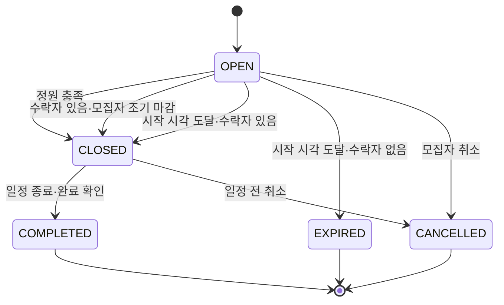
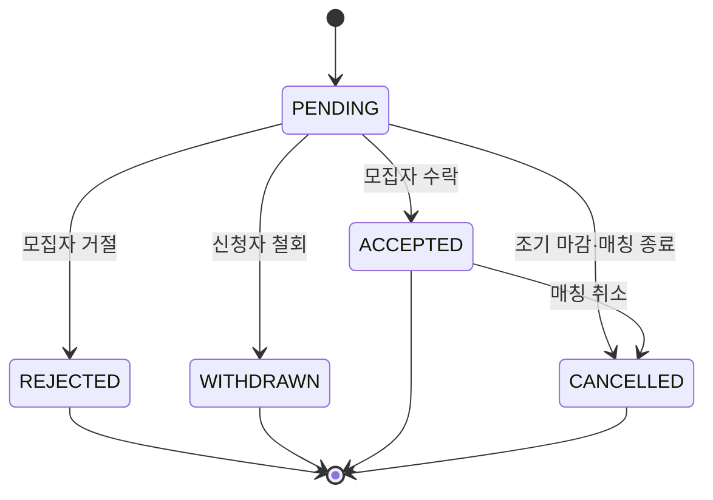
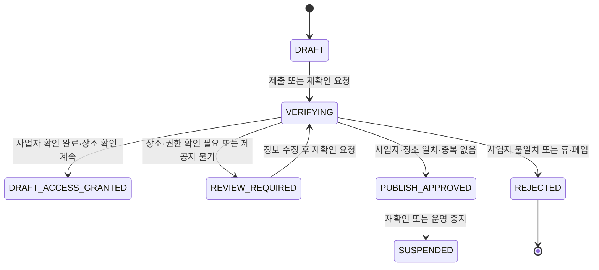
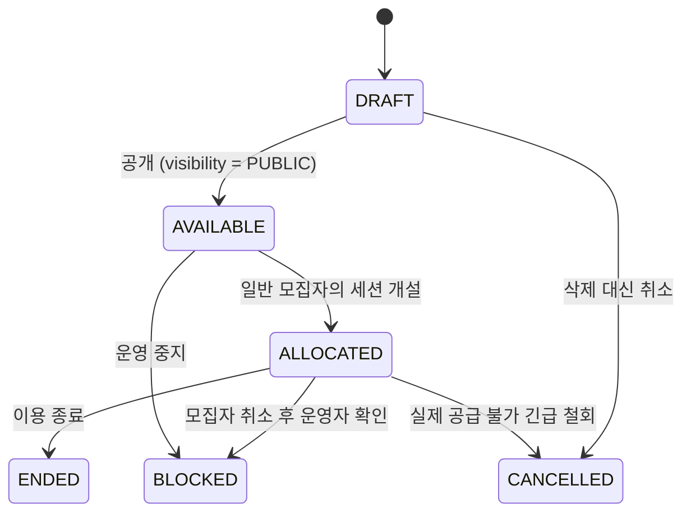

# Tennis Mate 데이터 모델 및 ERD

## 1. 문서 정보

| 항목 | 내용 |
| --- | --- |
| 문서명 | Tennis Mate Data Model & ERD |
| 문서 상태 | Draft v0.1 |
| 기준 문서 | `02-prd.md`, `03-screen-spec.md`, `03-1-court-partner-screen-spec.md` |
| 데이터베이스 후보 | PostgreSQL |
| ORM 후보 | Prisma |
| 다음 문서 | `05-api-spec.md` |

이 문서는 Core MVP의 데이터 모델을 우선 정의하고, Court Partner Pilot과 Court Commerce 모델을 확장 설계로 분리한다. 별도 구현 요청이 없으면 확장 모델을 Core MVP 마이그레이션에 포함하지 않는다.

## 2. 설계 원칙

### 2.1 현재 필요한 데이터만 Core에 만든다

Core MVP에는 회원, 테니스 프로필, 지역, 매칭과 신청에 필요한 테이블만 만든다. 코트 운영자, 제휴 코트, 결제와 정산 테이블은 해당 단계가 승인되었을 때 별도 마이그레이션으로 추가한다.

### 2.2 사용자에게 보이는 상태와 DB 상태를 구분한다

사용자 문구는 여러 데이터 상태를 조합해 만든다. 예를 들어 `같이 치게 됐어요`는 `MatchApplication.status = ACCEPTED`를 사용자 언어로 표현한 것이다.

### 2.3 계산 가능한 값은 중복 저장하지 않는다

- 예상 총 참여 인원 = 모집자 1명 + `Match.recruitCount`
- 예상 1인 비용 = 직접 예약 코트일 때만 `ceil(Match.totalCourtFeeKrw ÷ 예상 총 참여 인원)`, 코트 미정이면 NULL
- 남은 자리 = `Match.recruitCount - ACCEPTED 신청 수`
- 추천 점수 = 프로필, 지역과 플레이 목적을 이용해 조회 시 계산

반복 조회 성능이 실제로 문제가 될 때만 캐시나 집계 테이블을 검토한다.

### 2.4 변경되는 프로필과 신청 당시 정보를 분리한다

사용자는 신청 후 테니스 프로필을 수정할 수 있다. 모집자가 신청 당시 확인한 정보가 나중에 바뀌지 않도록 `MatchApplication.profileSnapshot`에 필요한 정보의 스냅샷을 저장하는 방향을 권장한다.

### 2.5 시간은 절대 시각으로 저장한다

날짜와 시간은 PostgreSQL `timestamptz`로 저장하고, 화면에서 Asia/Seoul 기준으로 표시한다. 날짜 문자열과 시간 문자열을 별도 컬럼으로 나눠 비즈니스 판단에 사용하지 않는다.

### 2.6 금액은 원 단위 정수로 저장한다

Core MVP의 통화는 KRW로 가정하고 금액을 정수 원 단위로 저장한다. 부동소수점 타입을 사용하지 않는다.

## 3. 단계별 엔터티 범위

| 단계 | 엔터티 |
| --- | --- |
| Core MVP | User, AuthAccount, TennisProfile, Region, TennisProfileRegion, TennisProfilePurpose, Match, MatchPurpose, MatchApplication, CourtImageUpload |
| Court Partner Pilot | CourtOperatorApplication, CourtOperator, Court, CourtUnit, CourtAmenity, CourtImage, CourtSlot, Match.courtSlotId |
| Court Commerce | 미정 — 결제 대상·계약 주체·환불 책임 승인 후 별도 설계 |

## 4. Core MVP ERD

```mermaid
erDiagram
    USER ||--o{ AUTH_ACCOUNT : authenticates
    USER ||--|| TENNIS_PROFILE : owns
    TENNIS_PROFILE ||--o{ TENNIS_PROFILE_REGION : selects
    REGION ||--o{ TENNIS_PROFILE_REGION : includes
    TENNIS_PROFILE ||--o{ TENNIS_PROFILE_PURPOSE : prefers
    USER ||--o{ MATCH : hosts
    USER ||--o{ COURT_IMAGE_UPLOAD : owns
    REGION ||--o{ MATCH : locates
    COURT_IMAGE_UPLOAD ||--o| MATCH : attached_to
    MATCH ||--o{ MATCH_PURPOSE : has
    MATCH ||--o{ MATCH_APPLICATION : receives
    USER ||--o{ MATCH_APPLICATION : submits

    USER {
        uuid id PK
        varchar nickname UK
        user_status status
        user_role role
        timestamptz nickname_confirmed_at
        timestamptz onboarding_completed_at
        timestamptz created_at
        timestamptz updated_at
        timestamptz deleted_at
    }

    AUTH_ACCOUNT {
        uuid id PK
        uuid user_id FK
        varchar provider
        varchar provider_account_id
        timestamptz created_at
    }

    TENNIS_PROFILE {
        uuid id PK
        uuid user_id FK_UK
        experience_range experience_range
        rally_level rally_level
        game_experience game_experience
        varchar skill_label
        int version
        timestamptz created_at
        timestamptz updated_at
    }

    REGION {
        varchar code PK
        varchar parent_code FK
        varchar name
        region_type type
        boolean active
    }

    TENNIS_PROFILE_REGION {
        uuid tennis_profile_id PK_FK
        varchar region_code PK_FK
        boolean is_primary
        smallint sort_order
    }

    TENNIS_PROFILE_PURPOSE {
        uuid tennis_profile_id PK_FK
        play_purpose purpose PK
    }

    MATCH {
        uuid id PK
        uuid host_user_id FK
        uuid client_request_id
        varchar region_code FK
        varchar title
        timestamptz starts_at
        timestamptz ends_at
        court_source court_source
        varchar external_court_name
        varchar external_court_address
        varchar external_court_number
        uuid external_court_image_upload_id FK_UK
        int recruit_count
        partner_preference partner_preference
        int total_court_fee_krw
        varchar additional_cost_note
        varchar introduction
        varchar contact_open_chat_url
        match_status status
        int version
        timestamptz closed_at
        timestamptz completed_at
        timestamptz expired_at
        timestamptz cancelled_at
        varchar cancellation_reason
        timestamptz created_at
        timestamptz updated_at
    }

    COURT_IMAGE_UPLOAD {
        uuid id PK
        uuid owner_user_id FK
        varchar private_object_ref UK
        varchar content_type
        int byte_size
        court_image_upload_status status
        timestamptz attached_at
        timestamptz cleanup_claimed_at
        timestamptz deleted_at
        timestamptz created_at
        timestamptz updated_at
    }

    MATCH_PURPOSE {
        uuid match_id PK_FK
        play_purpose purpose PK
    }

    MATCH_APPLICATION {
        uuid id PK
        uuid match_id FK
        uuid applicant_user_id FK
        application_status status
        varchar message
        jsonb profile_snapshot
        int profile_snapshot_version
        timestamptz decided_at
        timestamptz withdrawn_at
        timestamptz cancelled_at
        timestamptz created_at
        timestamptz updated_at
    }
```

## 5. Core MVP 엔터티 상세

### 5.1 User

서비스 회원의 안정적인 식별자와 계정 상태를 관리한다.

| 컬럼 | 타입 | 필수 | 규칙 |
| --- | --- | ---: | --- |
| `id` | UUID | O | PK, 서버 생성 |
| `nickname` | varchar(12) | O | 2~12자 한글·영문·숫자 표시명, 정규화 후 유일 |
| `status` | UserStatus | O | 기본 `ACTIVE` |
| `role` | UserRole | O | 기본 `MEMBER`, Court Partner Pilot의 내부 심사 권한만 별도 부여 |
| `nicknameConfirmedAt` | timestamptz | X | 최초 닉네임 확인 완료 시각 |
| `onboardingCompletedAt` | timestamptz | X | 온보딩 완료 여부 판단 |
| `createdAt` | timestamptz | O | 생성 시각 |
| `updatedAt` | timestamptz | O | 수정 시각 |
| `deletedAt` | timestamptz | X | 탈퇴 시 소프트 삭제 후보 |

#### UserStatus

- `ACTIVE`
- `SUSPENDED`
- `WITHDRAWN`

#### UserRole

- `MEMBER`
- `INTERNAL_REVIEWER`

`INTERNAL_REVIEWER`는 운영자 역할이나 일반 사용자의 영구 선택값이 아니다. 최초 부여는 일반 API·화면이 아닌 보호된 서비스 외 DB 절차로만 하며, 공개 출시 전에는 역할 관리와 다단계 권한 정책을 별도 확정한다.

성별과 연령은 Core MVP에서 수집하지 않는다. 카카오 표시명은 닉네임 기본값으로만 사용하고 사용자가 확인하거나 수정한 뒤 `nicknameConfirmedAt`을 기록한다.

### 5.2 AuthAccount

소셜 로그인 공급자 계정을 User에 연결한다. Core MVP의 생성 경로는 카카오 한 종류만 활성화하지만 향후 공급자 확장을 위해 provider 컬럼은 유지한다.

| 컬럼 | 타입 | 필수 | 규칙 |
| --- | --- | ---: | --- |
| `id` | UUID | O | PK |
| `userId` | UUID | O | User FK |
| `provider` | varchar(30) | O | 인증 공급자 코드 |
| `providerAccountId` | varchar(191) | O | 공급자 사용자 식별자 |
| `createdAt` | timestamptz | O | 연결 시각 |

유일 제약은 `(provider, providerAccountId)`다. Auth.js 설정에 따라 User·Account·Session 스키마가 달라질 수 있으므로 인증 방식을 확정한 뒤 실제 어댑터 스키마와 조정한다.

### 5.3 TennisProfile

현재 테니스 플레이 상태를 관리한다. 매칭 목적과 분리된 지속 데이터다.

| 컬럼 | 타입 | 필수 | 규칙 |
| --- | --- | ---: | --- |
| `id` | UUID | O | PK |
| `userId` | UUID | O | User FK, UNIQUE |
| `experienceRange` | ExperienceRange | O | 구력 참고값 |
| `rallyLevel` | RallyLevel | O | 추천의 주요 기준 |
| `gameExperience` | GameExperience | O | 추천의 보조 기준 |
| `nearbyRegionAllowed` | boolean | O | 선택 지역과 가까운 시·군·구 허용 여부, 기본 true |
| `skillLabel` | varchar(30) | X | Core에서는 NULL 유지·화면 미표시, 분류 규칙 확정 후 사용 |
| `version` | int | O | 기본 1, 프로필 수정마다 증가 |
| `createdAt` | timestamptz | O | 생성 시각 |
| `updatedAt` | timestamptz | O | 수정 시각 |

#### ExperienceRange

| 값 | 사용자 선택지 |
| --- | --- |
| `UNDER_3_MONTHS` | 3개월 미만 |
| `MONTHS_3_TO_6` | 3~6개월 |
| `MONTHS_6_TO_12` | 6개월~1년 |
| `YEARS_1_TO_2` | 1~2년 |
| `YEARS_2_PLUS` | 2년 이상 |

#### RallyLevel

| 값 | 사용자 선택지 | 정렬값 |
| --- | --- | ---: |
| `STARTING` | 아직 랠리가 어려워요 | 1 |
| `SHORT_RALLY` | 몇 번씩 주고받을 수 있어요 | 2 |
| `COMFORTABLE_RALLY` | 편하게 랠리할 수 있어요 | 3 |
| `STANDARD_RALLY` | 일반적인 랠리도 가능해요 | 4 |

정렬값은 추천 계산에서만 사용하고 사용자에게 레벨 숫자로 노출하지 않는다.

#### GameExperience

| 값 | 사용자 선택지 | 정렬값 |
| --- | --- | ---: |
| `NONE` | 아직 안 해봤어요 | 1 |
| `KNOWS_RULES` | 규칙은 조금 알아요 | 2 |
| `PLAYED_FEW` | 몇 번 해봤어요 | 3 |
| `CAN_PLAY` | 게임 진행이 가능해요 | 4 |

### 5.4 Region

사용자 활동 지역, 매칭 지역과 향후 코트 주소의 공통 기준이다.

| 컬럼 | 타입 | 필수 | 규칙 |
| --- | --- | ---: | --- |
| `code` | varchar(20) | O | 행정구역 기준 코드, PK |
| `parentCode` | varchar(20) | X | 상위 Region 자기 참조 |
| `name` | varchar(50) | O | 표시명 |
| `type` | RegionType | O | `CITY`, `DISTRICT` 등 |
| `active` | boolean | O | 폐지 지역을 삭제하지 않고 비활성화 |

Core MVP에서는 시·구 수준까지만 사용한다. 주소 전문을 Region에 저장하지 않는다.

### 5.5 TennisProfileRegion

사용자가 활동 가능한 지역을 관리한다.

| 컬럼 | 타입 | 필수 | 규칙 |
| --- | --- | ---: | --- |
| `tennisProfileId` | UUID | O | 복합 PK, FK |
| `regionCode` | varchar(20) | O | 복합 PK, FK |
| `isPrimary` | boolean | O | M2에서는 항상 true인 주 활동 지역 여부 |

M2에서는 한 프로필에 주 활동 지역이 정확히 한 건만 있어야 한다. `nearbyRegionAllowed`은 추가 지역 행이 아니라 TennisProfile boolean으로 저장한다. 이 제약은 프로필 저장 트랜잭션에서 보장한다.

### 5.6 PlayPurpose와 연결 테이블

#### PlayPurpose

- `CASUAL_HIT`: 편하게 공 주고받기
- `RALLY_PRACTICE`: 랠리 연습
- `STROKE_PRACTICE`: 스트로크 연습
- `GAME_INTRO`: 게임 입문
- `GAME`: 게임

`TennisProfilePurpose`는 사용자가 평소 원하는 플레이를, `MatchPurpose`는 특정 매칭에서 하고 싶은 플레이를 저장한다. 두 테이블 모두 최대 2개 제한을 서버 트랜잭션에서 검증한다.

### 5.7 Match

모집자가 외부에서 예약한 코트 또는 코트 미정 상태의 참가 조건을 등록한다.

| 컬럼 | 타입 | 필수 | 규칙 |
| --- | --- | ---: | --- |
| `id` | UUID | O | PK |
| `hostUserId` | UUID | O | 모집자 User FK |
| `clientRequestId` | UUID | O | 모집자별 매칭 생성 멱등성 키 |
| `regionCode` | varchar(20) | O | Match 지역 FK |
| `title` | varchar(80) | O | 짧은 모집 제목 |
| `startsAt` | timestamptz | O | 시작 시각 |
| `endsAt` | timestamptz | O | 종료 시각, 시작보다 이후 |
| `courtSource` | CourtSource | O | `EXTERNAL_RESERVED` 또는 `COURT_TBD` |
| `externalCourtName` | varchar(100) | 예약 코트만 O | 외부 예약 코트명 |
| `externalCourtAddress` | varchar(255) | 예약 코트만 O | 상세 장소 |
| `externalCourtNumber` | varchar(50) | 예약 코트에서 X | 코트 번호, 예약번호 금지 |
| `externalCourtImageUploadId` | UUID | 예약 코트에서 X | 모집자 본인의 `CourtImageUpload` 1건. 한 Match에만 연결하며 사진 URL을 직접 받지 않음 |
| `recruitCount` | int | O | 모집자 외 추가 인원, 1 이상 |
| `partnerPreference` | PartnerPreference | O | 원하는 상대 선택지 |
| `totalCourtFeeKrw` | int | 예약 코트만 O | 0 이상, 코트 미정이면 NULL |
| `additionalCostNote` | varchar(200) | X | 조명비·볼 비용 등 |
| `introduction` | varchar(300) | X | 짧은 소개 메시지 |
| `contactOpenChatUrl` | varchar(500) | O | 매칭별 카카오 오픈채팅 URL, 모집자·수락자에게만 공개 |
| `status` | MatchStatus | O | 기본 `OPEN` |
| `version` | int | O | 낙관적 잠금용, 기본 1 |
| `closedAt` | timestamptz | X | 모집 마감 시각 |
| `completedAt` | timestamptz | X | 완료 시각 |
| `expiredAt` | timestamptz | X | 수락자 없이 시작 시간이 지난 시각 |
| `cancelledAt` | timestamptz | X | 취소 시각 |
| `cancellationReason` | varchar(200) | X | 정책 확정 후 사용 |
| `createdAt` | timestamptz | O | 생성 시각 |
| `updatedAt` | timestamptz | O | 수정 시각 |

#### CourtImageUpload

외부 예약 코트 사진을 Match에 연결하기 전의 비공개 업로드 메타데이터다. 사진 원본은 비공개 객체 저장소에만 두고, 일반 API·클라이언트에는 객체 URL을 반환하지 않는다.

| 컬럼 | 타입 | 필수 | 규칙 |
| --- | --- | ---: | --- |
| `id` | UUID | O | PK, 매칭 등록 요청에는 이 식별자만 보냄 |
| `ownerUserId` | UUID | O | 업로드한 모집자 User FK |
| `privateObjectRef` | varchar(500) | O | Vercel Blob의 비공개 객체 참조, 일반 응답에 직접 노출하지 않음 |
| `contentType` | varchar(100) | O | JPEG, PNG, WebP만 허용 |
| `byteSize` | int | O | 4 MiB 이하 |
| `status` | CourtImageUploadStatus | O | `PENDING`, `ATTACHED`, `CLEANUP_PENDING`, `DELETED` |
| `attachedAt` | timestamptz | X | Match에 원자적으로 연결된 시각 |
| `cleanupClaimedAt` | timestamptz | X | 미연결 업로드 정리 작업이 점유한 시각 |
| `deletedAt` | timestamptz | X | 객체 삭제가 끝난 시각 |

`PENDING` 업로드는 24시간 안에 Match에 연결되지 않으면 정리 대상이다. `ATTACHED` 원본의 보관·삭제는 연결 Match의 이력 보관 정책과 함께 정식 개인정보 처리방침에서 확정한다. `CLEANUP_PENDING`은 Match 연결과 정리 작업의 경합을 막기 위한 내부 상태이며 API에 반환하지 않는다.

#### CourtSource

- `EXTERNAL_RESERVED`: 모집자가 외부에서 직접 예약
- `COURT_TBD`: 일정과 활동 지역은 정했지만 코트·비용은 수락자와 오픈채팅에서 조율
- `PARTNER_COURT`: Court Partner Pilot에서 운영자가 준비한 Slot에 일반 모집자가 연 Match

Core MVP에서는 첫 두 값만 허용한다. `COURT_TBD`에서는 `externalCourtName`, `externalCourtAddress`, `externalCourtNumber`, `totalCourtFeeKrw`, `additionalCostNote`를 NULL로 저장한다. `PARTNER_COURT`의 CourtSlot 연결 규칙은 13.5에서 정의한다. 오픈채팅 링크는 세 상태 모두 필수이며 모집자와 수락자에게만 공개한다.

#### PartnerPreference

- `COMPLETE_BEGINNER_WELCOME`: 완전 초보도 좋아요
- `SIMILAR_LEVEL`: 비슷한 수준이면 좋아요
- `GAME_CAPABLE`: 게임 가능한 분을 찾고 있어요

`초보자 환영` 배지는 `COMPLETE_BEGINNER_WELCOME`에서 파생한다. 별도 boolean을 중복 저장하지 않는다.

#### MatchStatus

- `OPEN`
- `CLOSED`
- `COMPLETED`
- `EXPIRED`
- `CANCELLED`

### 5.8 MatchApplication

사용자의 같이 치기 신청과 모집자의 결정을 저장한다.

| 컬럼 | 타입 | 필수 | 규칙 |
| --- | --- | ---: | --- |
| `id` | UUID | O | PK |
| `matchId` | UUID | O | Match FK |
| `applicantUserId` | UUID | O | 신청자 User FK |
| `status` | ApplicationStatus | O | 기본 `PENDING` |
| `message` | varchar(200) | X | 짧은 신청 메시지 |
| `profileSnapshot` | jsonb | O | 신청 당시 프로필 |
| `profileSnapshotVersion` | int | O | 스냅샷 스키마 버전 |
| `decidedAt` | timestamptz | X | 수락·거절 시각 |
| `withdrawnAt` | timestamptz | X | 대기 신청 철회 시각 |
| `cancelledAt` | timestamptz | X | 조기 마감·매칭 취소·성사 없이 종료로 무효화된 시각 |
| `createdAt` | timestamptz | O | 신청 시각 |
| `updatedAt` | timestamptz | O | 수정 시각 |

#### ApplicationStatus

- `PENDING`
- `ACCEPTED`
- `REJECTED`
- `WITHDRAWN`
- `CANCELLED`

Core MVP에서는 `(matchId, applicantUserId)`를 UNIQUE로 두어 한 사용자의 재신청을 허용하지 않는 단순한 정책을 권장한다. 철회 또는 거절 후 재신청이 필요하다고 결정되면 부분 유일 인덱스와 상태 이력을 도입한다.

#### profileSnapshot 권장 구조

```json
{
  "schemaVersion": 1,
  "profileVersion": 3,
  "experienceRange": "MONTHS_6_TO_12",
  "rallyLevel": "COMFORTABLE_RALLY",
  "gameExperience": "NONE",
  "playPurposes": ["RALLY_PRACTICE"],
  "activityRegion": { "code": "SEOUL-MAPO", "name": "마포구" },
  "nearbyRegionAllowed": true
}
```

스냅샷은 정해진 스키마로 검증하고 닉네임, 오픈채팅 링크, 연락처와 인증 정보를 넣지 않는다. 플레이 상태 이름은 Core에서 생성하지 않는다. 닉네임은 현재 User에서 읽는다.

## 6. Core MVP 관계와 삭제 정책

| 부모 | 자식 | 관계 | 삭제 정책 |
| --- | --- | --- | --- |
| User | AuthAccount | 1:N | 계정 탈퇴 정책에 따라 삭제 또는 비식별 보존 |
| User | TennisProfile | 1:1 | User 소프트 삭제 시 접근 차단 |
| TennisProfile | ProfileRegion·Purpose | 1:N | 프로필 삭제 시 CASCADE |
| User | Match | 1:N | Match 이력이 있으면 물리 삭제 금지 |
| Match | MatchPurpose | 1:N | Match 물리 삭제 시 CASCADE, 운영에서는 상태 변경 우선 |
| Match | MatchApplication | 1:N | 조기 마감·Match 취소·성사 없이 종료 시 필요한 신청을 `CANCELLED`, 물리 삭제 금지 |
| User | MatchApplication | 1:N | 탈퇴 시 표시 정보 비식별 처리 검토 |

과거 매칭과 신청 기록은 운영 분쟁과 상태 일관성을 위해 즉시 물리 삭제하지 않는다. 개인정보 보존 기간은 서비스 정책과 법적 검토 후 확정한다.

## 7. Core MVP 제약조건

### 7.1 CHECK 제약

- `Match.startsAt < Match.endsAt`
- `Match.recruitCount >= 1`
- `Match.totalCourtFeeKrw IS NULL OR Match.totalCourtFeeKrw >= 0`
- `Match.courtSource = EXTERNAL_RESERVED`인 경우 외부 코트명·주소·비용 필수, `COURT_TBD`인 경우 해당 값은 NULL
- `Match.contactOpenChatUrl`은 HTTPS와 `open.kakao.com` host만 허용
- `Match.status = CANCELLED`인 경우 `cancelledAt` 필수
- `Match.status = COMPLETED`인 경우 `completedAt` 필수
- `Match.status = EXPIRED`인 경우 `expiredAt` 필수
- 신청자와 모집자가 같은 User가 되지 않도록 서비스 및 DB 트리거 또는 트랜잭션 검증

Prisma schema만으로 표현할 수 없는 제약은 SQL migration에 명시한다.

### 7.2 유일 제약

- `AuthAccount(provider, providerAccountId)`
- `User.nickname` 정규화 기준 유일성
- `TennisProfile(userId)`
- `TennisProfileRegion(profileId, regionCode)`
- 프로필당 `isPrimary = true`인 Region 하나
- `TennisProfilePurpose(profileId, purpose)`
- `MatchPurpose(matchId, purpose)`
- `MatchApplication(matchId, applicantUserId)`
- `Match(hostUserId, clientRequestId)`

### 7.3 FK 삭제 동작

- User, Match와 MatchApplication의 핵심 FK에는 `RESTRICT` 또는 소프트 삭제를 우선한다.
- 단순 연결 테이블에는 `ON DELETE CASCADE`를 사용할 수 있다.
- Region은 참조 중 삭제하지 않고 `active = false`로 전환한다.

## 8. Core MVP 인덱스

| 테이블 | 인덱스 | 목적 |
| --- | --- | --- |
| Match | `(status, startsAt)` | 모집 중인 예정 매칭 조회 |
| Match | `(regionCode, status, startsAt)` | 지역별 홈·탐색 |
| Match | `(hostUserId, status, startsAt)` | 내가 만든 매칭 |
| MatchPurpose | `(purpose, matchId)` | 원하는 플레이 필터·추천 |
| MatchApplication | `(matchId, status, createdAt)` | 받은 신청 |
| MatchApplication | `(applicantUserId, status, createdAt DESC)` | 보낸 신청 |
| TennisProfileRegion | `(regionCode, tennisProfileId)` | 지역 적합도 계산 |

과거 매칭이 누적되면 `Match(status, startsAt)`에 부분 인덱스 `WHERE status = 'OPEN'`을 검토한다.

## 9. 추천 점수 데이터 흐름

추천 결과는 별도 `Recommendation` 테이블 없이 다음 데이터를 이용해 계산한다.

| 추천 기준 | 데이터 출처 |
| --- | --- |
| 랠리 수준 동일·인접 | TennisProfile.rallyLevel, Match.partnerPreference 또는 호스트 Profile |
| 플레이 목적 일치 | TennisProfilePurpose, MatchPurpose |
| 활동 지역 동일 | TennisProfileRegion, Match.regionCode |
| 게임 경험 유사 | 신청자·모집자 TennisProfile.gameExperience |

초기에는 SQL 또는 애플리케이션 로직으로 후보를 좁힌 뒤 점수를 계산한다. 사용자에게 내부 점수를 노출하지 않는다. 추천 규칙 변경 이력을 분석해야 할 때만 `recommendationVersion`을 이벤트에 기록한다.

## 10. 핵심 트랜잭션

### 10.1 신청 생성

1. Match를 조회하고 `OPEN`이며 미래 일정인지 확인한다.
2. 신청자가 모집자가 아닌지 확인한다.
3. 동일 Match 신청 존재 여부를 확인한다.
4. 현재 ACCEPTED 수가 정원보다 작은지 확인한다.
5. TennisProfile을 읽고 profileSnapshot을 생성한다.
6. MatchApplication을 `PENDING`으로 생성한다.

유일 제약 위반은 중복 신청 응답으로 변환한다.

### 10.2 신청 수락

한 트랜잭션 안에서 다음을 수행한다.

1. Match row를 잠그거나 version을 이용해 동시성을 제어한다.
2. Match가 `OPEN`인지 확인한다.
3. Application이 `PENDING`인지 확인한다.
4. `ACCEPTED` 신청 수를 다시 계산한다.
5. 남은 자리가 있으면 Application을 `ACCEPTED`로 변경한다.
6. 정원이 채워지면 Match를 `CLOSED`로 변경한다.
7. Match가 CLOSED가 되면 남아 있는 `PENDING` 신청을 `CANCELLED`로 변경한다.

화면에서 버튼을 비활성화하는 것만으로 정원 초과를 막지 않는다.

### 10.3 매칭 취소

1. 모집자 권한을 확인한다.
2. Match를 `CANCELLED`로 변경한다.
3. 연결된 `PENDING`과 `ACCEPTED` 신청을 `CANCELLED`로 변경한다.
4. 취소 시각과 정책상 필요한 사유를 기록한다.

Match가 `EXPIRED`로 전환될 때는 연결된 `PENDING` 신청을 `CANCELLED`로 변경한다. 사용자 문구는 Match 상태를 함께 확인하여 모집자 취소와 성사 없이 종료를 구분한다.

### 10.4 조기 마감

1. 모집자 권한과 Match version을 확인한다.
2. Match가 `OPEN`이고 ACCEPTED 신청이 한 건 이상인지 확인한다.
3. Match를 `CLOSED`로 변경하고 `closedAt`을 기록한다.
4. 남아 있는 `PENDING` 신청을 `CANCELLED`로 변경하고 `cancelledAt`을 기록한다.

정원 충족 또는 시작 시각 도달로 수락자가 있는 Match를 `CLOSED`로 전환할 때도 남은 PENDING 신청을 같은 방식으로 정리한다.

### 10.5 매칭 완료

1. 모집자 권한과 Match version을 확인한다.
2. Match가 `CLOSED`이고 `endsAt <= now`인지 확인한다.
3. Match를 `COMPLETED`로 변경하고 `completedAt`을 기록한다.

완료 후보 여부는 `status = CLOSED AND endsAt <= now`에서 계산하며 별도 컬럼으로 저장하지 않는다.

## 11. 상태 전이

### 11.1 Match



`CLOSED → OPEN` 재개는 허용하지 않는다. 공개 후 일정과 코트 정보 변경은 정책 확정 전 허용하지 않는다.

### 11.2 MatchApplication



수락 후 참가 취소는 Core MVP 화면과 API에서 제공하지 않고 비공개 테스트에서는 운영 문의로 처리한다. 정식 기능으로 추가할 때는 `CANCELLED_BY_APPLICANT` 같은 별도 상태와 상태 이력을 설계하며 `WITHDRAWN`을 재사용하지 않는다.

## 12. Court Partner 확장 ERD

Court Partner Pilot 구현 단계에서 추가한다. 운영자는 자율 등록할 수 있지만, 검증이 완료되기 전에는 코트와 Slot을 공개하지 않는다.

```mermaid
erDiagram
    USER ||--o{ COURT_OPERATOR_APPLICATION : submits
    USER ||--o{ OPERATOR_APPLICATION_EVIDENCE_UPLOAD : uploads
    USER ||--o{ OPERATOR_APPLICATION_REVIEW : performs
    OPERATOR_APPLICATION_EVIDENCE_UPLOAD ||--o| COURT_OPERATOR_APPLICATION : business_registration_certificate
    COURT_OPERATOR_APPLICATION ||--o{ OPERATOR_APPLICATION_VERIFICATION_ATTEMPT : records
    COURT_OPERATOR_APPLICATION ||--o{ OPERATOR_APPLICATION_REVIEW : receives
    USER ||--o| COURT_OPERATOR : owns
    COURT_OPERATOR ||--o{ COURT : manages
    COURT_OPERATOR_APPLICATION ||--o| COURT : verifies
    REGION ||--o{ COURT : locates
    COURT ||--o{ COURT_UNIT : contains
    COURT ||--o{ COURT_AMENITY : offers
    COURT ||--o{ COURT_IMAGE : displays
    COURT_UNIT ||--o{ COURT_SLOT : opens
    COURT_SLOT ||--o{ COURT_SLOT_STATUS_HISTORY : records
    COURT_SLOT ||--o{ COURT_SUPPLY_INCIDENT : receives
    MATCH ||--o{ COURT_SUPPLY_INCIDENT : affects
    COURT_SUPPLY_INCIDENT ||--o{ MATCH_SUPPLY_NOTICE_RECIPIENT : notifies
    COURT_OPERATOR_APPLICATION ||--o{ OPERATOR_SUPPLY_RESTRICTION : restricts
    COURT_SLOT ||--o{ MATCH : allocated_to_over_time

    COURT_OPERATOR_APPLICATION {
        uuid id PK
        uuid applicant_user_id FK
        operator_application_status status
        varchar business_name
        varchar business_registration_number_hash
        uuid business_registration_certificate_upload_id FK_UK
        varchar verification_input_ref
        business_verification_status business_verification_status
        venue_verification_status venue_verification_status
        varchar venue_name
        varchar venue_address
        varchar normalized_venue_key
        timestamptz verified_at
        timestamptz publish_approved_at
        varchar verification_failure_code
        timestamptz submitted_at
        timestamptz created_at
        timestamptz updated_at
    }

    OPERATOR_APPLICATION_EVIDENCE_UPLOAD {
        uuid id PK
        uuid owner_user_id FK
        varchar private_object_ref UK
        varchar content_type
        int byte_size
        operator_application_evidence_upload_status status
        timestamptz attached_at
        timestamptz expires_at
        timestamptz cleanup_claimed_at
        timestamptz deleted_at
        timestamptz created_at
        timestamptz updated_at
    }

    OPERATOR_APPLICATION_VERIFICATION_ATTEMPT {
        uuid id PK
        uuid application_id FK
        verification_attempt_kind kind
        verification_attempt_result result
        varchar safe_failure_code
        varchar provider_request_ref
        timestamptz attempted_at
    }

    OPERATOR_APPLICATION_REVIEW {
        uuid id PK
        uuid application_id FK
        uuid reviewer_user_id FK
        operator_application_review_decision decision
        operator_application_review_reason_code reason_code
        timestamptz created_at
    }

    COURT_OPERATOR {
        uuid id PK
        uuid owner_user_id FK_UK
        varchar display_name
        operator_status status
        timestamptz approved_at
        timestamptz created_at
        timestamptz updated_at
    }

    COURT {
        uuid id PK
        uuid operator_id FK
        uuid operator_application_id FK_UK
        varchar region_code FK
        varchar name
        varchar address
        varchar normalized_venue_key
        varchar location_guide
        decimal latitude
        decimal longitude
        court_status status
        timestamptz created_at
        timestamptz updated_at
    }

    COURT_UNIT {
        uuid id PK
        uuid court_id FK
        varchar name
        boolean indoor
        court_surface surface
        boolean lighting
        court_unit_status status
    }

    COURT_AMENITY {
        uuid court_id PK_FK
        amenity_type amenity PK
    }

    COURT_IMAGE {
        uuid id PK
        uuid court_id FK
        varchar private_object_ref
        varchar alt_text
        int sort_order
        boolean is_representative
    }

    COURT_SLOT {
        uuid id PK
        uuid court_unit_id FK
        timestamptz starts_at
        timestamptz ends_at
        int price_krw
        int max_participant_count
        court_slot_visibility visibility
        court_slot_status status
        timestamptz published_at
        varchar usage_note
        int version
        timestamptz created_at
        timestamptz updated_at
    }

    COURT_SLOT_STATUS_HISTORY {
        uuid id PK
        uuid court_slot_id FK
        court_slot_status from_status
        court_slot_status to_status
        slot_status_change_actor actor
        uuid actor_user_id FK
        varchar reason_code
        timestamptz created_at
    }

    COURT_SUPPLY_INCIDENT {
        uuid id PK
        uuid court_slot_id FK
        uuid match_id FK
        uuid reporter_user_id FK
        court_supply_incident_code code
        court_supply_incident_impact impact
        court_supply_incident_status status
        boolean operator_attributable
        varchar public_notice_code
        timestamptz reported_at
        timestamptz resolved_at
    }

    MATCH_SUPPLY_NOTICE_RECIPIENT {
        uuid id PK
        uuid incident_id FK
        uuid recipient_user_id FK
        supply_notice_audience audience
        timestamptz delivered_at
        timestamptz read_at
    }

    OPERATOR_SUPPLY_RESTRICTION {
        uuid id PK
        uuid operator_application_id FK
        operator_supply_restriction_source source
        varchar reason_code
        timestamptz started_at
        timestamptz cleared_at
        uuid cleared_by_user_id FK
    }
```

## 13. Court Partner 엔터티 상세

### 13.0 Pilot 현재 수직 단위 — 운영자 신청, 코트 시간 공급, 제휴 세션 연결

Court Partner Pilot의 현재 구현은 `CourtOperatorApplication`·자동 확인 시도 이력·내부 심사 감사 이력·필수 사업자등록증 비공개 업로드에 더해, 비공개 `Court`·`CourtUnit`·`CourtSlot` 초안과 공개된 Slot의 `PARTNER_COURT` Match 연결까지 활성화한다. 일반 회원은 공개 Slot을 읽기 전용으로 보거나 `AVAILABLE` Slot을 선택해 세션을 열 수 있다. 결제·환불·정산, 운영자 사진, 조건부 운영 권한 보완 증빙과 실제 외부 확인 제공자 호출은 이 단위에 포함하지 않는다.

이 단위가 해결하는 문제는 실제 코트 운영자가 등록을 시작한 뒤 심사 진행 상황과 다음 행동을 알 수 없고, 승인 전 코트 시간이 이용자에게 공개되는 위험이 있다는 점이다. 공개 권한을 `PUBLISH_APPROVED`로 분리해, 검증 전 입력 정보가 이용자 공개나 제휴 코트 세션 연결로 이어지지 않게 한다. `DRAFT_ACCESS_GRANTED` 또는 `PUBLISH_APPROVED` 신청자는 비공개 Court·Slot 초안만 만들 수 있고, 공개 전환은 후자만 할 수 있다. 더 단순한 대안인 신청 상태 문자열 하나만 저장하는 방식은 사업자 유효와 장소 운영 권한을 구분할 수 없어 사용하지 않는다.

현재 수직 단위 마이그레이션에는 다음을 포함한다.

- `CourtOperatorApplication`, `OperatorApplicationVerificationAttempt`
- `OperatorApplicationEvidenceUpload`와 신청당 사업자등록증 1건의 비공개·원자적 연결, 미연결·만료 파일 정리
- `User.role = INTERNAL_REVIEWER`와 `OperatorApplicationReview`의 판정·사유 코드·심사자·시각 감사 이력
- 신청 상태·사업자 확인 상태·장소 확인 상태 enum
- 신청자별 현재 진행 중인 신청을 빠르게 찾는 인덱스와 사업자·장소 중복 검토용 HMAC 키 인덱스
- `Court`, `CourtUnit`, `CourtSlot`, `CourtSlotStatusHistory`, `Match.courtSlotId`
- `PARTNER_COURT` source, Slot 공개/공급 상태 enum, 동일 CourtUnit 활성 Slot 시간 겹침 방지 제약

`verificationInputRef`는 사업자등록번호·개업일·대표자명 원문을 담지 않는 비공개 저장소 참조다. 실제 비공개 저장소와 암호화 키가 배포 환경에 준비되기 전에는 원문을 DB, 로그, 분석 이벤트에 저장하지 않는다. 따라서 첫 구현의 기본 `ManualVerificationProvider`는 외부 사업자·주소·장소 확인을 호출하지 않고 안전한 `UNAVAILABLE` 결과만 돌려준다. 테스트에서만 주입하는 fake provider가 상태 전이를 검증한다.

상태 전이는 다음과 같이 제한한다.



`DRAFT_ACCESS_GRANTED`와 `PUBLISH_APPROVED`는 별도 권한이다. 현재 API는 전자와 후자에 비공개 Court·Slot 초안을, 후자에만 공개를 허용한다. 한 신청에는 한 시설만 연결하며, 별도 지점은 기존 공개 권한을 재사용하지 않고 새 신청·장소 확인 흐름으로 처리한다. 별도의 `CourtOperator` 계정 테이블과 직원 멤버십은 아직 만들지 않고, 연결된 운영자 신청의 상태를 이 Pilot 권한의 단일 근거로 사용한다.

### 13.1 CourtOperatorApplication

운영자 신청과 심사 이력을 보존한다. 승인된 운영자와 신청 데이터를 하나의 테이블로 합치지 않는다. 신청 단계의 사업자 확인 완료는 비공개 Court·Slot 초안 작성 권한만 줄 수 있고, 공개 권한은 `PUBLISH_APPROVED` 상태에서만 부여한다.

민감한 사업자 번호 원문을 일반 컬럼에 저장하지 않는다. 중복 확인은 일반 해시가 아니라 비밀값으로 키를 관리하는 HMAC으로 수행하고, 필요한 경우에만 암호화된 별도 저장소 참조를 사용한다. `businessRegistrationCertificateUploadId`는 신청당 하나의 `ATTACHED` 사업자등록증 업로드만 가리키며, 증빙 파일 원문은 비공개 객체 저장소에만 둔다.

자동 검증에는 사업자번호·개업일·대표자명, 사업장명, 사용자가 고른 표준 도로명주소와 장소 검색 결과를 사용한다. 원문 사업자번호·대표자명·외부 API 응답 전문은 로그나 분석 이벤트에 남기지 않는다. `CourtOperatorApplication`에는 최소한 다음 결과를 보관한다.

| 필드 | 규칙 |
| --- | --- |
| `businessRegistrationNumberHash` | 정규화 사업자번호의 키 관리 HMAC. 원문 대입 공격 없이 중복 신청만 탐지 |
| `businessRegistrationCertificateUploadId` | 신청자 소유 `PENDING` 업로드를 제출 트랜잭션에서 원자적으로 연결한 1:1 FK. 원문·파일명·객체 URL은 반환하지 않음 |
| `verificationInputRef` | 사업자번호·개업일·대표자명·제출 주소를 재확인에만 쓰는 암호화된 비공개 참조 |
| `businessVerificationStatus` | `PENDING`, `VERIFIED`, `MISMATCH`, `UNAVAILABLE` |
| `venueVerificationStatus` | `PENDING`, `MATCHED`, `REVIEW_REQUIRED`, `UNAVAILABLE` |
| `normalizedVenueKey` | 표준 주소·장소 식별자로 만든 중복 탐지 키. 원문 장소 검색 응답을 저장하지 않음 |
| `verifiedAt` | 자동 또는 운영 검토로 확인된 시각 |
| `publishApprovedAt` | 코트·Slot 공개를 허용한 시각 |
| `revalidationDueAt` | 연 1회 또는 운영상 재확인이 필요한 다음 확인 시각 |
| `verificationFailureCode` | 사용자에게 안전하게 설명 가능한 코드만 저장 |

`businessVerificationStatus = VERIFIED`만으로 운영자를 승인하지 않는다. `venueVerificationStatus = MATCHED`, 주소·장소 일치, 활성 동일 장소 운영자 부재를 함께 충족하거나 운영 검토가 이를 대체해야 `PUBLISH_APPROVED` 및 `CourtOperator.ACTIVE`로 전환한다. 동일 `businessRegistrationNumberHash` 또는 `normalizedVenueKey`의 활성 신청·운영자가 있으면 자동 승인을 금지하고 검토 대상으로 만든다.

`UNAVAILABLE`은 외부 서비스 장애·지연을 뜻하므로 반려와 구분한다. 재시도는 별도 Attempt 이력으로 남기고 제한된 횟수 이후 `REVIEW_REQUIRED`로 전환한다. 첫 구현은 검증 원문을 일반 DB에 저장하지 않아 새 입력 제출로만 재확인을 시작한다. `MISMATCH` 또는 휴·폐업처럼 명백히 잘못된 사업자 상태만 정정 후 새 신청하도록 `REJECTED`로 전환할 수 있다.

#### OperatorApplicationEvidenceUpload

사업자등록증을 신청 생성 전 잠시 보관하고 심사 중에만 안전하게 열람하기 위한 비공개 업로드 메타데이터다. `ownerUserId`, UUID 기반 객체 참조, 허용 MIME·바이트 수·상태·기한만 저장하며 원본 파일명, OCR 결과, 문서에서 읽은 사업자번호·대표자명은 저장하지 않는다.

| 필드 | 규칙 |
| --- | --- |
| `privateObjectRef` | 비공개 객체 저장소 참조. API DTO·클라이언트·로그에 노출하지 않음 |
| `contentType` | `application/pdf`, `image/jpeg`, `image/png`만 허용하고 서버가 파일 서명을 재확인 |
| `byteSize` | 10 MiB 이하 |
| `status` | `PENDING`, `ATTACHED`, `REPLACED`, `CLEANUP_PENDING`, `DELETED` |
| `attachedAt` | 신청 제출·수정 트랜잭션에서 `ATTACHED`로 점유한 시각 |
| `expiresAt` | 연결 뒤 최대 30일의 심사·보완 기한. 승인·반려 시 즉시 만료 처리 |
| `cleanupClaimedAt`, `deletedAt` | 비공개 객체 삭제 작업의 동시성·완료 시각 |

`PENDING`은 24시간 안에 신청에 연결되지 않으면, `REPLACED`와 만료된 `ATTACHED`는 다음 정리 작업에서 객체와 메타데이터를 함께 삭제한다. 신청자가 새 등록증으로 교체하면 기존 증빙은 `REPLACED`로 전환해 재사용을 막는다. 내부 심사자만 현재 `ATTACHED` 증빙을 서버 중계 경로로 열람할 수 있고, 일반 운영자·일반 회원·감사 이력은 원문에 접근하지 못한다.

#### OperatorApplicationVerificationAttempt

사업자·주소·장소 확인의 실행 이력만 보관한다. 외부 응답 전문, 사업자번호 원문, 대표자명 원문, 주소 원문은 저장하지 않는다. `providerRequestRef`는 공급자 문의·장애 추적에 필요한 비식별 참조값만 허용한다.

#### OperatorApplicationReview

자동 확인으로 결론 낼 수 없는 장소·운영 권한을 권한 있는 운영 검토자가 판정한 감사 이력이다. `reviewerUserId`는 신청자와 같을 수 없고, 결정은 첫 Pilot에서 `APPROVE_PUBLISH`, `REQUEST_CHANGES`, `REJECT` 중 하나다. `reasonCode`는 `MANUAL_VERIFIED`, `INFORMATION_INCOMPLETE`, `BUSINESS_UNVERIFIED`, `VENUE_UNVERIFIED`, `OPERATING_AUTHORITY_UNCONFIRMED`, `DUPLICATE_VENUE` 중 하나로 제한한다. 자유 메모와 증빙 원문은 일반 DB에 저장하지 않으며, 중지 판정은 운영 중 재확인 정책이 확정될 때 추가한다. 공개 검토 권한은 일반 운영자 권한과 분리된 `User.role = INTERNAL_REVIEWER`에만 부여한다.

`OperatorApplicationReview(applicationId, reviewerUserId, decision, reasonCode, createdAt)`는 판정 후 수정·삭제하지 않는다. 같은 정규화 장소의 승인 신청은 PostgreSQL 부분 유일 인덱스로 한 건만 허용해, 동시에 승인해도 한 건만 `PUBLISH_APPROVED`가 되게 한다.

#### OperatorApplicationStatus

- `DRAFT`
- `SUBMITTED`
- `VERIFYING`
- `DRAFT_ACCESS_GRANTED`
- `REVIEW_REQUIRED`
- `UNDER_REVIEW`
- `CHANGES_REQUESTED`
- `PUBLISH_APPROVED`
- `REJECTED`
- `SUSPENDED`

### 13.2 CourtOperator

Pilot에서는 한 User가 한 운영자 계정의 소유자가 되는 단순한 구조를 사용한다. 여러 직원 권한이 실제로 필요해지면 `CourtOperatorMember` 연결 테이블을 추가한다.

#### OperatorStatus

- `ACTIVE`
- `SUSPENDED`
- `CLOSED`

### 13.3 Court와 CourtUnit

`Court`는 주소와 시설을 공유하는 코트장이고 `CourtUnit`은 실제 예약되는 개별 코트 면이다. Pilot에서는 한 `CourtOperatorApplication`이 한 `Court` 시설의 공개 권한을 검증한다. 같은 운영자가 다른 지점·시설을 추가하면 기존 승인 권한을 재사용하지 않고 별도 신청·장소 검증을 연결한다.

예:

- Court: 마포 테니스파크
- CourtUnit: 1번 코트, 2번 코트

시간대 중복 검사는 Court가 아니라 CourtUnit 단위로 수행한다.

`Court.normalizedVenueKey`는 연결된 신청의 정규화 장소 키와 일치해야 한다. 활성 또는 중지 상태의 Court에 같은 키가 존재하면 자동 공개를 허용하지 않는 부분 유일 인덱스를 둔다. 권리 관계가 확인된 공동 운영·명의 변경만 내부 검토의 명시적 결정으로 예외 처리한다.

`CourtImage`는 운영자 사진 업로드 수직 단위에서만 활성화한다. 그 전에는 공개 Slot·제휴 코트 Match 모두 동일한 기본 코트 일러스트를 `court.image.fallback = TENNIS_COURT_ILLUSTRATION`으로 표시한다. 활성화 시 운영자가 직접 제공한 사진만 저장하고, `privateObjectRef`, `altText`, `sortOrder`에 더해 대표 표시 여부를 둔다. 카드에는 대표 1장만 사용한다. 외부 예약 Match는 Court 엔터티와 연결하지 않고 `Match.externalCourtImageObjectRef`로 모집자 제공 사진을 1장만 참조한다. 두 경우 모두 이미지 원본은 비공개 객체 저장소에 두고 API가 제한된 URL만 반환하며, 웹·지도 사진을 자동 수집하지 않는다.

### 13.4 CourtSlot

운영자가 공급하는 특정 코트 면·시간대다. 일반 사용자의 예약 단위가 아니며, `AVAILABLE` Slot은 일반 모집자의 활성 Partner Court Match 한 건에만 연결될 수 있다. 공개 여부와 공급 상태를 분리해, 한 번 `PUBLIC`이 된 Slot은 `ENDED`, `BLOCKED`, `CANCELLED`가 되어도 상태를 보여 주는 공개 기록으로 남길 수 있다.

| 컬럼 | 타입 | 필수 | 규칙 |
| --- | --- | ---: | --- |
| `id` | UUID | O | PK |
| `courtUnitId` | UUID | O | 실제 코트 면 FK |
| `startsAt` | timestamptz | O | 시작 시각 |
| `endsAt` | timestamptz | O | 종료 시각 |
| `priceKrw` | int | O | 코트 전체 가격, 0 이상 |
| `maxParticipantCount` | int | O | 모집자를 포함한 현장 최대 인원, 2 이상 |
| `visibility` | CourtSlotVisibility | O | 기본 `PRIVATE`, 공개 후 상태와 별개로 유지 |
| `status` | CourtSlotStatus | O | 기본 `DRAFT` |
| `publishedAt` | timestamptz | X | 최초 공개 시각. 공개 상태를 다시 비공개로 숨기지 않는 Pilot 정책에서는 NULL 여부가 공개 시작 이력을 뜻함 |
| `statusChangedAt` | timestamptz | O | 가장 최근 공급 상태 전환 시각 |
| `usageNote` | varchar(500) | X | 준비물·이용 안내 |
| `version` | int | O | 동시 수정 제어 |
| `createdAt` | timestamptz | O | 생성 시각 |
| `updatedAt` | timestamptz | O | 수정 시각 |

#### CourtSlotStatus

- `DRAFT`
- `AVAILABLE`
- `ALLOCATED`
- `ENDED`
- `BLOCKED`
- `CANCELLED`

#### CourtSlotVisibility

- `PRIVATE`: 운영자 초안만 조회 가능
- `PUBLIC`: 인증된 일반 회원과 운영자가 안전한 상태·코트·시간·비용·이용 안내를 조회 가능

`visibility = PUBLIC`은 코트 예약 가능이나 운영자 승인 대기가 아니다. `status`가 실제 행동을 제한한다. Pilot의 공개 정책은 새 Slot을 `DRAFT`·`PRIVATE`로 시작하고, 한 번 `PUBLIC`이 된 Slot은 취소·종료 후에도 `PUBLIC`을 유지해 최신 상태를 보여 주는 것이다. 한 번도 공개하지 않은 초안을 취소한 경우에는 `PRIVATE`를 유지할 수 있다.

#### CourtSlotStatusHistory

공개 Slot의 상태 변경을 운영상 분쟁과 이용자 안내에 사용할 최소 감사 이력이다. `actor`는 `OPERATOR`, `SESSION_HOST`, `SYSTEM`, `ADMIN` 중 하나이며, `actorUserId`는 시스템 작업이면 NULL일 수 있다. `reasonCode`는 `OPERATOR_BLOCKED`, `SUPPLY_WITHDRAWN`, `TIME_ELAPSED`, `HOST_CANCELLED`처럼 안전한 코드만 저장하며 자유 입력 사유와 개인정보는 저장하지 않는다. `REOPENED`는 Pilot에서 사용하지 않는다.

### 13.5 Match 연결 확장

Court Partner 도입 시 `Match`에 다음 컬럼을 추가한다.

| 컬럼 | 타입 | 규칙 |
| --- | --- | --- |
| `courtSlotId` | UUID nullable | CourtSlot FK, 활성 Partner Court Match 기준 UNIQUE. 과거 Match는 같은 Slot을 참조할 수 있음 |

그리고 다음 CHECK 제약을 추가한다.

- `courtSource = EXTERNAL_RESERVED`이면 `courtSlotId IS NULL`이고 외부 코트 필드 필수
- `courtSource = COURT_TBD`이면 `courtSlotId IS NULL`이고 외부 코트 필드 NULL
- `courtSource = PARTNER_COURT`이면 `courtSlotId IS NOT NULL`이고 외부 코트 필드 NULL
- 연결 가능한 CourtSlot은 `AVAILABLE` 상태여야 하며 생성 트랜잭션 안에서 `ALLOCATED`가 됨
- `PARTNER_COURT` Match의 `recruitCount + 1 <= CourtSlot.maxParticipantCount`를 생성 트랜잭션 안에서 검증

제휴 코트의 명칭·주소·코트 면·시간·전체 비용은 연결된 CourtSlot과 Court에서 조회한다. Match 생성 이후 운영자·모집자 모두 시간과 비용을 직접 수정할 수 없다. 사용자 응답은 이 정보를 MatchDetailView에 조합해 반환하며, 예상 1인 비용은 기존 모집 인원 규칙으로 계산한다. 연결된 Match가 모집자 취소로 `CANCELLED`여도 기존 Match는 해당 Slot을 계속 참조하고 Slot은 자동으로 바뀌지 않는다. 운영자가 실제 공급 가능 여부를 확인한 뒤 이 취소된 Match가 연결된 `ALLOCATED` Slot만 `BLOCKED`로 중지할 수 있으며, 재공급은 그 뒤의 새 `DRAFT`로만 시작한다. 이 중지는 `CourtSupplyIncident`나 운영자 귀책 철회를 만들지 않는다.

### 13.6 CourtSupplyIncident·MatchSupplyNoticeRecipient·OperatorSupplyRestriction

`CourtSupplyIncident`는 `ALLOCATED` Slot에서 운영자가 실제 공급 불가나 운영상 문제를 접수한 기록이다. 일반 오류 요청은 `REQUESTED` 상태로 남기며 Slot·Match를 바꾸지 않는다. `SCHEDULE_UNAVAILABLE`, `FACILITY_CLOSED`, `SAFETY_RISK`, `NATURAL_DISASTER`만 `CANCEL_MATCH` 영향을 선택할 수 있다. 이 영향은 `SUPPLY_WITHDRAWN` 상태 이력, `CourtSlot.CANCELLED`, 연결 `Match.CANCELLED`, 대상 안내 생성까지 하나의 트랜잭션으로 처리한다.

| 필드 | 규칙 |
| --- | --- |
| `code` | 안전한 사유 enum. 원문 사유는 참가자 응답·분석 이벤트에 저장하지 않음 |
| `impact` | `NONE` 또는 `CANCEL_MATCH`. 시간·가격 변경 영향은 없음 |
| `operatorAttributable` | `SCHEDULE_UNAVAILABLE` 등 운영자 귀책을 서버 규칙으로 판정. 재난·시설 안전 조치는 별도 집계 |
| `publicNoticeCode` | 안전한 템플릿 코드. 참여자에게는 템플릿 문구만 반환 |
| `status` | `REQUESTED`, `WITHDRAWN`, `REVIEWED`, `REJECTED` |

`MatchSupplyNoticeRecipient`는 연결 Match의 모집자, `PENDING`, `ACCEPTED` 신청자에게 인앱 안내를 보여 주기 위한 최소 수신 이력이다. 연락처·운영자 원문 사유·내부 메모를 저장하거나 반환하지 않는다. `deliveredAt`은 인앱 안내 생성 시각이며, 푸시·문자·카카오 발송 성공을 뜻하지 않는다.

`OperatorSupplyRestriction`은 신청 심사 상태와 분리된 새 공개 제한 감사 이력이다. 운영자 귀책 `WITHDRAWN`이 최근 30일 2회이거나 시작 24시간 이내 1회이면 `AUTOMATED` 제한을 만든다. 제한 중에는 새 Slot 공개와 `AVAILABLE → ALLOCATED`를 거절하지만, 다른 연결 세션을 자동 취소하지 않는다. 관리자만 검토 후 `clearedAt`, `clearedByUserId`를 기록해 제한을 해제한다.

## 14. Court Partner 동시성 제약

### 14.1 겹치는 Slot 방지

같은 CourtUnit에 활성 시간대가 겹치지 않도록 PostgreSQL exclusion constraint를 권장한다.

개념적 제약:

```sql
EXCLUDE USING gist (
  court_unit_id WITH =,
  tstzrange(starts_at, ends_at, '[)') WITH &&
)
WHERE (status IN ('DRAFT', 'AVAILABLE', 'ALLOCATED'));
```

Prisma schema로 직접 표현되지 않으면 SQL migration에 작성한다.

### 14.2 활성 제휴 코트 세션 한 건

Pilot 권장안은 한 Slot에 활성 `PARTNER_COURT` Match 한 건만 허용하는 것이다. 부분 유일 인덱스가 Match의 `courtSlotId`를 기준으로 활성 상태만 제한한다.

```sql
CREATE UNIQUE INDEX uq_active_partner_match_per_slot
ON match (court_slot_id)
WHERE court_source = 'PARTNER_COURT'
  AND status IN ('OPEN', 'CLOSED');
```

`COMPLETED`, `EXPIRED`, `CANCELLED` Match가 있더라도 공개 Slot은 상태와 이력을 유지한다. Pilot에서는 과거 Match가 생긴 Slot을 다시 `AVAILABLE`로 전환하지 않는다. 같은 시간 공급이 필요하면 새 Slot을 만들고, 과거 Slot은 상태·이력 조회용 기록으로 남긴다.

### 14.3 세션 개설 트랜잭션

1. CourtSlot row를 잠근다.
2. `visibility = PUBLIC`, 상태가 `AVAILABLE`, 시작 시각 전이며 연결된 활성 Partner Court Match가 없는지 확인한다.
3. `recruitCount + 1`이 `maxParticipantCount` 이내인지 검증하고, 고정 코트·시간·비용을 사용해 `courtSource = PARTNER_COURT` Match를 생성한다.
4. Match의 `courtSlotId`를 설정하고 CourtSlot을 `ALLOCATED`로 변경한다.
5. 두 변경을 하나의 트랜잭션으로 커밋한다.

이 과정은 일반 사용자 CourtBooking이나 운영자 승인 상태를 생성하지 않는다.

## 15. Court Partner 상태 전이

### 15.1 CourtSlot



`visibility`는 상태 전이와 독립적이며, 한 번 `PUBLIC`이 된 Slot은 이후 상태 전이에서도 `PUBLIC`을 유지한다. 한 번도 공개하지 않은 초안을 취소하면 `PRIVATE`를 유지할 수 있다. `AVAILABLE`의 오류는 `BLOCKED` 후 새 초안으로만 정정한다. `BLOCKED`·`CANCELLED`의 재공개와 재개는 Pilot에서 제공하지 않는다. 세션 모집자가 시작 전 Match를 취소하면 `ALLOCATED` Slot은 자동 전환하지 않는다. 운영자가 실제 공급 가능 여부를 확인한 뒤 연결 Match가 `CANCELLED`인 경우에만 `ALLOCATED → BLOCKED`로 중지하고 새 초안을 만들 수 있다. 이 전이는 Match·Application·Incident·공개 제한을 바꾸지 않는다. 운영자가 연결된 Slot 공급을 철회하면 `ALLOCATED → CANCELLED`와 연결 Match 취소·대상 인앱 안내·사후 검토를 같은 작업으로 처리해야 하며, 이 긴급 철회를 단순 `BLOCKED` 전환으로 대체하지 않는다.

## 16. Court Commerce ERD

Court Commerce는 Pilot 범위 밖이며 이 정책은 결제·환불·정산 모델을 아직 정의하지 않는다. 일반 사용자의 코트 예약 모델이 없으므로 과거 `CourtBooking → Payment` 관계도 사용하지 않는다.

결제 대상, 계약 주체, 환불·분쟁 책임, 운영자 정산 주기와 개인정보 처리 방식이 사용자 승인으로 확정될 때에만 Payment·Refund·Settlement의 관계와 멱등성 규칙을 별도 문서·마이그레이션으로 설계한다.

## 17. 확장 모델 인덱스

| 테이블 | 인덱스 | 목적 |
| --- | --- | --- |
| CourtOperatorApplication | `(businessRegistrationNumberHash, status)` | 동일 사업자 신청·지점 관계 검토 |
| CourtOperatorApplication | 활성 `normalizedVenueKey` 부분 유일 | 동일 장소 자동 공개 방지 |
| Court | `(regionCode, status)` | 지역별 코트 탐색 |
| Court | 활성 `normalizedVenueKey` 부분 유일 | 승인 시설의 중복 공개 방지 |
| CourtUnit | `(courtId, status)` | 코트장 면 관리 |
| CourtSlot | `(visibility, status, startsAt)` | 공개 상태 조회와 세션 연결 가능 시간 탐색 |
| CourtSlot | `(courtUnitId, startsAt, endsAt)` | 시간 충돌 확인 |
| CourtSlotStatusHistory | `(courtSlotId, createdAt)` | 공개 상태 변경 이력 조회 |
| Match | 활성 `courtSlotId` 부분 유일 | 같은 Slot의 활성 Partner Court Match 중복 방지 |
| Match | `(courtSource, startsAt)` | 제휴 코트 세션 탐색 |

## 18. Prisma 및 PostgreSQL 구현 지침

### 18.1 타입

- 식별자: UUID
- 시간: `@db.Timestamptz(3)`
- 금액: `Int`, 원 단위
- 짧은 사용자 문구: 길이가 제한된 varchar
- 스냅샷: JSONB, 애플리케이션 스키마 검증 필수

### 18.2 Prisma 밖에서 관리할 가능성이 높은 제약

- 부분 유일 인덱스
- CourtSlot 시간 겹침 exclusion constraint
- 조건부 CHECK 제약
- 대소문자 무시 닉네임 유일성

이 제약은 migration SQL에 명시하고 테스트에서 실제 DB 동작을 검증한다.

### 18.3 Enum 변경

PostgreSQL enum 값 삭제·이름 변경은 운영 마이그레이션 비용이 크다. 사용자 문구는 enum 값과 분리하고, enum 이름은 안정적인 도메인 용어로 정한다.

### 18.4 낙관적 잠금

Match, TennisProfile과 CourtSlot의 `version`을 갱신 조건에 포함할 수 있다.

```text
UPDATE ...
SET version = version + 1, ...
WHERE id = :id AND version = :expectedVersion
```

수정 행이 0개면 최신 상태를 다시 조회하고 충돌 응답을 반환한다.

## 19. 개인정보와 보존

| 데이터 | 처리 원칙 |
| --- | --- |
| 인증 공급자 식별자 | 인증 목적 외 노출 금지 |
| 프로필 스냅샷 | 연락처와 인증정보 포함 금지 |
| 카카오 오픈채팅 URL | 모집자와 ACCEPTED 신청자에게만 반환, 로그·스냅샷 제외 |
| 외부 코트 주소 | 매칭 참여 판단에 필요한 범위로 노출 |
| 코트 사진 | 운영자 또는 모집자가 직접 제공한 사진만 비공개 객체 참조로 저장. 사진 출처와 표시 권한을 안내하고, 인물·연락처·예약번호 노출을 금지 |
| 사업자 증빙 | 비공개 저장, 접근 감사와 보존 기간 필요 |
| 운영자 연락처 | 일반 참가자에게 공개하지 않음. 운영 연락이 필요하면 별도 정책 승인 후 최소 범위만 사용 |
| CourtSlot·Match 상태 이력 | 운영상 분쟁 대응에 필요한 기간 보존 후 정책에 따라 삭제·비식별화 |

## 20. 테스트 데이터 시나리오

### 20.1 Core MVP

1. 랠리 수준과 목적이 같은 두 사용자
2. 지역은 같지만 랠리 수준이 두 단계 차이 나는 사용자
3. 모집 인원 1명인 Match에 동시에 두 신청을 수락하는 상황
4. PENDING 신청 후 프로필을 수정한 사용자
5. 모집자가 자신의 Match에 신청하는 상황
6. 취소된 Match에 신청하는 상황
7. 코트 비용 0원과 추가 비용 안내가 있는 Match
8. 같은 clientRequestId로 Match 생성 요청을 재시도하는 상황
9. 한 명 수락 후 조기 마감하여 PENDING 신청이 취소되는 상황
10. endsAt 이전과 이후의 완료 확인 요청
11. 수락 전·후 오픈채팅 링크 조회 권한

### 20.2 Court Partner

1. 같은 CourtUnit에 겹치는 두 Slot 등록
2. 같은 Slot으로 동시에 들어온 두 Partner Court Match 생성 요청
3. `AVAILABLE → ALLOCATED`와 Match 생성이 함께 실패 없이 완료되는지
4. `recruitCount + 1`이 `maxParticipantCount`를 넘는 Match 생성 거절
5. `AVAILABLE`·`ALLOCATED` Slot의 사용자 표시 필드 수정과 재공개 거절
6. `BLOCKED` Slot과 같은 CourtUnit·시간으로 새 `DRAFT`를 만들 수 있는지
7. 운영자가 `ALLOCATED` Slot을 긴급 철회할 때 연결 Match 취소·대상 인앱 안내·상태 이력이 하나의 트랜잭션으로 기록되는지
8. 일반 오류 접수가 Slot·Match 상태를 바꾸지 않는지
9. 최근 30일 2회 또는 시작 24시간 이내 1회의 운영자 귀책 철회가 새 공개 제한을 만들고, 기존 연결 세션은 유지하는지
10. 시작 시간이 지나 Match 종료와 Slot `ENDED` 전환, 공개 상태 유지
11. 세션 모집자 취소 뒤 Slot이 자동 재공개되지 않고, 운영자가 취소된 Match 연결을 확인한 경우에만 `ALLOCATED → BLOCKED` 후 같은 시간의 새 `DRAFT`를 만들 수 있는지

## 21. 남은 후속 결정과 데이터 영향

| 결정 항목 | 현재 처리 | 데이터 영향 |
| --- | --- | --- |
| 플레이 상태 분류 | Core에서 `skillLabel` NULL·미표시 | 분류 확정 후 채우거나 계산값으로 전환 |
| 신청 재신청 | Core 금지 | 허용 시 부분 유일 인덱스와 상태 이력 필요 |
| 수락 후 참가 취소 | 운영 문의 | 정식 기능 시 ApplicationStatus와 이력 확장 |
| 공개 후 일정·코트 변경 | Core 금지 | 허용 시 변경 이력과 수락자 동의 정책 필요 |
| 외부 코트 정보 오류 | 모집자 책임·운영 문의 | 신고·정정 이력 추가 가능 |
| Slot 활성 세션 수 | 한 건 권장 | 다중 세션 허용 시 자원 단위·정원 모델 재설계 필요 |
| Slot-Match 연결 | 활성 Match 한 건, 과거 Match 참조 보존 | 다중 동시 모집 허용 시 연결 테이블과 용량 배분 필요 |
| 운영자 긴급 공급 철회 | `ALLOCATED → CANCELLED`, Match 취소·인앱 안내·감사 이력 | CourtSupplyIncident·수신 이력·공개 제한 감사 이력 |
| 세션 모집자 취소 후 Slot 처리 | 자동 재공개하지 않음. 운영자 확인 뒤 `ALLOCATED → BLOCKED`, 이후 새 `DRAFT`만 허용 | 기존 Match·신청 이력 보존, 상태 이력 |
| 공개 Slot 상태 보존 | 한 번 공개하면 상태와 이력을 계속 공개 | 상태 이력, `visibility`, 공개 응답 DTO 필요 |
| 현장 최대 인원 | Slot별 `maxParticipantCount` 필수 | Partner Match 생성 시 정원 검증 필요 |
| 내부 심사자 부여 | `User.role = INTERNAL_REVIEWER`, 서비스 외 보호된 DB 절차로만 초기 부여 | 역할 관리 UI·다단계 권한은 실제 팀 운영 시 재설계 |
| 운영자 직원 계정 | Pilot 소유자 한 명 | 필요 시 CourtOperatorMember 추가 |

## 22. 구현 순서

### Core MVP

1. User·AuthAccount
2. Region seed
3. TennisProfile·ProfileRegion·ProfilePurpose
4. Match·MatchPurpose
5. MatchApplication과 profileSnapshot
6. 인덱스·CHECK·동시성 테스트

### Court Partner Pilot

1. CourtOperatorApplication·VerificationAttempt·내부 심사자 역할·Review 감사 이력과 공개 권한 분리
2. Court·CourtUnit·Amenity와 사진 없는 기본 일러스트
3. CourtSlot 공개 여부·상태 이력·현장 최대 인원, 시간 중복 제약 및 `PUBLISH_APPROVED` 공개 게이트
4. `Match.courtSlotId` 확장과 정원 검증, `AVAILABLE → ALLOCATED` 트랜잭션
5. Partner Court Match 탐색·기존 참가 신청 재사용
6. 공개 Slot 불변·공개 중지·새 초안 정정 규칙과 운영자 재확인 적용
7. CourtSupplyIncident·대상 인앱 안내·반복 철회 공개 제한 적용
8. 세션 모집자 취소 후 자동 재공개 금지, 운영자 확인 `BLOCKED`와 새 `DRAFT` 경로 적용

## 23. 다음 단계

`05-api-spec.md`에서는 Core MVP API를 먼저 정의한다.

- 인증 및 현재 사용자
- 온보딩·테니스 프로필
- 추천·매칭 목록과 상세
- 외부 예약 코트 매칭 등록
- 같이 치기 신청
- 신청 수락·거절·철회
- 내가 만든 매칭과 보낸 신청
- 매칭 취소·완료

Court Partner와 Court Commerce API는 Core API와 별도 섹션으로 구분하고, 구현 단계가 승인되기 전에는 엔드포인트를 활성 범위로 간주하지 않는다.
