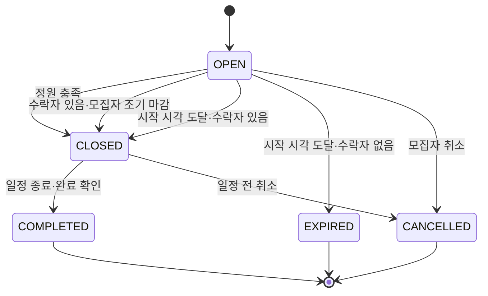
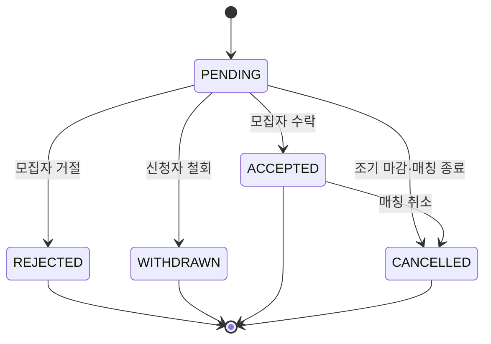
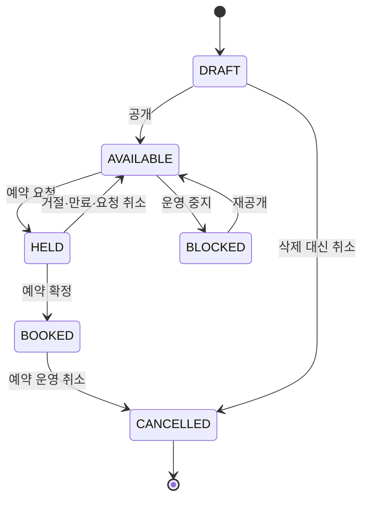
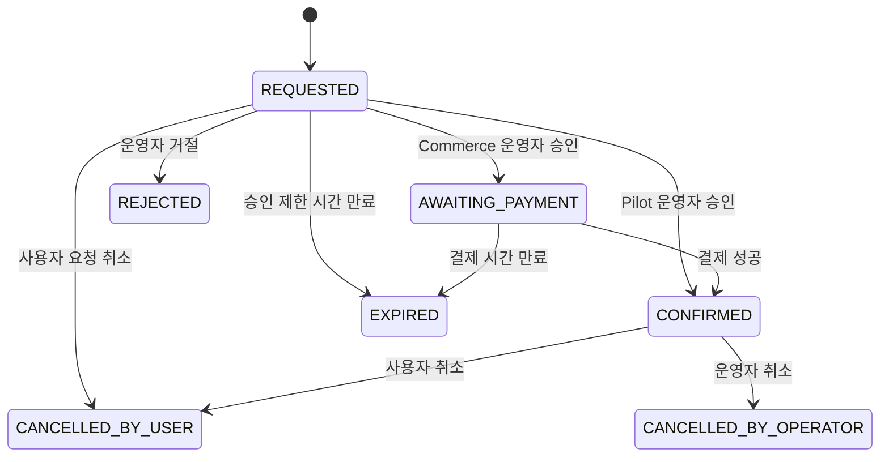
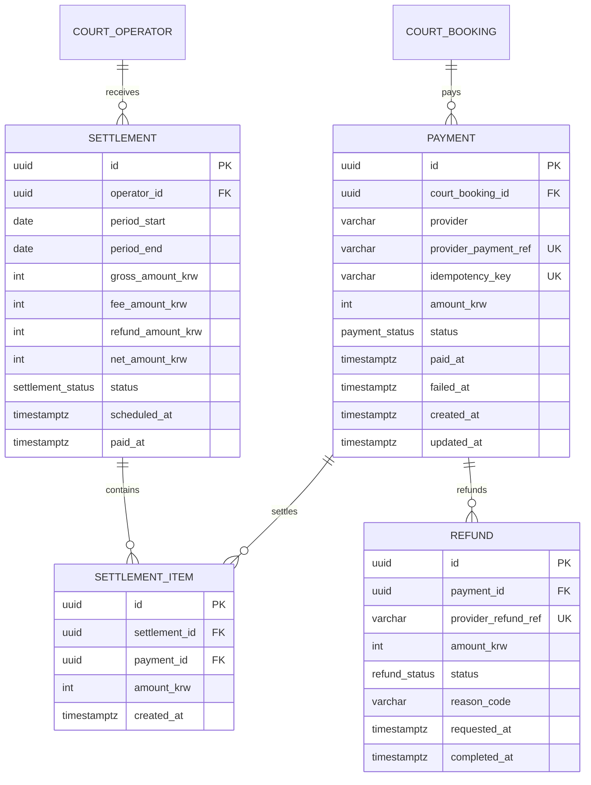

# Tennis Mate 데이터 모델 및 ERD

## 1. 문서 정보

| 항목 | 내용 |
| --- | --- |
| 문서명 | Tennis Mate Data Model & ERD |
| 문서 상태 | Draft v0.1 |
| 기준 문서 | `02-prd.md`, `03-screen-spec.md`, `03-1-court-partner-screen-spec.md` |
| 데이터베이스 후보 | PostgreSQL |
| ORM 후보 | Prisma |
| 다음 문서 | `05-api-spec.md` |

이 문서는 Core MVP의 데이터 모델을 우선 정의하고, Court Partner Pilot과 Court Commerce 모델을 확장 설계로 분리한다. 별도 구현 요청이 없으면 확장 모델을 Core MVP 마이그레이션에 포함하지 않는다.

## 2. 설계 원칙

### 2.1 현재 필요한 데이터만 Core에 만든다

Core MVP에는 회원, 테니스 프로필, 지역, 매칭과 신청에 필요한 테이블만 만든다. 코트 운영자, 제휴 코트, 결제와 정산 테이블은 해당 단계가 승인되었을 때 별도 마이그레이션으로 추가한다.

### 2.2 사용자에게 보이는 상태와 DB 상태를 구분한다

사용자 문구는 여러 데이터 상태를 조합해 만든다. 예를 들어 `같이 치게 됐어요`는 `MatchApplication.status = ACCEPTED`를 사용자 언어로 표현한 것이다.

### 2.3 계산 가능한 값은 중복 저장하지 않는다

- 예상 총 참여 인원 = 모집자 1명 + `Match.recruitCount`
- 예상 1인 비용 = `ceil(Match.totalCourtFeeKrw ÷ 예상 총 참여 인원)`
- 남은 자리 = `Match.recruitCount - ACCEPTED 신청 수`
- 추천 점수 = 프로필, 지역과 플레이 목적을 이용해 조회 시 계산

반복 조회 성능이 실제로 문제가 될 때만 캐시나 집계 테이블을 검토한다.

### 2.4 변경되는 프로필과 신청 당시 정보를 분리한다

사용자는 신청 후 테니스 프로필을 수정할 수 있다. 모집자가 신청 당시 확인한 정보가 나중에 바뀌지 않도록 `MatchApplication.profileSnapshot`에 필요한 정보의 스냅샷을 저장하는 방향을 권장한다.

### 2.5 시간은 절대 시각으로 저장한다

날짜와 시간은 PostgreSQL `timestamptz`로 저장하고, 화면에서 Asia/Seoul 기준으로 표시한다. 날짜 문자열과 시간 문자열을 별도 컬럼으로 나눠 비즈니스 판단에 사용하지 않는다.

### 2.6 금액은 원 단위 정수로 저장한다

Core MVP의 통화는 KRW로 가정하고 금액을 정수 원 단위로 저장한다. 부동소수점 타입을 사용하지 않는다.

## 3. 단계별 엔터티 범위

| 단계 | 엔터티 |
| --- | --- |
| Core MVP | User, AuthAccount, TennisProfile, Region, TennisProfileRegion, TennisProfilePurpose, Match, MatchPurpose, MatchApplication |
| Court Partner Pilot | CourtOperatorApplication, CourtOperator, Court, CourtUnit, CourtAmenity, CourtImage, CourtSlot, CourtBooking, CourtBookingStatusHistory |
| Court Commerce | Payment, Refund, Settlement, SettlementItem |

## 4. Core MVP ERD

```mermaid
erDiagram
    USER ||--o{ AUTH_ACCOUNT : authenticates
    USER ||--|| TENNIS_PROFILE : owns
    TENNIS_PROFILE ||--o{ TENNIS_PROFILE_REGION : selects
    REGION ||--o{ TENNIS_PROFILE_REGION : includes
    TENNIS_PROFILE ||--o{ TENNIS_PROFILE_PURPOSE : prefers
    USER ||--o{ MATCH : hosts
    REGION ||--o{ MATCH : locates
    MATCH ||--o{ MATCH_PURPOSE : has
    MATCH ||--o{ MATCH_APPLICATION : receives
    USER ||--o{ MATCH_APPLICATION : submits

    USER {
        uuid id PK
        varchar nickname UK
        user_status status
        timestamptz nickname_confirmed_at
        timestamptz onboarding_completed_at
        timestamptz created_at
        timestamptz updated_at
        timestamptz deleted_at
    }

    AUTH_ACCOUNT {
        uuid id PK
        uuid user_id FK
        varchar provider
        varchar provider_account_id
        timestamptz created_at
    }

    TENNIS_PROFILE {
        uuid id PK
        uuid user_id FK_UK
        experience_range experience_range
        rally_level rally_level
        game_experience game_experience
        varchar skill_label
        int version
        timestamptz created_at
        timestamptz updated_at
    }

    REGION {
        varchar code PK
        varchar parent_code FK
        varchar name
        region_type type
        boolean active
    }

    TENNIS_PROFILE_REGION {
        uuid tennis_profile_id PK_FK
        varchar region_code PK_FK
        boolean is_primary
        smallint sort_order
    }

    TENNIS_PROFILE_PURPOSE {
        uuid tennis_profile_id PK_FK
        play_purpose purpose PK
    }

    MATCH {
        uuid id PK
        uuid host_user_id FK
        uuid client_request_id
        varchar region_code FK
        varchar title
        timestamptz starts_at
        timestamptz ends_at
        court_source court_source
        varchar external_court_name
        varchar external_court_address
        varchar external_court_number
        int recruit_count
        partner_preference partner_preference
        int total_court_fee_krw
        varchar additional_cost_note
        varchar introduction
        varchar contact_open_chat_url
        match_status status
        int version
        timestamptz closed_at
        timestamptz completed_at
        timestamptz expired_at
        timestamptz cancelled_at
        varchar cancellation_reason
        timestamptz created_at
        timestamptz updated_at
    }

    MATCH_PURPOSE {
        uuid match_id PK_FK
        play_purpose purpose PK
    }

    MATCH_APPLICATION {
        uuid id PK
        uuid match_id FK
        uuid applicant_user_id FK
        application_status status
        varchar message
        jsonb profile_snapshot
        int profile_snapshot_version
        timestamptz decided_at
        timestamptz withdrawn_at
        timestamptz cancelled_at
        timestamptz created_at
        timestamptz updated_at
    }
```

## 5. Core MVP 엔터티 상세

### 5.1 User

서비스 회원의 안정적인 식별자와 계정 상태를 관리한다.

| 컬럼 | 타입 | 필수 | 규칙 |
| --- | --- | ---: | --- |
| `id` | UUID | O | PK, 서버 생성 |
| `nickname` | varchar(12) | O | 2~12자 한글·영문·숫자 표시명, 정규화 후 유일 |
| `status` | UserStatus | O | 기본 `ACTIVE` |
| `nicknameConfirmedAt` | timestamptz | X | 최초 닉네임 확인 완료 시각 |
| `onboardingCompletedAt` | timestamptz | X | 온보딩 완료 여부 판단 |
| `createdAt` | timestamptz | O | 생성 시각 |
| `updatedAt` | timestamptz | O | 수정 시각 |
| `deletedAt` | timestamptz | X | 탈퇴 시 소프트 삭제 후보 |

#### UserStatus

- `ACTIVE`
- `SUSPENDED`
- `WITHDRAWN`

성별과 연령은 Core MVP에서 수집하지 않는다. 카카오 표시명은 닉네임 기본값으로만 사용하고 사용자가 확인하거나 수정한 뒤 `nicknameConfirmedAt`을 기록한다.

### 5.2 AuthAccount

소셜 로그인 공급자 계정을 User에 연결한다. Core MVP의 생성 경로는 카카오 한 종류만 활성화하지만 향후 공급자 확장을 위해 provider 컬럼은 유지한다.

| 컬럼 | 타입 | 필수 | 규칙 |
| --- | --- | ---: | --- |
| `id` | UUID | O | PK |
| `userId` | UUID | O | User FK |
| `provider` | varchar(30) | O | 인증 공급자 코드 |
| `providerAccountId` | varchar(191) | O | 공급자 사용자 식별자 |
| `createdAt` | timestamptz | O | 연결 시각 |

유일 제약은 `(provider, providerAccountId)`다. Auth.js 설정에 따라 User·Account·Session 스키마가 달라질 수 있으므로 인증 방식을 확정한 뒤 실제 어댑터 스키마와 조정한다.

### 5.3 TennisProfile

현재 테니스 플레이 상태를 관리한다. 매칭 목적과 분리된 지속 데이터다.

| 컬럼 | 타입 | 필수 | 규칙 |
| --- | --- | ---: | --- |
| `id` | UUID | O | PK |
| `userId` | UUID | O | User FK, UNIQUE |
| `experienceRange` | ExperienceRange | O | 구력 참고값 |
| `rallyLevel` | RallyLevel | O | 추천의 주요 기준 |
| `gameExperience` | GameExperience | O | 추천의 보조 기준 |
| `nearbyRegionAllowed` | boolean | O | 선택 지역과 가까운 시·군·구 허용 여부, 기본 true |
| `skillLabel` | varchar(30) | X | Core에서는 NULL 유지·화면 미표시, 분류 규칙 확정 후 사용 |
| `version` | int | O | 기본 1, 프로필 수정마다 증가 |
| `createdAt` | timestamptz | O | 생성 시각 |
| `updatedAt` | timestamptz | O | 수정 시각 |

#### ExperienceRange

| 값 | 사용자 선택지 |
| --- | --- |
| `UNDER_3_MONTHS` | 3개월 미만 |
| `MONTHS_3_TO_6` | 3~6개월 |
| `MONTHS_6_TO_12` | 6개월~1년 |
| `YEARS_1_TO_2` | 1~2년 |
| `YEARS_2_PLUS` | 2년 이상 |

#### RallyLevel

| 값 | 사용자 선택지 | 정렬값 |
| --- | --- | ---: |
| `STARTING` | 아직 랠리가 어려워요 | 1 |
| `SHORT_RALLY` | 몇 번씩 주고받을 수 있어요 | 2 |
| `COMFORTABLE_RALLY` | 편하게 랠리할 수 있어요 | 3 |
| `STANDARD_RALLY` | 일반적인 랠리도 가능해요 | 4 |

정렬값은 추천 계산에서만 사용하고 사용자에게 레벨 숫자로 노출하지 않는다.

#### GameExperience

| 값 | 사용자 선택지 | 정렬값 |
| --- | --- | ---: |
| `NONE` | 아직 안 해봤어요 | 1 |
| `KNOWS_RULES` | 규칙은 조금 알아요 | 2 |
| `PLAYED_FEW` | 몇 번 해봤어요 | 3 |
| `CAN_PLAY` | 게임 진행이 가능해요 | 4 |

### 5.4 Region

사용자 활동 지역, 매칭 지역과 향후 코트 주소의 공통 기준이다.

| 컬럼 | 타입 | 필수 | 규칙 |
| --- | --- | ---: | --- |
| `code` | varchar(20) | O | 행정구역 기준 코드, PK |
| `parentCode` | varchar(20) | X | 상위 Region 자기 참조 |
| `name` | varchar(50) | O | 표시명 |
| `type` | RegionType | O | `CITY`, `DISTRICT` 등 |
| `active` | boolean | O | 폐지 지역을 삭제하지 않고 비활성화 |

Core MVP에서는 시·구 수준까지만 사용한다. 주소 전문을 Region에 저장하지 않는다.

### 5.5 TennisProfileRegion

사용자가 활동 가능한 지역을 관리한다.

| 컬럼 | 타입 | 필수 | 규칙 |
| --- | --- | ---: | --- |
| `tennisProfileId` | UUID | O | 복합 PK, FK |
| `regionCode` | varchar(20) | O | 복합 PK, FK |
| `isPrimary` | boolean | O | M2에서는 항상 true인 주 활동 지역 여부 |

M2에서는 한 프로필에 주 활동 지역이 정확히 한 건만 있어야 한다. `nearbyRegionAllowed`은 추가 지역 행이 아니라 TennisProfile boolean으로 저장한다. 이 제약은 프로필 저장 트랜잭션에서 보장한다.

### 5.6 PlayPurpose와 연결 테이블

#### PlayPurpose

- `CASUAL_HIT`: 편하게 공 주고받기
- `RALLY_PRACTICE`: 랠리 연습
- `STROKE_PRACTICE`: 스트로크 연습
- `GAME_INTRO`: 게임 입문
- `GAME`: 게임

`TennisProfilePurpose`는 사용자가 평소 원하는 플레이를, `MatchPurpose`는 특정 매칭에서 하고 싶은 플레이를 저장한다. 두 테이블 모두 최대 2개 제한을 서버 트랜잭션에서 검증한다.

### 5.7 Match

모집자가 외부에서 예약한 코트와 참가 조건을 등록한다.

| 컬럼 | 타입 | 필수 | 규칙 |
| --- | --- | ---: | --- |
| `id` | UUID | O | PK |
| `hostUserId` | UUID | O | 모집자 User FK |
| `clientRequestId` | UUID | O | 모집자별 매칭 생성 멱등성 키 |
| `regionCode` | varchar(20) | O | Match 지역 FK |
| `title` | varchar(80) | O | 짧은 모집 제목 |
| `startsAt` | timestamptz | O | 시작 시각 |
| `endsAt` | timestamptz | O | 종료 시각, 시작보다 이후 |
| `courtSource` | CourtSource | O | Core에서는 `EXTERNAL_RESERVED`만 생성 |
| `externalCourtName` | varchar(100) | O | 외부 예약 코트명 |
| `externalCourtAddress` | varchar(255) | O | 상세 장소 |
| `externalCourtNumber` | varchar(50) | X | 코트 번호, 예약번호 금지 |
| `recruitCount` | int | O | 모집자 외 추가 인원, 1 이상 |
| `partnerPreference` | PartnerPreference | O | 원하는 상대 선택지 |
| `totalCourtFeeKrw` | int | O | 0 이상 |
| `additionalCostNote` | varchar(200) | X | 조명비·볼 비용 등 |
| `introduction` | varchar(300) | X | 짧은 소개 메시지 |
| `contactOpenChatUrl` | varchar(500) | O | 매칭별 카카오 오픈채팅 URL, 모집자·수락자에게만 공개 |
| `status` | MatchStatus | O | 기본 `OPEN` |
| `version` | int | O | 낙관적 잠금용, 기본 1 |
| `closedAt` | timestamptz | X | 모집 마감 시각 |
| `completedAt` | timestamptz | X | 완료 시각 |
| `expiredAt` | timestamptz | X | 수락자 없이 시작 시간이 지난 시각 |
| `cancelledAt` | timestamptz | X | 취소 시각 |
| `cancellationReason` | varchar(200) | X | 정책 확정 후 사용 |
| `createdAt` | timestamptz | O | 생성 시각 |
| `updatedAt` | timestamptz | O | 수정 시각 |

#### CourtSource

- `EXTERNAL_RESERVED`: 모집자가 외부에서 직접 예약
- `PARTNER_COURT`: Court Partner 확장 단계
- `NOT_RESERVED`: 정책이 확정되기 전에는 생성 금지

Core MVP 초기 마이그레이션에서는 enum 확장 비용을 피하기 위해 세 값을 모두 선언할 수 있지만, 생성 API는 `EXTERNAL_RESERVED`만 허용한다. 더 엄격한 범위를 원하면 Core에서는 한 값만 선언하고 Partner 마이그레이션에서 값을 추가한다.

#### PartnerPreference

- `COMPLETE_BEGINNER_WELCOME`: 완전 초보도 좋아요
- `SIMILAR_LEVEL`: 비슷한 수준이면 좋아요
- `GAME_CAPABLE`: 게임 가능한 분을 찾고 있어요

`초보자 환영` 배지는 `COMPLETE_BEGINNER_WELCOME`에서 파생한다. 별도 boolean을 중복 저장하지 않는다.

#### MatchStatus

- `OPEN`
- `CLOSED`
- `COMPLETED`
- `EXPIRED`
- `CANCELLED`

### 5.8 MatchApplication

사용자의 같이 치기 신청과 모집자의 결정을 저장한다.

| 컬럼 | 타입 | 필수 | 규칙 |
| --- | --- | ---: | --- |
| `id` | UUID | O | PK |
| `matchId` | UUID | O | Match FK |
| `applicantUserId` | UUID | O | 신청자 User FK |
| `status` | ApplicationStatus | O | 기본 `PENDING` |
| `message` | varchar(200) | X | 짧은 신청 메시지 |
| `profileSnapshot` | jsonb | O | 신청 당시 프로필 |
| `profileSnapshotVersion` | int | O | 스냅샷 스키마 버전 |
| `decidedAt` | timestamptz | X | 수락·거절 시각 |
| `withdrawnAt` | timestamptz | X | 대기 신청 철회 시각 |
| `cancelledAt` | timestamptz | X | 조기 마감·매칭 취소·성사 없이 종료로 무효화된 시각 |
| `createdAt` | timestamptz | O | 신청 시각 |
| `updatedAt` | timestamptz | O | 수정 시각 |

#### ApplicationStatus

- `PENDING`
- `ACCEPTED`
- `REJECTED`
- `WITHDRAWN`
- `CANCELLED`

Core MVP에서는 `(matchId, applicantUserId)`를 UNIQUE로 두어 한 사용자의 재신청을 허용하지 않는 단순한 정책을 권장한다. 철회 또는 거절 후 재신청이 필요하다고 결정되면 부분 유일 인덱스와 상태 이력을 도입한다.

#### profileSnapshot 권장 구조

```json
{
  "schemaVersion": 1,
  "profileVersion": 3,
  "experienceRange": "MONTHS_6_TO_12",
  "rallyLevel": "COMFORTABLE_RALLY",
  "gameExperience": "NONE",
  "playPurposes": ["RALLY_PRACTICE"],
  "activityRegion": { "code": "SEOUL-MAPO", "name": "마포구" },
  "nearbyRegionAllowed": true
}
```

스냅샷은 정해진 스키마로 검증하고 닉네임, 오픈채팅 링크, 연락처와 인증 정보를 넣지 않는다. 플레이 상태 이름은 Core에서 생성하지 않는다. 닉네임은 현재 User에서 읽는다.

## 6. Core MVP 관계와 삭제 정책

| 부모 | 자식 | 관계 | 삭제 정책 |
| --- | --- | --- | --- |
| User | AuthAccount | 1:N | 계정 탈퇴 정책에 따라 삭제 또는 비식별 보존 |
| User | TennisProfile | 1:1 | User 소프트 삭제 시 접근 차단 |
| TennisProfile | ProfileRegion·Purpose | 1:N | 프로필 삭제 시 CASCADE |
| User | Match | 1:N | Match 이력이 있으면 물리 삭제 금지 |
| Match | MatchPurpose | 1:N | Match 물리 삭제 시 CASCADE, 운영에서는 상태 변경 우선 |
| Match | MatchApplication | 1:N | 조기 마감·Match 취소·성사 없이 종료 시 필요한 신청을 `CANCELLED`, 물리 삭제 금지 |
| User | MatchApplication | 1:N | 탈퇴 시 표시 정보 비식별 처리 검토 |

과거 매칭과 신청 기록은 운영 분쟁과 상태 일관성을 위해 즉시 물리 삭제하지 않는다. 개인정보 보존 기간은 서비스 정책과 법적 검토 후 확정한다.

## 7. Core MVP 제약조건

### 7.1 CHECK 제약

- `Match.startsAt < Match.endsAt`
- `Match.recruitCount >= 1`
- `Match.totalCourtFeeKrw >= 0`
- `Match.courtSource = EXTERNAL_RESERVED`인 경우 외부 코트명과 주소 필수
- `Match.contactOpenChatUrl`은 HTTPS와 `open.kakao.com` host만 허용
- `Match.status = CANCELLED`인 경우 `cancelledAt` 필수
- `Match.status = COMPLETED`인 경우 `completedAt` 필수
- `Match.status = EXPIRED`인 경우 `expiredAt` 필수
- 신청자와 모집자가 같은 User가 되지 않도록 서비스 및 DB 트리거 또는 트랜잭션 검증

Prisma schema만으로 표현할 수 없는 제약은 SQL migration에 명시한다.

### 7.2 유일 제약

- `AuthAccount(provider, providerAccountId)`
- `User.nickname` 정규화 기준 유일성
- `TennisProfile(userId)`
- `TennisProfileRegion(profileId, regionCode)`
- 프로필당 `isPrimary = true`인 Region 하나
- `TennisProfilePurpose(profileId, purpose)`
- `MatchPurpose(matchId, purpose)`
- `MatchApplication(matchId, applicantUserId)`
- `Match(hostUserId, clientRequestId)`

### 7.3 FK 삭제 동작

- User, Match와 MatchApplication의 핵심 FK에는 `RESTRICT` 또는 소프트 삭제를 우선한다.
- 단순 연결 테이블에는 `ON DELETE CASCADE`를 사용할 수 있다.
- Region은 참조 중 삭제하지 않고 `active = false`로 전환한다.

## 8. Core MVP 인덱스

| 테이블 | 인덱스 | 목적 |
| --- | --- | --- |
| Match | `(status, startsAt)` | 모집 중인 예정 매칭 조회 |
| Match | `(regionCode, status, startsAt)` | 지역별 홈·탐색 |
| Match | `(hostUserId, status, startsAt)` | 내가 만든 매칭 |
| MatchPurpose | `(purpose, matchId)` | 원하는 플레이 필터·추천 |
| MatchApplication | `(matchId, status, createdAt)` | 받은 신청 |
| MatchApplication | `(applicantUserId, status, createdAt DESC)` | 보낸 신청 |
| TennisProfileRegion | `(regionCode, tennisProfileId)` | 지역 적합도 계산 |

과거 매칭이 누적되면 `Match(status, startsAt)`에 부분 인덱스 `WHERE status = 'OPEN'`을 검토한다.

## 9. 추천 점수 데이터 흐름

추천 결과는 별도 `Recommendation` 테이블 없이 다음 데이터를 이용해 계산한다.

| 추천 기준 | 데이터 출처 |
| --- | --- |
| 랠리 수준 동일·인접 | TennisProfile.rallyLevel, Match.partnerPreference 또는 호스트 Profile |
| 플레이 목적 일치 | TennisProfilePurpose, MatchPurpose |
| 활동 지역 동일 | TennisProfileRegion, Match.regionCode |
| 게임 경험 유사 | 신청자·모집자 TennisProfile.gameExperience |

초기에는 SQL 또는 애플리케이션 로직으로 후보를 좁힌 뒤 점수를 계산한다. 사용자에게 내부 점수를 노출하지 않는다. 추천 규칙 변경 이력을 분석해야 할 때만 `recommendationVersion`을 이벤트에 기록한다.

## 10. 핵심 트랜잭션

### 10.1 신청 생성

1. Match를 조회하고 `OPEN`이며 미래 일정인지 확인한다.
2. 신청자가 모집자가 아닌지 확인한다.
3. 동일 Match 신청 존재 여부를 확인한다.
4. 현재 ACCEPTED 수가 정원보다 작은지 확인한다.
5. TennisProfile을 읽고 profileSnapshot을 생성한다.
6. MatchApplication을 `PENDING`으로 생성한다.

유일 제약 위반은 중복 신청 응답으로 변환한다.

### 10.2 신청 수락

한 트랜잭션 안에서 다음을 수행한다.

1. Match row를 잠그거나 version을 이용해 동시성을 제어한다.
2. Match가 `OPEN`인지 확인한다.
3. Application이 `PENDING`인지 확인한다.
4. `ACCEPTED` 신청 수를 다시 계산한다.
5. 남은 자리가 있으면 Application을 `ACCEPTED`로 변경한다.
6. 정원이 채워지면 Match를 `CLOSED`로 변경한다.
7. Match가 CLOSED가 되면 남아 있는 `PENDING` 신청을 `CANCELLED`로 변경한다.

화면에서 버튼을 비활성화하는 것만으로 정원 초과를 막지 않는다.

### 10.3 매칭 취소

1. 모집자 권한을 확인한다.
2. Match를 `CANCELLED`로 변경한다.
3. 연결된 `PENDING`과 `ACCEPTED` 신청을 `CANCELLED`로 변경한다.
4. 취소 시각과 정책상 필요한 사유를 기록한다.

Match가 `EXPIRED`로 전환될 때는 연결된 `PENDING` 신청을 `CANCELLED`로 변경한다. 사용자 문구는 Match 상태를 함께 확인하여 모집자 취소와 성사 없이 종료를 구분한다.

### 10.4 조기 마감

1. 모집자 권한과 Match version을 확인한다.
2. Match가 `OPEN`이고 ACCEPTED 신청이 한 건 이상인지 확인한다.
3. Match를 `CLOSED`로 변경하고 `closedAt`을 기록한다.
4. 남아 있는 `PENDING` 신청을 `CANCELLED`로 변경하고 `cancelledAt`을 기록한다.

정원 충족 또는 시작 시각 도달로 수락자가 있는 Match를 `CLOSED`로 전환할 때도 남은 PENDING 신청을 같은 방식으로 정리한다.

### 10.5 매칭 완료

1. 모집자 권한과 Match version을 확인한다.
2. Match가 `CLOSED`이고 `endsAt <= now`인지 확인한다.
3. Match를 `COMPLETED`로 변경하고 `completedAt`을 기록한다.

완료 후보 여부는 `status = CLOSED AND endsAt <= now`에서 계산하며 별도 컬럼으로 저장하지 않는다.

## 11. 상태 전이

### 11.1 Match



`CLOSED → OPEN` 재개는 허용하지 않는다. 공개 후 일정과 코트 정보 변경은 정책 확정 전 허용하지 않는다.

### 11.2 MatchApplication



수락 후 참가 취소는 Core MVP 화면과 API에서 제공하지 않고 비공개 테스트에서는 운영 문의로 처리한다. 정식 기능으로 추가할 때는 `CANCELLED_BY_APPLICANT` 같은 별도 상태와 상태 이력을 설계하며 `WITHDRAWN`을 재사용하지 않는다.

## 12. Court Partner 확장 ERD

Court Partner Pilot이 승인될 때 추가한다.

```mermaid
erDiagram
    USER ||--o{ COURT_OPERATOR_APPLICATION : submits
    USER ||--o| COURT_OPERATOR : owns
    COURT_OPERATOR ||--o{ COURT : manages
    REGION ||--o{ COURT : locates
    COURT ||--o{ COURT_UNIT : contains
    COURT ||--o{ COURT_AMENITY : offers
    COURT ||--o{ COURT_IMAGE : displays
    COURT_UNIT ||--o{ COURT_SLOT : opens
    COURT_SLOT ||--o{ COURT_BOOKING : receives
    USER ||--o{ COURT_BOOKING : requests
    COURT_BOOKING ||--o{ COURT_BOOKING_STATUS_HISTORY : records
    COURT_BOOKING ||--o| MATCH : creates

    COURT_OPERATOR_APPLICATION {
        uuid id PK
        uuid applicant_user_id FK
        operator_application_status status
        varchar business_name
        varchar business_number_hash
        varchar verification_document_ref
        varchar reviewer_note
        timestamptz submitted_at
        timestamptz reviewed_at
    }

    COURT_OPERATOR {
        uuid id PK
        uuid owner_user_id FK_UK
        varchar display_name
        operator_status status
        timestamptz approved_at
        timestamptz created_at
        timestamptz updated_at
    }

    COURT {
        uuid id PK
        uuid operator_id FK
        varchar region_code FK
        varchar name
        varchar address
        varchar location_guide
        decimal latitude
        decimal longitude
        court_status status
        timestamptz created_at
        timestamptz updated_at
    }

    COURT_UNIT {
        uuid id PK
        uuid court_id FK
        varchar name
        boolean indoor
        court_surface surface
        boolean lighting
        court_unit_status status
    }

    COURT_AMENITY {
        uuid court_id PK_FK
        amenity_type amenity PK
    }

    COURT_IMAGE {
        uuid id PK
        uuid court_id FK
        varchar private_object_ref
        varchar alt_text
        int sort_order
    }

    COURT_SLOT {
        uuid id PK
        uuid court_unit_id FK
        timestamptz starts_at
        timestamptz ends_at
        int price_krw
        court_slot_status status
        varchar usage_note
        int version
        timestamptz created_at
        timestamptz updated_at
    }

    COURT_BOOKING {
        uuid id PK
        uuid court_slot_id FK
        uuid booker_user_id FK
        court_booking_status status
        timestamptz expires_at
        timestamptz confirmed_at
        timestamptz cancelled_at
        varchar cancellation_reason
        int version
        timestamptz created_at
        timestamptz updated_at
    }

    COURT_BOOKING_STATUS_HISTORY {
        uuid id PK
        uuid court_booking_id FK
        court_booking_status from_status
        court_booking_status to_status
        uuid actor_user_id
        varchar reason_code
        varchar note
        timestamptz created_at
    }
```

## 13. Court Partner 엔터티 상세

### 13.1 CourtOperatorApplication

운영자 신청과 심사 이력을 보존한다. 승인된 운영자와 신청 데이터를 하나의 테이블로 합치지 않는다.

민감한 사업자 번호 원문을 일반 컬럼에 저장하지 않는다. 중복 확인용 해시와 필요한 경우 암호화된 별도 저장소 참조를 사용한다. 증빙 파일은 비공개 객체 저장소 참조만 저장한다.

#### OperatorApplicationStatus

- `DRAFT`
- `SUBMITTED`
- `UNDER_REVIEW`
- `CHANGES_REQUESTED`
- `APPROVED`
- `REJECTED`

### 13.2 CourtOperator

Pilot에서는 한 User가 한 운영자 계정의 소유자가 되는 단순한 구조를 사용한다. 여러 직원 권한이 실제로 필요해지면 `CourtOperatorMember` 연결 테이블을 추가한다.

#### OperatorStatus

- `ACTIVE`
- `SUSPENDED`
- `CLOSED`

### 13.3 Court와 CourtUnit

`Court`는 주소와 시설을 공유하는 코트장이고 `CourtUnit`은 실제 예약되는 개별 코트 면이다.

예:

- Court: 마포 테니스파크
- CourtUnit: 1번 코트, 2번 코트

시간대 중복 검사는 Court가 아니라 CourtUnit 단위로 수행한다.

### 13.4 CourtSlot

| 컬럼 | 타입 | 필수 | 규칙 |
| --- | --- | ---: | --- |
| `id` | UUID | O | PK |
| `courtUnitId` | UUID | O | 실제 코트 면 FK |
| `startsAt` | timestamptz | O | 시작 시각 |
| `endsAt` | timestamptz | O | 종료 시각 |
| `priceKrw` | int | O | 코트 전체 가격, 0 이상 |
| `status` | CourtSlotStatus | O | 기본 `DRAFT` |
| `usageNote` | varchar(500) | X | 준비물·이용 안내 |
| `version` | int | O | 동시 수정 제어 |
| `createdAt` | timestamptz | O | 생성 시각 |
| `updatedAt` | timestamptz | O | 수정 시각 |

#### CourtSlotStatus

- `DRAFT`
- `AVAILABLE`
- `HELD`
- `BOOKED`
- `BLOCKED`
- `CANCELLED`

### 13.5 CourtBooking

| 컬럼 | 타입 | 필수 | 규칙 |
| --- | --- | ---: | --- |
| `id` | UUID | O | PK |
| `courtSlotId` | UUID | O | CourtSlot FK |
| `bookerUserId` | UUID | O | 예약 요청자 FK |
| `status` | CourtBookingStatus | O | 기본 `REQUESTED` |
| `expiresAt` | timestamptz | X | 요청·결제 제한 시간 |
| `confirmedAt` | timestamptz | X | 확정 시각 |
| `cancelledAt` | timestamptz | X | 취소 시각 |
| `cancellationReason` | varchar(300) | X | 사용자 공개 사유와 내부 사유 분리 검토 |
| `version` | int | O | 동시성 제어 |
| `createdAt` | timestamptz | O | 생성 시각 |
| `updatedAt` | timestamptz | O | 수정 시각 |

#### CourtBookingStatus

- `REQUESTED`
- `AWAITING_PAYMENT`
- `CONFIRMED`
- `REJECTED`
- `EXPIRED`
- `CANCELLED_BY_USER`
- `CANCELLED_BY_OPERATOR`

Pilot에서는 `REQUESTED → CONFIRMED`, Commerce에서는 `REQUESTED → AWAITING_PAYMENT → CONFIRMED` 흐름을 사용한다.

### 13.6 Match 연결 확장

Court Partner 도입 시 `Match`에 다음 컬럼을 추가한다.

| 컬럼 | 타입 | 규칙 |
| --- | --- | --- |
| `courtBookingId` | UUID nullable | CourtBooking FK, 활성 Match 기준 UNIQUE 권장 |

그리고 다음 CHECK 제약을 추가한다.

- `courtSource = EXTERNAL_RESERVED`이면 `courtBookingId IS NULL`이고 외부 코트 필드 필수
- `courtSource = PARTNER_COURT`이면 `courtBookingId IS NOT NULL`이고 외부 코트 필드 NULL
- 연결 가능한 CourtBooking은 `CONFIRMED` 상태여야 함

확정 코트명, 주소, 시간과 가격은 CourtBooking을 통해 조회한다. 매칭 화면에서 수정할 수 없다. 예약 당시 표시 정보 보존이 필요하면 별도 예약 스냅샷을 CourtBooking에 추가한다.

## 14. Court Partner 동시성 제약

### 14.1 겹치는 Slot 방지

같은 CourtUnit에 활성 시간대가 겹치지 않도록 PostgreSQL exclusion constraint를 권장한다.

개념적 제약:

```sql
EXCLUDE USING gist (
  court_unit_id WITH =,
  tstzrange(starts_at, ends_at, '[)') WITH &&
)
WHERE (status IN ('AVAILABLE', 'HELD', 'BOOKED', 'BLOCKED'));
```

Prisma schema로 직접 표현되지 않으면 SQL migration에 작성한다.

### 14.2 활성 예약 요청 한 건

Pilot 권장안은 한 Slot에 활성 CourtBooking 한 건만 허용하는 것이다.

부분 유일 인덱스 개념:

```sql
CREATE UNIQUE INDEX uq_active_booking_per_slot
ON court_booking (court_slot_id)
WHERE status IN ('REQUESTED', 'AWAITING_PAYMENT', 'CONFIRMED');
```

요청이 생성되면 Slot을 `HELD`로 변경한다. 거절·만료·사용자 취소 시 정책에 따라 `AVAILABLE`로 되돌리고, 확정 시 `BOOKED`로 변경한다.

### 14.3 예약 요청 트랜잭션

1. CourtSlot row를 잠근다.
2. 상태가 `AVAILABLE`인지 확인한다.
3. CourtBooking을 `REQUESTED`로 생성한다.
4. CourtSlot을 `HELD`로 변경한다.
5. 두 변경을 하나의 트랜잭션으로 커밋한다.

## 15. Court Partner 상태 전이

### 15.1 CourtSlot



사용자 취소 후 Slot을 다시 `AVAILABLE`로 열지는 취소 시점과 운영 정책에 따라 결정한다.

### 15.2 CourtBooking



## 16. Court Commerce ERD

Court Commerce 단계가 승인될 때 추가한다.



## 17. Court Commerce 상세 원칙

### 17.1 Payment

하나의 CourtBooking에는 실패와 재시도를 포함해 여러 Payment 시도가 있을 수 있다. 성공한 결제는 한 건만 허용한다.

#### PaymentStatus

- `PENDING`
- `PAID`
- `FAILED`
- `CANCELLED`
- `PARTIALLY_REFUNDED`
- `REFUNDED`

결제수단 원문, 카드번호, 인증정보를 저장하지 않는다. 결제 제공자가 반환한 안전한 참조값만 저장한다.

### 17.2 Refund

부분 환불 가능성을 고려해 Payment와 1:N으로 설계한다. 환불 합계는 결제 금액을 초과할 수 없다.

#### RefundStatus

- `REQUESTED`
- `PROCESSING`
- `COMPLETED`
- `FAILED`
- `CANCELLED`

### 17.3 Settlement

정산은 CourtOperator와 기간을 기준으로 생성한다. 정산 금액은 Payment 원장을 근거로 계산하며 화면에서 직접 수정한 숫자를 진실 원장으로 사용하지 않는다.

#### SettlementStatus

- `PENDING`
- `SCHEDULED`
- `PAID`
- `HELD`
- `FAILED`

## 18. 결제와 예약의 일관성

결제 성공 웹훅 처리 시 다음을 하나의 멱등한 처리 흐름으로 수행한다.

1. 제공자 이벤트 ID 또는 결제 참조값의 중복 여부를 확인한다.
2. Payment를 `PAID`로 변경한다.
3. CourtBooking이 `AWAITING_PAYMENT`인지 확인한다.
4. CourtBooking을 `CONFIRMED`로 변경한다.
5. CourtSlot을 `BOOKED`로 변경한다.
6. 상태 이력을 기록한다.

결제 결과가 불확실하면 자동으로 새 Payment를 만들지 않고 제공자 상태를 조회한다.

## 19. 확장 모델 인덱스

| 테이블 | 인덱스 | 목적 |
| --- | --- | --- |
| Court | `(regionCode, status)` | 지역별 코트 탐색 |
| CourtUnit | `(courtId, status)` | 코트장 면 관리 |
| CourtSlot | `(status, startsAt)` | 예약 가능 시간 탐색 |
| CourtSlot | `(courtUnitId, startsAt, endsAt)` | 시간 충돌 확인 |
| CourtBooking | `(bookerUserId, status, createdAt DESC)` | 내 코트 예약 |
| CourtBooking | `(courtSlotId, status)` | Slot 활성 예약 확인 |
| CourtBooking | `(status, expiresAt)` | 만료 처리 작업 |
| Payment | `(courtBookingId, status)` | 예약 결제 상태 |
| Payment | `(provider, providerPaymentRef)` UNIQUE | 웹훅 멱등성 |
| Settlement | `(operatorId, periodStart, periodEnd)` | 운영자 정산 조회 |

## 20. Prisma 및 PostgreSQL 구현 지침

### 20.1 타입

- 식별자: UUID
- 시간: `@db.Timestamptz(3)`
- 금액: `Int`, 원 단위
- 짧은 사용자 문구: 길이가 제한된 varchar
- 스냅샷: JSONB, 애플리케이션 스키마 검증 필수

### 20.2 Prisma 밖에서 관리할 가능성이 높은 제약

- 부분 유일 인덱스
- CourtSlot 시간 겹침 exclusion constraint
- 조건부 CHECK 제약
- 대소문자 무시 닉네임 유일성

이 제약은 migration SQL에 명시하고 테스트에서 실제 DB 동작을 검증한다.

### 20.3 Enum 변경

PostgreSQL enum 값 삭제·이름 변경은 운영 마이그레이션 비용이 크다. 사용자 문구는 enum 값과 분리하고, enum 이름은 안정적인 도메인 용어로 정한다.

### 20.4 낙관적 잠금

Match, TennisProfile, CourtSlot과 CourtBooking의 `version`을 갱신 조건에 포함할 수 있다.

```text
UPDATE ...
SET version = version + 1, ...
WHERE id = :id AND version = :expectedVersion
```

수정 행이 0개면 최신 상태를 다시 조회하고 충돌 응답을 반환한다.

## 21. 개인정보와 보존

| 데이터 | 처리 원칙 |
| --- | --- |
| 인증 공급자 식별자 | 인증 목적 외 노출 금지 |
| 프로필 스냅샷 | 연락처와 인증정보 포함 금지 |
| 카카오 오픈채팅 URL | 모집자와 ACCEPTED 신청자에게만 반환, 로그·스냅샷 제외 |
| 외부 코트 주소 | 매칭 참여 판단에 필요한 범위로 노출 |
| 사업자 증빙 | 비공개 저장, 접근 감사와 보존 기간 필요 |
| 운영자 연락처 | 예약 확정 후 필요한 범위만 공개 |
| 결제 제공자 참조 | 카드정보가 아닌 안전한 참조만 저장 |
| 상태 이력 | 분쟁 대응에 필요한 기간 보존 후 정책에 따라 삭제·비식별화 |

## 22. 테스트 데이터 시나리오

### 22.1 Core MVP

1. 랠리 수준과 목적이 같은 두 사용자
2. 지역은 같지만 랠리 수준이 두 단계 차이 나는 사용자
3. 모집 인원 1명인 Match에 동시에 두 신청을 수락하는 상황
4. PENDING 신청 후 프로필을 수정한 사용자
5. 모집자가 자신의 Match에 신청하는 상황
6. 취소된 Match에 신청하는 상황
7. 코트 비용 0원과 추가 비용 안내가 있는 Match
8. 같은 clientRequestId로 Match 생성 요청을 재시도하는 상황
9. 한 명 수락 후 조기 마감하여 PENDING 신청이 취소되는 상황
10. endsAt 이전과 이후의 완료 확인 요청
11. 수락 전·후 오픈채팅 링크 조회 권한

### 22.2 Court Partner

1. 같은 CourtUnit에 겹치는 두 Slot 등록
2. 같은 Slot에 동시에 들어온 두 예약 요청
3. 운영자 승인과 요청 만료가 동시에 발생
4. 확정 예약으로 Match 생성 후 운영자 취소
5. AWAITING_PAYMENT 상태에서 결제 시간 만료
6. 결제 성공 웹훅 중복 수신
7. 부분 환불 후 정산 금액 계산

## 23. 남은 후속 결정과 데이터 영향

| 결정 항목 | 현재 처리 | 데이터 영향 |
| --- | --- | --- |
| 플레이 상태 분류 | Core에서 `skillLabel` NULL·미표시 | 분류 확정 후 채우거나 계산값으로 전환 |
| 신청 재신청 | Core 금지 | 허용 시 부분 유일 인덱스와 상태 이력 필요 |
| 수락 후 참가 취소 | 운영 문의 | 정식 기능 시 ApplicationStatus와 이력 확장 |
| 공개 후 일정·코트 변경 | Core 금지 | 허용 시 변경 이력과 수락자 동의 정책 필요 |
| 외부 코트 정보 오류 | 모집자 책임·운영 문의 | 신고·정정 이력 추가 가능 |
| Slot 활성 요청 수 | 한 건 권장 | 여러 건 허용 시 Slot HELD 의미와 승인 경쟁 변경 |
| 예약-매칭 연결 | 활성 Match 한 건 권장 | 다중 모집 허용 시 연결 테이블 필요 |
| 예약 취소 연쇄 처리 | 정책 미정 | Match 자동 취소 또는 위험 상태 추가 필요 |
| 운영자 직원 계정 | Pilot 소유자 한 명 | 필요 시 CourtOperatorMember 추가 |

## 24. 구현 순서

### Core MVP

1. User·AuthAccount
2. Region seed
3. TennisProfile·ProfileRegion·ProfilePurpose
4. Match·MatchPurpose
5. MatchApplication과 profileSnapshot
6. 인덱스·CHECK·동시성 테스트

### Court Partner Pilot

1. CourtOperatorApplication·CourtOperator
2. Court·CourtUnit·Amenity·Image
3. CourtSlot과 시간 중복 제약
4. CourtBooking과 상태 이력
5. Match.courtBookingId 확장
6. 예약·매칭 연쇄 취소 정책 적용

### Court Commerce

1. Payment와 멱등성
2. Refund
3. Settlement·SettlementItem
4. 결제·예약 상태 일관성 처리
5. 환불·정산 검증

## 25. 다음 단계

`05-api-spec.md`에서는 Core MVP API를 먼저 정의한다.

- 인증 및 현재 사용자
- 온보딩·테니스 프로필
- 추천·매칭 목록과 상세
- 외부 예약 코트 매칭 등록
- 같이 치기 신청
- 신청 수락·거절·철회
- 내가 만든 매칭과 보낸 신청
- 매칭 취소·완료

Court Partner와 Court Commerce API는 Core API와 별도 섹션으로 구분하고, 구현 단계가 승인되기 전에는 엔드포인트를 활성 범위로 간주하지 않는다.
