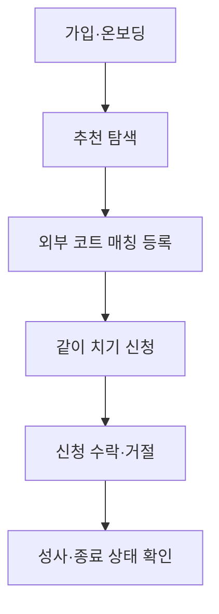
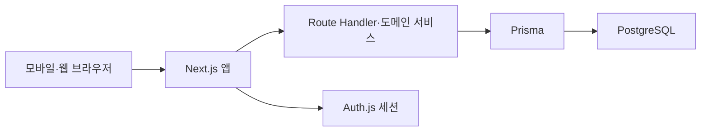

# Tennis Mate 개발 계획

## 1. 문서 정보

| 항목 | 내용 |
| --- | --- |
| 문서명 | Tennis Mate Development Plan |
| 문서 상태 | Draft v0.2 |
| 구현 대상 | Core MVP |
| 기준 문서 | `01-product-overview.md` ~ `05-api-spec.md` |
| 작성 시점 | M1 프로젝트 기반 구성 후 |
| 다음 단계 | 로컬 PostgreSQL 연결 확인 후 M2 인증·온보딩 구현 |

이 문서는 Tennis Mate Core MVP를 개인 개발자가 작은 단위로 구현하고 매 단계에서 직접 검증할 수 있도록 작업 순서, 의존성, 완료 기준과 테스트 전략을 정의한다.

Court Partner Pilot과 Court Commerce는 확장 로드맵으로만 다룬다. 별도 승인 전에는 해당 데이터 모델, 화면, API와 의존성을 Core MVP 코드에 추가하지 않는다.

## 2. 개발 목표

첫 번째 개발 완료 상태는 다음 한 문장으로 판단한다.

> 테니스 초보자 두 명이 각자 가입하고 프로필을 만든 뒤, 한 명이 외부 예약 코트 매칭을 등록하고 다른 한 명이 신청하여 모집자가 수락하고 결과를 확인할 수 있다.

기능 개수보다 아래 흐름의 완결성과 신뢰성을 우선한다.



## 3. 계획 원칙

### 3.1 수직 기능 단위로 완성한다

DB 테이블 전체, API 전체, 화면 전체를 각각 먼저 만들지 않는다. 하나의 사용자 행동에 필요한 DB·서버·화면·테스트를 함께 완성한다.

예를 들어 `같이 치기 신청` 단계에서는 다음을 하나의 작업 단위로 다룬다.

- MatchApplication 모델과 마이그레이션
- 신청 생성 도메인 규칙
- `POST /api/v1/matches/{matchId}/applications`
- 신청 바텀시트와 성공·오류 상태
- 중복 신청과 모집 마감 동시성 테스트

### 3.2 Core와 후속 단계를 물리적으로 분리한다

- Core 마이그레이션에 CourtOperator, CourtSlot, CourtBooking, Payment를 만들지 않는다.
- Core 화면에 비활성 운영자 메뉴를 노출하지 않는다.
- `PARTNER_COURT` 값이 코드에 있더라도 Core 생성 API는 받지 않는다.
- 앱 밖 비용 정산을 앱 결제로 보이게 하는 UI나 상태를 만들지 않는다.

### 3.3 데이터 규칙은 서버 한 곳에서 관리한다

다음 파생값과 상태 규칙을 화면별로 다시 구현하지 않는다.

- 예상 총 참여 인원
- 예상 1인 비용
- 초보자 환영 배지
- 수락 인원과 남은 자리
- 신청 가능 여부와 차단 사유
- 추천 이유
- Match와 MatchApplication 상태 전이

### 3.4 정책이 확정되지 않으면 확장 가능한 최소 형태로 멈춘다

미확정 정책을 추측해 완성하지 않는다. 구현을 막는 결정은 M0 결정 게이트에서 확정하고 관련 PRD·화면·ERD·API를 먼저 갱신한다.

### 3.5 모바일 실제 사용 흐름을 먼저 검증한다

데스크톱 레이아웃 완성보다 모바일에서 가입부터 수락까지 끊김 없이 진행되는지를 먼저 확인한다.

## 4. 기술 구성 권장안

M1 초기화 시점에 공식 호환성을 확인하고 승인한 구성이다. 정확한 패키지 버전은 `package-lock.json`을 기준으로 한다.

| 영역 | 권장안 | 선택 이유 | 확정 상태 |
| --- | --- | --- | --- |
| 웹 프레임워크 | Next.js 16 App Router | 화면과 Route Handler를 한 프로젝트에서 관리 | 확정 |
| 언어 | TypeScript strict | API·도메인 상태의 타입 오류를 조기에 발견 | 확정 |
| UI | React 19 + Tailwind CSS 4 | 모바일 화면을 빠르게 구현 | 확정 |
| DB | 로컬 PostgreSQL 17 | 초기 비용 없이 표준 PostgreSQL로 개발 | 확정 |
| ORM | Prisma ORM 7 + `@prisma/adapter-pg` | 공급자 종속 없이 스키마·마이그레이션 관리 | 확정 |
| 인증 | Auth.js v5 후보 + 카카오 로그인 한 종류 | App Router 최신 경로를 M2에서 통합 검증 | 공급자 확정·설치 보류 |
| 배포 | Vercel | Next.js 배포 흐름 단순화 | 비공개 MVP 시 생성 |
| 운영 DB | Neon Free 우선 검토 | 무료 검증 후 필요할 때 Launch로 전환 | 리소스 생성 안 함 |
| 단위·통합 테스트 | Vitest 4 | TypeScript 도메인 규칙과 Route Handler 검증 | 확정 |
| E2E 테스트 | Playwright | 모바일 핵심 흐름 브라우저 검증 | M8 설치 |

정확한 버전과 패키지는 초기화 당일 공식 호환성을 확인한 뒤 고정한다. 최신이라는 이유만으로 추가 프레임워크, 상태 관리 라이브러리 또는 UI 라이브러리를 도입하지 않는다.

### 4.1 권장 런타임 구조

초기에는 하나의 Next.js 애플리케이션과 하나의 PostgreSQL 데이터베이스로 구성한다.



- 별도 백엔드 서버와 마이크로서비스를 만들지 않는다.
- Redis, 메시지 큐와 검색 엔진은 Core MVP에 추가하지 않는다.
- 자동 상태 전환은 배포 환경에서 지원하는 단순 예약 실행 또는 요청 시 보정 중 하나로 시작한다.
- 외부 지도 API는 Core MVP에 포함하지 않고 주소 표시·복사로 충분히 검증한다.

## 5. 프로젝트 구조 권장안

프로젝트 초기화 후 다음 구조를 기준으로 시작한다. 실제 도구가 생성하는 파일에 맞춰 조정하며, 빈 폴더를 미리 모두 만들지 않는다.

```text
src/
  app/
    (auth)/
    (onboarding)/
    (main)/
    api/v1/
  components/
    ui/
  features/
    profile/
    matches/
    applications/
  server/
    auth/
    db/
    domain/
  lib/
prisma/
  schema.prisma
  migrations/
  seed.ts
tests/
  integration/
  e2e/
docs/
```

### 5.1 책임 경계

| 위치 | 책임 |
| --- | --- |
| `app/` | 라우팅, 페이지 조합, Route Handler 진입점 |
| `components/ui/` | 제품 도메인에 종속되지 않는 작은 UI |
| `features/` | 화면·폼·스키마·표시 로직을 기능별로 배치 |
| `server/auth/` | 세션 조회와 인증·계정 상태 확인 |
| `server/db/` | Prisma client와 DB 연결 |
| `server/domain/` | 추천, 신청 가능 여부, 상태 전이와 트랜잭션 |
| `prisma/` | 스키마, 마이그레이션과 지역 seed |
| `tests/` | 여러 기능을 통과하는 통합·E2E 시나리오 |

범용 Repository 계층, 이벤트 버스와 복잡한 Clean Architecture 골격은 실제 중복이 확인되기 전 만들지 않는다. Route Handler에 비즈니스 규칙을 직접 흩어놓는 것도 피하고, 중요한 규칙은 작은 도메인 함수 또는 서비스로 모은다.

## 6. M0 — 확정 결과

Core MVP 구현 기준은 다음과 같이 승인되었다.

| ID | 결정 | 확정 내용 |
| --- | --- | --- |
| D-01 | 첫 소셜 로그인 | 카카오 한 종류 |
| D-02 | 닉네임 생성 | 소셜 표시명을 기본 제안하고 최초 진입에서 확인·수정 |
| D-03 | 매칭 후 연락 | 매칭별 카카오 오픈채팅 링크를 모집자와 수락자에게만 공개 |
| D-04 | 매칭 완료 | endsAt 이후 완료 후보로 표시하고 모집자가 확인 |
| D-05 | 예상 비용 | 모집자 포함 예상 인원 기준 1원 단위 올림, 수정 불가 |
| D-06 | 비로그인 탐색 | 서비스 소개만 허용, 목록·상세 불가 |
| D-07 | 조기 마감 | 한 명 이상 수락 후 모집자가 마감 가능 |
| D-08 | 수락 후 참가 취소 | Core 화면·API 미제공, 비공개 테스트에서 운영 문의 |
| D-09 | 매칭 생성 재시도 | 모집자별 `clientRequestId`로 멱등성 보장 |
| D-10 | 플레이 상태 이름 | 분류 규칙 확정 전 숨김 |
| D-11 | 신고·차단 | 비공개 MVP 운영 문의, 공개 출시 전 최소 기능 재검토 |

M0 제품 정책과 기술 구성 승인은 완료되었다.

## 7. 마일스톤 개요

| 마일스톤 | 시연 가능한 결과 | 주요 의존성 |
| --- | --- | --- |
| M0 | Core 제품 정책 승인 | 없음 |
| M1 | 앱 실행, DB 연결, 자동 검증 실행 | 기술 구성 |
| M2 | 로그인 후 온보딩 완료 | 인증·닉네임 정책 |
| M3 | 추천 목록과 상세 확인 | 프로필·지역·Match 조회 |
| M4 | 외부 예약 코트 매칭 등록 | Match 쓰기 규칙 |
| M5 | 다른 사용자가 같이 치기 신청 | Application 생성 |
| M6 | 모집자가 신청을 수락·거절 | 정원 동시성 |
| M7 | 양쪽 활동 목록과 취소·종료 확인 | 상태 전이 정책 |
| M8 | 모바일 E2E·보안·배포 점검 | 전체 Core 흐름 |
| M9 | 제한된 사용자 테스트 | 배포·운영 준비 |

예상 기간은 개발자의 가용 시간과 익숙한 기술에 따라 달라지므로 고정 출시일로 사용하지 않는다. 각 마일스톤은 다음 단계로 넘어가기 전에 독립적으로 시연 가능해야 한다.

## 8. M1 — 프로젝트 기반 구성

### 8.0 구현 상태

M1 코드 구성은 완료되었다. Next.js 앱, Prisma 7 표준 PostgreSQL 연결,
환경 변수 검증, 헬스 API, Vitest, CI와 첫 `README.md`를 생성했다.

현재 작업 환경에는 Docker와 PostgreSQL 실행 파일이 없어 실제 DB 연결과
마이그레이션 적용은 실행하지 못했다. 제품 테이블이 없는 빈 마이그레이션은
만들지 않으며, 사용자의 로컬 Docker 연결 확인 후 M2 첫 모델과 함께 최초
마이그레이션을 생성한다.

### 8.1 구현 범위

- 합의된 Next.js·TypeScript 프로젝트 초기화
- TypeScript strict 설정
- 코드 포맷·린트 구성
- 환경 변수 예제 파일
- PostgreSQL 개발 DB 연결
- Prisma 초기 설정
- 테스트 러너와 최소 smoke test
- CI에서 lint, typecheck, test, build 실행
- 기본 모바일 레이아웃과 오류 경계

### 8.2 환경 변수 후보

실제 이름은 인증·DB 공급자 확정 후 README에 기록한다.

```text
DATABASE_URL
AUTH_SECRET
AUTH_PROVIDER_CLIENT_ID
AUTH_PROVIDER_CLIENT_SECRET
APP_BASE_URL
```

실제 비밀값은 저장소에 넣지 않는다. `.env.example`에는 설명용 빈 값만 둔다.

### 8.3 완료 기준

- 새 환경에서 문서화된 명령으로 개발 서버가 실행된다.
- DB 연결과 첫 migration이 성공한다.
- 기본 페이지와 health 확인 경로가 동작한다.
- lint, typecheck, test와 production build 명령이 실제로 존재하고 통과한다.
- 실패한 환경 변수는 시작 시 이해 가능한 오류로 안내된다.

### 8.4 산출물

- 초기화된 프로젝트
- `package.json`과 lockfile
- Prisma 기본 구성
- CI 설정
- 실제 실행 방법을 담은 첫 `README.md`
- 프로젝트에 맞게 갱신된 `AGENTS.md` 검증 명령

README는 이 마일스톤에서 실제 명령을 확인한 뒤 작성한다. 문서 설계 단계에서 추정 명령을 미리 기록하지 않는다.

## 9. M2 — 인증과 테니스 프로필

### 9.1 데이터

- User
- AuthAccount와 Auth.js가 요구하는 인증 테이블
- Region과 초기 시·구 seed
- TennisProfile
- TennisProfileRegion
- TennisProfilePurpose

### 9.2 서버

- 인증 세션에서 현재 User 식별
- 활성 계정과 온보딩 완료 여부 확인
- `GET /api/v1/me`
- `PATCH /api/v1/me`
- `GET /api/v1/regions`
- `PUT /api/v1/me/tennis-profile`
- Profile·Region·Purpose를 하나의 트랜잭션으로 저장
- 프로필 version 충돌 처리

### 9.3 화면

- S01 로그인·회원가입
- 카카오 표시명을 기본값으로 사용한 닉네임 확인
- S02 다섯 단계 온보딩
- 프로필 결과
- O06 테니스 프로필 수정
- 인증 중·실패·세션 만료 상태
- 보호된 화면 직접 진입 시 로그인·온보딩 완료 후 원래 경로로 복귀

온보딩 시작 전에 짧은 닉네임 확인 단계를 제공하며 테니스 질문 다섯 개 자체는 유지한다. 플레이 상태 이름은 분류 규칙 확정 전 표시하지 않는다.

### 9.4 테스트

- 비로그인 `/me` 요청
- 비로그인 보호 경로 → `/login?returnTo=...` → 로그인·온보딩 후 원래 경로 복귀
- 외부 URL·`//`·인코딩 우회 `returnTo` 차단
- 신규 로그인 후 온보딩 이동
- 활성·비활성 Region 선택
- 주 활동 지역 없음·비활성 지역
- 플레이 목적 0개·3개·중복
- 프로필 저장 실패 후 입력 유지
- 오래된 version으로 프로필 수정
- 인증정보가 프로필 응답에 포함되지 않는지 확인

### 9.5 완료 기준

- 신규 사용자가 로그인 후 프로필 결과까지 완료한다.
- 새로고침과 재로그인 후에도 프로필이 유지된다.
- 온보딩 미완료 사용자는 등록·신청 화면으로 갈 수 없다.
- 비로그인 사용자는 보호된 화면에서 재시도 오류가 아니라 로그인 흐름을 보며, 로그인 후 원래 화면으로 안전하게 복귀한다.
- 모바일에서 30~45초 목표를 실제 사용자 3명 이상으로 측정할 준비가 된다.

## 10. M3 — 추천 매칭과 상세

### 10.0 구현 상태

- Match·MatchPurpose·MatchApplication 읽기 모델, 추천·목록·상세 조회 API와 홈·상세 조회 UI를 구현했다.
- 추천은 문서의 고정 가중치와 `startsAt ASC`, `id ASC` 동점 정렬을 사용한다.
- 화면 명세의 P0 범위를 따라 탐색 필터는 이번 단계에서 제외했다. 지역·날짜·플레이 필터는 P1에서 별도 구현한다.

### 10.1 데이터·서버

- Match와 MatchPurpose 읽기 모델
- Match 테스트 seed
- 추천 후보 필터와 규칙 기반 점수
- 추천 이유 생성 함수
- 신청 가능 여부와 파생값 계산 함수
- `GET /api/v1/matches/recommended`
- `GET /api/v1/matches`
- `GET /api/v1/matches/{matchId}`

### 10.2 화면

- S03 홈·추천 매칭
- MatchCard
- 탐색 필터
- S04 매칭 상세의 조회 부분
- 로딩 skeleton, 빈 추천, 빈 목록, 오류와 재시도

### 10.3 구현 규칙

- 추천 점수를 DB에 저장하지 않는다.
- 내부 숫자 점수를 UI에 노출하지 않는다.
- 직접 예약 코트에는 서비스 확인 표현을 사용하지 않는다.
- 예상 비용, 초보자 환영과 남은 자리는 서버 공통 함수에서 계산한다.
- 지도 연동 없이 주소 표시와 복사를 제공한다.

### 10.4 테스트

- 랠리 수준 동일·인접·두 단계 차이
- 플레이 목적·지역·게임 경험 일치 여부
- 본인 Match와 이미 신청한 Match 추천 제외
- OPEN이 아닌 Match와 과거 Match 제외
- 동점 정렬의 안정성
- 추천 이유가 없을 때 영역 숨김
- 직접 예약 코트 문구와 예상 비용 계산

### 10.5 완료 기준

- 로그인한 사용자가 추천 3~5개 또는 적절한 Empty State를 본다.
- 카드에서 일정, 코트 출처, 비용과 남은 자리를 이해할 수 있다.
- 상세 화면에서 신청 가능 여부와 차단 이유가 정확하다.

## 11. M4 — 외부 예약 코트 매칭 등록

### 11.0 구현 상태

- 외부 예약 코트만 허용하는 매칭 생성 API와 모집자 매칭 목록 API를 구현했다.
- 코트 확보 게이트와 4단계 모바일 등록 화면을 구현했다.
- `clientRequestId` 재시도, 서버 파생 비용, 카카오 오픈채팅 URL 검증을 적용했다.

### 11.1 데이터·서버

- Match·MatchPurpose 쓰기 migration
- Match CHECK와 인덱스
- `POST /api/v1/matches`
- `GET /api/v1/me/hosted-matches`
- `clientRequestId`와 모집자 복합 유일성 추가

### 11.2 화면

- S05 코트 확보 게이트
- 일정·코트 입력
- 플레이·모집 조건 입력
- 비용·안내 입력
- 수락자 전용 카카오 오픈채팅 링크 입력
- 실제 상세 순서의 미리보기
- 등록 성공과 내가 만든 매칭 이동

### 11.3 구현 규칙

- Core 생성은 `EXTERNAL_RESERVED`만 허용한다.
- 예상 1인 비용과 초보자 환영 여부를 요청값으로 받지 않는다.
- 예상 1인 비용은 모집자 포함 예상 인원으로 나누고 1원 단위 올림하며 수정할 수 없다.
- 카카오 오픈채팅 URL은 Match에 저장하되 모집자와 ACCEPTED 신청자에게만 반환한다.
- 예약번호, 예약 확인 이미지와 예약자 연락처를 받지 않는다.
- 단계 이동 시 입력을 보존하지만 Core에서 서버 임시저장은 만들지 않는다.

### 11.4 테스트

- 과거 시작 시각과 잘못된 이용 시간
- 없는 Region
- 코트명·주소 누락
- 모집 인원 0명
- 플레이 목적 0개·3개
- 음수 비용과 무료 코트
- `PARTNER_COURT` 생성 시도
- 중복 클릭·네트워크 실패 후 입력 보존

### 11.5 완료 기준

- 외부에서 코트를 예약한 사용자가 모바일에서 매칭을 등록한다.
- 등록 직후 상세와 내가 만든 매칭에 같은 값이 표시된다.
- 앱 내 결제를 암시하는 표현이 없다.

## 12. M5 — 같이 치기 신청

### 12.1 데이터·서버

- MatchApplication
- profileSnapshot schema version 1
- `(matchId, applicantUserId)` 유일 제약
- `POST /api/v1/matches/{matchId}/applications`
- `GET /api/v1/me/applications`

### 12.2 화면

- O01 신청 바텀시트
- 프로필·일정·비용 재확인
- 선택 메시지 입력
- 신청 성공
- S07 보낸 신청 목록과 상태

### 12.3 동시성 규칙

- 서버가 Match의 OPEN, 미래 일정, 남은 자리와 본인 여부를 다시 확인한다.
- DB 유일 제약 위반을 `APPLICATION_ALREADY_EXISTS`로 변환한다.
- 마지막 자리가 이미 수락된 경우 신청을 받지 않는다.
- 네트워크 재시도 시 새 Application이 중복 생성되지 않는다.

### 12.4 테스트

- 정상 신청과 메시지 없는 신청
- 본인 Match 신청
- 동일 사용자의 동시 중복 신청
- CLOSED·COMPLETED·EXPIRED·CANCELLED 신청
- 신청과 Match 마감의 동시 실행
- 신청 뒤 프로필을 수정해도 snapshot 유지
- 스냅샷에 닉네임·연락처·인증정보가 없는지 확인

### 12.5 완료 기준

- 사용자가 상세에서 짧은 확인만 거쳐 신청한다.
- 성공 후 보낸 신청에서 `검토 중` 상태를 확인한다.
- 실패 시 메시지와 화면 입력을 잃지 않는다.

## 13. M6 — 신청 수락과 거절

### 13.1 서버

- `GET /api/v1/matches/{matchId}/applications`
- `POST /api/v1/applications/{applicationId}/accept`
- `POST /api/v1/applications/{applicationId}/reject`
- 모집자 권한 확인
- Match row 잠금 또는 원자적 version 갱신
- 정원 충족 시 Match CLOSED 전환

### 13.2 화면

- S06 받은 신청
- 신청자 profileSnapshot 상세
- 수락·거절 확인 다이얼로그
- 대기·수락 인원과 남은 자리 갱신
- 동시 상태 변경 충돌 안내

### 13.3 테스트

- 모집자만 신청 목록 조회
- PENDING 신청 수락·거절
- 이미 결정된 신청 재처리
- 동시에 마지막 자리를 수락하는 두 요청
- 수락과 철회 동시 실행
- Match 취소와 수락 동시 실행
- 정원 충족 시 Match CLOSED와 추가 수락 차단
- 정원 충족 시 남은 PENDING 신청 CANCELLED 전환

### 13.4 완료 기준

- 모집자가 신청 당시 프로필을 보고 수락 또는 거절한다.
- 동시에 마지막 자리를 수락해도 한 요청만 성공한다.
- 신청자는 새로고침 후 변경된 결과를 확인한다.
- 거절 문구가 실력을 평가하거나 비난하는 표현이 아니다.

## 14. M7 — 활동·취소·종료 상태

### 14.1 구현 범위

- 내가 만든 매칭 상태별 목록
- 보낸 신청 상태별 목록
- `POST /api/v1/applications/{applicationId}/withdraw`
- `POST /api/v1/matches/{matchId}/cancel`
- `POST /api/v1/matches/{matchId}/close`
- `POST /api/v1/matches/{matchId}/complete`
- OPEN Match의 시작 시각 기반 CLOSED 또는 EXPIRED 보정
- EXPIRED 시 PENDING Application CANCELLED 전환
- 한 명 이상 수락된 Match의 조기 마감과 PENDING 신청 취소
- endsAt 이후 모집자의 완료 확인
- 수락 후 참가 취소는 화면·API 없이 운영 문의 안내

### 14.2 자동 상태 전환 권장 구현

초기 권장안은 다음 두 안전장치를 함께 사용하는 것이다.

1. 관련 Match를 조회하거나 변경할 때 현재 시각 기준 상태를 트랜잭션 안에서 보정한다.
2. 배포 환경에서 짧은 주기의 예약 작업을 실행해 오래 조회되지 않은 Match도 보정한다.

예약 작업만 의존하면 실행 지연 중 잘못된 신청이 들어올 수 있고, 요청 시 보정만 사용하면 다시 조회되지 않은 Match가 오래 OPEN으로 남을 수 있다. 두 경로는 같은 멱등 도메인 함수를 호출한다.

### 14.3 테스트

- PENDING 신청 철회와 재신청 차단
- Match 취소 시 PENDING·ACCEPTED Application 취소
- 외부 코트는 자동 취소되지 않는다는 안내
- 시작 시 수락자 0명인 Match EXPIRED
- 시작 시 수락자 1명 이상인 Match CLOSED
- 같은 `clientRequestId` 동시 재시도는 하나의 Match만 만들고 기존 Match를 반환
- 시작 시각 도달 뒤 신청 거절 요청은 `CANCELLED` 상태를 보존
- 자동 보정 작업 중복 실행
- 완료 정책에 따른 허용·차단 조건
- 취소·종료 이력의 사용자 문구 구분
- 수락 전 오픈채팅 링크 비공개와 수락 후 공개

### 14.4 완료 기준

- 모집자와 신청자가 같은 사건을 서로 모순되지 않는 상태로 본다.
- 성사 없이 종료와 모집자 취소가 다른 문구로 표시된다.
- Match와 연결 Application 상태가 한 트랜잭션으로 전환된다.
- 외부 코트 취소 책임이 명확하게 안내된다.

## 15. M8 — 품질·보안·배포 준비

### 15.1 전체 E2E 시나리오

최소 두 개의 독립 계정으로 다음 흐름을 자동 또는 수동 검증한다.

1. 사용자 A 가입·온보딩
2. 사용자 B 가입·온보딩
3. 사용자 A가 외부 예약 코트 Match 등록
4. 사용자 B가 추천 또는 목록에서 Match 발견
5. 사용자 B가 같이 치기 신청
6. 사용자 A가 신청자 프로필 확인
7. 사용자 A가 신청 수락
8. 사용자 B가 수락 상태 확인
9. Match 취소 또는 일정 종료 상태 확인

### 15.2 접근성

- 키보드로 주요 흐름 사용
- focus 표시와 다이얼로그 focus 관리
- 입력 label과 오류 연결
- 상태를 색상만으로 구분하지 않음
- 모바일 터치 영역 확보
- 화면 확대와 긴 한국어 문구 확인

### 15.3 보안

- 모든 쓰기 API의 서버 세션·권한 검증
- CSRF 방어가 적용된 인증 구성
- 입력 길이·enum·UUID 검증
- 개인정보와 인증정보 로그 제외
- `.env`와 비밀값 저장소 분리
- 다른 사용자의 Application·Match 관리 접근 차단
- 기본 요청 제한과 과도한 목록 크기 차단

현재 `/api/v1`은 인증된 계정별 60초 120회 제한을 운영 DB의 최근 요청 창 하나로 적용한다. 인스턴스별 메모리 제한에 의존하지 않으며, 공개 출시 전에는 로그인·인증 공급자 경로를 포함하는 플랫폼 경계의 추가 제한도 검토한다.

### 15.4 운영 준비

- 개발·Preview·Production 환경 분리
- DB migration 적용 절차
- 최소 백업·복구 확인
- 서버 오류 requestId와 안전한 로그
- 빈 DB에서 Region seed 실행
- 배포 후 smoke test
- 이용약관·개인정보 처리 안내 경로

`/terms`와 `/privacy`는 로그인 전에도 제공한다. 비공개 MVP 안내에 남긴 운영 주체·문의 채널·보관 및 파기 정책은 정식 공개 전 확정해야 한다.

### 15.5 완료 기준

- lint, typecheck, 단위·통합 테스트와 production build가 통과한다.
- 모바일 viewport E2E 핵심 흐름이 통과한다.
- 권한·동시성·개인정보 테스트가 통과한다.
- Preview 환경에서 두 계정으로 전체 흐름을 시연한다.
- 알려진 제한과 미완료 정책이 문서화된다.

## 16. M9 — 제한된 사용자 테스트

### 16.1 목적

기능을 더 추가하기 전에 핵심 가설을 검증한다.

> 초보자가 상대방의 수준을 쉽게 이해하면 처음 보는 사람에게 같이 치기를 신청하는가?

### 16.2 권장 테스트 범위

- 테니스 입문자 5~10명
- 실제 또는 운영자가 준비한 외부 예약 코트 Match
- 1~2주 내의 짧은 관찰 기간
- 가입·온보딩·상세 확인·신청·수락 퍼널 기록
- 신청하지 않은 이유를 짧게 인터뷰

### 16.3 우선 관찰 항목

| 관찰 | 확인할 문제 |
| --- | --- |
| 온보딩 이탈 | 질문 수·용어·지역 선택 부담 |
| 추천 상세 진입 | 카드 정보가 충분히 안심을 주는지 |
| 신청 바텀시트 이탈 | 비용·상대·연락 불확실성 |
| 신청 후 대기 이탈 | 응답 시간과 상태 설명 부족 |
| 모집자의 거절·미처리 | 신청자 정보 부족 또는 관리 부담 |
| 실제 약속 실패 | 연락·취소·코트 정보 정책 부족 |

### 16.4 다음 단계 판단

Court Partner Pilot은 Core MVP 다음의 필수 구현 단계다. M9에서는 Pilot을 시작할지 여부가 아니라, 초보자가 어느 예약 단계에서 어려움을 겪는지와 Pilot 화면·운영 방식을 어떻게 개선할지를 관찰한다.

- 사용자가 직접 코트 예약에서 막히는 단계와 설명이 필요한 지점을 기록한다.
- 외부 예약 Match의 신청·수락 결과를 제휴 코트 예약 화면의 우선순위 판단에 활용한다.
- 코트 운영자가 유휴 시간대를 공급하려 할 때 필요한 운영 도구와 수동 처리 범위를 확인한다.
- 예약 승인 업무를 수동 운영으로 먼저 검증할 수 있는지 확인한다.

실제 운영 절차, 참여자 안내문, 퍼널 기록 양식과 중단 기준은 `docs/07-m9-limited-user-test.md`를 따른다. 이 문서는 참여자 개인정보나 실제 운영 문의 채널을 저장하지 않는다.

## 17. 테스트 전략

### 17.1 테스트 피라미드

| 층 | 대상 | 예시 |
| --- | --- | --- |
| 도메인 단위 테스트 | 순수 규칙 | 추천 점수, 예상 비용, 상태 전이, 신청 차단 이유 |
| DB 통합 테스트 | 실제 PostgreSQL 제약·트랜잭션 | 중복 신청, 정원 초과, profileSnapshot |
| API 통합 테스트 | 인증·검증·응답 계약 | 401·403·404·409·422와 DTO |
| 컴포넌트 테스트 | 폼과 상태 표시 | 온보딩 선택, 오류 유지, CTA 상태 |
| E2E | 핵심 사용자 여정 | 두 계정 신청·수락·취소 |

모든 경우를 E2E로 만들지 않는다. 동시성, DB 제약과 상태 전이는 실제 PostgreSQL 통합 테스트에서 검증한다.

### 17.2 마이그레이션 검증

- 빈 DB에 전체 migration 적용
- 기존 migration을 수정하지 않고 새 migration 추가
- Region seed 재실행 가능성
- Prisma 밖 SQL 제약의 실제 동작
- 테스트 DB와 운영 후보 DB의 PostgreSQL 기능 호환성

### 17.3 고정 테스트 데이터

최소 다음 fixture를 유지한다.

- 온보딩 전 User
- 서로 다른 랠리 수준·지역·목적의 User 3명 이상
- OPEN·CLOSED·COMPLETED·EXPIRED·CANCELLED Match
- 자리가 1개 남은 Match
- PENDING·ACCEPTED·REJECTED·WITHDRAWN·CANCELLED Application
- 무료 Match와 추가 비용이 있는 Match

## 18. CI와 변경 검증

프로젝트 초기화 후 실제 명령을 확정하며, 최소 파이프라인 순서는 다음과 같다.

1. 의존성 고정 설치
2. Prisma schema 검증과 client 생성
3. lint
4. TypeScript typecheck
5. 단위 테스트
6. PostgreSQL 통합 테스트
7. production build
8. 핵심 E2E—실행 비용에 따라 PR 또는 배포 전 단계 선택

변경 범위별 최소 확인:

| 변경 | 필수 확인 |
| --- | --- |
| UI 문구·레이아웃 | lint, typecheck, 관련 컴포넌트·모바일 확인 |
| API·도메인 규칙 | 단위·API·DB 통합 테스트 |
| Prisma schema·migration | 빈 DB 적용, 통합 테스트, rollback 계획 검토 |
| 인증·권한 | 비로그인·다른 사용자·정지 계정 테스트 |
| 상태 전이 | 정상·중복·경쟁 요청 테스트 |
| 배포 설정 | production build와 Preview smoke test |

## 19. 관측성과 오류 대응

Core MVP에서는 복잡한 관측 플랫폼보다 문제 재현에 필요한 최소 정보를 남긴다.

- 요청마다 `requestId` 생성 또는 전달
- 서버 오류에 사용자 ID 원문 대신 내부 식별자 최소 사용
- Route, 오류 코드, 상태 전이 결과와 처리 시간 기록
- 토큰, 세션, 신청 메시지, 연락처와 인증 공급자 응답 원문 로그 금지
- 예측 가능한 비즈니스 충돌은 오류 로그가 아니라 구조화된 상태로 분류
- 자동 상태 전환의 처리 건수와 실패 건수 기록

운영 PostgreSQL 연결 문자열에 `sslmode=require`, `prefer`, `verify-ca`가 있으면 애플리케이션은 현재 보안 의미를 명시하는 `sslmode=verify-full`로 정규화한다. 로컬 SSL 미사용 연결 문자열은 변경하지 않는다.

외부 오류 추적 서비스를 도입하려면 비용, 개인정보 전송과 운영 필요성을 먼저 검토한다.

## 20. 데이터와 배포 변경 원칙

### 20.1 Migration

- migration은 한 가지 목적만 가진다.
- 적용된 migration 파일을 수정하지 않는다.
- enum 이름 변경과 삭제는 데이터 이전 계획 없이 진행하지 않는다.
- 부분 인덱스와 CHECK는 migration SQL과 테스트를 함께 추가한다.
- 운영 데이터가 생긴 뒤 필수 컬럼을 추가할 때는 nullable 추가, backfill, 제약 강화 순서를 검토한다.

### 20.2 배포

- 기능과 DB 변경의 호환 순서를 확인한다.
- migration 실패 시 애플리케이션이 부분 배포되지 않도록 절차를 정한다.
- Preview에서 migration을 운영 DB에 적용하지 않는다.
- 배포 후 로그인, 추천 목록, 상세와 health를 smoke test한다.
- 큰 기능은 필요한 경우 비공개 경로나 단순 feature flag로 제한하되 별도 플랫폼은 도입하지 않는다.

## 21. 문서 동기화 규칙

| 변경 유형 | 함께 검토할 문서 |
| --- | --- |
| 제품 범위·정책 | `01-product-overview.md`, `02-prd.md` |
| 화면·문구·상태 표시 | `03-screen-spec.md` |
| 제휴 코트 화면 | `03-1-court-partner-screen-spec.md` |
| 필드·관계·enum·제약 | `04-erd.md` |
| 요청·응답·오류 코드 | `05-api-spec.md` |
| 순서·완료 기준·테스트 | `06-development-plan.md` |
| 실제 설치·실행·배포 명령 | `README.md` |
| 반복 작업 규칙 | `AGENTS.md` |

정책 변경은 코드만 고치지 않는다. 가장 가까운 기준 문서를 먼저 수정하고 영향을 받는 하위 계약과 테스트를 갱신한다.

## 22. Core MVP 제외 체크리스트

각 마일스톤 시작 전에 다음 기능이 실수로 포함되지 않았는지 확인한다.

- 실시간 채팅
- 영상 업로드와 AI 분석
- NTRP 자동 계산
- 클럽·커뮤니티·대회·랭킹
- 복잡한 AI 추천
- 코트 운영자 입점과 권한
- 제휴 코트 시간대·예약 승인
- 앱 결제·환불·정산
- 참가자별 분할 결제
- 지도 API—별도 승인 전
- 범용 알림 시스템—핵심 흐름에 필요성이 확정되기 전

## 23. Court Partner Pilot 로드맵

Court Partner Pilot은 Core MVP 다음의 필수 구현 단계다. M9 사용자 테스트는 이 단계를 대체하거나 시작을 막지 않으며, Pilot의 UX와 운영 절차를 개선하는 근거로만 사용한다.

### 23.1 Pilot 순서

1. OP01·OP02와 검토 상태 화면을 Figma에서 먼저 설계하고 모바일 검토
2. 운영자 자율 신청, 검증 상태·감사 이력·내부 검토 권한 데이터 모델 설계
3. 사업자·주소·장소 확인 어댑터와 전용 속도 제한 설계 — 공급자 키·비용·개인정보 처리 승인 후 구현
4. 비공개 코트·시간대 초안과 `PUBLISH_APPROVED` 공개 게이트 구현
5. 불일치·중복 장소·지점·위탁·공공시설의 증빙 보완 및 내부 검토 흐름 구현
6. 재확인·공개 중지·확정 예약 안내 운영 절차 구현
7. Court·CourtUnit 관리
8. CourtSlot 등록과 겹침 방지
9. 사용자 예약 가능 Slot 조회
10. CourtBooking 요청
11. 운영자 승인·거절
12. CONFIRMED Booking 기반 Match 생성
13. 예약 취소와 Match 영향 정책 검증

### 23.2 Pilot 완료 기준

- 운영자가 자신의 코트와 시간대만 관리한다.
- 같은 CourtUnit에 활성 Slot이 겹치지 않는다.
- 같은 Slot의 활성 예약 요청 정책이 DB와 서버에서 일치한다.
- 코트 예약 승인과 참가 신청 수락이 별개로 동작한다.
- 확정된 제휴 코트에만 예약 확인 문구가 표시된다.
- 결제 없이 운영 가능한 수동 Pilot 흐름이 완결된다.

### 23.3 Commerce 진입 조건

다음이 확인되기 전 앱 결제를 구현하지 않는다.

- 유료 예약이 반복적으로 발생한다.
- 운영자 승인·취소 업무가 안정적으로 수행된다.
- 환불·우천·노쇼 책임 정책이 문서화된다.
- 결제 수수료와 정산 주체가 결정된다.
- 고객 문의와 분쟁 처리 책임을 감당할 운영 방식이 있다.

## 24. 마일스톤 공통 완료 정의

각 마일스톤은 다음 조건을 모두 만족해야 완료다.

- 해당 사용자 행동이 화면에서 DB까지 끝까지 동작한다.
- 관련 문서, enum, API와 화면 문구가 일치한다.
- 클라이언트와 서버 입력 검증이 적용된다.
- 권한 검증이 서버에 있다.
- 로딩, 빈 화면, 오류와 충돌 상태가 처리된다.
- 관련 단위·통합·E2E 테스트가 통과한다.
- 모바일 화면을 직접 확인한다.
- 범위 밖 기능이나 새 프로덕션 의존성이 추가되지 않았다.
- 미해결 위험과 실행하지 못한 검증을 기록한다.

## 25. 구현 시작 순서

다음 행동 순서를 권장한다.

1. M0 확정 정책이 관련 문서에 반영됐는지 확인
2. 기술 구성 승인
3. M1 프로젝트 초기화
4. 실제 명령으로 lint·typecheck·test·build 확인
5. `README.md`와 `AGENTS.md` 실행 명령 갱신
6. M2 카카오 인증·닉네임·온보딩 수직 기능 구현
7. 이후 마일스톤을 하나씩 시연하고 다음 단계 진행

현재는 문서 설계 단계이므로 존재하지 않는 프로젝트 명령이나 설치 방법을 README에 미리 작성하지 않는다.

## 26. 첫 구현 요청의 권장 범위

Codex에 전달할 첫 구현 요청은 다음 정도로 제한하는 것이 적절하다.

> `docs/`와 `AGENTS.md`를 기준으로 M1 프로젝트 기반 구성만 구현해 주세요. 합의된 기술 조합으로 프로젝트를 초기화하고, PostgreSQL·Prisma 연결, 환경 변수 검증, lint·typecheck·test·build 명령과 최소 CI를 구성하세요. 제품 기능은 아직 구현하지 말고 실제 검증 결과를 보고해 주세요.

이 요청이 끝난 뒤 실제 파일과 명령을 기준으로 README를 작성하고 M2를 시작한다.
