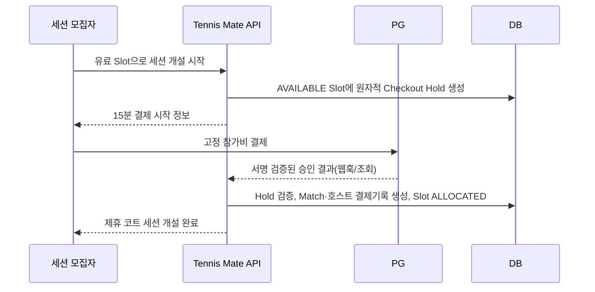
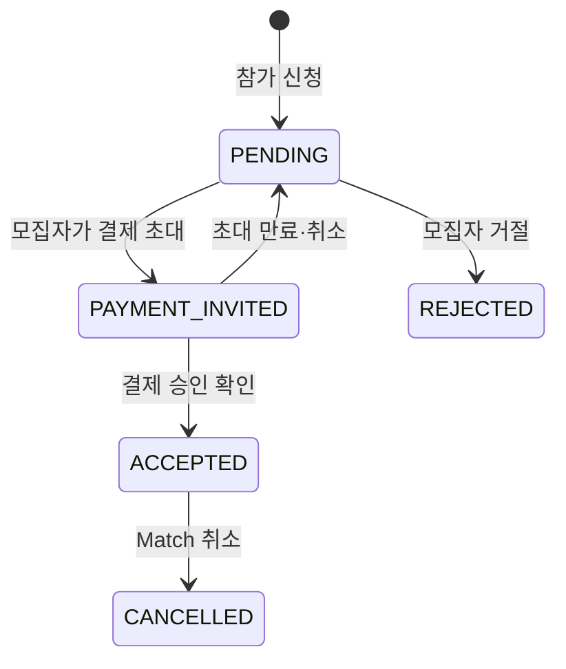
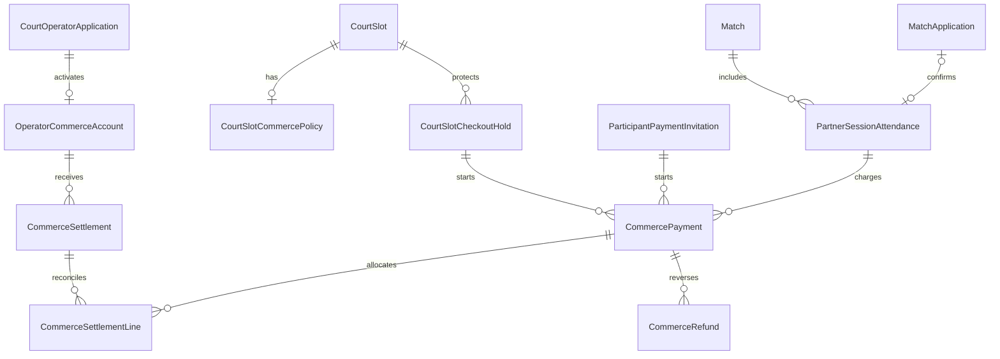

# Court Commerce 설계

## 1. 문서 정보

| 항목 | 내용 |
| --- | --- |
| 문서명 | Court Commerce 설계 |
| 상태 | 제품 설계 확정안 — 구현·PG 계약·법무/세무 검토 전 |
| 대상 | 승인된 제휴 코트 시간에 열린 `PARTNER_COURT` 세션의 참가비 결제·환불·운영자 정산 |
| 관련 문서 | `02-prd.md`, `03-1-court-partner-screen-spec.md`, `04-erd.md`, `05-api-spec.md`, `06-development-plan.md` |
| 구현 상태 | 미구현. 이 문서는 DB migration, PG 연동, 화면, 배포를 승인하지 않는다. |

이 문서는 Court Partner Pilot이 검증한 **운영자 시간 공급**과 **일반 모집자의 참가 승인**을 유지한 채, 유료 제휴 코트 세션을 안전하게 도입하기 위한 다음 단계의 설계다. 일반 사용자가 코트를 예약하거나 운영자가 참가자를 승인하는 제품으로 바꾸지 않는다.

## 2. 해결하려는 문제와 범위 판단

### 2.1 사용자 문제

- 참가자는 현장 계좌이체·개인 송금 없이 확정된 참가비와 환불 상태를 알고 싶다.
- 운영자는 현장에 상주하지 않아도 결제 확인, 수납, 정산을 신뢰할 수 있어야 한다.
- 세션 모집자는 참가 신청을 수락하는 역할은 유지하되, 타인의 결제 수단·정산 정보를 다루지 않아야 한다.
- Tennis Mate는 결제 완료·환불·코트 공급 철회를 서로 모순 없이 기록해야 한다.

### 2.2 MVP와 일정 영향

이는 Core MVP와 현 Court Partner Pilot의 필수 범위가 아닌 별도 Commerce 단계다. PG 심사·계약, 환불 정책, 고객 지원, 정산 대사, 개인정보·세무 검토가 추가되므로 Pilot과 같은 작은 수직 기능으로 바로 구현하지 않는다.

더 단순한 대안은 무료 세션 또는 운영자·참가자 사이의 앱 밖 납부를 유지하는 것이다. 이 대안은 빠르지만, 운영자가 현장에 없을 때 확인 부담·개인 송금 오류·분쟁 기록·5% 수수료 모델을 해결하지 못한다. 따라서 반복 유료 세션을 검증한 뒤에만 이 설계를 구현한다.

### 2.3 명시적 비범위

- 일반 사용자의 CourtBooking, 코트 예약 요청, 운영자의 참가 신청 수락
- 운영자가 자신의 PG 키·계좌번호·결제 URL을 직접 입력하거나 참가자에게 공개하는 기능
- Tennis Mate가 카드 정보나 계좌 정보를 저장하는 기능
- 범용 실시간 채팅, 개인 DM, 참가자별 협상 가격, 현장 결제 확인 UI. Match 전용 텍스트 채팅은 `08-in-app-match-chat-design.md`의 별도 단계로만 검토
- 앱 밖 납부를 앱 내 결제로 보이게 하는 문구
- PG 계약·사업자 심사·세무 신고를 앱 코드로 대체하는 기능

## 3. 역할과 결제 구조

### 3.1 역할 분리

| 주체 | 하는 일 | 하지 않는 일 |
| --- | --- | --- |
| 참가자 | 확정 전 결제 초대를 받고 정해진 참가비를 결제 | 코트를 별도 예약하거나 운영자에게 결제 승인 요청 |
| 세션 모집자 | 공개 Slot으로 세션을 열고 참가 신청을 검토·결제 초대 | 참가자 결제 정보·환불 수단·운영자 정산 확인 |
| 코트 운영자 | 코트 시간과 참가비를 공급하고 PG 입점·정산 상태를 유지 | 참가 신청 수락·거절, 카드 결제 확인 |
| Tennis Mate | 세션·결제 상태를 연결하고 PG 결과를 검증·표시 | 카드/계좌 원문 보관, 수기 송금 수납, 임의 정산 |
| PG/지급결제 제공자 | 결제 승인·취소·환불·정산 또는 하위가맹점 지급 | Match 참가자 승인 판단 |

권장 계약 구조는 **운영자가 PG의 판매자/하위가맹점으로 온보딩되고, Tennis Mate는 플랫폼 중개자로 PG의 마켓플레이스·분할정산 기능을 사용**하는 방식이다. 실제 계약상 판매자, 정산 주체, 세금계산서 및 환불 비용의 귀속은 선택한 PG의 계약서와 법무·세무 검토로 확정한다. 이 문서는 법률·세무 자문이 아니다.

### 3.2 활성화 전제

유료 Slot을 공개하려면 다음 모두가 필요하다.

1. 운영자 신청 상태가 `PUBLISH_APPROVED`이고 Court가 `ACTIVE`다.
2. 운영자의 Commerce 계정 상태가 `ACTIVE`다.
3. 운영자는 선택 PG의 사업자/정산 온보딩을 완료했다. 기존 사업자등록증은 Tennis Mate의 운영자 심사 증빙이며 PG 심사를 대체하지 않는다.
4. Slot에 고정 참가비와 환불 정책 버전이 저장되어 있다.
5. 지원 담당자, 공급 철회 환불 절차, PG 장애 안내가 운영 가능하다.

PG 온보딩에 필요한 정산 계좌 등 민감 정보는 PG의 전용 흐름에서만 수집한다. Tennis Mate DB에는 제공자가 발급한 최소 식별자와 상태만 보관한다.

## 4. 확정된 상업 정책

### 4.1 수수료와 프로모션

| 항목 | 정책 |
| --- | --- |
| 플랫폼 수수료 | 운영자 부담, 결제 승인 시점 기준 참가비 총액의 5% |
| PG 수수료 | 운영자 부담, PG가 실제 정산한 금액을 기록 |
| 참가자 가격 | 별도 플랫폼 수수료를 더하지 않은 고정 원화 금액. 결제 직전과 영수증에서 같은 금액을 보여 준다. |
| 무료 기간 | 해당 운영자의 **첫 성공 유료 세션 결제 승인 시각**부터 30일간 플랫폼 수수료 0% |
| 무료 기간 중 PG 수수료 | 면제하지 않음. 운영자 부담 |
| 기간 종료 | `firstPaidAt + 30일` 미만에 승인된 결제는 0%, 그 이후 승인분부터 5%. 가입일·신청 승인일·세션 시작일은 기준이 아니다. |
| 수수료 스냅샷 | 결제 생성이 아니라 PG 승인 시의 수수료율·금액을 불변 기록한다. 이후 정책 변경으로 과거 결제를 재계산하지 않는다. |

`firstPaidAt`은 해당 운영자의 첫 **성공 승인**에서 한 번만 설정하며, 그 결제가 이후 전액 환불되어도 초기화하지 않는다. 이는 무료 기간의 출발점을 가입·세션 시작·지급 완료처럼 변하기 쉬운 상태가 아니라 사용자가 정한 승인 시각으로 고정하기 위함이다.

원 단위 수수료 반올림, 부가세 포함 여부, PG의 취소 수수료·지급 보류 처리, 정산 주기는 PG 계약 및 세무 검토에서 확정해야 한다. 구현 전 권장안은 `floor(참가비 × 수수료율)`로 원 단위 절사하고, 참가자에게 별도 부과하지 않는 것이다.

### 4.2 가격 모델

`CourtSlot.priceKrw`와 기존 `estimatedFeePerPersonKrw`는 Pilot에서 코트 전체 비용을 알리는 참고값이다. Commerce에서 이 값을 결제 금액으로 재사용하면 모집 인원 변경에 따라 청구액이 흔들린다.

따라서 유료 Slot에는 별도의 불변 `participantPriceKrw`를 둔다. 운영자는 초안에서 참가자 1인 고정 금액을 설정하고, 공개 뒤에는 수정할 수 없다. 첫 Commerce 단계의 권장안은 다음과 같다.

- 세션 모집자도 참가자 1인으로 같은 고정 금액을 결제한다.
- 최소 인원, 남은 자리의 가격 재계산, 모집자의 손실 보전·보증금은 제공하지 않는다.
- 빈자리 위험과 코트 원가의 관계는 운영자가 고정 참가비를 정할 때 판단한다.
- 동일 Slot에 생성된 Match의 가격은 Slot Commerce 정책에서만 읽는다.

이 정책은 참가자에게 “언제·얼마를 내는가”를 단순하게 보이고, 모집자가 다른 사람의 금액을 보증하게 만들지 않는다. 최소 인원 또는 모집자 보증은 별도 제품·법무·환불 정책 없이는 추가하지 않는다.

## 5. 세션 개설과 결제 흐름

### 5.1 왜 결제 홀드가 필요한가

현 Pilot은 `AVAILABLE → ALLOCATED`와 Match 생성을 하나의 트랜잭션으로 처리한다. 여기에 외부 결제를 단순히 뒤에 붙이면 결제 취소·실패 때 Slot이 이미 `ALLOCATED`로 남는다. 반대로 먼저 결제하면 동시에 두 모집자가 같은 Slot을 결제하려 할 수 있다.

Commerce는 **임시 결제 홀드**로 이 간격을 분리한다. 홀드는 예약이 아니며 일반 사용자에게 운영자 예약 요청으로 보이지 않게 한다.

### 5.2 모집자 개설 흐름

1. 인증·온보딩 완료 모집자만 `AVAILABLE` 유료 Slot에 대해 홀드를 시작한다.
2. 서버는 짧은 트랜잭션으로 해당 Slot에 활성 홀드가 없는지 확인하고 생성한다. 기본 만료 시간은 **15분**이며 Slot별 변경은 제공하지 않는다.
3. PG 승인 결과는 클라이언트 리다이렉트만 믿지 않고, 서명 검증한 웹훅 또는 PG 조회 결과로 확정한다.
4. 승인 처리 트랜잭션은 홀드가 아직 유효하고, 운영자 Commerce 상태·Court·Slot 상태가 여전히 유효한지 재확인한다.
5. 조건이 모두 맞을 때만 Match, 호스트 출석 결제기록, `AVAILABLE → ALLOCATED`를 함께 확정한다.
6. 홀드 만료·사용자 취소·PG 실패면 Match와 Slot 배정은 만들지 않는다. 확정되지 않은 승인 결제는 자동 취소/환불 작업으로 전환하고 운영 경보를 남긴다.

동일 `clientRequestId` 재시도는 기존 홀드나 이미 만든 Match를 돌려줘야 하며, 같은 Slot의 서로 다른 요청은 하나만 활성화할 수 있다.

### 5.3 참가자 결제 흐름

기존 `MatchApplication`의 `ACCEPTED`는 실제 참가 확정 상태로 유지한다. 모집자가 신청을 검토해 결제 초대를 만든 순간에는 신청을 섣불리 `ACCEPTED`로 바꾸지 않는다.

- `PAYMENT_INVITED`는 `MatchApplication` enum 값이 아니라 별도 `ParticipantPaymentInvitation`의 상태다. Application은 `PENDING`을 유지한다.
- 결제 초대는 한 자리와 고정 가격을 15분 동안만 잡는다. 남은 자리는 `ACCEPTED` 수와 유효 결제 초대 수를 함께 빼서 계산한다.
- 참가자 결제 승인 트랜잭션은 초대가 유효하고 Match가 참가 가능 상태인지 확인한 뒤, 초대를 결제 완료로 바꾸고 Application을 `ACCEPTED`로 바꾼다.
- 만료·취소·실패면 자리는 즉시 풀리며 Application은 다시 `PENDING`이다. 모집자는 다시 초대하거나 거절할 수 있다.
- 연락 수단이 현재 카카오 링크이든 새 `IN_APP_CHAT` 방이든 실제 `ACCEPTED` 신청자만 접근한다. 결제 초대 대기자는 링크·방 어느 것도 보지 못한다.

모집자·운영자는 참가자의 카드 정보·실패 이유·환불 수단을 보지 못한다. 화면에는 필요한 `결제 대기`, `결제 완료`, `기한 만료`, `환불 진행` 상태만 제공한다.

## 6. 취소·환불·정산 설계

### 6.1 이미 확정한 환불 원칙

운영자 공급 철회(`SCHEDULE_UNAVAILABLE`, 시설 폐쇄, 안전 문제, 재난)로 연결 Match가 취소되면, 해당 Match의 결제 완료 호스트와 참가자에게 **전액 환불**을 생성한다. 대기 중 결제 초대는 취소하며 청구하지 않는다.

이때 플랫폼 수수료는 환불분만큼 되돌리고, PG 취소·환불 수수료의 부담은 PG 계약의 실제 규칙과 운영자 계약에 따른다. 공급 철회 이력과 기존 운영자 제한 규칙은 계속 적용한다.

### 6.2 구현 전에 확정해야 할 환불 정책

다음은 가격·지원 비용을 크게 바꾸므로 코드로 임의 결정하지 않는다.

| 상황 | 필요한 결정 | 현재 상태 |
| --- | --- | --- |
| 모집자 취소 | 시작 전 언제까지, 호스트·참가자 전액/부분 환불 여부, 운영자에게 지급할 금액 | 미확정 |
| 참가자 취소 | 정식 취소 기능 제공 여부, 마감 시각, 대기자 승계 여부 | 미확정 |
| 노쇼·현장 거절 | 증빙, 환불 불가/부분 환불 기준, 이의 절차 | 미확정 |
| 우천 | 운영자의 공급 철회와 구분할 기준, 대체 일정·전액 환불 기준 | 미확정 |
| PG 장애·중복 승인 | 자동 취소 시간, 수동 지원 SLA, 사용자 안내 | 설계상 필수, 운영 SLA 미확정 |

첫 구현은 위 정책이 승인되기 전까지 **운영자 공급 철회 전액 환불과 시스템 결제 오류 자동 취소만** 자동화하고, 나머지는 유료 세션을 열 수 없게 하거나 명시된 운영 문의로 제한해야 한다. 더 나은 출시 기준은 모집자·참가자 취소 정책까지 함께 확정하는 것이다.

### 6.3 정산과 원장

정산은 화면의 합계가 아니라 불변 금액 원장으로 계산한다.

- 결제 승인마다 참가비, 승인 시점 플랫폼 수수료율·금액, PG 실수수료, 환불·취소 금액을 별도 행으로 남긴다.
- 이미 승인된 금액을 수정하지 않고, 취소·환불은 반대 방향 원장 행으로 추가한다.
- 운영자 지급 가능 금액은 `결제 승인액 - 환불액 - 플랫폼 수수료 - PG 수수료 ± PG 조정`을 PG 지급 데이터와 대사한다.
- 플랫폼 수수료 0% 기간의 결제도 PG 수수료와 지급 결과를 기록한다.
- 정산 화면은 기간·상태·합계·PG 지급 참조만 보여 준다. 참가자 결제수단·전체 사업자 증빙·다른 운영자 데이터는 노출하지 않는다.

PG가 정산을 실제 지급하는 구조를 우선한다. Tennis Mate가 수동 이체로 지급하거나 참가자 돈을 임시 보관하는 구조는 도입하지 않는다.

## 7. 데이터 모델

### 7.1 엔터티 관계

### 7.2 제안 모델

| 모델 | 핵심 필드 | 규칙 |
| --- | --- | --- |
| `OperatorCommerceAccount` | `operatorApplicationId`, `provider`, `providerMerchantRef`, `status`, `firstPaidAt`, `promotionEndsAt` | 계좌·카드·PG 키를 저장하지 않는다. `ACTIVE`만 유료 Slot을 공급한다. 최초 성공 승인에서만 `firstPaidAt`을 원자적으로 설정한다. |
| `CourtSlotCommercePolicy` | `courtSlotId`, `participantPriceKrw`, `currency`, `paymentDeadlineMinutes`, `refundPolicyVersion` | 공개 전 Draft에서만 작성·수정. 공개 시 불변. 기존 `priceKrw`와 구분한다. |
| `CourtSlotCheckoutHold` | `courtSlotId`, `hostUserId`, `clientRequestId`, `status`, `expiresAt`, `providerOrderRef` | 한 Slot에 유효 홀드는 하나. 만료 후 새 홀드 가능. 결제 승인과 Slot 배정을 원자적으로 연결한다. |
| `PartnerSessionAttendance` | `matchId`, `userId`, `matchApplicationId?`, `role`, `status`, `participantPriceKrw`, `paidAt` | 호스트와 참가자의 `PENDING_PAYMENT`·`PAID`·환불 상태를 구분한다. PENDING_PAYMENT는 자리만 잡으며 실제 `ACCEPTED`가 아니다. 카드·계좌 정보는 없다. |
| `ParticipantPaymentInvitation` | `matchApplicationId`, `attendanceId`, `status`, `expiresAt`, `clientRequestId` | PENDING Application과 분리된 자리 홀드. 활성 초대는 신청 하나당 하나. |
| `CommercePayment` | `checkoutHoldId?`, `paymentInvitationId?`, `attendanceId?`, `source`, `providerPaymentRef?`, `providerOrderRef`, `status`, `grossAmountKrw`, `platformFeeRateBps?`, `platformFeeAmountKrw?`, `pgFeeAmountKrw?`, `approvedAt?` | PG 주문을 먼저 만들 수 있도록 Hold 또는 초대 하나에 연결된 PENDING 결제도 기록한다. 승인 트랜잭션에서 Attendance를 만들고 연결하며, 그때 승인 참조·수수료 스냅샷을 불변 확정한다. |
| `CommerceRefund` | `paymentId`, `providerRefundRef`, `reason`, `amountKrw`, `status`, `requestedAt`, `approvedAt` | 부분 환불을 대비해 결제별 다건 허용, 총 승인 금액 초과 금지. |
| `CommerceSettlement` | `commerceAccountId`, `providerPayoutRef`, `periodStartsAt`, `periodEndsAt`, `status`, `paidAt` | PG 지급 결과와 대사하는 읽기 전용 집계. |
| `CommerceSettlementLine` | `settlementId`, `paymentId?`, `refundId?`, `amountKrw`, `kind` | 정산 합계를 승인·환불 원장과 추적 가능하게 한다. |
| `CommerceWebhookEvent` | `provider`, `providerEventRef`, `eventType`, `verifiedAt`, `processedAt`, `outcome` | 제공자 이벤트 ID 유일. 원문 결제수단·민감 payload를 보관하지 않는다. |

금액은 `Int` 원 단위, 시각은 `timestamptz`, 모든 제공자 참조는 비식별 opaque 문자열로 저장한다. 금전 데이터는 사업자 증빙·사진의 30일 삭제 정책을 적용하지 않는다. 보관 기간과 삭제·익명화 절차는 법무·세무·PG 계약에 맞춰 별도로 확정한다.

권장 상태 코드는 `CourtSlotCheckoutHold: ACTIVE/COMPLETED/EXPIRED/CANCELLED`, `ParticipantPaymentInvitation: ACTIVE/PAID/EXPIRED/CANCELLED`, `PartnerSessionAttendance: PENDING_PAYMENT/PAID/REFUND_PENDING/REFUNDED`, `CommercePayment: PENDING/PAID/FAILED/CANCELLED/REFUND_PENDING/PARTIALLY_REFUNDED/REFUNDED`다. DB enum 도입 여부와 명칭은 실제 migration 전에 PostgreSQL enum 변경 비용을 함께 검토한다.

### 7.3 필수 제약과 동시성

1. `CourtSlotCheckoutHold`에는 `status=ACTIVE`인 행을 하나만 허용하는 부분 유일 인덱스를 둔다. PostgreSQL 부분 인덱스 조건에 현재 시각을 넣지 않는다. 새 홀드 트랜잭션은 먼저 만료된 ACTIVE 홀드를 `EXPIRED`로 전환한 뒤 새 ACTIVE 홀드를 만들며, 행 잠금/조건부 갱신으로 경쟁을 직렬화한다.
2. `Match.courtSlotId`의 기존 활성 부분 유일 인덱스는 계속 유지한다. Commerce 확정에서만 Hold를 `COMPLETED`로 바꾸고 Match를 만든다.
3. `ParticipantPaymentInvitation`도 `status=ACTIVE`인 행을 신청 하나당 하나만 허용한다. 만료 처리와 새 초대 생성은 같은 방식으로 직렬화한다.
4. 동일 `providerOrderRef`, `providerPaymentRef`, `providerEventRef`, 참가자별 Attendance는 중복될 수 없다. Payment는 `checkoutHoldId` 또는 `paymentInvitationId` 중 하나만 가져야 하며, `PAID` 상태면 `attendanceId`, 승인 참조, 수수료 스냅샷이 반드시 있어야 한다.
5. 결제 승인 처리·환불 처리·Match 취소는 idempotency key와 DB 트랜잭션으로 재시도 가능해야 한다.
6. PG 승인 콜백이 늦게 오면 홀드 만료·Match 마감·공급 철회를 다시 검사한다. 더 이상 확정할 수 없으면 자동 취소/환불 대기와 운영 경보를 만든다.
7. 결제 초대의 자리 수는 `ACCEPTED + 유효 결제 초대 + 호스트`가 Slot 현장 최대 인원을 넘지 않도록 계산한다.
8. 웹훅은 서명·이벤트 ID·금액·주문 참조를 검증하고, 클라이언트가 보낸 “결제 성공” 값만으로 상태를 변경하지 않는다.

## 8. API 계약 초안

이 절은 구현 승인 시 `05-api-spec.md`의 활성 계약으로 승격한다. 모든 금전 상태 변경은 서버·PG 검증 결과만 수행하며, 아래 경로는 일반 CourtBooking API가 아니다.

| 메서드·경로 | 권한 | 목적 |
| --- | --- | --- |
| `GET /api/v1/operator/commerce-account` | 본인 운영자 | PG 온보딩·Commerce 활성·프로모션 상태 조회 |
| `POST /api/v1/operator/commerce-account/onboarding-link` | `PUBLISH_APPROVED` 운영자 | PG가 발급한 온보딩 시작 URL 요청. 계좌정보를 본문으로 받지 않음 |
| `GET /api/v1/operator/commerce-settlements` | 본인 운영자 | 대사 완료된 정산 요약 조회 |
| `PUT /api/v1/operator/slots/{slotId}/commerce-policy` | 해당 Draft Slot 운영자 | 고정 참가비·정책 버전 설정. `PUBLIC` 이후 409 |
| `POST /api/v1/partner-session-checkout-holds` | 온보딩 완료 일반 회원 | 유료 Slot으로 세션 개설할 15분 홀드와 호스트 결제 주문 생성 |
| `GET /api/v1/partner-session-checkout-holds/{holdId}` | 홀드 모집자 | 결제 확인 중·만료·세션 생성 결과 조회 |
| `DELETE /api/v1/partner-session-checkout-holds/{holdId}` | 홀드 모집자 | PG 승인 전 홀드·미결제 주문 취소 |
| `POST /api/v1/matches/{matchId}/applications/{applicationId}/payment-invitations` | 해당 Match 모집자 | PENDING 신청자에게 한 자리·고정 금액 결제 초대 생성 |
| `GET /api/v1/payment-invitations/{invitationId}` | 해당 참가자 | 결제 기한·고정 금액·안전한 상태 조회 |
| `DELETE /api/v1/payment-invitations/{invitationId}` | 해당 Match 모집자 | 승인 전 결제 초대와 자리 홀드 취소 |
| `POST /api/v1/commerce/payments/{paymentId}/checkout` | 결제 당사자 | 제공자 결제 시작 정보 요청 |
| `GET /api/v1/commerce/payments/{paymentId}` | 결제 당사자 | 사용자용 승인 확인 상태 조회. 리다이렉트 성공만으로 완료를 표시하지 않음 |
| `POST /api/v1/webhooks/{provider}/commerce` | PG 서명 | 승인·취소·환불·지급 결과를 멱등 처리 |

오류 코드 예시는 `OPERATOR_COMMERCE_NOT_ACTIVE`, `PARTNER_SLOT_CHECKOUT_HELD`, `CHECKOUT_HOLD_EXPIRED`, `PAYMENT_INVITATION_EXPIRED`, `PAYMENT_AMOUNT_MISMATCH`, `PAYMENT_ALREADY_PROCESSED`, `PAYMENT_PROVIDER_UNAVAILABLE`, `COMMERCE_PAYMENT_STATE_CONFLICT`다.

참가자·모집자·운영자용 응답에는 카드 번호, 계좌번호, PG 원문 오류, 다른 운영자의 정산이나 공급자 식별 정보를 넣지 않는다. PG 콜백 URL은 일반 사용자 세션 인증을 사용하지 않고 제공자 서명·재전송 방어로 보호한다.

## 9. 화면과 문구 원칙

Figma 사용량 제한에 따라 이 설계에서는 Figma를 변경하지 않는다. 구현 요청과 사용자의 별도 Figma 동기화 요청이 있을 때만 화면을 동기화한다.

| 화면 | 필요한 정보 | 금지할 표현·행동 |
| --- | --- | --- |
| 공개 유료 Slot | `1인 참가비`, 호스트도 결제 필요, 결제 확인 후 세션 개설 | `코트 예약`, 운영자 연락처, 가격 협상 |
| 호스트 결제 | 고정 금액, 15분 기한, `결제 상태를 확인 중이에요` | 리다이렉트만 보고 즉시 `결제 완료` 표시 |
| Match 상세 | `Tennis Mate에서 준비한 코트예요`, 참가비, 실제 `ACCEPTED` 뒤 현재 연락 수단(카카오 링크 또는 Match 채팅) | 결제 초대 대기자를 참가 확정으로 표시 |
| 참가자 결제 초대 | 고정 금액, 만료 시각, 결제/취소 결과 | 다른 참가자 결제 현황·운영자 계좌 |
| 취소된 유료 세션 | 공급 철회 사유의 안전한 안내, `환불을 진행하고 있어요`와 확정 결과 | 수동 송금 안내·보장할 수 없는 환불 완료 약속 |
| 운영자 Commerce | 온보딩 상태, 프로모션 종료 시각, 정산 합계·지급 상태 | 참가 신청 승인, 카드·계좌·참가자 원문 결제 정보 |

390×844 모바일에서 결제 전 가격·기한·환불 관련 다음 행동을 한 화면에서 이해할 수 있어야 한다. 기존 Noto Sans KR, 하드코트 블루·테니스볼 옐로, 로딩·빈·오류·접근성 패턴을 유지한다.

## 10. 운영·보안·관측

### 10.1 운영 절차

- PG webhook 실패, 승인 후 홀드 만료, 환불 실패, 정산 불일치에는 내부 경보와 재처리 대기열이 필요하다.
- 고객 지원은 결제 ID와 안전한 상태만 조회하고 카드·계좌 원문을 보지 않는다.
- 운영자 공급 철회는 기존 Incident·인앱 안내 흐름에 환불 생성만 추가한다. 단순 정보 오류 검토 요청에는 환불을 만들지 않는다.
- PG 장애 시 새 유료 홀드·결제 초대를 시작하지 않고, 기존 결제에는 “상태 확인 중”을 표시한다.

### 10.2 분석 이벤트

`commerce_checkout_hold_created`, `commerce_checkout_hold_expired`, `commerce_payment_approved`, `commerce_payment_failed`, `commerce_invitation_created`, `commerce_invitation_expired`, `commerce_refund_requested`, `commerce_refund_completed`, `commerce_settlement_reconciled`를 기록한다. 사업자 번호, 카드·계좌 정보, 결제 오류 원문, 주소·신청 메시지 원문은 분석 이벤트에 넣지 않는다.

## 11. 구현 게이트와 인수 기준

### 11.1 구현 전 게이트

- [ ] PG 마켓플레이스/하위가맹점 계약에서 운영자·Tennis Mate·PG의 수납·환불·지급 책임을 확인했다.
- [ ] 세무·법무 검토로 판매자 표기, 부가세, 현금영수증·영수증, 보관 기간을 확정했다.
- [ ] 모집자 취소, 참가자 취소, 노쇼, 우천 정책과 지원 SLA를 문서화했다.
- [ ] 운영자 PG 온보딩·제한·해지와 기존 `PUBLISH_APPROVED`의 관계를 확정했다.
- [ ] PG 장애·웹훅 재전송·정산 불일치 대응 담당자와 도구가 준비됐다.
- [ ] 사용자에게 보일 약관·환불 정책·개인정보 처리 문구가 검토됐다.

### 11.2 구현 인수 기준

- [ ] 같은 유료 Slot에 동시 개설 요청을 보내도 활성 홀드·Match·호스트 결제는 각각 한 건만 확정된다.
- [ ] 홀드 만료·결제 실패·사용자 취소 뒤 Slot이 `AVAILABLE`로 안전하게 남고 Match가 생기지 않는다.
- [ ] 늦은 승인·웹훅 재전송·중복 리다이렉트가 결제·Match·환불을 중복 만들지 않는다.
- [ ] 승인 확인 전에는 Application이 `ACCEPTED`가 아니며 카카오 링크·Match 채팅도 공개되지 않는다.
- [ ] 결제 초대가 잡은 자리를 포함해 현장 최대 인원을 넘길 수 없다.
- [ ] 운영자 공급 철회는 연결된 모든 결제 완료 출석에 전액 환불 원장을 하나씩 만들고, 대기 초대는 청구 없이 취소한다.
- [ ] 첫 성공 유료 승인일부터 30일 동안 플랫폼 수수료 스냅샷은 0%, 이후는 5%이며 PG 수수료는 모든 승인에 운영자 부담으로 기록된다.
- [ ] 운영자·모집자·참가자 누구도 자신의 권한 밖 결제·정산·민감 정보를 조회하거나 바꾸지 못한다.
- [ ] DB 제약, API 권한·입력·동시성 Vitest, PG sandbox 웹훅 재전송, 모바일 핵심 흐름을 검증한다.

## 12. 권장 구현 순서

1. PG 후보의 계약·온보딩·정산 API를 실제 문서와 sandbox로 검증하고 11.1 게이트를 닫는다.
2. 환불·취소·우천·지원 정책을 사용자에게 보이는 문구까지 확정한다.
3. 금전 원장, Commerce 계정, Slot 정책, 홀드·초대 모델의 DB migration과 동시성 테스트를 먼저 만든다.
4. PG 온보딩·webhook 검증·결제 확인을 서버에서 구현한다.
5. 호스트 결제 후 세션 개설, 참가자 결제 초대 후 실제 수락을 순서대로 구현한다.
6. 공급 철회 전액 환불·정산 대사·운영 경보를 구현한다.
7. Figma 한도 해제와 사용자 요청 후에만 최종 UI를 Figma에 동기화하고, sandbox/production rollout은 별도 승인으로 진행한다.
