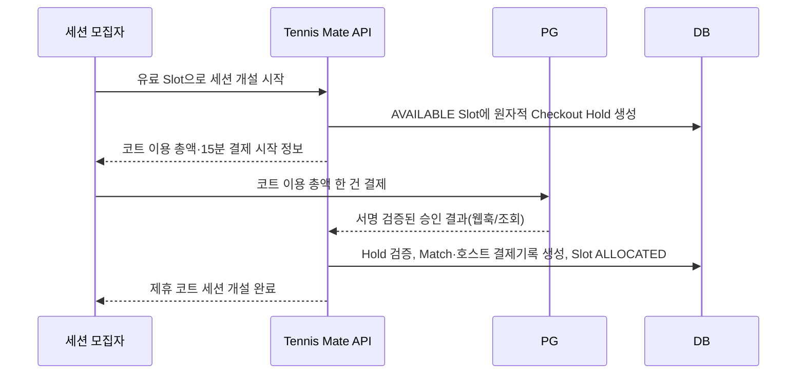
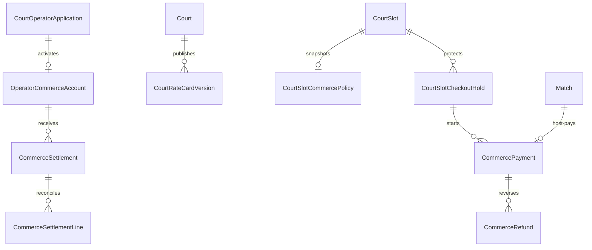

# Court Commerce 설계

## 1. 문서 정보

| 항목 | 내용 |
| --- | --- |
| 문서명 | Court Commerce 설계 |
| 상태 | 제품 정책 확정안 — 구현·PG 계약·법무/세무 검토 전 |
| 대상 | 승인된 제휴 코트 시간에 열린 `PARTNER_COURT` 세션의 **모집자 단일 결제**, 환불, 운영자 정산 |
| 관련 문서 | `02-prd.md`, `03-1-court-partner-screen-spec.md`, `04-erd.md`, `05-api-spec.md`, `06-development-plan.md` |
| 구현 상태 | 미구현. 이 문서는 DB migration, PG 연동, 화면, 배포를 승인하지 않는다. |

이 문서는 Court Partner Pilot의 운영자 시간 공급과 일반 모집자의 참가 승인 권한을 유지한 채, 유료 제휴 코트 세션을 안전하게 도입하기 위한 다음 단계 설계다. 일반 사용자의 코트 예약 요청·운영자의 참가 승인·참가자별 앱 결제를 만들지 않는다.

## 2. 해결하려는 문제와 범위 판단

### 2.1 사용자 문제

- 운영자는 현장에 없더라도 코트 이용 총액이 실제 결제된 세션만 확인·정산하고 싶다.
- 모집자는 코트를 먼저 확보해야 하지만, 참가자별 결제 실패·부분 환불·재청구를 대신 처리하고 싶지 않다.
- 참가자는 신청 전에 코트 총액, 예상 1인 부담, 현장 비용 분담 방식, 무료 취소 마감 시각을 알고 싶다.
- Tennis Mate는 한 세션의 결제·환불·공급 철회를 서로 모순 없이 기록해야 한다.

### 2.2 MVP와 일정 영향

이는 Core MVP와 현 Court Partner Pilot의 필수 범위가 아닌 별도 Commerce 단계다. PG 심사·계약, 환불 정책, 고객 지원, 정산 대사, 개인정보·세무 검토가 추가된다.

더 단순한 대안은 현재 Pilot처럼 앱 결제 없이 운영하는 것이다. 유료 Commerce를 도입하되 참가자별 분할결제를 만들면 다수 PG 거래의 실패·재시도·부분 환불이 하나의 세션 정산을 흔들 수 있다. 따라서 첫 유료 모델은 **모집자 한 명과 운영자 한 곳 사이의 단일 결제**로 제한한다.

### 2.3 명시적 비범위

- 일반 사용자의 CourtBooking, 코트 예약 요청, 운영자의 참가 신청 수락
- 참가자별 앱 결제, 참가자 결제 초대, 참가자 비용 수납·환불·미납 관리
- 참가자 간 계좌·현금·간편송금 정보 입력, 송금 링크·QR·수기 정산 기록
- Tennis Mate의 수기 지급·수납·임시 자금 보관
- 운영자가 자신의 PG 키·계좌번호·결제 URL을 직접 입력하거나 참가자에게 공개하는 기능
- Tennis Mate가 카드 정보나 계좌 정보를 저장하는 기능
- PG 계약·사업자 심사·세무 신고를 앱 코드로 대체하는 기능

## 3. 역할과 결제 구조

### 3.1 역할 분리

| 주체 | 하는 일 | 하지 않는 일 |
| --- | --- | --- |
| 참가자 | 세션 상세에서 코트 총액·예상 부담·현장 분담 안내를 보고 신청·참가 | Tennis Mate에 코트 비용을 결제하거나, 다른 사용자의 비용을 대신 보증 |
| 세션 모집자 | 공개 Slot으로 세션을 열고, **코트 이용 총액 한 건을 실제 결제**하며 참가 신청을 수락·거절 | 참가자 카드·계좌·환불 수단 확인, 운영자 정산 조작 |
| 코트 운영자 | 코트 시간·최대 인원·요금표를 공급하고 PG 입점·정산 상태를 유지 | 참가 신청 수락·거절, 참가자 현장 비용 분담에 개입 |
| Tennis Mate | 단일 결제와 Slot·Match 상태를 연결하고 PG 결과를 검증·표시 | 참가자 간 돈 수납·환불 보장, 카드·계좌 원문 보관, 수기 정산 |
| PG/지급결제 제공자 | 모집자 결제 승인·취소·환불·운영자 정산 또는 하위가맹점 지급 | Match 참가자 승인 판단, 현장 비용 분담 판단 |

권장 계약 구조는 운영자가 PG의 판매자/하위가맹점으로 온보딩되고, Tennis Mate가 플랫폼 중개자로 PG의 마켓플레이스·지급 기능을 사용하는 방식이다. 실제 계약상 판매자, 정산 주체, 세금계산서 및 환불 비용의 귀속은 선택한 PG 계약서와 법무·세무 검토로 확정한다. 이 문서는 법률·세무 자문이 아니다.

### 3.2 활성화 전제

유료 Slot을 공개하려면 다음 모두가 필요하다.

1. 운영자 신청 상태가 `PUBLISH_APPROVED`이고 Court가 `ACTIVE`다.
2. 운영자의 Commerce 계정 상태가 `ACTIVE`다.
3. 운영자는 선택 PG의 사업자·정산 온보딩을 완료했다. 기존 사업자등록증은 Tennis Mate의 운영자 심사 증빙이며 PG 심사를 대체하지 않는다.
4. Slot에 사용자 공개용 코트 이용 총액, 요금표 버전, 24시간 전 전액 취소 정책 버전이 고정되어 있다.
5. 지원 담당자, 공급 철회 환불 절차, PG 장애 안내가 운영 가능하다.

PG 온보딩에 필요한 정산 계좌 등 민감 정보는 PG의 전용 흐름에서만 수집한다. Tennis Mate DB에는 제공자가 발급한 최소 식별자와 상태만 보관한다.

## 4. 확정된 상업 정책

### 4.1 코트 이용 총액과 요금표

유료 Slot의 가격 단위는 `1인 참가비`가 아니라 **코트 이용 총액**이다. 운영자는 초안에서 코트 면·이용 시간·현장 최대 인원과 함께 해당 시간의 사용자 공개 총액을 정한다. 참가자에게는 코트 이용 총액과 모집 인원을 기준으로 한 `예상 1인 부담`만 참고 정보로 보여 준다. 이 예상값은 Tennis Mate의 청구·채권·수납 금액이 아니다.

운영자는 요일·시간대·코트 면별 요금표를 스스로 관리한다. 모든 요금표 수정에 사전 심사를 요구하지 않는다.

- 요금표 변경은 새 `DRAFT` Slot에만 적용하며, 이미 `PUBLIC`이거나 연결·결제된 Slot의 총액은 바꾸지 않는다.
- 공개한 시간의 총액을 바꾸려면 기존 Slot을 `BLOCKED`로 중지하고 새 `DRAFT`를 만든다. Pilot의 공개 후 직접 수정 금지 규칙을 그대로 따른다.
- `CourtSlotCommercePolicy`는 적용한 요금표 버전과 코트 이용 총액을 불변 스냅샷으로 남긴다.
- 시스템은 과도한 인상·너무 잦은 변경·이용자 신고를 운영 검토 신호로 기록할 수 있으나, 평상시 요금표 변경을 매번 수동 승인 대기로 만들지 않는다.

`CourtSlot.priceKrw`는 Pilot의 전체 비용 표시를 유지한다. Commerce에서는 이 값을 사용자에게 실제로 청구할 **코트 이용 총액**으로 스냅샷하며, 운영자가 별도의 1인 가격을 입력하거나 참가자에게 결제 막판 추가 수수료를 붙이지 않는다.

### 4.2 수수료와 프로모션

| 항목 | 정책 |
| --- | --- |
| 플랫폼 수수료 | 운영자 부담. 성공한 모집자 코트 이용 총액의 5% |
| PG 수수료 | 운영자 부담. PG가 실제 정산한 금액을 기록 |
| 모집자 결제 금액 | Slot에 공개·고정된 코트 이용 총액 한 건. 결제 직전·영수증·환불 기준에서 같은 금액을 표시 |
| 참가자 비용 | 앱에서 청구하지 않음. 현장 자율 분담이며 Tennis Mate가 금액·수납·환불을 보장하지 않음 |
| 무료 기간 | 해당 운영자의 **첫 성공 유료 세션 모집자 결제 승인 시각**부터 30일간 플랫폼 수수료 0% |
| 무료 기간 중 PG 수수료 | 면제하지 않음. 운영자 부담 |
| 기간 종료 | `firstPaidAt + 30일` 미만에 승인된 결제는 0%, 그 이후 승인분부터 5% |

`firstPaidAt`은 해당 운영자의 첫 성공 승인에서 한 번만 설정하며, 그 결제가 이후 전액 환불되어도 초기화하지 않는다. 원 단위 수수료 반올림, 부가세 포함 여부, PG의 취소·환불 수수료와 지급 보류·정산 주기는 PG 계약 및 세무 검토에서 확정한다. 구현 전 권장안은 `floor(코트 이용 총액 × 수수료율)`로 원 단위 절사하고, 모집자·참가자에게 별도 플랫폼 수수료를 추가하지 않는 것이다.

### 4.3 현장 비용 분담 원칙

모집자는 코트 이용 총액을 서비스에서 결제한다. 참가자는 앱에서 돈을 내지 않으며, 현장에서 비용을 나눌지와 실제 방식은 참여자들이 자율적으로 정한다.

- 상세에는 `모집자가 코트 이용료를 결제했어요`, `예상 1인 부담`, `현장에서 함께 정산해요`를 함께 표시한다.
- 예상 1인 부담은 `코트 이용 총액 ÷ 모집자를 포함한 목표 참여 인원`을 1원 단위 올림한 참고값이다. 실제 현장 분담액·누가 내는지·미납은 서비스가 기록하거나 강제하지 않는다.
- 테니스공은 `운영자 제공`, `모집자 준비`, `각자 준비` 중 하나를 사전에 표시한다. 공 비용·현장 추가금·개인 송금은 Tennis Mate 결제 범위에 넣지 않는다.
- 참가 신청·수락·Match Chat은 결제 여부와 무관하게 기존 Match 규칙을 따른다. 참가자가 현장 비용을 내지 않았다는 이유만으로 Tennis Mate가 참가 상태를 변경하거나 돈을 청구하지 않는다.

### 4.4 최소 인원과 진행 결정

모집자는 세션 생성 시 본인을 포함한 `minimumParticipantCount`를 정한다. 값은 2 이상이고 Slot의 `maxParticipantCount` 이하여야 한다. 이는 코트 결제 금액을 바꾸는 값이 아니라, 모집자가 해당 인원 이상일 때 진행할 의사가 있음을 보여 주는 기준이다.

- 최소 인원은 수락된 모집자·참가자 수로 판단하며, 참가자가 앱에 돈을 내는 상태와 연결하지 않는다.
- 시작 24시간 전까지 최소 인원이 모이면 모집자는 현재 인원으로 진행하거나 더 모집할 수 있다.
- 시작 24시간 전까지 최소 인원이 모이지 않으면 모집자는 `현재 인원으로 진행` 또는 `세션 취소`를 선택한다. 현재 인원으로 진행하려면 이미 수락된 참가자에게 바뀐 진행 조건을 Match Chat과 상세에서 다시 알린다.
- 마감 시각까지 응답하지 않으면 세션을 취소하고 모집자 결제 전액 환불을 시작한다.

## 5. 세션 개설과 단일 결제 흐름

### 5.1 왜 결제 홀드가 필요한가

현 Pilot은 `AVAILABLE → ALLOCATED`와 Match 생성을 하나의 트랜잭션으로 처리한다. 외부 결제를 단순히 뒤에 붙이면 결제 취소·실패 때 Slot이 이미 `ALLOCATED`로 남고, 반대로 먼저 결제하면 동시에 두 모집자가 같은 Slot을 결제하려 할 수 있다.

Commerce는 **임시 결제 홀드**로 이 간격을 분리한다. 홀드는 운영자에게 보내는 일반 사용자 예약 요청이 아니며, 결제 승인 확인 전에는 코트 이용권이나 세션을 확정하지 않는다.

### 5.2 모집자 개설 흐름

1. 인증·온보딩 완료 모집자만 `AVAILABLE` 유료 Slot에 대해 홀드를 시작한다.
2. 서버는 짧은 트랜잭션으로 해당 Slot에 활성 홀드가 없는지 확인하고 생성한다. 기본 만료 시간은 **15분**이며 Slot별 변경은 제공하지 않는다.
3. 결제 화면은 코트 이용 총액, `무료 취소: {startsAt - 24시간}`의 정확한 시각, 최소 인원, 현장 비용 분담 안내를 결제 전에 보여 준다.
4. PG 승인 결과는 클라이언트 리다이렉트만 믿지 않고, 서명 검증한 웹훅 또는 PG 조회 결과로 확정한다.
5. 승인 처리 트랜잭션은 홀드가 아직 유효하고, 운영자 Commerce 상태·Court·Slot 상태가 여전히 유효한지 재확인한다.
6. 조건이 모두 맞을 때만 Match, 모집자 단일 결제 기록, `AVAILABLE → ALLOCATED`를 함께 확정한다.
7. 홀드 만료·사용자 취소·PG 실패면 Match와 Slot 배정은 만들지 않는다. 확정되지 않은 승인 결제는 PG 취소/환불 대기열로 전환하고 운영 경보를 남긴다.

동일 `clientRequestId` 재시도는 기존 홀드나 이미 만든 Match를 돌려줘야 하며, 같은 Slot의 서로 다른 요청은 하나만 활성화할 수 있다.

### 5.3 참가 신청 흐름

참가 신청과 수락은 현 Pilot의 `MatchApplication` 규칙을 그대로 사용한다. 모집자가 신청자를 수락하면 `ACCEPTED`가 되고 Match Chat에 입장한다. 참가자 결제 초대·자리 결제 홀드·결제 실패로 인한 `ACCEPTED` 전환 지연은 만들지 않는다.

모집자·운영자는 참가자의 카드 정보·현장 정산 여부·계좌·실패 이유를 보지 못한다. 화면에는 수락·대기·거절·마감의 Match 상태만 제공한다.

## 6. 취소·환불·정산 설계

### 6.1 시작 24시간 전 전액 취소

유료 `PARTNER_COURT` 세션의 모집자는 `startsAt - 24시간`까지 코트 이용권 결제를 전액 취소할 수 있다. 화면과 알림에는 상대 시간 대신 `무료 취소: 2026년 9월 3일 오후 7:00까지`처럼 한국 시간 기준의 정확한 마감 시각을 표시한다.

| 상황 | 처리 |
| --- | --- |
| 모집자가 마감 시각까지 취소 | Match·연결 신청을 취소하고 모집자 결제 전액 환불. 플랫폼 수수료는 부과하지 않음 |
| 최소 인원 미달 후 모집자가 취소 선택 또는 무응답 | 위와 동일하게 전액 환불. 참가자는 앱에서 결제하지 않았으므로 참가자 환불은 없음 |
| 최소 인원 미달 후 모집자가 현재 인원으로 진행 선택 | Match를 유지. 모집자는 이미 결제한 코트 이용 총액을 부담하고, 참가자에게 진행 사실을 다시 알림 |
| 마감 시각 후 모집자 취소 | 앱의 자동 환불·취소를 제공하지 않음. 법정·PG 계약상 필요한 예외는 안전한 운영 문의로 처리하되 환불을 약속하지 않음 |
| 운영자 공급 철회·시설 폐쇄·안전 위험·사용 불가 우천·재난 | 시간과 무관하게 모집자 결제 전액 환불. 기존 공급 철회 Incident·인앱 안내·공개 제한 규칙을 함께 적용 |
| 참가자 노쇼·현장 비용 미납 | 참가자 결제가 없으므로 서비스 환불·청구·정산 없음. 모집자와 참가자 사이 현장 문제로 기록·강제하지 않음 |

마감 시각은 Slot 공개와 모집자 결제 승인 때 스냅샷한다. 공개·결제된 세션에 운영자 또는 플랫폼이 취소 기준을 소급 변경할 수 없다. 운영자 공급 철회 환불은 운영자 귀책 여부와 별개로 참가자에게 안전한 안내만 보여 주며, 원문 사유·운영자 연락처를 노출하지 않는다.

### 6.2 PG 장애와 환불 상태

- PG 장애 중에는 새 Checkout Hold·결제를 시작하지 않고, 이미 시작한 결제에는 `결제 상태를 확인하고 있어요`만 표시한다.
- 홀드 만료 뒤 늦은 승인, 중복 웹훅, 중복 리다이렉트는 공급자 주문·결제 참조의 유일 제약과 DB 트랜잭션으로 멱등 처리한다.
- 전액 환불은 원 결제수단의 PG 취소·환불로만 처리한다. Tennis Mate가 계좌번호를 받아 수동 송금하지 않는다.
- 고객 화면은 `환불 요청됨`, `PG 확인 중`, `환불 완료`를 구분한다. 환불 완료 시각·처리 기한은 PG 계약과 법무 검토에서 확정하며, 제공자가 확정하지 않은 완료 시각을 약속하지 않는다.

### 6.3 정산과 원장

정산은 화면의 합계가 아니라 불변 금액 원장으로 계산한다.

- 한 유료 Match에는 모집자 코트 이용 총액 결제 한 건만 연결한다.
- 결제 승인마다 총액, 승인 시점 플랫폼 수수료율·금액, PG 실수수료, 취소·환불 금액을 별도 행으로 남긴다.
- 이미 승인된 금액을 수정하지 않고, 취소·환불은 반대 방향 원장 행으로 추가한다.
- 운영자 지급 가능 금액은 `모집자 결제 승인액 - 환불액 - 플랫폼 수수료 - PG 수수료 ± PG 조정`을 PG 지급 데이터와 대사한다.
- 참가자 사이 현장 비용 분담은 결제·환불·정산 원장에 넣지 않는다.
- 플랫폼 수수료 0% 기간의 결제도 PG 수수료와 지급 결과를 기록한다.

PG가 정산을 실제 지급하는 구조를 우선한다. Tennis Mate가 수동 이체로 지급하거나 참가자 돈을 임시 보관하는 구조는 도입하지 않는다.

## 7. 데이터 모델

### 7.1 엔터티 관계

### 7.2 제안 모델

| 모델 | 핵심 필드 | 규칙 |
| --- | --- | --- |
| `OperatorCommerceAccount` | `operatorApplicationId`, `provider`, `providerMerchantRef`, `status`, `firstPaidAt`, `promotionEndsAt` | 계좌·카드·PG 키를 저장하지 않는다. `ACTIVE`만 유료 Slot을 공급한다. 최초 성공 승인에서만 `firstPaidAt`을 원자적으로 설정한다. |
| `CourtRateCardVersion` | `courtId`, `version`, `effectiveFrom`, `timeBands`, `createdByUserId`, `reviewSignal` | 운영자가 관리하는 요일·시간대·코트 면별 요금표 버전. 새 초안만 참조하며 이미 공개된 Slot을 바꾸지 않는다. |
| `CourtSlotCommercePolicy` | `courtSlotId`, `courtTotalChargeKrw`, `rateCardVersionId`, `hostCancellationDeadlineAt`, `refundPolicyVersion` | 공개 전 Draft에서만 작성·수정. 공개 시 불변. `hostCancellationDeadlineAt = startsAt - 24시간`을 스냅샷한다. |
| `CourtSlotCheckoutHold` | `courtSlotId`, `hostUserId`, `clientRequestId`, `status`, `expiresAt`, `providerOrderRef` | 한 Slot에 유효 홀드는 하나. 만료 후 새 홀드 가능. 모집자 단일 결제 승인과 Slot 배정을 원자적으로 연결한다. |
| `CommercePayment` | `checkoutHoldId`, `matchId?`, `payerUserId`, `source`, `providerPaymentRef?`, `providerOrderRef`, `status`, `grossAmountKrw`, `platformFeeRateBps?`, `platformFeeAmountKrw?`, `pgFeeAmountKrw?`, `approvedAt?` | 유료 Match당 성공한 모집자 결제 한 건. `payerUserId`는 Match 모집자와 같아야 한다. 참가자·Application 결제 연결을 만들지 않는다. |
| `CommerceRefund` | `paymentId`, `providerRefundRef`, `reason`, `amountKrw`, `status`, `requestedAt`, `approvedAt` | 원 결제의 환불 이력. 전액 환불은 승인 금액과 같아야 하며 중복·초과를 금지한다. |
| `CommerceSettlement` | `commerceAccountId`, `providerPayoutRef`, `periodStartsAt`, `periodEndsAt`, `status`, `paidAt` | PG 지급 결과와 대사하는 읽기 전용 집계. |
| `CommerceSettlementLine` | `settlementId`, `paymentId?`, `refundId?`, `amountKrw`, `kind` | 정산 합계를 모집자 결제·환불 원장과 추적 가능하게 한다. |
| `CommerceWebhookEvent` | `provider`, `providerEventRef`, `eventType`, `verifiedAt`, `processedAt`, `outcome` | 제공자 이벤트 ID 유일. 원문 결제수단·민감 payload를 보관하지 않는다. |

`PartnerSessionAttendance`, `ParticipantPaymentInvitation`, 참가자 `participantPriceKrw`는 이 Commerce 모델에 만들지 않는다. 금액은 `Int` 원 단위, 시각은 `timestamptz`, 제공자 참조는 비식별 opaque 문자열로 저장한다. 금전 데이터 보관 기간과 익명화 절차는 법무·세무·PG 계약에 맞춰 별도로 확정한다.

### 7.3 필수 제약과 동시성

1. `CourtSlotCheckoutHold`에는 `status=ACTIVE`인 행을 하나만 허용하는 부분 유일 인덱스를 둔다. 만료 처리와 새 홀드 생성은 행 잠금/조건부 갱신으로 직렬화한다.
2. `Match.courtSlotId`의 기존 활성 부분 유일 인덱스는 계속 유지한다. Commerce 확정에서만 Hold를 `COMPLETED`로 바꾸고 Match를 만든다.
3. 동일 `providerOrderRef`, `providerPaymentRef`, `providerEventRef`는 중복될 수 없다. `PAID` Payment는 Match·모집자·승인 참조·수수료 스냅샷을 반드시 가진다.
4. 결제 승인 처리·환불 처리·Match 취소는 idempotency key와 DB 트랜잭션으로 재시도 가능해야 한다.
5. PG 승인 콜백이 늦게 오면 홀드 만료·Match 마감·공급 철회를 다시 검사한다. 더 이상 세션을 만들 수 없으면 PG 취소/환불 대기열로 보내고, Slot·Match를 되살리지 않는다.
6. 참가자 수락과 Match Chat 멤버십은 기존 Match 상태 전이로만 만든다. 참가자 결제·현장 분담 상태를 수락 조건에 섞지 않는다.
7. `courtTotalChargeKrw`는 유료 Commerce Slot에서 1원 이상이어야 한다. 0원 시간은 결제 주문·정산·환불을 만들지 않는 Pilot 무료 세션으로만 유지한다.

## 8. API 계약 원칙

상세 경로는 `05-api-spec.md`를 따른다. 유료 Commerce API는 다음 역할만 가진다.

| 경로 | 목적 |
| --- | --- |
| `PUT /api/v1/operator/slots/{slotId}/commerce-policy` | Draft Slot의 코트 이용 총액·요금표 버전·24시간 취소 정책 스냅샷 설정 |
| `POST /api/v1/partner-session-checkout-holds` | 유료 `AVAILABLE` Slot의 단일 15분 홀드와 모집자 코트 이용 총액 결제 주문 생성 |
| `GET /api/v1/partner-session-checkout-holds/{holdId}` | 모집자의 결제 확인 중·만료·Match 생성 결과 조회 |
| `DELETE /api/v1/partner-session-checkout-holds/{holdId}` | PG 승인 전 홀드·미결제 주문 취소 |
| `POST /api/v1/matches/{matchId}/commerce-cancellations` | 모집자의 24시간 전 전액 취소 요청. 서버가 마감 시각·결제·권한을 검증 |
| `GET /api/v1/matches/{matchId}/commerce-payment` | 모집자에게만 안전한 결제·환불 상태 조회 |
| `POST /api/v1/webhooks/{provider}/commerce` | PG 서명으로 승인·취소·환불·지급 결과를 멱등 처리 |

참가자 결제 초대·참가자 결제 조회·참가자 비용 수납 API는 만들지 않는다. 사용자·운영자 응답에는 카드번호, 계좌번호, PG 원문 오류, 참가자 간 현장 정산 정보, 다른 운영자의 정산 정보를 넣지 않는다.

## 9. 화면과 문구 원칙

Figma 사용량 제한에 따라 이 설계에서는 Figma를 변경하지 않는다. 구현 요청과 사용자의 별도 Figma 동기화 요청이 있을 때만 화면을 동기화한다.

| 화면 | 필요한 정보 | 금지할 표현·행동 |
| --- | --- | --- |
| 공개 유료 Slot | 코트 이용 총액, 최대 인원, 목표 인원 기준 예상 1인 부담, 테니스공 준비 방식, `모집자가 코트 이용료를 결제해요` | `1인 참가비 결제`, 운영자 연락처, 가격 협상 |
| 모집자 결제 | 코트 이용 총액 한 건, `무료 취소: 정확한 시각`, 최소 인원, 현장 자율 분담 안내, 15분 결제 기한 | 참가자 비용을 앱에서 대신 수납·환불한다는 표현 |
| Match 상세 | `Tennis Mate에서 준비한 코트예요`, 모집자 결제 완료 상태, 예상 1인 부담은 참고값, `현장에서 함께 정산해요` | 참가자에게 결제 버튼·영수증·미납 표시 |
| 최소 인원 미달 안내 | 현재 인원, 진행 또는 전액 취소 CTA, 취소 마감 정확한 시각 | 참가자에게 비용을 청구·환불하는 CTA |
| 취소된 유료 세션 | 안전한 취소 사유, `환불을 진행하고 있어요`와 서버 확인 상태 | 수동 송금 안내·보장할 수 없는 완료 시각 |
| 운영자 Commerce | 온보딩 상태, 요금표 버전, 프로모션 종료 시각, 모집자 결제 기준 정산 합계·지급 상태 | 참가 신청 승인·참가자의 카드/계좌/현장 정산 정보 |

390×844 모바일에서 결제 전 총액·취소 시각·최소 인원·현장 분담의 비결제 범위를 한 화면에서 이해할 수 있어야 한다. 기존 Noto Sans KR, 하드코트 블루·테니스볼 옐로, 로딩·빈·오류·접근성 패턴을 유지한다.

## 10. 운영·보안·관측

### 10.1 운영 절차

- PG webhook 실패, 승인 후 홀드 만료, 환불 실패, 정산 불일치에는 내부 경보와 재처리 대기열이 필요하다.
- 고객 지원은 결제 ID와 안전한 상태만 조회하고 카드·계좌 원문을 보지 않는다.
- 운영자 공급 철회는 기존 Incident·인앱 안내 흐름에 모집자 전액 환불 생성만 추가한다. 단순 정보 오류 검토 요청에는 환불을 만들지 않는다.
- PG 장애 시 새 유료 홀드·결제를 시작하지 않고, 기존 결제에는 `상태 확인 중`을 표시한다.
- 요금표 변경은 감사 이력으로 남기고, 이상 변경 경보가 나도 이미 공개·결제된 Slot의 가격·취소 마감은 바꾸지 않는다.

### 10.2 분석 이벤트

`commerce_checkout_hold_created`, `commerce_checkout_hold_expired`, `commerce_host_payment_approved`, `commerce_host_payment_failed`, `commerce_host_cancellation_requested`, `commerce_refund_requested`, `commerce_refund_completed`, `commerce_settlement_reconciled`, `commerce_minimum_participants_unmet`를 기록한다. 사업자 번호, 카드·계좌 정보, 결제 오류 원문, 참가자 간 현장 정산 정보, 주소·신청 메시지 원문은 분석 이벤트에 넣지 않는다.

## 11. 구현 게이트와 인수 기준

### 11.1 구현 전 게이트

- [ ] PG 마켓플레이스/하위가맹점 계약에서 운영자·Tennis Mate·PG의 단일 모집자 수납·환불·지급 책임을 확인했다.
- [ ] 세무·법무 검토로 판매자 표기, 부가세, 현금영수증·영수증, 보관 기간을 확정했다.
- [ ] 모집자 24시간 전 전액 취소, 최소 인원 미달, 운영자 공급 철회·우천, 노쇼, PG 장애 정책과 지원 SLA를 문서화했다.
- [ ] 요금표의 자체 수정·버전 고정·이상 변경 검토 규칙을 확정했다.
- [ ] 운영자 PG 온보딩·제한·해지와 기존 `PUBLISH_APPROVED`의 관계를 확정했다.
- [ ] PG 장애·웹훅 재전송·정산 불일치 대응 담당자와 도구가 준비됐다.
- [ ] 사용자에게 보일 약관·환불 정책·현장 비용 분담 비보장 문구가 검토됐다.

### 11.2 구현 인수 기준

- [ ] 같은 유료 Slot에 동시 개설 요청을 보내도 활성 홀드·Match·모집자 결제는 각각 한 건만 확정된다.
- [ ] 홀드 만료·결제 실패·사용자 취소 뒤 Match와 `ALLOCATED` Slot이 생기지 않는다.
- [ ] 늦은 승인·웹훅 재전송·중복 리다이렉트가 Payment·Match·환불을 중복 만들지 않는다.
- [ ] 유료 Match에는 모집자와 같은 `payerUserId`의 성공 Payment 한 건만 있고, 참가자·Application 결제 행은 없다.
- [ ] 시작 24시간 전까지 모집자 취소는 정확한 마감 시각을 기준으로 전액 환불을 만들며, 이후 자동 환불은 거절한다.
- [ ] 최소 인원 미달에서 진행 선택·취소·무응답 자동 취소가 서로 모순되지 않으며, 참가자에게 앱 결제가 생기지 않는다.
- [ ] 운영자 공급 철회는 모집자 결제에 전액 환불 원장을 하나 만들고, 참가자에게 안전한 인앱 안내를 남긴다.
- [ ] 첫 성공 유료 모집자 결제 승인일부터 30일 동안 플랫폼 수수료 스냅샷은 0%, 이후는 5%이며 PG 수수료는 운영자 부담으로 기록된다.
- [ ] 공개·결제된 Slot의 코트 이용 총액·요금표 버전·취소 마감 시각은 바꿀 수 없다.
- [ ] 운영자·모집자·참가자 누구도 자신의 권한 밖 결제·정산·민감 정보를 조회하거나 바꾸지 못한다.
- [ ] DB 제약, API 권한·입력·동시성 Vitest, PG sandbox 웹훅 재전송, 모바일 핵심 흐름을 검증한다.

## 12. 권장 구현 순서

1. PG 후보의 단일 결제·환불·운영자 지급·webhook 계약을 실제 문서와 sandbox로 검증하고 11.1 게이트를 닫는다.
2. 운영자 요금표, 24시간 전 전액 취소, 최소 인원 미달, 현장 비용 분담 비보장 문구를 약관·화면 문구까지 확정한다.
3. 금전 원장, Commerce 계정, 요금표 버전, Slot 정책, 단일 Checkout Hold 모델의 DB migration과 동시성 테스트를 먼저 만든다.
4. PG 온보딩·webhook 검증·모집자 결제 확인을 서버에서 구현한다.
5. 모집자 결제 후 세션 개설, 최소 인원 미달 선택·마감 취소, 공급 철회 전액 환불을 구현한다.
6. PG 지급 대사·운영 경보·정산 조회를 구현한다.
7. 참가자별 앱 결제·현장 비용 수납 UI가 없는지 회귀 검증한다.
8. Figma 한도 해제와 사용자 요청 후에만 최종 UI를 Figma에 동기화하고, sandbox/production rollout은 별도 승인으로 진행한다.
