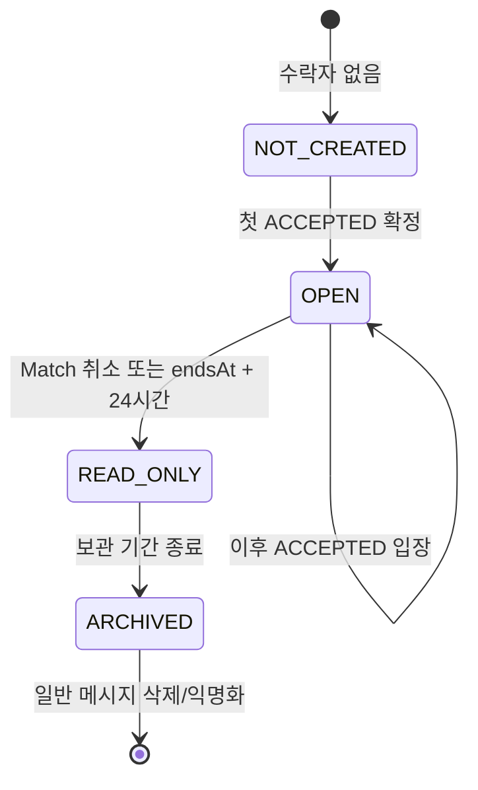
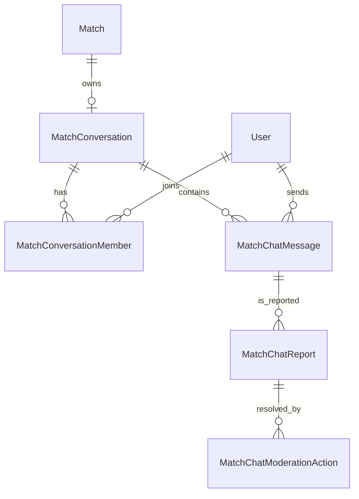

# 서비스 내 Match 채팅 설계

## 1. 문서 정보

| 항목 | 내용 |
| --- | --- |
| 문서명 | 서비스 내 Match 채팅 설계 |
| 상태 | Match Chat MVP 구현 승인 — 기존 카카오 링크 호환·공개 출시 게이트 유지 |
| 대상 | 하나의 Match에서 모집자와 실제 수락 참가자가 일정·준비물을 조율하는 텍스트 채팅 |
| 관련 문서 | `01-product-overview.md`, `02-prd.md`, `03-screen-spec.md`, `04-erd.md`, `05-api-spec.md`, `06-development-plan.md`, `07-court-commerce-design.md` |
| 구현 상태 | 소스 구현 완료. 모든 Match는 서비스 내 Match 채팅만 사용하며, 공개 출시는 보관·파기와 운영 SLA 법무 검토 게이트 뒤에만 진행한다. |

이 문서는 외부 오픈채팅 링크를 서비스 내 Match 채팅으로 단계적으로 대체하는 설계다. 범용 메신저나 개인 DM을 만들지 않으며, 코트 운영자에게 참가 신청 승인 권한을 주지도 않는다.

## 2. 문제와 범위

### 2.1 해결하려는 문제

- 수락 뒤 외부 앱으로 이동하면 매칭 정보·안내·대화가 분산되고, 사용자는 별도 계정·링크를 관리해야 한다.
- `COURT_TBD`와 제휴 코트 세션은 수락자끼리 시간·준비물·현장 안내를 조율할 안전한 장소가 필요하다.
- 서비스는 취소·공급 철회 같은 시스템 안내를 대화와 같은 맥락에서 보여 줄 수 있어야 한다.

### 2.2 일정 영향과 더 단순한 대안

서비스 내 채팅은 메시지 저장, 권한, 신고·운영 조치, 보관·삭제, 전송 지연과 장애 안내가 함께 필요하므로 Core와 현재 Pilot 범위를 넓힌다. 더 단순한 대안은 외부 연락 수단을 유지하는 것이지만, 외부 이동과 서비스 밖 안전 정책 문제 때문에 채택하지 않는다.

권장 첫 단계는 **Match마다 하나의 텍스트 방**이다. 실시간 개인 메신저, 사진·파일·음성, 읽음 표시, 반응, 메시지 편집·사용자 삭제, 개인 DM, 참여자 검색, 운영자–참가자 대화는 모두 제외한다.

## 3. 제품 정책과 역할

### 3.1 방과 멤버십

| 항목 | 정책 |
| --- | --- |
| 방 수 | Match당 최대 하나. 대화는 새 Match로 재사용하지 않는다. |
| 입장 | 모집자와 해당 Match의 `ACCEPTED` 참가자만. `PENDING`, `REJECTED`, `WITHDRAWN`, 수락된 적 없는 `CANCELLED` 신청자와 운영자는 입장하지 못한다. Match 취소 뒤에는 이미 입장한 멤버만 보관 기간 동안 읽기 전용으로 남는다. |
| 생성 | 첫 `ACCEPTED`가 확정될 때 서버가 생성하거나 기존 방에 멤버를 원자적으로 추가한다. 빈 방을 미리 만들지 않는다. |
| 표시 | 사용자는 Match 상세·활동 화면 또는 전역 `채팅` 탭에서 `채팅방 열기`로 들어간다. 전역 탭은 내가 만든 Match와 내가 신청해 수락된 Match를 나누며, 방 생성·사용자 검색은 없다. |
| 메시지 | 텍스트 1~500자, 줄바꿈 제한, URL 미리보기·파일·사진·위치 공유 없음. |
| 발신 | 모집자와 현재 수락 참가자만. 서버가 멤버십·방 상태·속도 제한을 모두 검사한다. |
| 읽음 | 내부의 마지막 읽은 메시지 커서만 저장해 미확인 수를 계산할 수 있다. 다른 사용자에게 읽음·접속 상태를 보여 주지 않는다. |

참가 신청을 수락하는 권한은 계속 일반 세션 모집자에게만 있다. 코트 운영자는 시간 공급·정산 상태만 관리하며 채팅방에 입장하거나 메시지를 보낼 수 없다.

### 3.2 Match와 방 상태

- `OPEN`: 모집 마감 뒤에도 이용 종료 전까지 메시지를 보낼 수 있다.
- `READ_ONLY`: Match 취소, 공급 철회, 또는 `endsAt + 24시간`에 전환한다. 시스템 안내는 남지만 새 메시지는 받지 않는다.
- `ARCHIVED`: 일반 멤버에게 보이지 않는다. 실제 메시지 보관·삭제는 7장의 정책 게이트를 통과한 뒤에만 자동화한다.
- 공급 철회와 모집자 취소는 서버가 안전한 시스템 메시지를 만든 뒤 방을 읽기 전용으로 바꾼다. 취소된 Match를 대화로 재개하거나 Slot을 재공개하지 않는다.

### 3.3 외부 오픈채팅 제거와 기존 Match 전환

외부 오픈채팅 링크는 더 이상 연락 수단으로 사용하지 않는다. 출시 migration은 다음 순서로 기존 데이터를 안전하게 전환한다.

1. `matches.contact_open_chat_url`과 그 URL CHECK 제약을 제거한다. 링크 원문은 복구·반환하지 않는다.
2. 현재 진행 중이며 수락자가 있는 기존 Match에는 모집자와 `ACCEPTED` 참가자 멤버십을 가진 서비스 내 방을 backfill한다.
3. 모든 새·기존 Match의 상세와 활동 응답은 URL 대신 방 상태와 안전한 진입 경로만 반환한다.
4. 수락자가 없거나 보관 기한이 지난 기존 Match에는 빈 방을 만들지 않는다.

`COURT_TBD`를 포함한 모든 Match는 첫 수락 뒤 서비스 내 Match 방에서 코트·비용을 조율한다.

## 4. 안전, 신고와 보관

### 4.1 최소 안전 장치

채팅은 상대의 원문을 직접 보게 하므로 운영 문의만으로는 충분하지 않다. 첫 공개 채팅에는 아래 기능을 함께 포함한다.

| 기능 | 정책 |
| --- | --- |
| 메시지 신고 | 방 멤버가 특정 메시지와 `괴롭힘`, `성적·혐오 표현`, `개인정보 노출`, `스팸·사기`, `기타` 중 하나를 신고한다. 선택 설명은 200자 이하다. |
| 운영 조치 | `INTERNAL_REVIEWER`만 신고를 검토하고 메시지 숨김, 발신 일시 중지, 방 읽기 전용, 조치 없음 중 하나를 선택형 사유·시각과 함께 감사 이력으로 남긴다. |
| 메시지 불변성 | 일반 사용자는 메시지를 수정·삭제하지 못한다. 검토로 숨긴 메시지는 안전한 안내문으로 대체하고, 원문은 보관 정책에 따라 제한 접근한다. |
| 속도 제한 | 새 메시지는 사용자·방 단위 속도 제한과 `clientRequestId` 멱등성을 적용한다. 오류 원문·메시지 원문을 로그·분석 이벤트에 넣지 않는다. |
| 차단 | 첫 단계는 메시지 신고와 운영 발신 중지까지만 제공한다. 사용자 간 영구 차단은 같은 Match의 참여·안전·보관 규칙을 바꾸므로 별도 정책 없이는 추가하지 않는다. |

운영 조치가 MatchApplication, 코트 운영자 권한, 결제·정산, 다른 Match의 멤버십을 자동으로 바꾸지 않는다. 긴급 위험은 제품 UI만으로 해결한다고 약속하지 않고 운영 문의·긴급 신고 절차를 별도 고지한다.

### 4.2 보관과 개인정보

메시지 본문, 신고 설명, 숨김 사유 원문은 분석 이벤트·일반 서버 로그·클라이언트 상태 저장소에 넣지 않는다. 검색·AI 요약·광고 타기팅·자동 콘텐츠 학습은 제공하지 않는다.

권장안은 Match 종료·취소 뒤 24시간까지 읽기 전용으로 보이고, 일반 메시지는 그 뒤 30일을 넘기지 않고 삭제 또는 비식별화하는 것이다. 신고된 메시지·조치 이력의 보관 기간, 실제 파기 방식, 법적 보존 예외, 이용약관·개인정보 처리 문구는 법무 검토 후 확정한다. 이 결정 전에는 공개 채팅을 출시하지 않는다.

## 5. 데이터 모델과 무결성

| 모델 | 핵심 필드 | 무결성 규칙 |
| --- | --- | --- |
| `MatchConversation` | `matchId`, `status`, `readOnlyAt`, `archiveAt`, `createdAt` | `matchId` 유일. Match를 삭제·재사용하지 않는다. |
| `MatchConversationMember` | `conversationId`, `userId`, `role`, `joinedAt`, `sendingSuspendedAt?`, `lastReadMessageId?` | `(conversationId, userId)` 유일. 서버가 모집자 또는 수락 시점의 `ACCEPTED` Application에서만 만든다. Match 취소 뒤 기존 멤버는 읽기 전용으로 보관한다. |
| `MatchChatMessage` | `conversationId`, `senderUserId?`, `type`, `body`, `visibility`, `clientRequestId?`, `createdAt` | 일반 메시지는 활성 발신 멤버만 생성한다. 시스템 메시지는 서버만 만든다. `(senderUserId, clientRequestId)`는 non-null 부분 유일이다. |
| `MatchChatReport` | `messageId`, `reporterUserId`, `reason`, `description?`, `status`, `createdAt` | 신고자는 해당 방 멤버여야 하며 같은 메시지를 중복 신고하지 않는다. |
| `MatchChatModerationAction` | `reportId`, `reviewerUserId`, `action`, `reason`, `createdAt` | `INTERNAL_REVIEWER`만 생성하고 수정·삭제하지 않는다. |

메시지 목록은 `(createdAt, id)` 복합 커서로 정렬해 동시 발신에도 순서가 흔들리지 않게 한다. 방 생성·수락 상태 전환·멤버 추가는 같은 DB 트랜잭션에서 처리한다. 수락 취소 기능이 이후 도입되면 해당 Application의 멤버십 제거 시점과 과거 메시지 열람 권한을 별도 설계한다.

## 6. API 계약 초안

모든 경로는 인증이 필요하며, 방·Match 존재 여부를 권한 없는 사용자에게 구분해 주지 않고 `404 MATCH_CONVERSATION_NOT_FOUND`로 처리한다.

| 메서드·경로 | 권한 | 목적 |
| --- | --- | --- |
| `GET /api/v1/matches/{matchId}/conversation` | 모집자 또는 `ACCEPTED` 참가자 | 방 상태·멤버의 안전한 닉네임·내 미확인 수 조회 |
| `GET /api/v1/matches/{matchId}/conversation/messages?before=cursor` | 방 멤버 | 커서 기반 과거 메시지 30개 조회 |
| `POST /api/v1/matches/{matchId}/conversation/messages` | 발신 가능한 방 멤버 | `body`, `clientRequestId`로 텍스트 메시지 생성 |
| `POST /api/v1/matches/{matchId}/conversation/read` | 방 멤버 | 내 마지막 읽은 커서 갱신. 다른 멤버에게 읽음 표시 안 함 |
| `POST /api/v1/matches/{matchId}/conversation/messages/{messageId}/reports` | 방 멤버 | 메시지 신고 생성 |
| `GET /api/internal/chat-reports` | `INTERNAL_REVIEWER` | 대기 신고 목록 조회 |
| `POST /api/internal/chat-reports/{reportId}/actions` | `INTERNAL_REVIEWER` | 메시지 숨김·발신 중지·방 읽기 전용 등 감사 가능한 조치 |

주요 오류 코드는 `MATCH_CONVERSATION_NOT_FOUND`, `MATCH_CONVERSATION_NOT_OPEN`, `CHAT_MEMBER_REQUIRED`, `CHAT_SENDING_SUSPENDED`, `CHAT_MESSAGE_INVALID`, `CHAT_MESSAGE_RATE_LIMITED`, `CHAT_MESSAGE_DUPLICATE`, `CHAT_REPORT_DUPLICATE`다. 메시지 본문과 신고 설명은 오류 응답·분석·로그에 되돌려 보내지 않는다.

## 7. 전달 방식과 사용자 경험

### 7.1 첫 구현의 전달 방식

첫 구현은 PostgreSQL 영속 메시지와 HTTP 폴링을 사용한다.

- 채팅 화면이 전면·활성 상태일 때만 마지막 커서 이후 메시지를 5초마다 조회한다.
- 화면을 다시 열거나 앱이 전면으로 돌아오면 즉시 최신 메시지를 조회한다.
- 발신은 낙관적으로 표시하되 서버 확인 전에는 `보내는 중`으로 두고, 중복 재시도는 `clientRequestId`로 합친다.
- 알림·읽음·접속·입력 중 표시를 실시간으로 약속하지 않는다. 채팅 화면 밖에서는 활동 화면 재진입·새로고침 시 미확인 수를 갱신한다.

이는 새 외부 서비스·유료 의존성 없이 작은 Pilot에서 권한·보관·신고 모델을 먼저 검증하기 위한 선택이다. Vercel WebSocket 방식은 실험적 API와 외부 공유 상태 저장소가 필요할 수 있으므로, 실시간 전송은 메시지량·지연·비용을 확인한 뒤 별도 승인으로 검토한다.

### 7.2 화면 원칙

| 화면 | 보여 줄 것 | 보여 주지 않을 것 |
| --- | --- | --- |
| Match 상세·활동 | `채팅방 열기`, 현재 방 상태, 수락 후 이용 가능 안내 | 외부 오픈채팅 CTA(새 Match), 운영자 연락처 |
| 채팅방 | Match 제목·일정의 짧은 고정 정보, 텍스트 메시지, 시스템 안내, 신고 | 전화번호·이메일·결제수단·읽음/접속/입력 중 표시 |
| 채팅 목록 | 내가 입장 권한을 가진 Match 방, 호스트·참가자 구분 탭, 안전한 마지막 메시지와 내 미확인 수 | 임의 방 생성, 사용자 검색, 알림 권한 설정 |
| 읽기 전용 방 | 취소·이용 종료 이유의 안전한 안내, 보관 종료 시각 | 새 메시지 입력·재개 CTA |
| 신고 | 선택형 사유, 짧은 설명, 접수 완료 안내 | 신고 대상에게 신고자·원문 운영 메모 공개 |

390×844 모바일에서는 방 제목과 일정 요약을 좁은 상단에 고정하고, 입력창은 안전 영역·키보드에 가리지 않게 한다. Noto Sans KR, 하드코트 블루·테니스볼 옐로, 기존 로딩·빈·오류·접근성 상태를 따른다. Figma 사용량 제한 때문에 이 문서에서는 Figma를 수정하지 않으며, 한도 해제 뒤 사용자의 명시적 요청이 있을 때만 동기화한다.

## 8. 운영, 지표와 출시 게이트

### 8.1 운영과 분석

- 시스템 메시지는 `매칭이 성사됐어요`, `새 참가자가 확정됐어요`, `매칭이 취소됐어요`, `이 채팅방은 읽기 전용이에요` 같은 안전한 상태만 쓴다.
- 채팅 API 실패·폴링 지연·신고 접수·운영 조치에는 식별자와 상태만 관측한다. 본문·신고 설명·닉네임을 분석 속성에 넣지 않는다.
- 지표는 `conversation_opened`, `chat_message_sent`, `chat_message_send_failed`, `chat_report_submitted`, `chat_moderation_actioned`, `chat_read_only`를 사용한다.

### 8.2 공개 출시 전 게이트

- [ ] 메시지·신고 보관·삭제와 약관·개인정보 처리 문구를 법무 검토로 확정했다.
- [ ] 신고 검토 담당자, 긴급 조치 권한, 응답 SLA와 이용자 안내를 정했다.
- [ ] 기존 카카오 링크 Match와 새 서비스 내 채팅 Match의 전환·호환 방식을 검토했다.
- [ ] 사용자 차단을 이후 도입할지, 같은 Match 방에서 차단이 멤버십·메시지에 미칠 영향을 별도 결정했다.
- [ ] Vercel/DB 비용과 폴링 부하를 Preview에서 측정했고, 실시간 인프라 필요 여부를 판단할 기준을 정했다.
- [ ] Figma 한도 해제 후 별도 요청이 있을 때만 최종 화면을 동기화한다.

### 8.3 구현 인수 기준

- [ ] 수락과 방 멤버 생성은 한 트랜잭션이며 PENDING·운영자·제3자는 메시지와 멤버 목록을 읽지 못한다.
- [ ] 같은 `clientRequestId` 재시도와 동시 발신이 메시지를 중복 생성하지 않고 커서 순서가 안정적이다.
- [ ] 취소·공급 철회·이용 종료 뒤 메시지 발신이 거절되고 안전한 시스템 안내만 남는다.
- [ ] 메시지 길이·빈 값·속도 제한·권한·읽기 전용·발신 중지·신고 중복을 서버에서 검증한다.
- [ ] 신고 조치는 일반 사용자에게 메시지 원문을 노출하지 않고, `INTERNAL_REVIEWER`의 제한된 검토 화면에만 필요한 원문을 보이며 감사 이력으로 남는다.
- [ ] 메시지·신고 원문이 API 오류·로그·분석 이벤트에 포함되지 않는다.
- [ ] 모바일 키보드·로딩·빈 방·폴링 실패·네트워크 재시도·접근성 상태를 확인한다.

## 9. 권장 구현 순서

1. 보관·신고·운영 SLA 및 기존 외부 링크 전환 정책을 확정한다.
2. Conversation·Member·Message·Report·ModerationAction migration과 DB 권한·멱등성 테스트를 만든다.
3. 수락 트랜잭션의 방 생성·멤버 추가, 읽기 전용 자동 전환과 시스템 메시지를 구현한다.
4. 메시지 조회·발신·읽음 커서·5초 폴링 UI를 구현한다.
5. 신고·내부 조치와 보관 정리 작업을 구현하고, 개인정보·운영 흐름을 점검한다.
6. 서비스 내 채팅을 새 Match에 적용한 뒤, 기존 카카오 링크 Match의 호환 기간을 운영한다.
7. 사용량·지연·비용이 기준을 넘을 때에만 Redis 기반 실시간 전송을 별도 설계·승인·검증한다.
